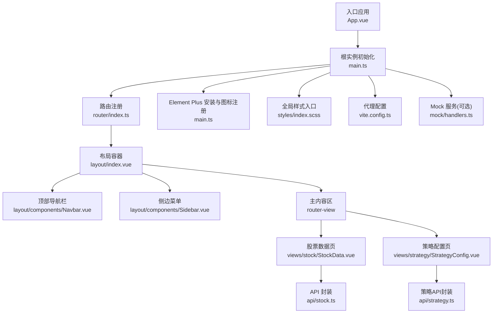
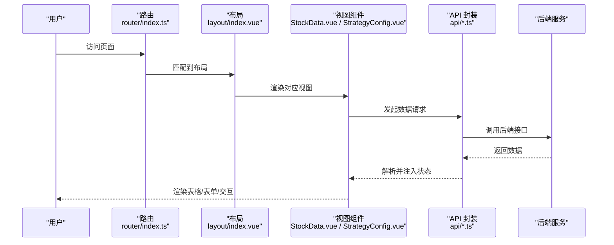
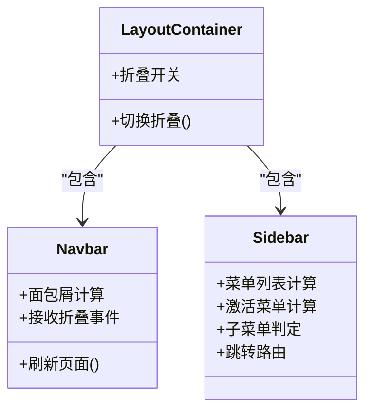
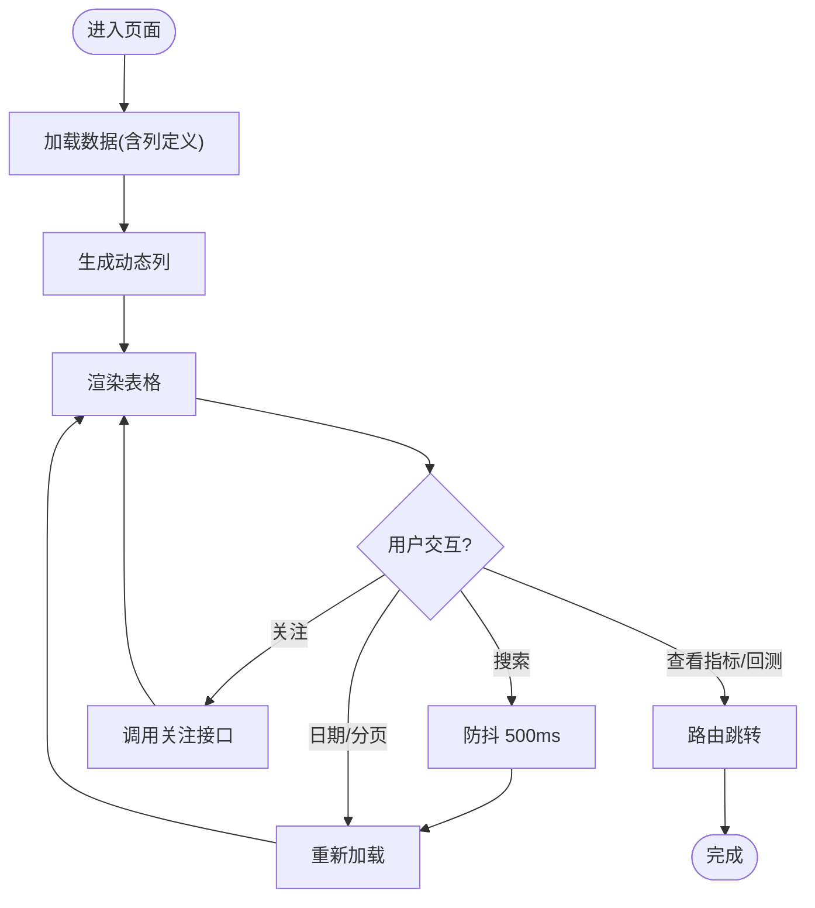
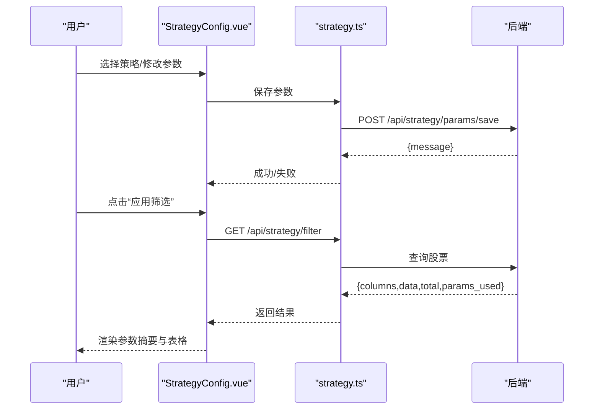
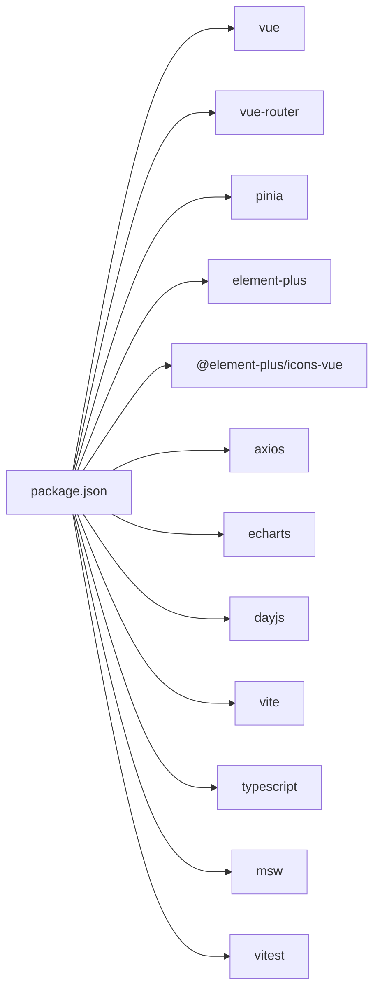

# 组件库与UI设计

<cite>
**本文引用的文件**
- [instock/fontWeb/src/App.vue](file://instock/fontWeb/src/App.vue)
- [instock/fontWeb/src/main.ts](file://instock/fontWeb/src/main.ts)
- [instock/fontWeb/package.json](file://instock/fontWeb/package.json)
- [instock/fontWeb/vite.config.ts](file://instock/fontWeb/vite.config.ts)
- [instock/fontWeb/src/styles/index.scss](file://instock/fontWeb/src/styles/index.scss)
- [instock/fontWeb/src/layout/index.vue](file://instock/fontWeb/src/layout/index.vue)
- [instock/fontWeb/src/layout/components/Navbar.vue](file://instock/fontWeb/src/layout/components/Navbar.vue)
- [instock/fontWeb/src/layout/components/Sidebar.vue](file://instock/fontWeb/src/layout/components/Sidebar.vue)
- [instock/fontWeb/src/views/stock/StockData.vue](file://instock/fontWeb/src/views/stock/StockData.vue)
- [instock/fontWeb/src/views/strategy/StrategyConfig.vue](file://instock/fontWeb/src/views/strategy/StrategyConfig.vue)
- [instock/fontWeb/src/api/stock.ts](file://instock/fontWeb/src/api/stock.ts)
- [instock/fontWeb/src/api/strategy.ts](file://instock/fontWeb/src/api/strategy.ts)
- [instock/fontWeb/src/router/index.ts](file://instock/fontWeb/src/router/index.ts)
- [instock/fontWeb/src/mock/handlers.ts](file://instock/fontWeb/src/mock/handlers.ts)
</cite>

## 目录
1. [简介](#简介)
2. [项目结构](#项目结构)
3. [核心组件](#核心组件)
4. [架构总览](#架构总览)
5. [组件详解](#组件详解)
6. [依赖关系分析](#依赖关系分析)
7. [性能考量](#性能考量)
8. [故障排查指南](#故障排查指南)
9. [结论](#结论)
10. [附录](#附录)

## 简介
本文件面向前端开发者，系统梳理 SelectStock 项目中基于 Vue 3 + Element Plus 的组件库与UI设计实践。重点覆盖：
- Element Plus 组件库的使用与自定义主题配置
- 布局组件、导航组件、表单组件、数据表格组件的设计原理与使用方法
- 组件复用机制、Props 传递、事件处理、插槽使用
- 样式系统设计、SCSS 变量管理、响应式布局、主题定制
- 组件开发规范、可访问性设计、移动端适配策略
目标是帮助团队构建一致、可维护、可扩展的用户界面。

## 项目结构
前端位于 instock/fontWeb，采用 Vite + Vue 3 + TypeScript + Element Plus 技术栈；路由按模块组织，视图层通过 Element Plus 提供的容器、导航、表单、表格等组件组合而成；全局样式通过 SCSS 变量统一管理。

图表来源
- [instock/fontWeb/src/App.vue](file://instock/fontWeb/src/App.vue#L1-L19)
- [instock/fontWeb/src/main.ts](file://instock/fontWeb/src/main.ts#L1-L40)
- [instock/fontWeb/src/router/index.ts](file://instock/fontWeb/src/router/index.ts#L1-L336)
- [instock/fontWeb/src/layout/index.vue](file://instock/fontWeb/src/layout/index.vue#L1-L80)
- [instock/fontWeb/src/layout/components/Navbar.vue](file://instock/fontWeb/src/layout/components/Navbar.vue#L1-L110)
- [instock/fontWeb/src/layout/components/Sidebar.vue](file://instock/fontWeb/src/layout/components/Sidebar.vue#L1-L155)
- [instock/fontWeb/src/views/stock/StockData.vue](file://instock/fontWeb/src/views/stock/StockData.vue#L1-L617)
- [instock/fontWeb/src/views/strategy/StrategyConfig.vue](file://instock/fontWeb/src/views/strategy/StrategyConfig.vue#L1-L697)
- [instock/fontWeb/src/api/stock.ts](file://instock/fontWeb/src/api/stock.ts#L1-L189)
- [instock/fontWeb/src/api/strategy.ts](file://instock/fontWeb/src/api/strategy.ts#L1-L93)
- [instock/fontWeb/src/styles/index.scss](file://instock/fontWeb/src/styles/index.scss#L1-L95)
- [instock/fontWeb/vite.config.ts](file://instock/fontWeb/vite.config.ts#L1-L32)
- [instock/fontWeb/src/mock/handlers.ts](file://instock/fontWeb/src/mock/handlers.ts#L1-L81)

章节来源
- [instock/fontWeb/src/App.vue](file://instock/fontWeb/src/App.vue#L1-L19)
- [instock/fontWeb/src/main.ts](file://instock/fontWeb/src/main.ts#L1-L40)
- [instock/fontWeb/src/router/index.ts](file://instock/fontWeb/src/router/index.ts#L1-L336)
- [instock/fontWeb/src/styles/index.scss](file://instock/fontWeb/src/styles/index.scss#L1-L95)

## 核心组件
- 布局容器：提供整体页面骨架，包含侧边栏、顶部导航与主内容区，支持折叠切换与路由视图缓存。
- 导航组件：顶部面包屑与动作按钮，支持折叠切换、刷新与外部链接。
- 菜单组件：基于 Element Plus Menu 的动态菜单，支持多级路由、图标、激活态与跳转。
- 数据表格组件：基于 Element Plus Table 的通用数据展示页，支持动态列、固定列、分页、搜索、关注标记等。
- 策略配置组件：基于 Element Plus 的参数卡片与表单控件，支持滑块、数字输入、文本、密码、选择框等，配合筛选与分页。

章节来源
- [instock/fontWeb/src/layout/index.vue](file://instock/fontWeb/src/layout/index.vue#L1-L80)
- [instock/fontWeb/src/layout/components/Navbar.vue](file://instock/fontWeb/src/layout/components/Navbar.vue#L1-L110)
- [instock/fontWeb/src/layout/components/Sidebar.vue](file://instock/fontWeb/src/layout/components/Sidebar.vue#L1-L155)
- [instock/fontWeb/src/views/stock/StockData.vue](file://instock/fontWeb/src/views/stock/StockData.vue#L1-L617)
- [instock/fontWeb/src/views/strategy/StrategyConfig.vue](file://instock/fontWeb/src/views/strategy/StrategyConfig.vue#L1-L697)

## 架构总览
前端通过 Vite 启动，注册 Element Plus 与图标，挂载 Pinia、路由与全局样式；路由按模块划分，视图组件通过 Element Plus 组件组合实现业务功能；API 层对后端接口进行薄封装，Mock 服务用于开发调试。

图表来源
- [instock/fontWeb/src/router/index.ts](file://instock/fontWeb/src/router/index.ts#L1-L336)
- [instock/fontWeb/src/layout/index.vue](file://instock/fontWeb/src/layout/index.vue#L1-L80)
- [instock/fontWeb/src/views/stock/StockData.vue](file://instock/fontWeb/src/views/stock/StockData.vue#L1-L617)
- [instock/fontWeb/src/views/strategy/StrategyConfig.vue](file://instock/fontWeb/src/views/strategy/StrategyConfig.vue#L1-L697)
- [instock/fontWeb/src/api/stock.ts](file://instock/fontWeb/src/api/stock.ts#L1-L189)
- [instock/fontWeb/src/api/strategy.ts](file://instock/fontWeb/src/api/strategy.ts#L1-L93)

## 组件详解

### 布局容器与导航体系
- 布局容器负责整体骨架与过渡动画，侧边栏支持折叠，顶部导航包含面包屑与动作按钮。
- 顶部导航通过路由元信息生成面包屑，支持折叠按钮事件向上冒泡。
- 侧边菜单根据路由配置动态生成，支持图标、子菜单与激活态，点击自动跳转。

图表来源
- [instock/fontWeb/src/layout/index.vue](file://instock/fontWeb/src/layout/index.vue#L1-L80)
- [instock/fontWeb/src/layout/components/Navbar.vue](file://instock/fontWeb/src/layout/components/Navbar.vue#L1-L110)
- [instock/fontWeb/src/layout/components/Sidebar.vue](file://instock/fontWeb/src/layout/components/Sidebar.vue#L1-L155)

章节来源
- [instock/fontWeb/src/layout/index.vue](file://instock/fontWeb/src/layout/index.vue#L1-L80)
- [instock/fontWeb/src/layout/components/Navbar.vue](file://instock/fontWeb/src/layout/components/Navbar.vue#L1-L110)
- [instock/fontWeb/src/layout/components/Sidebar.vue](file://instock/fontWeb/src/layout/components/Sidebar.vue#L1-L155)

### 数据表格组件（StockData）
- 动态列：根据后端返回的列定义生成 el-table-column，支持最小宽度与对齐方式。
- 固定列：日期、代码、名称等固定列，便于快速定位。
- 单元格格式化：根据字段类型与表名进行亿/万、百分比、成交量等格式化。
- 行样式：关注标记行使用特殊背景与加粗。
- 交互：支持搜索（带防抖）、日期选择、分页、导出占位、关注/取消关注、查看指标与回测入口。
- 错误处理：统一消息提示与回退逻辑。

图表来源
- [instock/fontWeb/src/views/stock/StockData.vue](file://instock/fontWeb/src/views/stock/StockData.vue#L1-L617)
- [instock/fontWeb/src/api/stock.ts](file://instock/fontWeb/src/api/stock.ts#L1-L189)

章节来源
- [instock/fontWeb/src/views/stock/StockData.vue](file://instock/fontWeb/src/views/stock/StockData.vue#L1-L617)
- [instock/fontWeb/src/api/stock.ts](file://instock/fontWeb/src/api/stock.ts#L1-L189)

### 策略配置组件（StrategyConfig）
- 策略选择：通过下拉选择当前策略，读取策略描述与参数组。
- 参数面板：根据参数类型渲染不同控件（滑块+数字输入、文本、密码、选择框），支持单位与描述。
- 应用筛选：保存当前参数后触发筛选，支持日期选择与分页。
- 结果展示：表格展示筛选结果，支持查看指标、回测与关注。
- 状态管理：加载、保存、筛选、重置均使用 Loading 状态，消息提示统一。

图表来源
- [instock/fontWeb/src/views/strategy/StrategyConfig.vue](file://instock/fontWeb/src/views/strategy/StrategyConfig.vue#L1-L697)
- [instock/fontWeb/src/api/strategy.ts](file://instock/fontWeb/src/api/strategy.ts#L1-L93)

章节来源
- [instock/fontWeb/src/views/strategy/StrategyConfig.vue](file://instock/fontWeb/src/views/strategy/StrategyConfig.vue#L1-L697)
- [instock/fontWeb/src/api/strategy.ts](file://instock/fontWeb/src/api/strategy.ts#L1-L93)

### 样式系统与主题定制
- 全局样式：重置盒模型、字体、滚动条样式，统一高度与布局基线。
- SCSS 变量：定义主色、状态色、涨跌色与常用工具类，便于主题切换与一致性。
- 组件内样式：通过 scoped 作用域隔离，深选择器(:deep)用于覆盖 Element Plus 组件样式。
- 响应式布局：结合 calc、flex 与固定列，保证表格在不同屏幕下的可读性。

章节来源
- [instock/fontWeb/src/styles/index.scss](file://instock/fontWeb/src/styles/index.scss#L1-L95)
- [instock/fontWeb/src/views/stock/StockData.vue](file://instock/fontWeb/src/views/stock/StockData.vue#L538-L617)
- [instock/fontWeb/src/views/strategy/StrategyConfig.vue](file://instock/fontWeb/src/views/strategy/StrategyConfig.vue#L526-L697)

### Element Plus 使用与主题配置
- 安装与图标：在入口注册 Element Plus 与全部图标组件，按需使用。
- 国际化：通过 ConfigProvider 设置语言为简体中文。
- 主题：通过 SCSS 变量与覆盖样式实现品牌色与状态色统一；必要时可通过主题变量或 CSS 变量进一步扩展。

章节来源
- [instock/fontWeb/src/main.ts](file://instock/fontWeb/src/main.ts#L1-L40)
- [instock/fontWeb/src/App.vue](file://instock/fontWeb/src/App.vue#L1-L19)

### 组件复用机制、Props、事件与插槽
- 复用机制：布局容器与导航组件通过 props 传入折叠状态，事件向上冒泡，实现跨组件通信。
- Props：菜单组件接收 isCollapse；导航组件接收 isCollapse 并发出 toggle 事件。
- 事件：导航组件触发 toggle，布局容器切换折叠状态；表格组件通过事件触发关注、查看指标、回测等操作。
- 插槽：表格列模板通过默认插槽自定义单元格内容与样式；面包屑标题通过插槽扩展。

章节来源
- [instock/fontWeb/src/layout/components/Sidebar.vue](file://instock/fontWeb/src/layout/components/Sidebar.vue#L1-L155)
- [instock/fontWeb/src/layout/components/Navbar.vue](file://instock/fontWeb/src/layout/components/Navbar.vue#L1-L110)
- [instock/fontWeb/src/views/stock/StockData.vue](file://instock/fontWeb/src/views/stock/StockData.vue#L440-L515)

### API 封装与 Mock
- API 封装：对后端接口进行薄封装，统一请求方法与参数结构，便于组件调用与测试。
- Mock：在开发模式下启用 MSW，按表名映射模拟数据，支持关注、K线、指标详情等接口，提升开发效率。

章节来源
- [instock/fontWeb/src/api/stock.ts](file://instock/fontWeb/src/api/stock.ts#L1-L189)
- [instock/fontWeb/src/api/strategy.ts](file://instock/fontWeb/src/api/strategy.ts#L1-L93)
- [instock/fontWeb/src/mock/handlers.ts](file://instock/fontWeb/src/mock/handlers.ts#L1-L81)

## 依赖关系分析
- 运行时依赖：Vue 3、Element Plus、@element-plus/icons-vue、vue-router、pinia、axios、echarts、dayjs。
- 构建与开发：Vite、TypeScript、Sass、MSW、Vitest。
- 代理与构建：Vite 配置了 API 代理与输出目录，支持开发与预览。

图表来源
- [instock/fontWeb/package.json](file://instock/fontWeb/package.json#L1-L44)

章节来源
- [instock/fontWeb/package.json](file://instock/fontWeb/package.json#L1-L44)
- [instock/fontWeb/vite.config.ts](file://instock/fontWeb/vite.config.ts#L1-L32)

## 性能考量
- 组件缓存：布局容器对路由视图使用 keep-alive，减少重复渲染开销。
- 表格优化：动态列与最小宽度自适应，避免横向滚动；固定列减少重排。
- 请求节流：搜索输入采用防抖；分页与尺寸变更触发请求，避免频繁刷新。
- 样式隔离：scoped 与深选择器合理使用，避免全局污染与样式冲突。
- 构建优化：Vite 快速冷启动与热更新；生产构建输出独立资源目录。

章节来源
- [instock/fontWeb/src/layout/index.vue](file://instock/fontWeb/src/layout/index.vue#L28-L34)
- [instock/fontWeb/src/views/stock/StockData.vue](file://instock/fontWeb/src/views/stock/StockData.vue#L72-L78)
- [instock/fontWeb/vite.config.ts](file://instock/fontWeb/vite.config.ts#L1-L32)

## 故障排查指南
- 国际化问题：确认 ConfigProvider 已包裹根组件且语言设置为简体中文。
- 图标不显示：检查是否在入口注册了全部 Element Plus 图标。
- Mock 未生效：确认运行模式为 mock，且 MSW worker 已启动。
- 路由跳转异常：检查路由元信息中的 title、tableName、isRealtime 等字段是否正确。
- 表格列错位：检查动态列的 min-width 与 dataType 对齐设置，确保固定列与动态列不冲突。
- 代理失败：确认 vite 代理配置与后端地址一致，网络可达。

章节来源
- [instock/fontWeb/src/App.vue](file://instock/fontWeb/src/App.vue#L1-L19)
- [instock/fontWeb/src/main.ts](file://instock/fontWeb/src/main.ts#L13-L24)
- [instock/fontWeb/src/router/index.ts](file://instock/fontWeb/src/router/index.ts#L1-L336)
- [instock/fontWeb/vite.config.ts](file://instock/fontWeb/vite.config.ts#L13-L26)

## 结论
本项目以 Element Plus 为核心，结合 Vue 3 组合式 API 与 SCSS 变量体系，实现了布局、导航、表单与数据表格的标准化组件化方案。通过路由元信息驱动菜单与页面行为、API 封装与 Mock 提升开发效率、样式变量与深选择器保障主题一致性，形成了可复用、可维护、可扩展的前端组件库与UI设计实践范式。

## 附录
- 组件开发规范建议
  - Props 命名与类型明确，提供默认值与校验。
  - 事件命名采用动词短语，遵循“组件名:事件名”约定。
  - 插槽命名清晰，尽量提供默认插槽与具名插槽示例。
  - 样式使用 scoped，必要时通过 :deep 覆盖第三方组件样式。
  - 表单控件统一使用 Element Plus 组件，保持交互一致性。
- 可访问性设计
  - 为图标与按钮提供可读的 aria-label 或替代文本。
  - 确保键盘可操作性，Tab 顺序合理。
  - 颜色对比度符合 WCAG 基准，避免仅靠颜色传达信息。
- 移动端适配策略
  - 使用 flex 布局与相对单位，避免固定宽度。
  - 表格在窄屏下优先展示关键列，必要时提供横向滚动。
  - 控件尺寸与间距在小屏下适当增大，提升触达性。