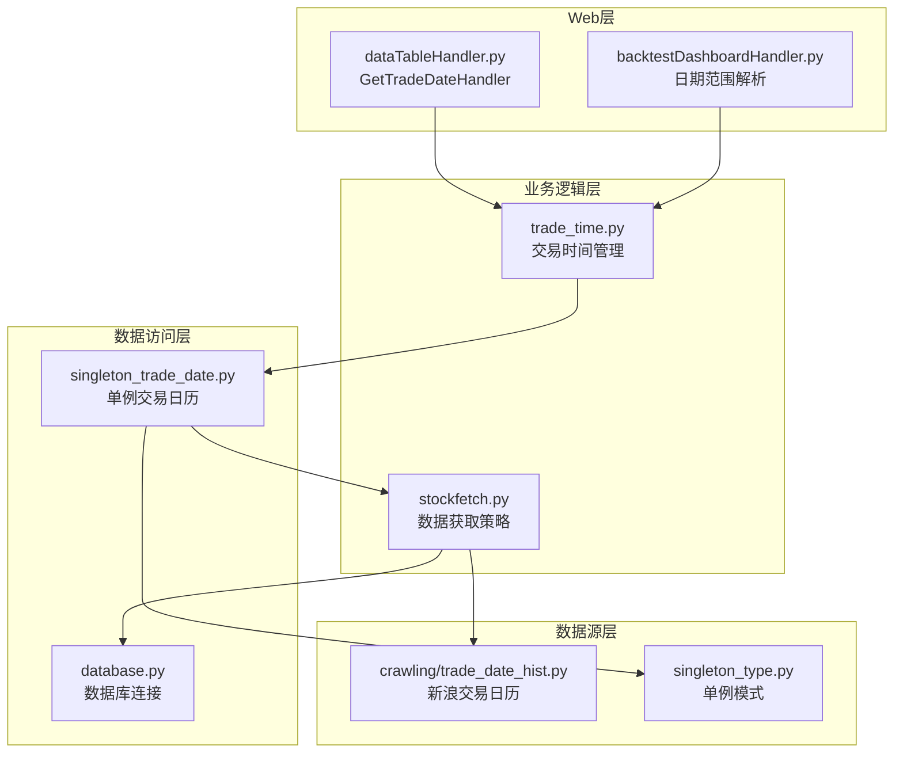
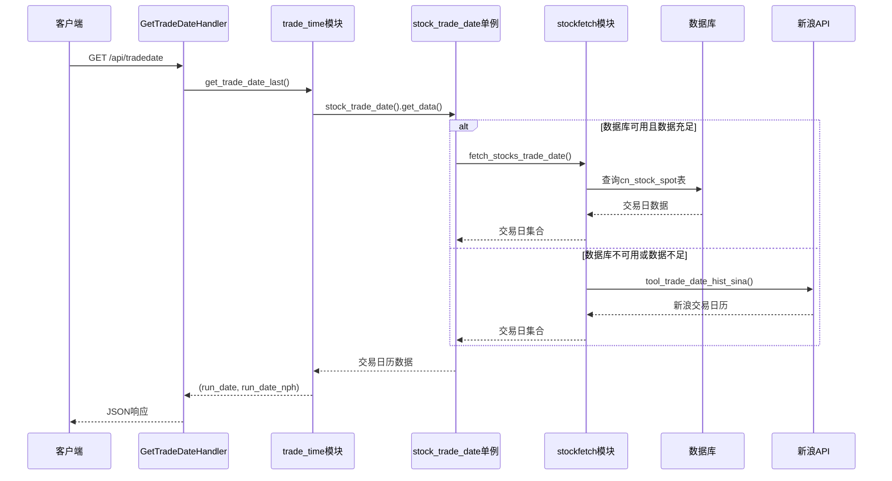
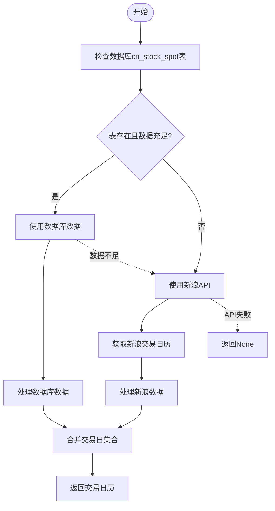
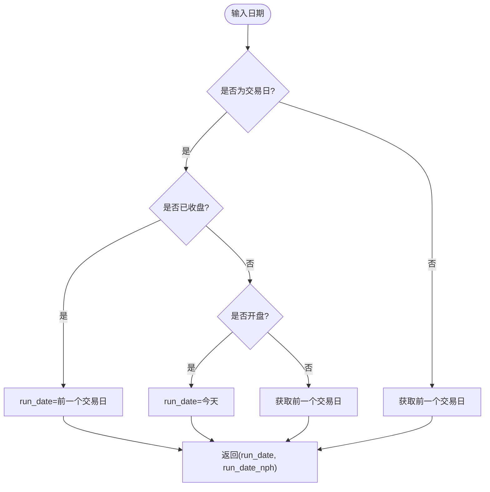
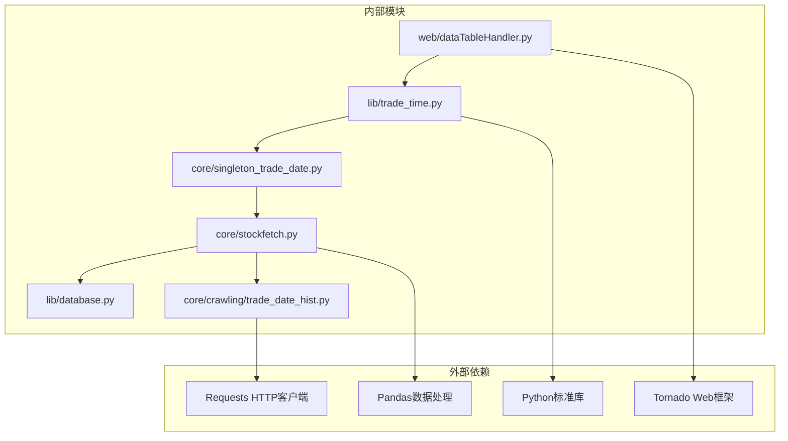

# 交易日期API

<cite>
**本文档引用的文件**
- [docker/stock/instock/web/dataTableHandler.py](file://docker/stock/instock/web/dataTableHandler.py)
- [docker/stock/instock/lib/trade_time.py](file://docker/stock/instock/lib/trade_time.py)
- [docker/stock/instock/core/stockfetch.py](file://docker/stock/instock/core/stockfetch.py)
- [docker/stock/instock/core/crawling/trade_date_hist.py](file://docker/stock/instock/core/crawling/trade_date_hist.py)
- [docker/stock/instock/core/singleton_trade_date.py](file://docker/stock/instock/core/singleton_trade_date.py)
- [docker/stock/instock/lib/singleton_type.py](file://docker/stock/instock/lib/singleton_type.py)
- [docker/stock/instock/lib/database.py](file://docker/stock/instock/lib/database.py)
- [docker/stock/instock/web/backtestDashboardHandler.py](file://docker/stock/instock/web/backtestDashboardHandler.py)
</cite>

## 目录
1. [简介](#简介)
2. [项目结构](#项目结构)
3. [核心组件](#核心组件)
4. [架构概览](#架构概览)
5. [详细组件分析](#详细组件分析)
6. [依赖关系分析](#依赖关系分析)
7. [性能考虑](#性能考虑)
8. [故障排除指南](#故障排除指南)
9. [结论](#结论)

## 简介

SelectStock项目的交易日期API是一个关键的基础设施组件，负责提供股票交易日历管理、日期查询机制和日期回退功能。该API通过单一入口点为整个系统提供准确的交易日期信息，支持实时数据查询和历史数据分析。

该API的核心功能包括：
- 最近交易日的获取和管理
- 非工作日的识别和处理
- 交易日历的缓存策略
- 日期格式规范和标准化
- 时区处理和节假日判断逻辑
- 数据查询中的日期回退机制

## 项目结构

交易日期API相关的文件分布在整个项目结构中，形成了清晰的分层架构：



**图表来源**
- [docker/stock/instock/web/dataTableHandler.py](file://docker/stock/instock/web/dataTableHandler.py#L217-L232)
- [docker/stock/instock/lib/trade_time.py](file://docker/stock/instock/lib/trade_time.py#L1-L224)
- [docker/stock/instock/core/stockfetch.py](file://docker/stock/instock/core/stockfetch.py#L223-L254)

**章节来源**
- [docker/stock/instock/web/dataTableHandler.py](file://docker/stock/instock/web/dataTableHandler.py#L1-L232)
- [docker/stock/instock/lib/trade_time.py](file://docker/stock/instock/lib/trade_time.py#L1-L224)

## 核心组件

### GetTradeDateHandler - 主要API入口

GetTradeDateHandler是交易日期API的主要入口点，负责处理HTTP请求并返回标准化的交易日期信息。

**核心功能特性：**
- 提供JSON格式的交易日期响应
- 包含两个关键日期字段：`run_date`和`run_date_nph`
- 实现异常处理和降级机制
- 支持CORS跨域请求

**响应格式规范：**
```json
{
    "run_date": "YYYY-MM-DD",
    "run_date_nph": "YYYY-MM-DD"
}
```

### trade_time.py - 交易时间管理核心

trade_time.py模块提供了完整的交易时间管理功能，包括：

**主要方法：**
- `is_trade_date(date)`: 判断指定日期是否为交易日
- `get_previous_trade_date(date, count)`: 获取前N个工作日
- `get_next_trade_date(date)`: 获取下一个交易日
- `get_trade_date_last()`: 获取最近交易日期

**时间窗口定义：**
- 开盘时间：09:15-11:30 和 13:00-15:00
- 午休时间：11:30-12:59:30
- 收盘时间：15:00以后

### singleton_trade_date.py - 交易日历单例

singleton_trade_date.py实现了交易日历的单例模式，确保系统中只有一个交易日历实例：

**设计原则：**
- 数据采集和数据分析分离
- 优先从数据库读取，避免外部API依赖
- 支持新浪API作为回退方案

**数据源优先级：**
1. 数据库（cn_stock_spot表）- 零代理、零API
2. 新浪财经API - 需要代理支持

**章节来源**
- [docker/stock/instock/web/dataTableHandler.py](file://docker/stock/instock/web/dataTableHandler.py#L217-L232)
- [docker/stock/instock/lib/trade_time.py](file://docker/stock/instock/lib/trade_time.py#L12-L183)
- [docker/stock/instock/core/singleton_trade_date.py](file://docker/stock/instock/core/singleton_trade_date.py#L12-L23)

## 架构概览

交易日期API采用分层架构设计，确保高可用性和可维护性：



**图表来源**
- [docker/stock/instock/web/dataTableHandler.py](file://docker/stock/instock/web/dataTableHandler.py#L217-L232)
- [docker/stock/instock/lib/trade_time.py](file://docker/stock/instock/lib/trade_time.py#L171-L183)
- [docker/stock/instock/core/stockfetch.py](file://docker/stock/instock/core/stockfetch.py#L223-L254)

## 详细组件分析

### GetTradeDateHandler实现分析

GetTradeDateHandler是交易日期API的核心实现，具有以下特点：

**请求处理流程：**
1. 设置响应头为JSON格式
2. 调用`trd.get_trade_date_last()`获取交易日期
3. 格式化日期为"YYYY-MM-DD"格式
4. 返回标准化的JSON响应
5. 异常情况下降级到当前日期

**错误处理机制：**
- 捕获所有异常并记录日志
- 发生异常时返回当前日期作为降级方案
- 确保API的高可用性

**响应示例：**
```json
{
    "run_date": "2024-01-15",
    "run_date_nph": "2024-01-15"
}
```

### 交易日历管理机制

交易日历管理系统采用双数据源策略：



**图表来源**
- [docker/stock/instock/core/stockfetch.py](file://docker/stock/instock/core/stockfetch.py#L223-L254)
- [docker/stock/instock/core/crawling/trade_date_hist.py](file://docker/stock/instock/core/crawling/trade_date_hist.py#L352-L382)

### 日期查询机制

trade_time.py模块提供了灵活的日期查询功能：

**最近交易日获取逻辑：**


**图表来源**
- [docker/stock/instock/lib/trade_time.py](file://docker/stock/instock/lib/trade_time.py#L171-L183)

### 缓存策略分析

交易日历采用了多层次的缓存策略：

**单例模式缓存：**
- stock_trade_date类使用singleton_type实现单例
- 避免重复创建和销毁交易日历实例
- 减少内存占用和初始化开销

**数据源降级机制：**
- 数据库优先：零代理、零API依赖
- 新浪API回退：需要代理支持
- 自动故障转移，确保系统稳定性

**章节来源**
- [docker/stock/instock/lib/singleton_type.py](file://docker/stock/instock/lib/singleton_type.py#L12-L20)
- [docker/stock/instock/core/stockfetch.py](file://docker/stock/instock/core/stockfetch.py#L223-L254)

## 依赖关系分析

交易日期API的依赖关系体现了清晰的分层设计：



**图表来源**
- [docker/stock/instock/web/dataTableHandler.py](file://docker/stock/instock/web/dataTableHandler.py#L1-L232)
- [docker/stock/instock/lib/trade_time.py](file://docker/stock/instock/lib/trade_time.py#L1-L224)
- [docker/stock/instock/core/stockfetch.py](file://docker/stock/instock/core/stockfetch.py#L1-L800)

**依赖特点：**
- 松耦合设计，模块间依赖清晰
- 外部依赖最小化，便于部署和维护
- 核心业务逻辑独立于Web框架

**章节来源**
- [docker/stock/instock/web/dataTableHandler.py](file://docker/stock/instock/web/dataTableHandler.py#L1-L232)
- [docker/stock/instock/lib/trade_time.py](file://docker/stock/instock/lib/trade_time.py#L1-L224)

## 性能考虑

### 缓存优化策略

**单例模式优势：**
- 避免重复初始化交易日历数据
- 减少数据库查询次数
- 提高并发访问性能

**数据源选择优化：**
- 数据库查询比网络请求更快
- 避免代理池初始化开销
- 减少外部API依赖

### 错误处理和降级

**异常处理策略：**
- 所有异常被捕获并记录
- 发生异常时返回当前日期
- 确保API的高可用性

**性能监控：**
- 日志记录关键操作
- 监控数据源健康状况
- 自动故障转移机制

## 故障排除指南

### 常见问题及解决方案

**问题1：API响应异常**
- 检查数据库连接状态
- 验证交易日历数据完整性
- 查看日志文件获取详细错误信息

**问题2：交易日历数据为空**
- 确认数据库中cn_stock_spot表存在
- 检查数据源连接状态
- 验证新浪API可用性

**问题3：日期格式错误**
- 确保输入日期格式为"YYYY-MM-DD"
- 检查时区设置
- 验证日期有效性

### 调试建议

**开发环境调试：**
- 启用详细日志记录
- 使用单元测试验证核心功能
- 监控API响应时间和错误率

**生产环境监控：**
- 设置告警机制
- 定期检查数据源健康状况
- 监控API性能指标

**章节来源**
- [docker/stock/instock/web/dataTableHandler.py](file://docker/stock/instock/web/dataTableHandler.py#L228-L231)
- [docker/stock/instock/lib/trade_time.py](file://docker/stock/instock/lib/trade_time.py#L34-L42)

## 结论

SelectStock项目的交易日期API展现了优秀的软件工程实践：

**设计优势：**
- 清晰的分层架构，职责分离明确
- 双数据源策略确保高可用性
- 单例模式提高性能和资源利用率
- 完善的错误处理和降级机制

**技术特点：**
- 基于Python和Tornado的现代Web框架
- 面向对象的设计模式
- 模块化的代码组织
- 详细的文档和注释

**应用场景：**
- 实时股票数据查询
- 历史数据分析
- 回测系统日期管理
- 交易策略执行

该API为SelectStock项目提供了稳定可靠的交易日期服务，是整个系统的重要基础设施组件。其设计原则和实现模式可以作为类似金融数据系统的参考模板。