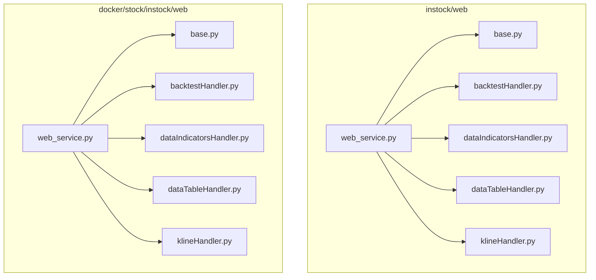
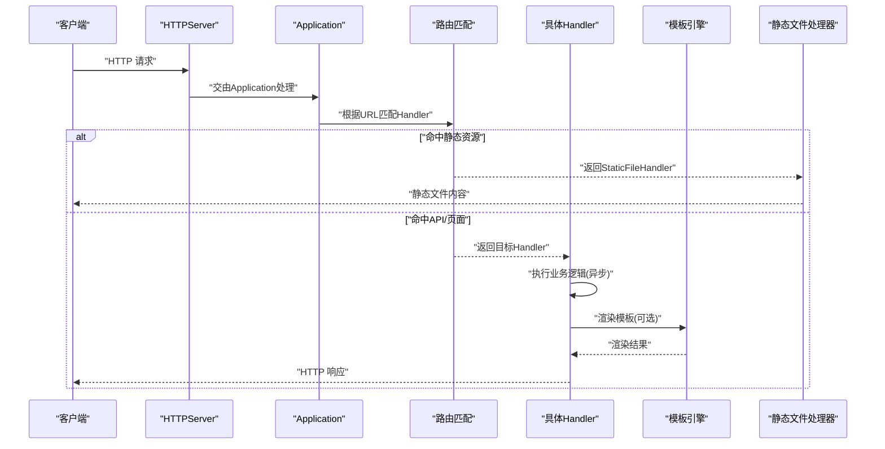
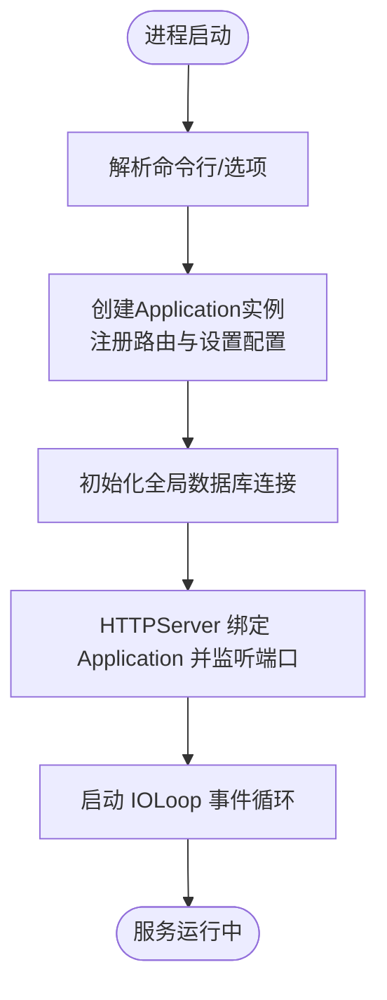
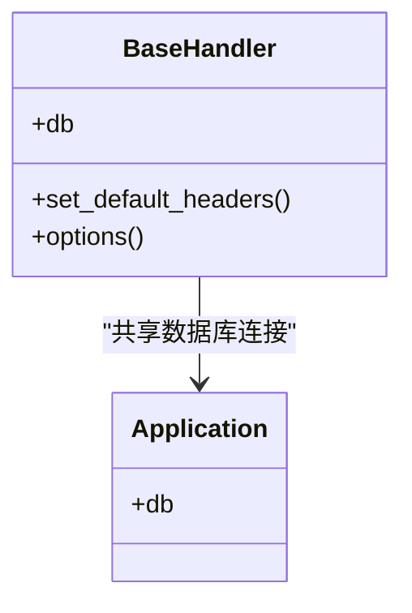
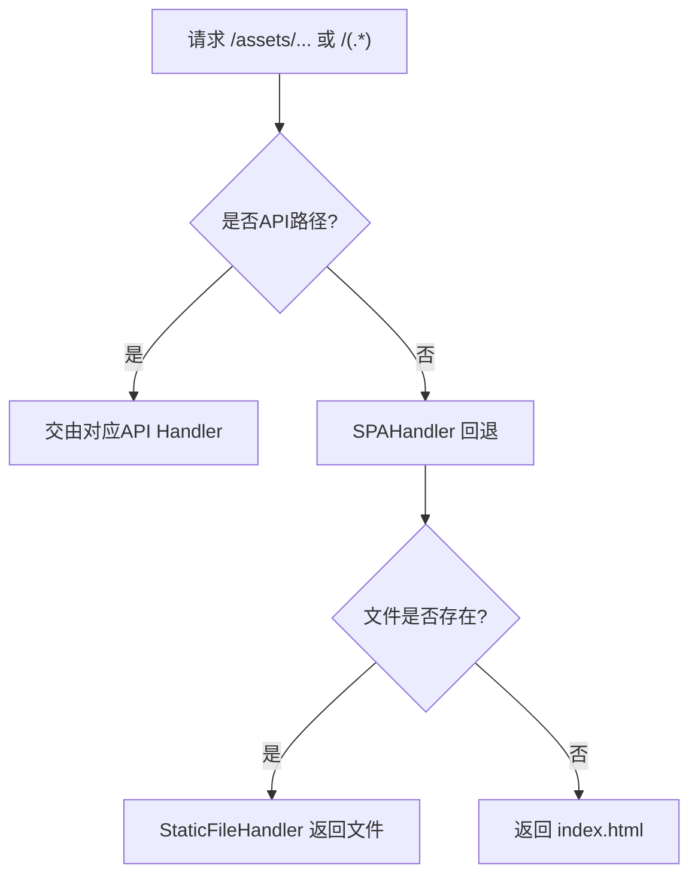
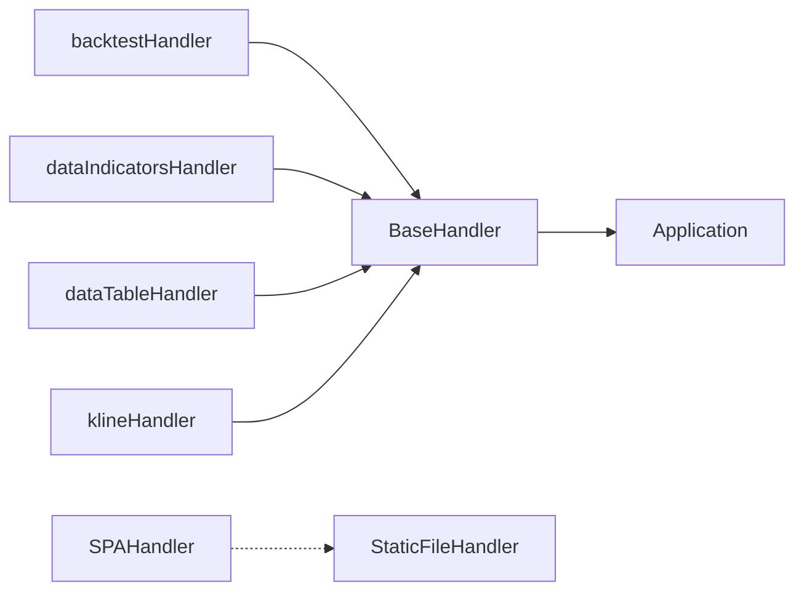

# Tornado Web框架

<cite>
**本文引用的文件**
- [instock/web/web_service.py](file://instock/web/web_service.py)
- [instock/web/base.py](file://instock/web/base.py)
- [docker/stock/instock/web/web_service.py](file://docker/stock/instock/web/web_service.py)
- [docker/stock/instock/web/base.py](file://docker/stock/instock/web/base.py)
- [instock/web/backtestHandler.py](file://instock/web/backtestHandler.py)
- [instock/web/dataIndicatorsHandler.py](file://instock/web/dataIndicatorsHandler.py)
- [instock/web/dataTableHandler.py](file://instock/web/dataTableHandler.py)
- [instock/web/klineHandler.py](file://instock/web/klineHandler.py)
- [docker/stock/instock/web/backtestHandler.py](file://docker/stock/instock/web/backtestHandler.py)
- [docker/stock/instock/web/dataIndicatorsHandler.py](file://docker/stock/instock/web/dataIndicatorsHandler.py)
- [docker/stock/instock/web/dataTableHandler.py](file://docker/stock/instock/web/dataTableHandler.py)
- [docker/stock/instock/web/klineHandler.py](file://docker/stock/instock/web/klineHandler.py)
</cite>

## 目录
1. [简介](#简介)
2. [项目结构](#项目结构)
3. [核心组件](#核心组件)
4. [架构总览](#架构总览)
5. [详细组件分析](#详细组件分析)
6. [依赖关系分析](#依赖关系分析)
7. [性能考虑](#性能考虑)
8. [故障排查指南](#故障排查指南)
9. [结论](#结论)
10. [附录](#附录)

## 简介
本文件面向SelectStock项目中基于Tornado的Web后端实现，系统性梳理其异步IO模型、RequestHandler基类使用、Application配置与生命周期、静态文件与模板渲染、以及错误处理策略。文档同时总结Tornado特有的异步处理模式、协程使用方法与性能优化建议，帮助开发者充分利用Tornado的异步优势构建高性能Web服务。

## 项目结构
SelectStock在两个位置均提供了Tornado Web实现：
- instock/web：核心业务Handler与应用入口
- docker/stock/instock/web：Docker部署环境下的同构实现

二者共享统一的基类与Handler组织方式，采用Application集中注册路由、配置模板与静态目录，并通过IOLoop驱动事件循环。

图表来源
- [instock/web/web_service.py](file://instock/web/web_service.py#L82-L100)
- [docker/stock/instock/web/web_service.py](file://docker/stock/instock/web/web_service.py#L82-L100)

章节来源
- [instock/web/web_service.py](file://instock/web/web_service.py#L82-L100)
- [docker/stock/instock/web/web_service.py](file://docker/stock/instock/web/web_service.py#L82-L100)

## 核心组件
- Application与路由注册
  - 在Application构造函数中集中注册URL模式与对应Handler，并设置模板路径、静态路径、Cookie密钥等全局配置。
  - 使用StaticFileHandler处理静态资源；通过自定义SPAHandler对非API路径进行回退到前端单页应用入口。
- RequestHandler基类
  - BaseHandler继承tornado.web.RequestHandler，统一设置CORS响应头、处理OPTIONS预检请求，并提供db属性以复用与自动重连数据库连接。
- 异步与协程
  - 多个Handler显式导入tornado.gen，使用@gen.coroutine或async/await风格进行异步IO操作（如数据库查询、外部接口调用）。
- 模板与静态资源
  - 通过settings.template_path与settings.static_path指定模板与静态资源根目录，配合模板渲染与静态文件处理器实现前后端一体化部署。

章节来源
- [instock/web/web_service.py](file://instock/web/web_service.py#L82-L100)
- [docker/stock/instock/web/web_service.py](file://docker/stock/instock/web/web_service.py#L82-L100)
- [instock/web/base.py](file://instock/web/base.py#L14-L36)
- [docker/stock/instock/web/base.py](file://docker/stock/instock/web/base.py#L14-L36)

## 架构总览
下图展示了从HTTP请求进入，到路由分发、Handler处理、模板渲染与静态资源返回的整体流程。

图表来源
- [instock/web/web_service.py](file://instock/web/web_service.py#L82-L100)
- [docker/stock/instock/web/web_service.py](file://docker/stock/instock/web/web_service.py#L82-L100)

## 详细组件分析

### Application与生命周期
- 初始化流程
  - 构造Application时传入handlers列表与settings字典，完成路由注册与全局配置。
  - settings中包含template_path、static_path、cookie_secret、xsrf_cookies、debug等键值。
  - 在Application.__init__之后，建立全局数据库连接self.db并挂载到application实例上，供各Handler共享。
- 生命周期管理
  - 通过tornado.httpserver.HTTPServer绑定Application实例并监听端口。
  - 使用tornado.ioloop.IOLoop.current().start()启动事件循环，保持服务常驻运行。
  - 日志级别通过tornado.options.options.logging控制，生产环境可关闭默认日志以降低开销。

图表来源
- [instock/web/web_service.py](file://instock/web/web_service.py#L127-L138)
- [docker/stock/instock/web/web_service.py](file://docker/stock/instock/web/web_service.py#L127-L138)

章节来源
- [instock/web/web_service.py](file://instock/web/web_service.py#L82-L100)
- [instock/web/web_service.py](file://instock/web/web_service.py#L127-L138)
- [docker/stock/instock/web/web_service.py](file://docker/stock/instock/web/web_service.py#L82-L100)
- [docker/stock/instock/web/web_service.py](file://docker/stock/instock/web/web_service.py#L127-L138)

### RequestHandler基类与CORS
- CORS支持
  - set_default_headers统一设置允许跨域的Origin、Headers、Methods与Max-Age。
  - options方法处理预检请求，直接返回204状态。
- 数据库连接复用与自动重连
  - db属性每次访问时先执行一次简单查询校验连接有效性，异常时触发reconnect，保证长连接稳定性。

图表来源
- [instock/web/base.py](file://instock/web/base.py#L14-L36)
- [docker/stock/instock/web/base.py](file://docker/stock/instock/web/base.py#L14-L36)

章节来源
- [instock/web/base.py](file://instock/web/base.py#L14-L36)
- [docker/stock/instock/web/base.py](file://docker/stock/instock/web/base.py#L14-L36)

### SPA回退与静态资源
- 静态资源
  - 使用StaticFileHandler映射/static/(.*)到静态目录，支持按扩展名设置Content-Type。
- SPA回退
  - SPAHandler拦截非API路径，若请求的文件存在则直接返回该文件；否则返回前端index.html，使前端路由接管。
- 路由注册
  - Application.handlers中包含静态资源与SPA回退规则，确保Vue SPA与API共存。

图表来源
- [instock/web/web_service.py](file://instock/web/web_service.py#L82-L88)
- [instock/web/web_service.py](file://instock/web/web_service.py#L102-L124)
- [docker/stock/instock/web/web_service.py](file://docker/stock/instock/web/web_service.py#L82-L88)
- [docker/stock/instock/web/web_service.py](file://docker/stock/instock/web/web_service.py#L102-L124)

章节来源
- [instock/web/web_service.py](file://instock/web/web_service.py#L82-L88)
- [instock/web/web_service.py](file://instock/web/web_service.py#L102-L124)
- [docker/stock/instock/web/web_service.py](file://docker/stock/instock/web/web_service.py#L82-L88)
- [docker/stock/instock/web/web_service.py](file://docker/stock/instock/web/web_service.py#L102-L124)

### 异步处理与协程模式
- 协程导入与使用
  - 多个Handler导入tornado.gen并在方法上使用@gen.coroutine装饰器，或采用async/await语法进行异步IO。
- 典型场景
  - 数据库查询、外部数据抓取、指标计算等耗时操作通过异步协程避免阻塞主线程。
- 错误传播
  - 协程内部异常会冒泡至IOLoop，需在Handler中捕获并返回标准错误响应，避免未处理异常导致服务中断。

章节来源
- [instock/web/backtestHandler.py](file://instock/web/backtestHandler.py#L15-L20)
- [instock/web/dataIndicatorsHandler.py](file://instock/web/dataIndicatorsHandler.py#L4-L10)
- [instock/web/dataTableHandler.py](file://instock/web/dataTableHandler.py#L7-L12)
- [docker/stock/instock/web/backtestHandler.py](file://docker/stock/instock/web/backtestHandler.py#L15-L20)
- [docker/stock/instock/web/dataIndicatorsHandler.py](file://docker/stock/instock/web/dataIndicatorsHandler.py#L4-L10)
- [docker/stock/instock/web/dataTableHandler.py](file://docker/stock/instock/web/dataTableHandler.py#L7-L12)

### 模板渲染机制
- 配置
  - settings.template_path指向模板目录，Application在构造时传入该配置。
- 使用
  - Handler在需要时加载模板并渲染，结合数据上下文输出HTML。
- 结合静态资源
  - 模板中可引用静态资源路径，由StaticFileHandler统一处理。

章节来源
- [instock/web/web_service.py](file://instock/web/web_service.py#L89-L96)
- [docker/stock/instock/web/web_service.py](file://docker/stock/instock/web/web_service.py#L89-L96)

### 典型Handler示例（抽象说明）
- backtestHandler：处理回测相关API，可能涉及大量数据读写与计算，适合使用异步协程提升吞吐。
- dataIndicatorsHandler：处理技术指标数据API，通常需要与数据库交互，建议在BaseHandler基础上复用db连接。
- dataTableHandler：处理表格数据API，注意分页与缓存策略以降低数据库压力。
- klineHandler：处理K线数据API，建议结合缓存与限流策略，避免高并发下的抖动。

章节来源
- [instock/web/backtestHandler.py](file://instock/web/backtestHandler.py#L15-L20)
- [instock/web/dataIndicatorsHandler.py](file://instock/web/dataIndicatorsHandler.py#L4-L10)
- [instock/web/dataTableHandler.py](file://instock/web/dataTableHandler.py#L7-L12)
- [instock/web/klineHandler.py](file://instock/web/klineHandler.py#L1-L50)
- [docker/stock/instock/web/backtestHandler.py](file://docker/stock/instock/web/backtestHandler.py#L15-L20)
- [docker/stock/instock/web/dataIndicatorsHandler.py](file://docker/stock/instock/web/dataIndicatorsHandler.py#L4-L10)
- [docker/stock/instock/web/dataTableHandler.py](file://docker/stock/instock/web/dataTableHandler.py#L7-L12)
- [docker/stock/instock/web/klineHandler.py](file://docker/stock/instock/web/klineHandler.py#L1-L50)

## 依赖关系分析
- 组件耦合
  - BaseHandler与Application强关联（共享db连接），其他Handler继承BaseHandler，形成清晰的层次化设计。
  - SPAHandler与静态资源处理器解耦于业务Handler，便于维护与扩展。
- 外部依赖
  - torndb用于MySQL连接池与事务封装；tornado.web、tornado.gen、tornado.httpserver、tornado.ioloop构成核心运行时。
- 可能的循环依赖
  - 当前结构无明显循环导入；若后续引入复杂模块间依赖，需避免Handler之间相互导入。

图表来源
- [instock/web/base.py](file://instock/web/base.py#L14-L36)
- [instock/web/web_service.py](file://instock/web/web_service.py#L82-L88)
- [docker/stock/instock/web/base.py](file://docker/stock/instock/web/base.py#L14-L36)
- [docker/stock/instock/web/web_service.py](file://docker/stock/instock/web/web_service.py#L82-L88)

章节来源
- [instock/web/base.py](file://instock/web/base.py#L14-L36)
- [instock/web/web_service.py](file://instock/web/web_service.py#L82-L88)
- [docker/stock/instock/web/base.py](file://docker/stock/instock/web/base.py#L14-L36)
- [docker/stock/instock/web/web_service.py](file://docker/stock/instock/web/web_service.py#L82-L88)

## 性能考虑
- 异步优先
  - 将数据库查询、网络请求等IO密集型操作改为异步协程，减少线程切换开销。
- 连接复用与健康检查
  - 通过BaseHandler的db属性实现连接复用；定期执行轻量查询验证连接可用性，异常时自动重连。
- 静态资源与缓存
  - 使用StaticFileHandler提供静态资源；对高频API响应增加缓存层，降低数据库压力。
- IOLoop与并发
  - 合理设置工作进程数与线程数；避免在协程中执行CPU密集型任务，必要时拆分为子进程或使用异步执行器。
- 日志与监控
  - 生产环境可关闭默认日志以降低开销；接入指标采集与错误追踪，及时发现性能瓶颈。

## 故障排查指南
- CORS相关问题
  - 若出现跨域失败，检查BaseHandler的CORS响应头设置与options预检处理是否生效。
- 数据库连接异常
  - 观察db属性访问时的日志与重连行为；确认MySQL服务可用性与连接参数正确。
- SPA回退不生效
  - 检查Application.handlers中静态资源与SPA回退规则顺序；确认请求路径未被其他API规则覆盖。
- 静态文件无法访问
  - 核对settings.static_path与StaticFileHandler映射路径；确认文件权限与扩展名识别正常。
- 协程异常导致服务中断
  - 在Handler中捕获协程异常并返回标准错误响应；避免未处理异常冒泡至IOLoop。

章节来源
- [instock/web/base.py](file://instock/web/base.py#L14-L36)
- [instock/web/web_service.py](file://instock/web/web_service.py#L82-L124)
- [docker/stock/instock/web/base.py](file://docker/stock/instock/web/base.py#L14-L36)
- [docker/stock/instock/web/web_service.py](file://docker/stock/instock/web/web_service.py#L82-L124)

## 结论
SelectStock项目在Tornado之上建立了清晰的分层架构：以BaseHandler统一处理CORS与数据库连接，以Application集中注册路由与配置，以协程模式支撑异步IO，以SPA回退与静态资源处理器实现前后端一体化。遵循本文的异步实践、性能优化与故障排查建议，可进一步提升系统的稳定性与吞吐能力。

## 附录
- 关键配置项说明
  - template_path：模板目录路径
  - static_path：静态资源目录路径
  - cookie_secret：Cookie签名密钥
  - xsrf_cookies：是否启用XSRF保护
  - debug：调试模式开关
- 启动与停止
  - 启动：创建HTTPServer并绑定Application，监听端口，启动IOLoop
  - 停止：优雅关闭IOLoop或发送信号终止进程