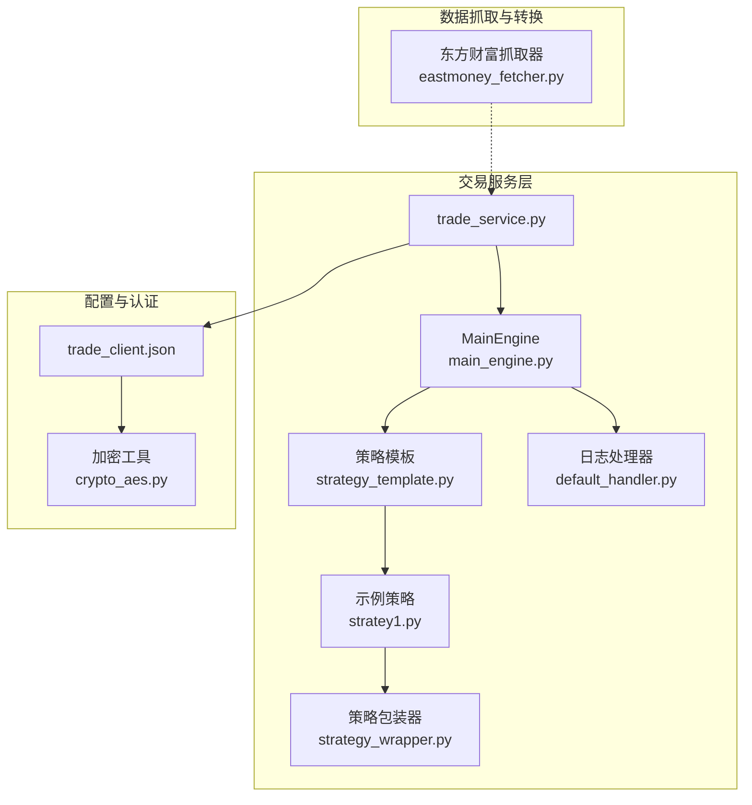
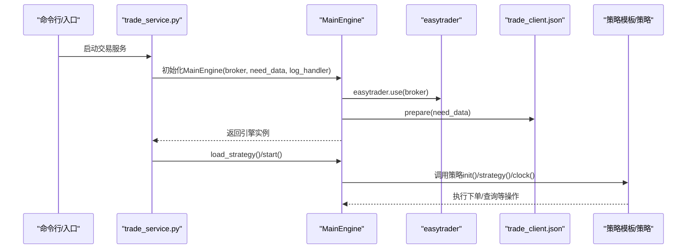
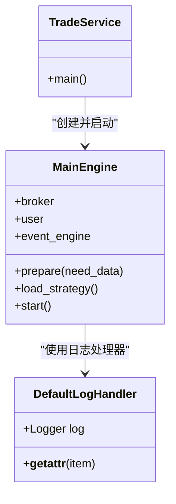
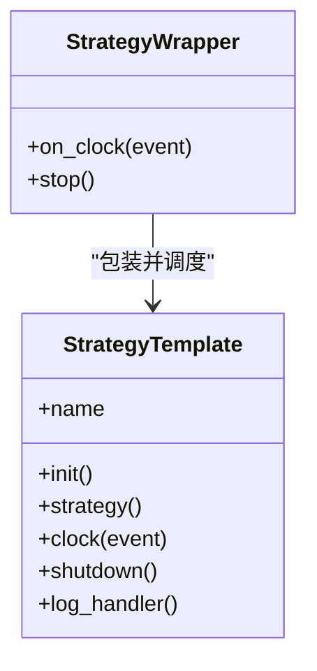
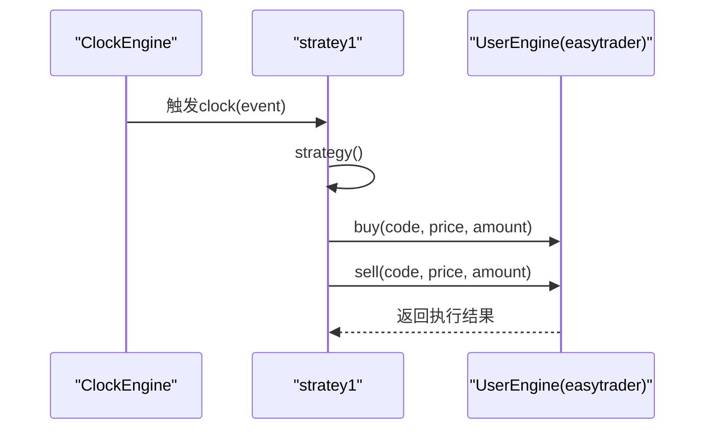
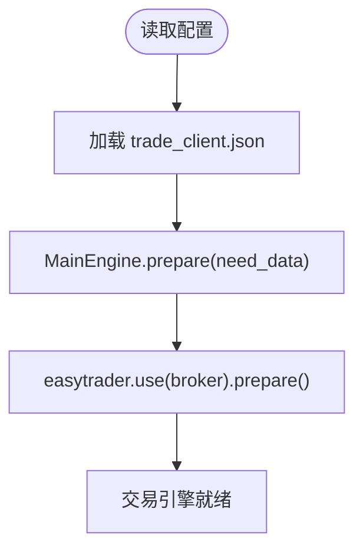
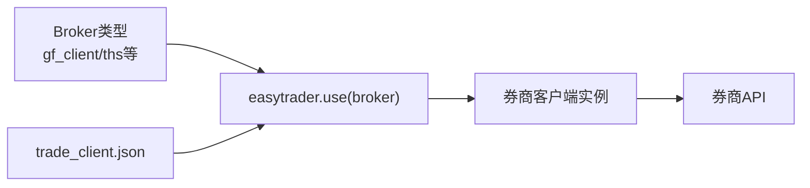
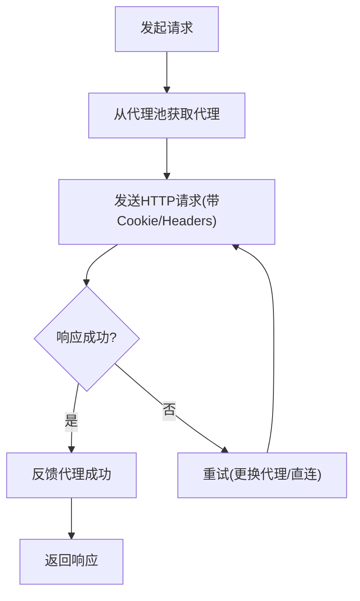
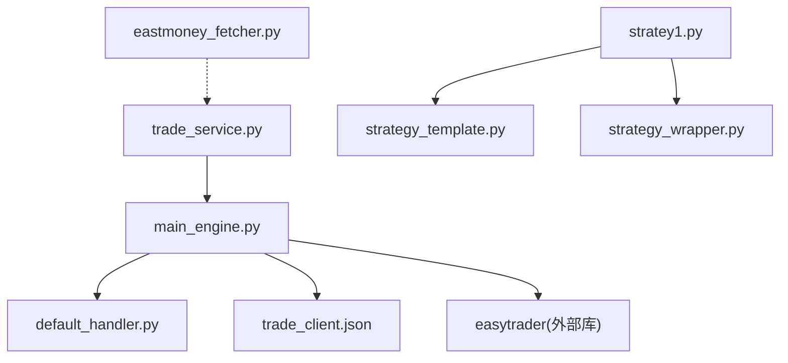

# 券商接口适配

<cite>
**本文引用的文件**
- [README.md](file://README.md)
- [QUICKSTART.md](file://QUICKSTART.md)
- [instock\config\trade_client.json](file://instock/config/trade_client.json)
- [instock\trade\trade_service.py](file://instock/trade/trade_service.py)
- [instock\trade\robot\engine\main_engine.py](file://instock/trade/robot/engine/main_engine.py)
- [instock\trade\robot\infrastructure\default_handler.py](file://instock/trade/robot/infrastructure/default_handler.py)
- [instock\trade\robot\infrastructure\strategy_template.py](file://instock/trade/robot/infrastructure/strategy_template.py)
- [instock\trade\robot\infrastructure\strategy_wrapper.py](file://instock/trade/robot/infrastructure/strategy_wrapper.py)
- [instock\trade\strategies\stratey1.py](file://instock/trade/strategies/stratey1.py)
- [instock\core\eastmoney_fetcher.py](file://instock/core/eastmoney_fetcher.py)
- [instock\lib\crypto_aes.py](file://instock/lib/crypto_aes.py)
</cite>

## 目录
1. [引言](#引言)
2. [项目结构](#项目结构)
3. [核心组件](#核心组件)
4. [架构总览](#架构总览)
5. [详细组件分析](#详细组件分析)
6. [依赖关系分析](#依赖关系分析)
7. [性能考虑](#性能考虑)
8. [故障排查指南](#故障排查指南)
9. [结论](#结论)
10. [附录](#附录)

## 引言
本技术文档面向券商接口适配场景，围绕交易系统与多家券商客户端的对接，系统性阐述接口抽象层设计、适配器模式应用、认证与安全机制、数据转换规则、常见券商对接流程、参数配置、错误处理与安全认证、接口测试方法、调试技巧与性能优化建议。目标是帮助读者在不改变核心框架的前提下，稳定适配多家券商接口。

## 项目结构
项目采用模块化分层组织，交易相关能力集中在 instock/trade 子系统，核心数据抓取与转换位于 instock/core，前端可视化位于 instock/fontWeb，配置文件位于 instock/config。交易服务通过 trade_service.py 启动，MainEngine 负责加载券商客户端、准备账户信息、启动事件引擎与策略执行。

**图表来源**
- [instock\trade\trade_service.py](file://instock/trade/trade_service.py#L1-L30)
- [instock\trade\robot\engine\main_engine.py](file://instock/trade/robot/engine/main_engine.py#L1-L43)
- [instock\trade\robot\infrastructure\strategy_template.py](file://instock/trade/robot/infrastructure/strategy_template.py#L1-L43)
- [instock\trade\robot\infrastructure\strategy_wrapper.py](file://instock/trade/robot/infrastructure/strategy_wrapper.py#L1-L45)
- [instock\trade\strategies\stratey1.py](file://instock/trade/strategies/stratey1.py#L1-L42)
- [instock\trade\robot\infrastructure\default_handler.py](file://instock/trade/robot/infrastructure/default_handler.py#L1-L37)
- [instock\config\trade_client.json](file://instock/config/trade_client.json#L1-L5)
- [instock\lib\crypto_aes.py](file://instock/lib/crypto_aes.py#L1-L211)
- [instock\core\eastmoney_fetcher.py](file://instock/core/eastmoney_fetcher.py#L1-L149)

**章节来源**
- [README.md](file://README.md#L463-L504)
- [QUICKSTART.md](file://QUICKSTART.md#L1-L207)

## 核心组件
- 交易服务入口：trade_service.py 读取配置文件路径，初始化日志，构造 MainEngine 并启动策略加载与运行。
- 主引擎 MainEngine：通过 easytrader 选择券商客户端类型，加载账户配置文件，准备登录凭证，初始化事件引擎。
- 策略模板 StrategyTemplate：定义策略生命周期（init、strategy、clock、shutdown），提供日志句柄优先级与时钟引擎接入。
- 策略包装器 StrategyWrapper：将策略时钟事件通过进程队列与线程解耦，实现跨进程时钟事件分发。
- 示例策略 stratey1.py：演示如何注册时钟事件并在策略中调用 user.buy/sell 进行下单。
- 配置与认证：trade_client.json 提供账户、密码与客户端路径；crypto_aes.py 提供对称加密工具，可用于敏感信息保护。
- 数据抓取与转换：eastmoney_fetcher.py 提供线程安全的会话、Cookie注入、代理池与重试机制，支撑行情与数据抓取。

**章节来源**
- [instock\trade\trade_service.py](file://instock/trade/trade_service.py#L1-L30)
- [instock\trade\robot\engine\main_engine.py](file://instock/trade/robot/engine/main_engine.py#L1-L43)
- [instock\trade\robot\infrastructure\strategy_template.py](file://instock/trade/robot/infrastructure/strategy_template.py#L1-L43)
- [instock\trade\robot\infrastructure\strategy_wrapper.py](file://instock/trade/robot/infrastructure/strategy_wrapper.py#L1-L45)
- [instock\trade\strategies\stratey1.py](file://instock/trade/strategies/stratey1.py#L1-L42)
- [instock\config\trade_client.json](file://instock/config/trade_client.json#L1-L5)
- [instock\lib\crypto_aes.py](file://instock/lib/crypto_aes.py#L1-L211)
- [instock\core\eastmoney_fetcher.py](file://instock/core/eastmoney_fetcher.py#L1-L149)

## 架构总览
交易系统采用“服务入口 -> 主引擎 -> 策略模板 -> 策略实现”的分层结构，并通过 easytrader 抽象不同券商客户端。配置文件通过 MainEngine.prepare 加载，策略通过策略模板统一生命周期管理，策略包装器负责跨进程时钟事件调度。

**图表来源**
- [instock\trade\trade_service.py](file://instock/trade/trade_service.py#L1-L30)
- [instock\trade\robot\engine\main_engine.py](file://instock/trade/robot/engine/main_engine.py#L1-L43)
- [instock\config\trade_client.json](file://instock/config/trade_client.json#L1-L5)

## 详细组件分析

### 组件A：交易服务入口与主引擎
- trade_service.py：设置 broker 类型、日志处理器、构造 MainEngine 并启动策略加载与运行。
- main_engine.py：根据 broker 选择客户端，加载 trade_client.json 凭证，准备登录；初始化事件引擎；提供策略加载与启动能力。
- default_handler.py：统一日志输出（控制台/文件），支持级别与格式配置。

**图表来源**
- [instock\trade\trade_service.py](file://instock/trade/trade_service.py#L1-L30)
- [instock\trade\robot\engine\main_engine.py](file://instock/trade/robot/engine/main_engine.py#L1-L43)
- [instock\trade\robot\infrastructure\default_handler.py](file://instock/trade/robot/infrastructure/default_handler.py#L1-L37)

**章节来源**
- [instock\trade\trade_service.py](file://instock/trade/trade_service.py#L1-L30)
- [instock\trade\robot\engine\main_engine.py](file://instock/trade/robot/engine/main_engine.py#L1-L43)
- [instock\trade\robot\infrastructure\default_handler.py](file://instock/trade/robot/infrastructure/default_handler.py#L1-L37)

### 组件B：策略模板与策略包装器
- strategy_template.py：定义策略生命周期钩子，提供日志句柄优先级与时钟引擎接入，便于策略复用与扩展。
- strategy_wrapper.py：通过进程队列与线程实现策略时钟事件的解耦分发，支持跨进程策略运行。

**图表来源**
- [instock\trade\robot\infrastructure\strategy_template.py](file://instock/trade/robot/infrastructure/strategy_template.py#L1-L43)
- [instock\trade\robot\infrastructure\strategy_wrapper.py](file://instock/trade/robot/infrastructure/strategy_wrapper.py#L1-L45)

**章节来源**
- [instock\trade\robot\infrastructure\strategy_template.py](file://instock/trade/robot/infrastructure/strategy_template.py#L1-L43)
- [instock\trade\robot\infrastructure\strategy_wrapper.py](file://instock/trade/robot/infrastructure/strategy_wrapper.py#L1-L45)

### 组件C：示例策略与下单流程
- stratey1.py：演示注册时钟事件（时刻/间隔），在策略中调用 user.buy/sell 完成下单。策略继承 StrategyTemplate，复用日志与时钟引擎。

**图表来源**
- [instock\trade\strategies\stratey1.py](file://instock/trade/strategies/stratey1.py#L1-L42)

**章节来源**
- [instock\trade\strategies\stratey1.py](file://instock/trade/strategies/stratey1.py#L1-L42)

### 组件D：配置文件与认证机制
- trade_client.json：包含交易账号、密码与客户端路径，MainEngine.prepare 读取并用于 easytrader 登录。
- crypto_aes.py：提供对称加密/解密工具，可用于敏感信息（如密码）的本地存储与读取，提升安全性。

**图表来源**
- [instock\config\trade_client.json](file://instock/config/trade_client.json#L1-L5)
- [instock\trade\robot\engine\main_engine.py](file://instock/trade/robot/engine/main_engine.py#L1-L43)
- [instock\lib\crypto_aes.py](file://instock/lib/crypto_aes.py#L1-L211)

**章节来源**
- [instock\config\trade_client.json](file://instock/config/trade_client.json#L1-L5)
- [instock\trade\robot\engine\main_engine.py](file://instock/trade/robot/engine/main_engine.py#L1-L43)
- [instock\lib\crypto_aes.py](file://instock/lib/crypto_aes.py#L1-L211)

### 组件E：接口抽象层与适配器模式
- easytrader 抽象：通过 broker 参数选择不同券商客户端类型，实现“统一接口、多客户端适配”。trade_service.py 中 broker 可配置为不同券商标识，MainEngine.prepare 传入配置文件路径，完成凭证准备与登录。
- 适配器模式应用：trade_client.json 作为适配器配置，屏蔽不同券商客户端差异；策略模板统一策略生命周期，策略实现仅关心业务逻辑。

**图表来源**
- [instock\trade\trade_service.py](file://instock/trade/trade_service.py#L1-L30)
- [instock\trade\robot\engine\main_engine.py](file://instock/trade/robot/engine/main_engine.py#L1-L43)
- [instock\config\trade_client.json](file://instock/config/trade_client.json#L1-L5)

**章节来源**
- [instock\trade\trade_service.py](file://instock/trade/trade_service.py#L1-L30)
- [instock\trade\robot\engine\main_engine.py](file://instock/trade/robot/engine/main_engine.py#L1-L43)

### 组件F：数据抓取与转换规则
- eastmoney_fetcher.py：提供线程安全会话、Cookie注入（环境变量/文件）、代理池与重试机制，支持直连与代理切换，自动反馈代理成功率/失败率，保障数据抓取稳定性。
- 数据转换规则：前端展示侧对金额、成交量、百分比等字段进行格式化转换，体现“数据抓取 -> 结构化存储 -> 可视化展示”的链路。

**图表来源**
- [instock\core\eastmoney_fetcher.py](file://instock/core/eastmoney_fetcher.py#L1-L149)

**章节来源**
- [instock\core\eastmoney_fetcher.py](file://instock/core/eastmoney_fetcher.py#L1-L149)

## 依赖关系分析
- trade_service.py 依赖 MainEngine 与日志处理器，MainEngine 依赖 easytrader 与配置文件。
- 策略模板与策略包装器共同构成策略执行层，策略实现依赖时钟引擎与用户引擎。
- eastmoney_fetcher 作为数据抓取层，为系统提供稳定的数据来源。

**图表来源**
- [instock\trade\trade_service.py](file://instock/trade/trade_service.py#L1-L30)
- [instock\trade\robot\engine\main_engine.py](file://instock/trade/robot/engine/main_engine.py#L1-L43)
- [instock\trade\robot\infrastructure\default_handler.py](file://instock/trade/robot/infrastructure/default_handler.py#L1-L37)
- [instock\config\trade_client.json](file://instock/config/trade_client.json#L1-L5)
- [instock\trade\strategies\stratey1.py](file://instock/trade/strategies/stratey1.py#L1-L42)
- [instock\trade\robot\infrastructure\strategy_template.py](file://instock/trade/robot/infrastructure/strategy_template.py#L1-L43)
- [instock\trade\robot\infrastructure\strategy_wrapper.py](file://instock/trade/robot/infrastructure/strategy_wrapper.py#L1-L45)
- [instock\core\eastmoney_fetcher.py](file://instock/core/eastmoney_fetcher.py#L1-L149)

**章节来源**
- [instock\trade\trade_service.py](file://instock/trade/trade_service.py#L1-L30)
- [instock\trade\robot\engine\main_engine.py](file://instock/trade/robot/engine/main_engine.py#L1-L43)
- [instock\trade\robot\infrastructure\strategy_template.py](file://instock/trade/robot/infrastructure/strategy_template.py#L1-L43)
- [instock\trade\robot\infrastructure\strategy_wrapper.py](file://instock/trade/robot/infrastructure/strategy_wrapper.py#L1-L45)
- [instock\trade\strategies\stratey1.py](file://instock/trade/strategies/stratey1.py#L1-L42)
- [instock\config\trade_client.json](file://instock/config/trade_client.json#L1-L5)
- [instock\core\eastmoney_fetcher.py](file://instock/core/eastmoney_fetcher.py#L1-L149)

## 性能考虑
- 多线程与会话隔离：eastmoney_fetcher 使用 threading.local 为每个线程提供独立 Session，避免连接池损坏与 Cookie 混乱，提升并发抓取稳定性。
- 代理池与重试：代理池反馈成功/失败，动态剔除劣质代理；重试策略结合随机延迟与直连兜底，减少因代理波动导致的失败。
- 策略执行解耦：策略包装器通过进程队列与线程解耦，避免阻塞主事件循环，提升策略执行吞吐。
- 日志分级：DefaultLogHandler 支持文件/控制台输出与级别配置，便于在生产环境降低日志开销。

**章节来源**
- [instock\core\eastmoney_fetcher.py](file://instock/core/eastmoney_fetcher.py#L1-L149)
- [instock\trade\robot\infrastructure\strategy_wrapper.py](file://instock/trade/robot/infrastructure/strategy_wrapper.py#L1-L45)
- [instock\trade\robot\infrastructure\default_handler.py](file://instock/trade/robot/infrastructure/default_handler.py#L1-L37)

## 故障排查指南
- 交易服务无法启动
  - 检查 trade_client.json 是否存在且可读，broker 类型是否正确。
  - 查看交易服务日志文件，定位初始化失败原因。
- 下单失败
  - 确认券商客户端路径与凭证配置正确，尝试更换 broker 类型。
  - 检查策略中下单参数（代码、价格、数量）是否合法。
- 数据抓取失败
  - 检查代理池状态与网络连通性，必要时清空代理文件并重启服务。
  - 检查东方财富 Cookie 是否过期，按 README 步骤重新设置。
- 日志定位
  - 交易服务日志路径在 trade_service.py 中配置，使用 DefaultLogHandler 输出到文件便于排查。

**章节来源**
- [instock\trade\trade_service.py](file://instock/trade/trade_service.py#L1-L30)
- [instock\trade\robot\infrastructure\default_handler.py](file://instock/trade/robot/infrastructure/default_handler.py#L1-L37)
- [README.md](file://README.md#L463-L504)

## 结论
本系统通过 easytrader 抽象不同券商客户端，配合策略模板与策略包装器实现统一的策略生命周期管理与跨进程事件调度；通过配置文件与加密工具保障认证与安全；通过代理池与重试机制提升数据抓取稳定性。遵循本文档的对接流程、参数配置、错误处理与性能优化建议，可在不破坏核心框架的前提下稳定适配多家券商接口。

## 附录
- 常见券商对接流程
  - 选择 broker 类型（如 gf_client），在 trade_service.py 中设置。
  - 在 trade_client.json 中填写账号、密码与客户端路径。
  - 启动交易服务，MainEngine.prepare 完成凭证准备与登录。
  - 开发策略，继承 StrategyTemplate，注册时钟事件并实现下单逻辑。
- 参数配置清单
  - trade_client.json：user、password、exe_path。
  - trade_service.py：broker、日志文件路径。
  - easytrader：broker 类型与客户端路径。
- 错误处理与安全认证
  - 代理失败自动切换与直连兜底；Cookie 注入与轮换；敏感信息可使用 crypto_aes.py 加密存储。
- 接口测试与调试
  - 使用策略包装器进行单策略调试；通过日志文件定位异常；必要时降低日志级别以减少开销。
- 性能优化建议
  - 合理设置代理池规模与重试次数；启用线程安全会话；策略执行与事件循环解耦；按需开启可视化与日志级别。