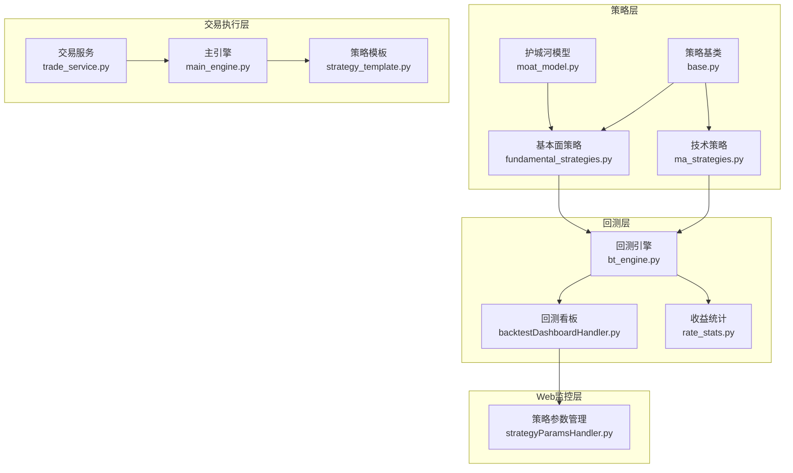
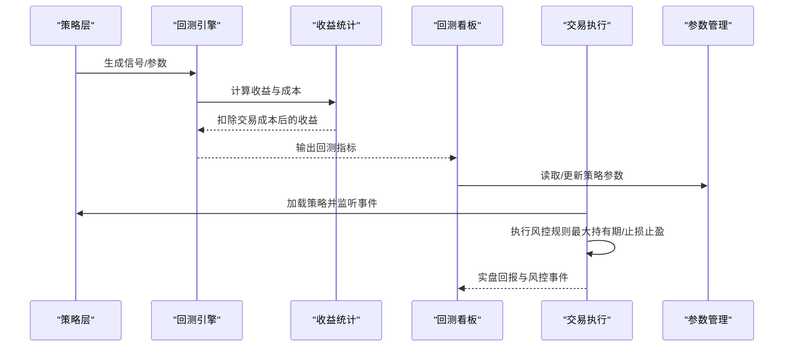
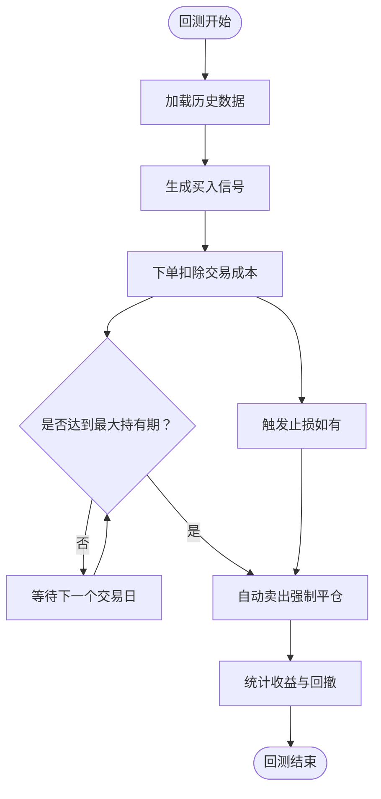
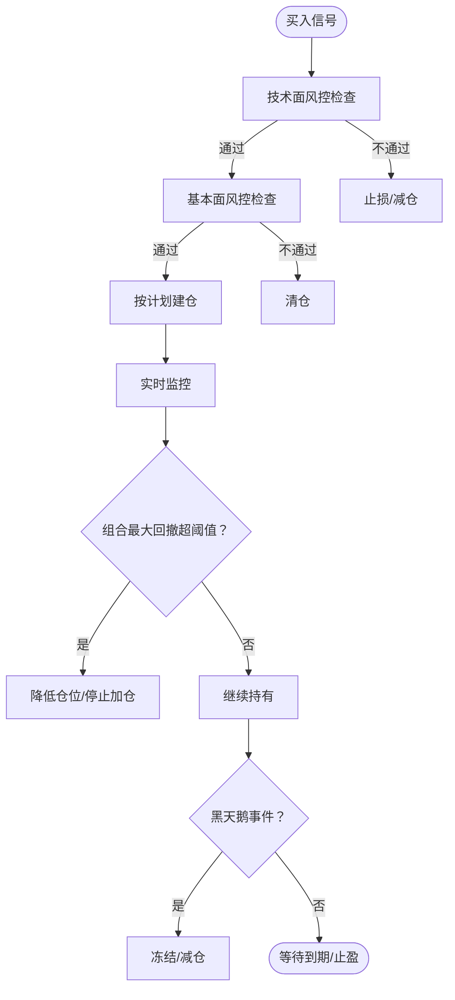
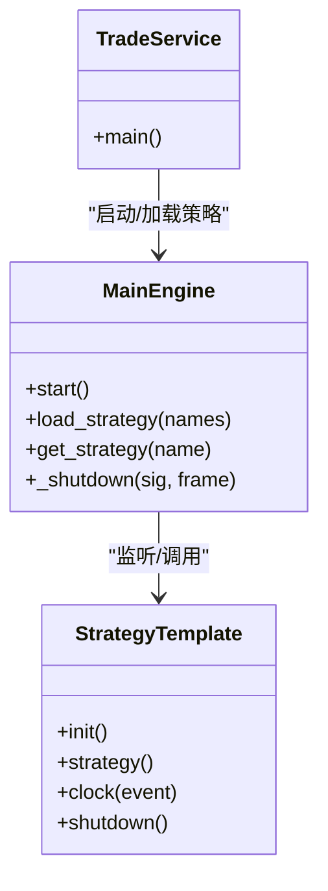
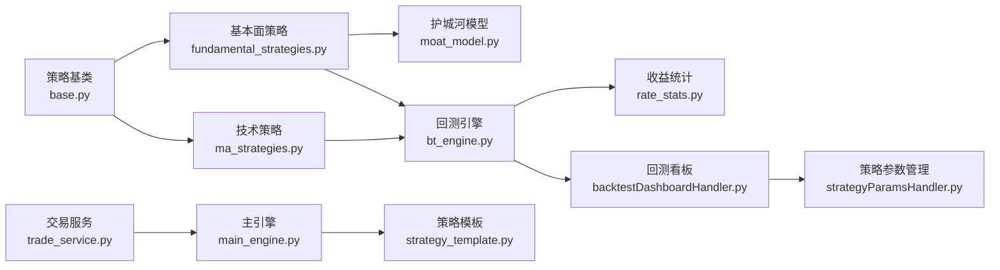

# 风险控制机制

<cite>
**本文档引用的文件**
- [instock/core/backtest/bt_engine.py](file://instock/core/backtest/bt_engine.py)
- [instock/core/backtest/rate_stats.py](file://instock/core/backtest/rate_stats.py)
- [instock/web/backtestDashboardHandler.py](file://instock/web/backtestDashboardHandler.py)
- [instock/web/strategyParamsHandler.py](file://instock/web/strategyParamsHandler.py)
- [instock/trade/robot/engine/main_engine.py](file://instock/trade/robot/engine/main_engine.py)
- [instock/trade/robot/infrastructure/strategy_template.py](file://instock/trade/robot/infrastructure/strategy_template.py)
- [instock/trade/trade_service.py](file://instock/trade/trade_service.py)
- [instock/core/strategy/base.py](file://instock/core/strategy/base.py)
- [instock/core/strategy/fundamental/moat_model.py](file://instock/core/strategy/fundamental/moat_model.py)
- [instock/core/strategy/fundamental/fundamental_strategies.py](file://instock/core/strategy/fundamental/fundamental_strategies.py)
- [instock/core/strategy/technical/ma_strategies.py](file://instock/core/strategy/technical/ma_strategies.py)
- [instock/core/strategy/document/ChatGP选股策略文档.md](file://instock/core/strategy/document/ChatGP选股策略文档.md)
- [tests/test_backtest_integrity.py](file://tests/test_backtest_integrity.py)
- [tests/test_backtest_trade_pairs_date_format.py](file://tests/test_backtest_trade_pairs_date_format.py)
</cite>

## 目录
1. [引言](#引言)
2. [项目结构](#项目结构)
3. [核心组件](#核心组件)
4. [架构总览](#架构总览)
5. [详细组件分析](#详细组件分析)
6. [依赖关系分析](#依赖关系分析)
7. [性能考虑](#性能考虑)
8. [故障排查指南](#故障排查指南)
9. [结论](#结论)
10. [附录](#附录)

## 引言
本文件面向交易系统的风险控制机制，围绕策略设计、风控指标体系、止损止盈、资金管理与仓位控制、最大回撤控制、流动性风险管理等方面，结合代码库中的回测引擎、风控规则文档、参数化策略与交易执行引擎，构建一套可落地、可监控、可调整的风险管理体系。目标是在保证交易系统安全性与稳定性的同时，提升策略的稳健性与可解释性。

## 项目结构
本项目采用模块化组织方式，风险控制贯穿策略层、回测层、交易执行层与Web监控层：
- 策略层：技术面与基本面策略，提供信号与风控前置条件
- 回测层：统一回测引擎与收益统计，内置交易成本与滑点模拟
- 交易执行层：事件驱动引擎与策略模板，支撑实盘交易与风控执行
- Web监控层：回测看板与参数管理，提供可视化风控指标与策略参数配置

**图表来源**
- [instock/core/strategy/technical/ma_strategies.py](file://instock/core/strategy/technical/ma_strategies.py#L1-L237)
- [instock/core/strategy/fundamental/fundamental_strategies.py](file://instock/core/strategy/fundamental/fundamental_strategies.py#L1-L351)
- [instock/core/strategy/fundamental/moat_model.py](file://instock/core/strategy/fundamental/moat_model.py#L1-L479)
- [instock/core/strategy/base.py](file://instock/core/strategy/base.py#L1-L202)
- [instock/core/backtest/bt_engine.py](file://instock/core/backtest/bt_engine.py#L1-L388)
- [instock/core/backtest/rate_stats.py](file://instock/core/backtest/rate_stats.py#L1-L108)
- [instock/web/backtestDashboardHandler.py](file://instock/web/backtestDashboardHandler.py#L1-L906)
- [instock/web/strategyParamsHandler.py](file://instock/web/strategyParamsHandler.py#L433-L619)
- [instock/trade/robot/engine/main_engine.py](file://instock/trade/robot/engine/main_engine.py#L1-L232)
- [instock/trade/robot/infrastructure/strategy_template.py](file://instock/trade/robot/infrastructure/strategy_template.py#L1-L43)
- [instock/trade/trade_service.py](file://instock/trade/trade_service.py#L1-L31)

**章节来源**
- [instock/core/strategy/base.py](file://instock/core/strategy/base.py#L1-L202)
- [instock/core/backtest/bt_engine.py](file://instock/core/backtest/bt_engine.py#L1-L388)
- [instock/web/backtestDashboardHandler.py](file://instock/web/backtestDashboardHandler.py#L1-L906)
- [instock/trade/robot/engine/main_engine.py](file://instock/trade/robot/engine/main_engine.py#L1-L232)

## 核心组件
- 回测引擎与风控指标
  - 回测引擎封装Backtrader，提供统一的策略回测接口，内置佣金、滑点与印花税等交易成本模拟，支持最大持有期等风控参数化配置
  - 收益统计模块提供交易成本扣除、涨停过滤与多日收益计算，确保回测结果贴近真实收益
- 风控规则与策略
  - 策略文档定义了卖出策略、仓位管理与系统级风控规则（组合最大回撤、黑天鹅保护），为实盘风控提供依据
  - 基本面策略与护城河模型引入财务安全、盈利能力与风险等级调整，形成“财务+技术”的双维风控
- 交易执行与监控
  - 主引擎与策略模板提供事件驱动的策略加载、监听与生命周期管理；交易服务负责启动与日志记录
  - 回测看板与策略参数管理提供可视化风控指标与参数配置能力

**章节来源**
- [instock/core/backtest/bt_engine.py](file://instock/core/backtest/bt_engine.py#L101-L215)
- [instock/core/backtest/rate_stats.py](file://instock/core/backtest/rate_stats.py#L11-L32)
- [instock/core/strategy/document/ChatGP选股策略文档.md](file://instock/core/strategy/document/ChatGP选股策略文档.md#L222-L289)
- [instock/core/strategy/fundamental/moat_model.py](file://instock/core/strategy/fundamental/moat_model.py#L216-L268)
- [instock/trade/robot/engine/main_engine.py](file://instock/trade/robot/engine/main_engine.py#L22-L134)
- [instock/web/backtestDashboardHandler.py](file://instock/web/backtestDashboardHandler.py#L173-L215)

## 架构总览
下图展示了风险控制在系统中的位置与交互关系：策略层产生信号与风控前置条件，回测层验证风控有效性与成本影响，Web层提供参数化与可视化，交易执行层在实盘中落实风控策略。

**图表来源**
- [instock/core/backtest/bt_engine.py](file://instock/core/backtest/bt_engine.py#L160-L208)
- [instock/core/backtest/rate_stats.py](file://instock/core/backtest/rate_stats.py#L34-L108)
- [instock/web/backtestDashboardHandler.py](file://instock/web/backtestDashboardHandler.py#L173-L215)
- [instock/web/strategyParamsHandler.py](file://instock/web/strategyParamsHandler.py#L450-L619)
- [instock/trade/robot/engine/main_engine.py](file://instock/trade/robot/engine/main_engine.py#L92-L134)

## 详细组件分析

### 回测引擎与风控指标
- 交易成本与滑点模拟
  - 引擎内置佣金、印花税与滑点参数，统一在回测中扣除，避免过度乐观收益
  - 收益统计模块严格使用T+1开盘价作为买入基准，过滤涨停/跌停情形，确保回测可执行性
- 最大持有期风控
  - 回测引擎支持持有天数参数，到期自动卖出，防止过度持仓
  - 回测看板提供“最大持有期”参数，配合“超期强平”逻辑，保障组合层面的流动性与风险暴露可控

**图表来源**
- [instock/core/backtest/bt_engine.py](file://instock/core/backtest/bt_engine.py#L77-L99)
- [instock/core/backtest/rate_stats.py](file://instock/core/backtest/rate_stats.py#L34-L108)
- [instock/web/backtestDashboardHandler.py](file://instock/web/backtestDashboardHandler.py#L173-L215)

**章节来源**
- [instock/core/backtest/bt_engine.py](file://instock/core/backtest/bt_engine.py#L101-L215)
- [instock/core/backtest/rate_stats.py](file://instock/core/backtest/rate_stats.py#L11-L32)
- [tests/test_backtest_integrity.py](file://tests/test_backtest_integrity.py#L194-L211)

### 风控规则与策略设计
- 卖出策略与止损止盈
  - 技术性减仓：RSI超买、布林上轨遇阻等条件触发部分止盈/减仓
  - 趋势破坏清仓：周线跌破MA60并确认下跌放量，触发清仓
  - 基本面卖出：财务恶化、核心竞争力下降、行业逻辑失效，直接卖出
- 仓位管理与集中度控制
  - 单只股票最大仓位、核心股票仓位、行业集中度上限
  - 分批建仓模型：首次/二次/三次加仓与机动仓位，降低一次性风险
- 组合层面风控
  - 最大回撤阈值：超过阈值停止加仓或降低整体仓位
  - 黑天鹅保护：个股单日大跌或两日累计大跌触发临时冻结/强制减仓

**图表来源**
- [instock/core/strategy/document/ChatGP选股策略文档.md](file://instock/core/strategy/document/ChatGP选股策略文档.md#L222-L289)

**章节来源**
- [instock/core/strategy/document/ChatGP选股策略文档.md](file://instock/core/strategy/document/ChatGP选股策略文档.md#L222-L289)

### 资金管理与流动性风险管理
- 资金管理策略
  - 通过回测引擎的初始资金与交易成本参数，模拟真实资金占用与滑点影响
  - 回测看板提供收益分布与时间序列，辅助评估资金使用效率
- 流动性风险管理
  - 涨停/跌停过滤：回测统计模块在T+1开盘价处检测涨停，避免无法成交
  - 最大持有期：防止因流动性不足导致无法及时平仓
  - 黑天鹅保护：在极端行情下冻结交易，次日再观察，避免流动性枯竭

**章节来源**
- [instock/core/backtest/rate_stats.py](file://instock/core/backtest/rate_stats.py#L70-L84)
- [instock/web/backtestDashboardHandler.py](file://instock/web/backtestDashboardHandler.py#L173-L215)

### 交易执行与策略模板
- 主引擎负责策略加载、事件监听与生命周期管理，支持动态重载策略
- 策略模板提供统一的策略接口，便于扩展与维护
- 交易服务启动主引擎并加载策略，支持日志记录与异常处理

**图表来源**
- [instock/trade/robot/engine/main_engine.py](file://instock/trade/robot/engine/main_engine.py#L81-L134)
- [instock/trade/robot/infrastructure/strategy_template.py](file://instock/trade/robot/infrastructure/strategy_template.py#L9-L43)
- [instock/trade/trade_service.py](file://instock/trade/trade_service.py#L19-L31)

**章节来源**
- [instock/trade/robot/engine/main_engine.py](file://instock/trade/robot/engine/main_engine.py#L22-L134)
- [instock/trade/robot/infrastructure/strategy_template.py](file://instock/trade/robot/infrastructure/strategy_template.py#L9-L43)
- [instock/trade/trade_service.py](file://instock/trade/trade_service.py#L1-L31)

### 参数化风控与策略调整
- 策略参数持久化
  - 通过策略参数管理模块，将策略参数写入数据库表，支持在线修改与生效
  - 回测看板与策略参数联动，确保参数变更后能快速验证效果
- 风险阈值与自动化
  - 回测引擎与回测看板提供阈值配置入口，支持最大持有期、止损止盈等参数化
  - 参数变更后清理筛选缓存，避免脏数据影响

**章节来源**
- [instock/web/strategyParamsHandler.py](file://instock/web/strategyParamsHandler.py#L450-L619)
- [instock/web/backtestDashboardHandler.py](file://instock/web/backtestDashboardHandler.py#L780-L897)

## 依赖关系分析
- 策略层依赖基础策略类，提供统一的check接口与数据准备能力
- 回测层依赖策略层与收益统计模块，输出风控指标与回测报告
- 交易执行层依赖策略模板与主引擎，实现策略加载与事件驱动
- Web监控层依赖数据库与回测看板，提供参数化与可视化

**图表来源**
- [instock/core/strategy/base.py](file://instock/core/strategy/base.py#L19-L97)
- [instock/core/strategy/technical/ma_strategies.py](file://instock/core/strategy/technical/ma_strategies.py#L1-L237)
- [instock/core/strategy/fundamental/fundamental_strategies.py](file://instock/core/strategy/fundamental/fundamental_strategies.py#L1-L351)
- [instock/core/strategy/fundamental/moat_model.py](file://instock/core/strategy/fundamental/moat_model.py#L1-L479)
- [instock/core/backtest/bt_engine.py](file://instock/core/backtest/bt_engine.py#L1-L388)
- [instock/core/backtest/rate_stats.py](file://instock/core/backtest/rate_stats.py#L1-L108)
- [instock/web/backtestDashboardHandler.py](file://instock/web/backtestDashboardHandler.py#L1-L906)
- [instock/web/strategyParamsHandler.py](file://instock/web/strategyParamsHandler.py#L433-L619)
- [instock/trade/trade_service.py](file://instock/trade/trade_service.py#L1-L31)
- [instock/trade/robot/engine/main_engine.py](file://instock/trade/robot/engine/main_engine.py#L1-L232)
- [instock/trade/robot/infrastructure/strategy_template.py](file://instock/trade/robot/infrastructure/strategy_template.py#L1-L43)

**章节来源**
- [instock/core/strategy/base.py](file://instock/core/strategy/base.py#L155-L202)
- [instock/core/backtest/bt_engine.py](file://instock/core/backtest/bt_engine.py#L1-L388)
- [instock/web/backtestDashboardHandler.py](file://instock/web/backtestDashboardHandler.py#L1-L906)

## 性能考虑
- 回测性能
  - 使用向量化计算与TA-Lib加速技术指标计算
  - 控制回测数据长度与窗口大小，避免内存与计算瓶颈
- 实盘性能
  - 主引擎采用事件驱动与线程池，减少阻塞
  - 策略模板最小化开销，避免频繁IO
- 可观测性
  - 回测看板提供收益分布与时间序列，便于快速定位异常

[本节为通用指导，无需特定文件引用]

## 故障排查指南
- 回测收益异常
  - 检查交易成本参数是否正确设置，确认T+1开盘价与涨停过滤逻辑
  - 使用收益统计模块的兼容性测试用例核对计算流程
- 最大持有期不生效
  - 核对回测引擎的持有天数参数与回测看板的“最大持有期”配置
  - 使用单元测试验证超期强平逻辑
- 策略参数未生效
  - 检查策略参数表是否存在，确认参数写入与读取流程
  - 清理筛选缓存后重试

**章节来源**
- [tests/test_backtest_integrity.py](file://tests/test_backtest_integrity.py#L194-L211)
- [tests/test_backtest_trade_pairs_date_format.py](file://tests/test_backtest_trade_pairs_date_format.py#L76-L97)
- [instock/web/strategyParamsHandler.py](file://instock/web/strategyParamsHandler.py#L450-L619)

## 结论
本风险控制机制以策略文档为纲、回测引擎为基、参数化管理为手段、交易执行为落点，形成了覆盖信号、资金、仓位、回撤与流动性等全维度的风控体系。通过可配置的参数与可视化的监控，系统能够在不同市场环境下保持稳健性与适应性，为实盘交易提供可靠保障。

## 附录
- 风控指标清单
  - 交易成本：佣金、印花税、滑点
  - 收益指标：单日/多日收益、累计收益、夏普比率、最大回撤
  - 风控阈值：最大持有期、单日/两日跌幅阈值、组合最大回撤阈值
- 风险控制参数配置建议
  - 交易成本：根据券商费率与市场流动性设定
  - 最大持有期：结合策略频率与流动性设定（如5-20日）
  - 止损止盈：技术指标阈值与基本面信号联动
  - 仓位控制：单只/行业集中度上限与分批建仓节奏

[本节为通用指导，无需特定文件引用]