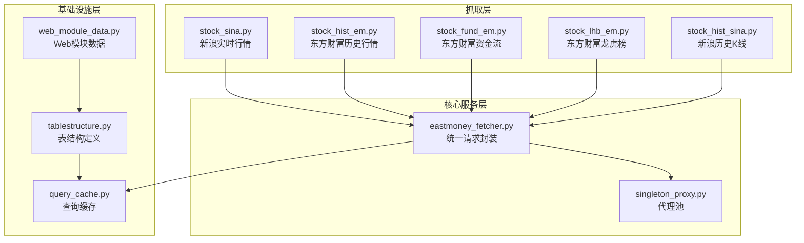
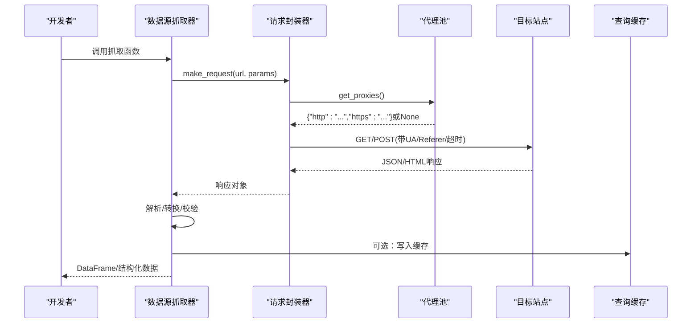
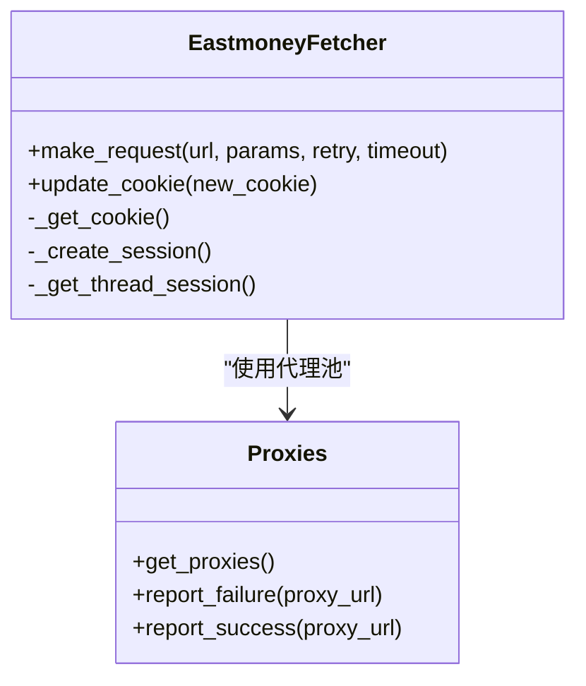
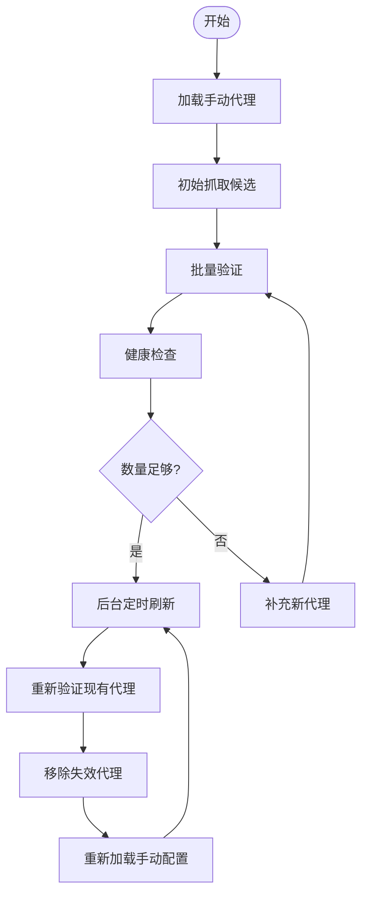
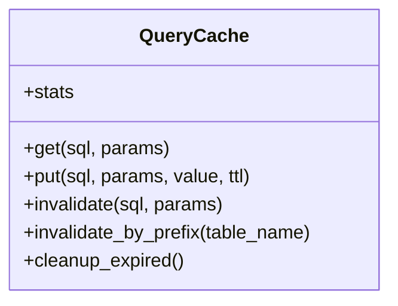
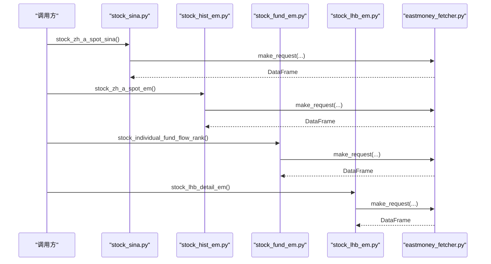
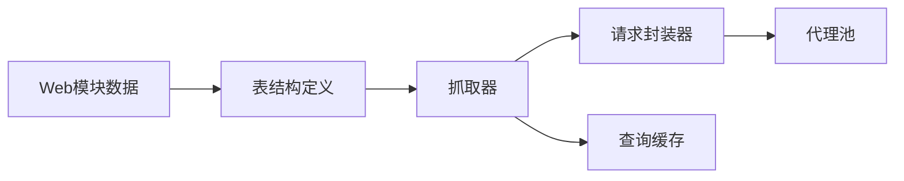

# 数据源扩展

<cite>
**本文引用的文件**
- [instock/core/crawling/stock_sina.py](file://instock/core/crawling/stock_sina.py)
- [instock/core/crawling/stock_hist_em.py](file://instock/core/crawling/stock_hist_em.py)
- [instock/core/eastmoney_fetcher.py](file://instock/core/eastmoney_fetcher.py)
- [instock/core/singleton_proxy.py](file://instock/core/singleton_proxy.py)
- [instock/lib/query_cache.py](file://instock/lib/query_cache.py)
- [instock/core/crawling/stock_hist_sina.py](file://instock/core/crawling/stock_hist_sina.py)
- [instock/core/crawling/stock_fund_em.py](file://instock/core/crawling/stock_fund_em.py)
- [instock/core/crawling/stock_lhb_em.py](file://instock/core/crawling/stock_lhb_em.py)
- [instock/core/tablestructure.py](file://instock/core/tablestructure.py)
- [instock/core/web_module_data.py](file://instock/core/web_module_data.py)
</cite>

## 目录
1. [简介](#简介)
2. [项目结构](#项目结构)
3. [核心组件](#核心组件)
4. [架构总览](#架构总览)
5. [详细组件分析](#详细组件分析)
6. [依赖分析](#依赖分析)
7. [性能考量](#性能考量)
8. [故障排查指南](#故障排查指南)
9. [结论](#结论)
10. [附录](#附录)

## 简介
本指南面向希望扩展“数据源”的开发者，系统讲解本项目的抓取架构、数据源接口规范、数据验证机制，并提供从简单API到复杂网页数据抓取的完整扩展流程。内容涵盖：
- 数据抓取器开发与接口规范
- 代理配置与反爬虫处理
- 数据格式转换与质量保证
- 数据缓存策略
- 完整扩展示例（API数据源、备选数据源、资金流与龙虎榜）

## 项目结构
项目采用“功能域+层次”组织方式：
- instock/core/crawling：各类数据源抓取实现（API/网页）
- instock/core：核心服务（数据获取器、代理池、单例工具）
- instock/lib：通用基础设施（查询缓存）
- instock/core/tablestructure.py：数据库表结构定义
- instock/core/web_module_data.py：Web模块数据描述

图表来源
- [instock/core/crawling/stock_sina.py](file://instock/core/crawling/stock_sina.py#L1-L243)
- [instock/core/crawling/stock_hist_em.py](file://instock/core/crawling/stock_hist_em.py#L1-L551)
- [instock/core/eastmoney_fetcher.py](file://instock/core/eastmoney_fetcher.py#L1-L149)
- [instock/core/singleton_proxy.py](file://instock/core/singleton_proxy.py#L1-L701)
- [instock/lib/query_cache.py](file://instock/lib/query_cache.py#L1-L156)
- [instock/core/tablestructure.py](file://instock/core/tablestructure.py#L1-L800)
- [instock/core/web_module_data.py](file://instock/core/web_module_data.py#L1-L23)

章节来源
- [instock/core/crawling/stock_sina.py](file://instock/core/crawling/stock_sina.py#L1-L243)
- [instock/core/crawling/stock_hist_em.py](file://instock/core/crawling/stock_hist_em.py#L1-L551)
- [instock/core/eastmoney_fetcher.py](file://instock/core/eastmoney_fetcher.py#L1-L149)
- [instock/core/singleton_proxy.py](file://instock/core/singleton_proxy.py#L1-L701)
- [instock/lib/query_cache.py](file://instock/lib/query_cache.py#L1-L156)
- [instock/core/tablestructure.py](file://instock/core/tablestructure.py#L1-L800)
- [instock/core/web_module_data.py](file://instock/core/web_module_data.py#L1-L23)

## 核心组件
- 统一请求封装器：负责Cookie管理、会话管理、线程安全、重试与代理集成
- 代理池：自动抓取、验证、刷新，支持直连与HTTPS隧道
- 查询缓存：LRU+TTL，减少重复查询
- 数据源抓取器：按接口规范实现，统一输出标准化数据帧
- 表结构定义：统一字段类型、长度、注释，保障入库一致性
- Web模块数据：描述Web端数据模块的元信息（查询/编辑、排序、主键等）

章节来源
- [instock/core/eastmoney_fetcher.py](file://instock/core/eastmoney_fetcher.py#L16-L149)
- [instock/core/singleton_proxy.py](file://instock/core/singleton_proxy.py#L45-L701)
- [instock/lib/query_cache.py](file://instock/lib/query_cache.py#L27-L156)
- [instock/core/tablestructure.py](file://instock/core/tablestructure.py#L25-L800)
- [instock/core/web_module_data.py](file://instock/core/web_module_data.py#L9-L23)

## 架构总览
整体流程：抓取器通过统一请求封装器访问目标站点，必要时经代理池转发；返回数据进行格式转换与校验，随后写入数据库或返回Web端消费。

图表来源
- [instock/core/eastmoney_fetcher.py](file://instock/core/eastmoney_fetcher.py#L75-L143)
- [instock/core/singleton_proxy.py](file://instock/core/singleton_proxy.py#L112-L164)
- [instock/lib/query_cache.py](file://instock/lib/query_cache.py#L51-L92)

## 详细组件分析

### 组件A：统一请求封装器（eastmoney_fetcher）
职责
- 线程安全：每个线程独立Session，避免连接池与Cookie冲突
- Cookie管理：环境变量 > 文件 > 默认，支持动态更新
- 重试与错误分类：区分连接级错误与业务错误，自动换代理/直连
- 代理集成：与代理池协作，上报成功/失败，动态调整超时

关键点
- make_request：统一入口，支持直连与代理，自动缩短代理超时
- report_failure/report_success：与代理池联动，维护代理健康度
- _get_cookie/_create_session：灵活配置请求头与Cookie

图表来源
- [instock/core/eastmoney_fetcher.py](file://instock/core/eastmoney_fetcher.py#L16-L149)
- [instock/core/singleton_proxy.py](file://instock/core/singleton_proxy.py#L45-L214)

章节来源
- [instock/core/eastmoney_fetcher.py](file://instock/core/eastmoney_fetcher.py#L16-L149)

### 组件B：代理池（singleton_proxy）
职责
- 自动抓取免费代理，批量验证HTTP/HTTPS能力
- 后台定时刷新，移除失效代理，补充新代理
- 动态直连概率与新鲜度加权，提升稳定性
- 支持手动配置proxy.txt，优先级最高

关键点
- get_proxies：随机返回可用代理，支持HTTPS隧道
- report_failure/report_success：失败计数与移除策略
- _batch_validate/_revalidate_existing：并发验证
- _refresh_cycle：定时刷新逻辑

图表来源
- [instock/core/singleton_proxy.py](file://instock/core/singleton_proxy.py#L65-L686)

章节来源
- [instock/core/singleton_proxy.py](file://instock/core/singleton_proxy.py#L45-L701)

### 组件C：查询缓存（query_cache）
职责
- LRU+TTL：命中即移动至末尾，过期自动清理
- 线程安全：读写加锁，统计命中/未命中
- 适用场景：Web分页查询、筛选结果缓存

关键点
- get/put/invalidate：基于SQL+参数生成key
- stats：命中率、条目数、TTL等

图表来源
- [instock/lib/query_cache.py](file://instock/lib/query_cache.py#L27-L156)

章节来源
- [instock/lib/query_cache.py](file://instock/lib/query_cache.py#L1-L156)

### 组件D：数据源抓取器（示例：stock_sina、stock_hist_em、stock_fund_em、stock_lhb_em）
职责
- 实现具体数据源接口，遵循统一返回格式
- 数据清洗与类型转换，缺失字段补齐
- 错误处理与降级（如备用接口）

要点
- stock_sina：实时行情，GBK解码，字段映射与数值转换
- stock_hist_em：分页拉取、参数映射、数值类型转换
- stock_fund_em：多域名重试、字段映射、分页聚合
- stock_lhb_em：多接口聚合、日期/数值转换

图表来源
- [instock/core/crawling/stock_sina.py](file://instock/core/crawling/stock_sina.py#L171-L243)
- [instock/core/crawling/stock_hist_em.py](file://instock/core/crawling/stock_hist_em.py#L20-L188)
- [instock/core/crawling/stock_fund_em.py](file://instock/core/crawling/stock_fund_em.py#L46-L266)
- [instock/core/crawling/stock_lhb_em.py](file://instock/core/crawling/stock_lhb_em.py#L21-L136)
- [instock/core/eastmoney_fetcher.py](file://instock/core/eastmoney_fetcher.py#L75-L143)

章节来源
- [instock/core/crawling/stock_sina.py](file://instock/core/crawling/stock_sina.py#L1-L243)
- [instock/core/crawling/stock_hist_em.py](file://instock/core/crawling/stock_hist_em.py#L1-L551)
- [instock/core/crawling/stock_fund_em.py](file://instock/core/crawling/stock_fund_em.py#L1-L514)
- [instock/core/crawling/stock_lhb_em.py](file://instock/core/crawling/stock_lhb_em.py#L1-L911)

### 组件E：数据格式转换与质量保证
- 字段映射：统一列名与顺序，缺失字段补0/None
- 类型转换：数值/日期/布尔，异常值填充
- 缺失与异常：空响应、解析失败、字段不足时降级或返回空表
- 复权与单位：K线成交量单位统一（手/股），复权参数映射

章节来源
- [instock/core/crawling/stock_sina.py](file://instock/core/crawling/stock_sina.py#L37-L242)
- [instock/core/crawling/stock_hist_em.py](file://instock/core/crawling/stock_hist_em.py#L244-L318)
- [instock/core/crawling/stock_hist_sina.py](file://instock/core/crawling/stock_hist_sina.py#L58-L219)

### 组件F：Web模块数据（web_module_data）
- 描述Web端数据模块的元信息：查询/编辑模式、图标、名称、表名、列定义、主键、是否实时、排序列等
- 自动生成URL，便于前端路由与权限控制

章节来源
- [instock/core/web_module_data.py](file://instock/core/web_module_data.py#L9-L23)

## 依赖分析
- 抓取器依赖统一请求封装器，间接依赖代理池
- 请求封装器依赖代理池与Cookie配置
- 查询缓存可被抓取器与Web层复用
- 表结构定义贯穿入库与Web展示

图表来源
- [instock/core/eastmoney_fetcher.py](file://instock/core/eastmoney_fetcher.py#L16-L149)
- [instock/core/singleton_proxy.py](file://instock/core/singleton_proxy.py#L45-L701)
- [instock/lib/query_cache.py](file://instock/lib/query_cache.py#L1-L156)
- [instock/core/tablestructure.py](file://instock/core/tablestructure.py#L1-L800)
- [instock/core/web_module_data.py](file://instock/core/web_module_data.py#L1-L23)

章节来源
- [instock/core/eastmoney_fetcher.py](file://instock/core/eastmoney_fetcher.py#L16-L149)
- [instock/core/singleton_proxy.py](file://instock/core/singleton_proxy.py#L45-L701)
- [instock/lib/query_cache.py](file://instock/lib/query_cache.py#L1-L156)
- [instock/core/tablestructure.py](file://instock/core/tablestructure.py#L1-L800)
- [instock/core/web_module_data.py](file://instock/core/web_module_data.py#L1-L23)

## 性能考量
- 并发与限速：抓取器使用线程池并发，配合随机延迟与批次控制，避免触发限流
- 代理策略：动态直连概率与HTTPS隧道支持，降低失败率
- 缓存策略：LRU+TTL减少重复查询，热点数据命中率提升
- 类型转换与缺失处理：统一转换与填充，避免下游重复处理

## 故障排查指南
常见问题与定位
- 请求失败（连接级错误）：检查代理池健康度、直连/代理切换、超时设置
- 解析失败：确认响应编码、字段映射、空响应降级
- 速率限制：增加延迟、减少并发、启用代理
- Cookie失效：更新环境变量或文件中的Cookie

定位步骤
- 查看请求封装器的重试与错误分类日志
- 检查代理池report_failure/report_success反馈
- 核对数据源抓取器的字段映射与类型转换
- 使用查询缓存的stats查看命中情况

章节来源
- [instock/core/eastmoney_fetcher.py](file://instock/core/eastmoney_fetcher.py#L116-L142)
- [instock/core/singleton_proxy.py](file://instock/core/singleton_proxy.py#L185-L209)
- [instock/lib/query_cache.py](file://instock/lib/query_cache.py#L124-L136)

## 结论
通过统一请求封装器、代理池与查询缓存，项目实现了稳定、可扩展的数据抓取体系。开发者可依据现有抓取器模式快速扩展新的数据源，确保数据格式统一、质量可控、性能与稳定性兼顾。

## 附录

### 扩展新数据源的步骤清单
- 设计接口规范：明确输入参数、输出字段、数据粒度（实时/历史）、复权/单位约定
- 实现抓取器：参考现有文件，使用统一请求封装器，处理分页/重试/降级
- 数据转换：字段映射、类型转换、缺失值填充、单位统一
- 反爬虫与代理：合理设置延迟、UA/Referer、启用代理池
- 缓存策略：对高频查询启用LRU+TTL缓存
- 表结构与Web模块：在表结构定义中注册新表，配置Web模块数据
- 单元测试与回归：覆盖边界条件、异常路径、性能基线

章节来源
- [instock/core/crawling/stock_sina.py](file://instock/core/crawling/stock_sina.py#L1-L243)
- [instock/core/crawling/stock_hist_em.py](file://instock/core/crawling/stock_hist_em.py#L1-L551)
- [instock/core/crawling/stock_fund_em.py](file://instock/core/crawling/stock_fund_em.py#L1-L514)
- [instock/core/crawling/stock_lhb_em.py](file://instock/core/crawling/stock_lhb_em.py#L1-L911)
- [instock/core/tablestructure.py](file://instock/core/tablestructure.py#L1-L800)
- [instock/core/web_module_data.py](file://instock/core/web_module_data.py#L1-L23)