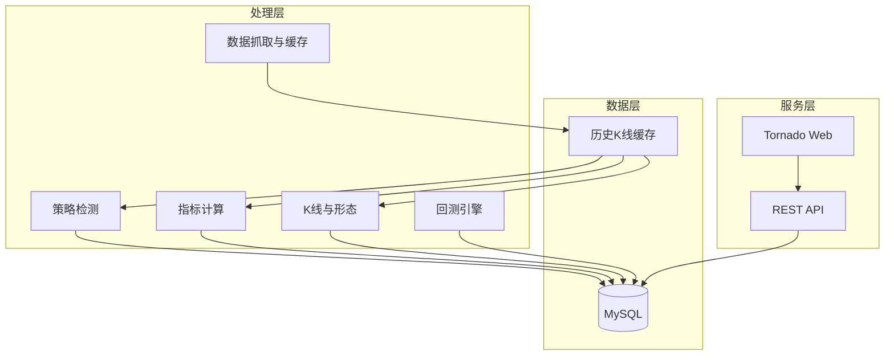
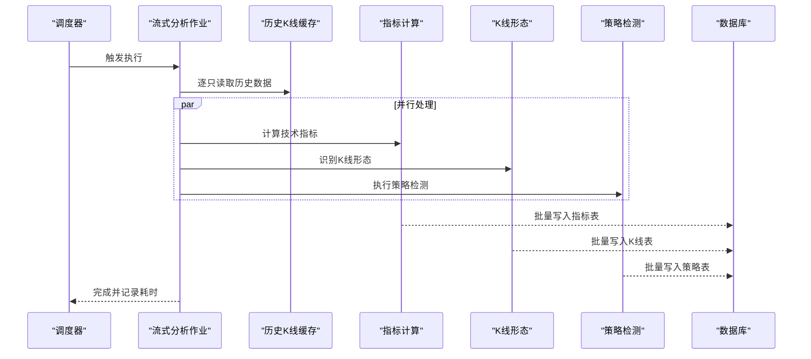
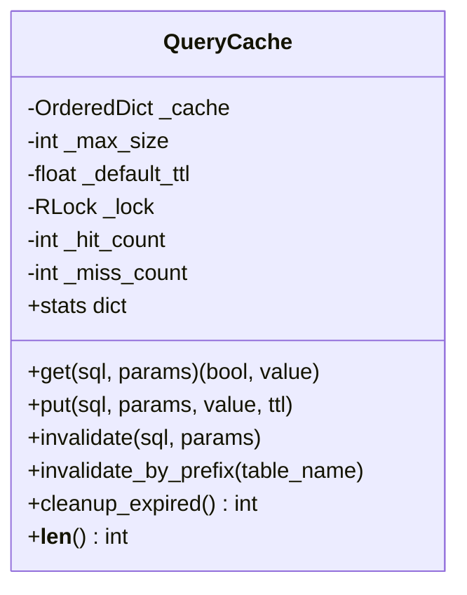
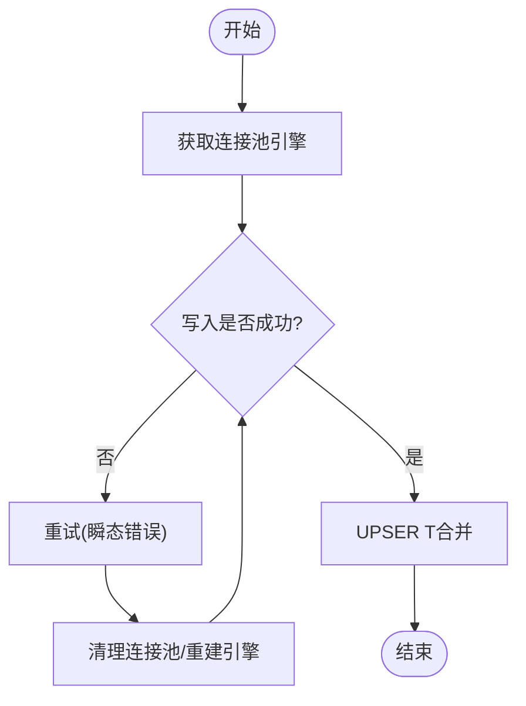
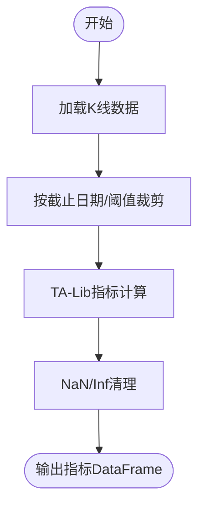
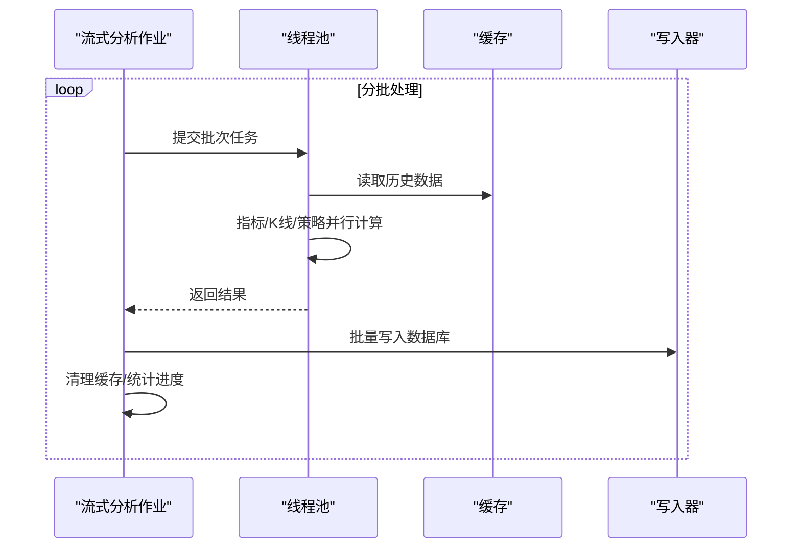
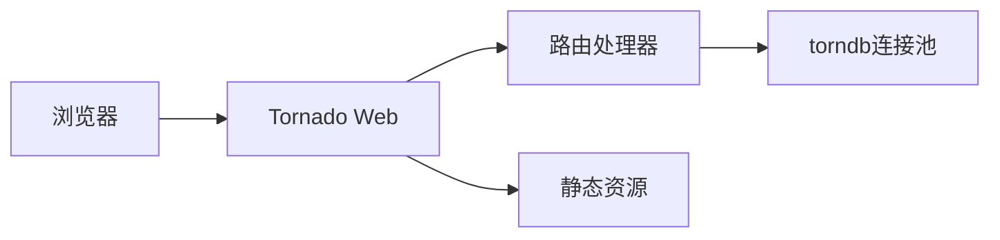
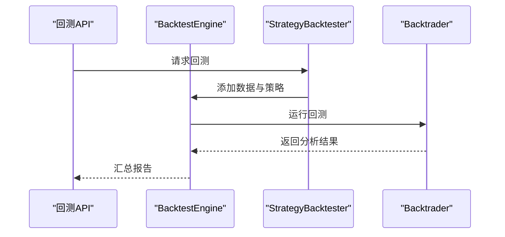
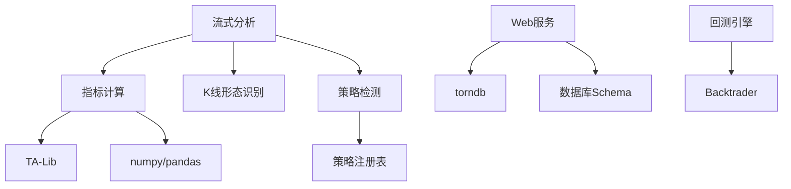

# 性能问题排查

<cite>
**本文引用的文件**
- [README.md](file://README.md)
- [QUICKSTART.md](file://QUICKSTART.md)
- [instock/lib/query_cache.py](file://instock/lib/query_cache.py)
- [instock/lib/database.py](file://instock/lib/database.py)
- [instock/lib/torndb.py](file://instock/lib/torndb.py)
- [instock/core/indicator/calculate_indicator.py](file://instock/core/indicator/calculate_indicator.py)
- [instock/core/backtest/bt_engine.py](file://instock/core/backtest/bt_engine.py)
- [instock/job/streaming_analysis_job.py](file://instock/job/streaming_analysis_job.py)
- [instock/core/kline/visualization.py](file://instock/core/kline/visualization.py)
- [instock/web/web_service.py](file://instock/web/web_service.py)
- [document/database_schema.md](file://document/database_schema.md)
- [docker/init_database.sql](file://docker/init_database.sql)
- [tests/test_pagination.py](file://tests/test_pagination.py)
- [tests/test_bugfixes.py](file://tests/test_bugfixes.py)
- [instock/core/strategy/base.py](file://instock/core/strategy/base.py)
</cite>

## 目录
1. [简介](#简介)
2. [项目结构](#项目结构)
3. [核心组件](#核心组件)
4. [架构总览](#架构总览)
5. [详细组件分析](#详细组件分析)
6. [依赖关系分析](#依赖关系分析)
7. [性能考量](#性能考量)
8. [故障排查指南](#故障排查指南)
9. [结论](#结论)
10. [附录](#附录)

## 简介
本指南面向系统管理员与运维工程师，聚焦SelectStock系统在生产环境中的性能问题排查与优化。内容涵盖CPU使用率过高、内存泄漏、数据库查询缓慢、技术指标计算性能、K线数据处理效率、策略回测速度优化、缓存策略与并发处理改进、算法性能提升等主题，并配套性能监控工具使用与系统资源分析方法。

## 项目结构
SelectStock采用模块化分层设计：
- 数据采集与缓存：历史K线缓存、增量更新、数据源健康度与降级策略
- 指标计算：基于TA-Lib与pandas的高效指标计算
- K线与可视化：K线图、筹码分布、形态标注
- 策略体系：策略基类、策略注册与分类
- 回测引擎：回测框架与收益统计
- Web服务：Tornado提供REST API与SPA路由
- 数据库：SQLAlchemy连接池、批量写入、UPSER T合并

**图表来源**
- [instock/job/streaming_analysis_job.py](file://instock/job/streaming_analysis_job.py#L118-L294)
- [instock/core/indicator/calculate_indicator.py](file://instock/core/indicator/calculate_indicator.py#L23-L407)
- [instock/web/web_service.py](file://instock/web/web_service.py#L53-L98)
- [instock/lib/database.py](file://instock/lib/database.py#L60-L71)

**章节来源**
- [README.md](file://README.md#L1-L700)
- [QUICKSTART.md](file://QUICKSTART.md#L1-L207)

## 核心组件
- 查询缓存模块：提供线程安全的LRU+TTL缓存，减少数据库重复查询，支持分页场景的独立缓存与COUNT共享缓存。
- 数据库连接与批量写入：SQLAlchemy连接池、UPSER T合并、瞬态错误重试与连接池清理。
- 指标计算：基于TA-Lib与numpy/pandas的向量化计算，NaN/Inf清理，阈值裁剪。
- 流式分析作业：单次遍历+并发线程+批量写入，显著降低内存峰值与I/O次数。
- Web服务：Tornado路由与静态资源，统一日志配置。
- 回测引擎：Backtrader适配器，收益统计与分析器。

**章节来源**
- [instock/lib/query_cache.py](file://instock/lib/query_cache.py#L27-L156)
- [instock/lib/database.py](file://instock/lib/database.py#L60-L304)
- [instock/core/indicator/calculate_indicator.py](file://instock/core/indicator/calculate_indicator.py#L23-L407)
- [instock/job/streaming_analysis_job.py](file://instock/job/streaming_analysis_job.py#L118-L294)
- [instock/web/web_service.py](file://instock/web/web_service.py#L53-L143)
- [instock/core/backtest/bt_engine.py](file://instock/core/backtest/bt_engine.py#L101-L215)

## 架构总览
系统采用“缓存优先、批量写入、并发处理”的高性能流水线：
- 数据抓取阶段：历史K线缓存（增量更新），避免重复API调用
- 分析阶段：流式分析作业，单次遍历4900只股票，指标/K线/策略并行计算，批量写入数据库
- 展示阶段：Web服务提供API与SPA，查询缓存降低数据库压力
- 回测阶段：策略回测与收益统计，支持多天数horizon

**图表来源**
- [instock/job/streaming_analysis_job.py](file://instock/job/streaming_analysis_job.py#L201-L294)

**章节来源**
- [instock/job/streaming_analysis_job.py](file://instock/job/streaming_analysis_job.py#L1-L530)

## 详细组件分析

### 查询缓存模块（QueryCache）
- 设计目标：LRU淘汰+TTL过期，线程安全，支持COUNT与DATA区分缓存
- 关键行为：命中返回、过期清理、LRU淘汰、统计信息（命中/未命中/命中率）
- 适用场景：股票列表分页、策略筛选结果缓存

**图表来源**
- [instock/lib/query_cache.py](file://instock/lib/query_cache.py#L27-L156)

**章节来源**
- [instock/lib/query_cache.py](file://instock/lib/query_cache.py#L1-L156)
- [tests/test_pagination.py](file://tests/test_pagination.py#L835-L993)

### 数据库连接与批量写入
- 连接池：SQLAlchemy连接池，预热与回收策略，连接超时与重试
- 写入策略：UPSER T合并（主键冲突更新），批量写入，瞬态错误重试与连接池清理
- 健康检查：主键约束自动补齐，表结构不兼容时重建

**图表来源**
- [instock/lib/database.py](file://instock/lib/database.py#L60-L185)

**章节来源**
- [instock/lib/database.py](file://instock/lib/database.py#L1-L304)
- [tests/test_bugfixes.py](file://tests/test_bugfixes.py#L93-L116)

### 指标计算性能（TA-Lib + pandas/numpy）
- 向量化计算：使用TA-Lib与numpy/pandas进行批量计算，减少循环
- NaN/Inf处理：统一清理策略，避免后续计算异常
- 阈值裁剪：按需裁剪数据长度，降低计算量

**图表来源**
- [instock/core/indicator/calculate_indicator.py](file://instock/core/indicator/calculate_indicator.py#L23-L407)

**章节来源**
- [instock/core/indicator/calculate_indicator.py](file://instock/core/indicator/calculate_indicator.py#L1-L449)
- [tests/test_strategy_bugs.py](file://tests/test_strategy_bugs.py#L254-L277)

### 流式分析作业（内存与并发优化）
- 单次遍历：4900只股票×1次缓存读取，显著降低I/O
- 并发线程：控制同时在内存中的股票数，避免内存峰值过高
- 批量写入：BATCH_SIZE分批写入，减少数据库连接开销
- 延迟清理：按需清理当日旧数据，避免中途崩溃导致数据丢失

**图表来源**
- [instock/job/streaming_analysis_job.py](file://instock/job/streaming_analysis_job.py#L248-L294)

**章节来源**
- [instock/job/streaming_analysis_job.py](file://instock/job/streaming_analysis_job.py#L1-L530)

### Web服务与API
- Tornado路由：API与SPA统一入口，静态资源直出
- 数据库连接：torndb连接池，统一日志配置
- 前端交互：Vue SPA通过AJAX调用API，Bokeh图表按需渲染

**图表来源**
- [instock/web/web_service.py](file://instock/web/web_service.py#L53-L143)

**章节来源**
- [instock/web/web_service.py](file://instock/web/web_service.py#L1-L143)

### 回测引擎与收益统计
- Backtrader适配：PandasData数据源、SignalStrategy信号策略
- 收益统计：支持多天数horizon，交易成本扣除
- 报告生成：按策略与日期生成回测报告

**图表来源**
- [instock/core/backtest/bt_engine.py](file://instock/core/backtest/bt_engine.py#L101-L215)

**章节来源**
- [instock/core/backtest/bt_engine.py](file://instock/core/backtest/bt_engine.py#L1-L388)

## 依赖关系分析
- 指标计算依赖TA-Lib与numpy/pandas
- 流式分析依赖历史K线缓存与策略注册表
- Web服务依赖torndb与数据库schema
- 回测引擎依赖Backtrader（可选）

**图表来源**
- [instock/core/indicator/calculate_indicator.py](file://instock/core/indicator/calculate_indicator.py#L1-L449)
- [instock/job/streaming_analysis_job.py](file://instock/job/streaming_analysis_job.py#L1-L530)
- [instock/web/web_service.py](file://instock/web/web_service.py#L1-L143)
- [instock/core/backtest/bt_engine.py](file://instock/core/backtest/bt_engine.py#L1-L388)
- [instock/core/strategy/base.py](file://instock/core/strategy/base.py#L155-L202)

**章节来源**
- [document/database_schema.md](file://document/database_schema.md#L342-L421)
- [docker/init_database.sql](file://docker/init_database.sql#L1-L36)

## 性能考量
- CPU使用率过高
  - 指标计算：确保数据裁剪阈值合理，避免不必要的长序列计算
  - 并发线程：根据CPU核数调整并发线程数，避免过度竞争
  - 策略检测：策略逻辑尽量向量化，减少Python循环
- 内存泄漏
  - 流式分析：及时释放大DataFrame，定期触发GC
  - 缓存：合理设置TTL与容量，避免缓存膨胀
- 数据库查询缓慢
  - 连接池：调整连接池大小与回收策略
  - 写入：批量写入与UPSER T合并，减少事务开销
  - 索引：确保高频查询字段建立索引
- 技术指标计算性能
  - 向量化优先：避免逐行迭代
  - NaN/Inf清理：统一清理策略，减少后续计算分支
- K线数据处理效率
  - 缓存优先：历史K线缓存，增量更新
  - 可视化：Bokeh按需渲染，避免一次性加载过多数据
- 策略回测速度优化
  - 多天数horizon：按需计算，避免冗余
  - 交易成本：统一扣除，减少回测偏差

[本节为通用指导，无需特定文件引用]

## 故障排查指南

### 1. 识别性能瓶颈
- 使用系统监控工具（如top/htop、iostat、vmstat、netstat）观察CPU、内存、磁盘I/O、网络连接
- Web侧：关注API响应时间与错误率
- 数据库侧：慢查询日志与连接数峰值

**章节来源**
- [README.md](file://README.md#L311-L318)

### 2. CPU使用率过高
- 指标计算：检查阈值与数据长度，必要时缩短序列
- 并发：调整并发线程数与批大小
- 策略：优化策略逻辑，减少复杂度

**章节来源**
- [instock/core/indicator/calculate_indicator.py](file://instock/core/indicator/calculate_indicator.py#L23-L407)
- [instock/job/streaming_analysis_job.py](file://instock/job/streaming_analysis_job.py#L48-L54)

### 3. 内存泄漏
- 流式分析：确认每批处理后清理结果缓冲区并触发GC
- 缓存：监控缓存命中率与容量，定期清理过期条目

**章节来源**
- [instock/job/streaming_analysis_job.py](file://instock/job/streaming_analysis_job.py#L277-L284)
- [instock/lib/query_cache.py](file://instock/lib/query_cache.py#L114-L121)

### 4. 数据库查询缓慢
- 连接池：检查连接池大小与回收策略
- 写入：批量写入与UPSER T合并，避免单条插入
- 索引：为高频查询字段建立索引

**章节来源**
- [instock/lib/database.py](file://instock/lib/database.py#L60-L185)
- [document/database_schema.md](file://document/database_schema.md#L342-L421)

### 5. 技术指标计算性能
- 向量化：确保使用TA-Lib与numpy/pandas的向量化接口
- NaN/Inf：统一清理策略，避免后续计算异常

**章节来源**
- [instock/core/indicator/calculate_indicator.py](file://instock/core/indicator/calculate_indicator.py#L18-L21)
- [tests/test_strategy_bugs.py](file://tests/test_strategy_bugs.py#L254-L277)

### 6. K线数据处理效率
- 缓存：启用历史K线缓存，增量更新
- 可视化：Bokeh按需渲染，避免一次性加载过多数据

**章节来源**
- [instock/core/kline/visualization.py](file://instock/core/kline/visualization.py#L29-L275)

### 7. 策略回测速度优化
- 多天数horizon：按需计算，避免冗余
- 交易成本：统一扣除，减少回测偏差

**章节来源**
- [instock/core/backtest/bt_engine.py](file://instock/core/backtest/bt_engine.py#L310-L358)

### 8. 缓存策略优化
- 查询缓存：合理设置TTL与容量，区分COUNT与DATA缓存
- 分页场景：独立缓存不同页码，COUNT结果在翻页间共享

**章节来源**
- [instock/lib/query_cache.py](file://instock/lib/query_cache.py#L1-L156)
- [tests/test_pagination.py](file://tests/test_pagination.py#L943-L980)

### 9. 并发处理改进
- 线程池：控制同时在内存中的数据量，避免内存峰值过高
- 批量写入：减少数据库连接开销

**章节来源**
- [instock/job/streaming_analysis_job.py](file://instock/job/streaming_analysis_job.py#L248-L294)

### 10. 算法性能提升
- 向量化优先：避免逐行迭代
- 数据裁剪：按需裁剪，减少计算量
- 策略注册：统一策略基类，便于扩展与维护

**章节来源**
- [instock/core/indicator/calculate_indicator.py](file://instock/core/indicator/calculate_indicator.py#L23-L407)
- [instock/core/strategy/base.py](file://instock/core/strategy/base.py#L155-L202)

### 11. 数据库性能调优
- 连接池：调整连接池大小与回收策略
- 写入：批量写入与UPSER T合并
- 索引：为高频查询字段建立索引

**章节来源**
- [instock/lib/database.py](file://instock/lib/database.py#L60-L185)
- [document/database_schema.md](file://document/database_schema.md#L342-L421)

### 12. Web服务与API监控
- Tornado路由：监控API响应时间与错误率
- 日志：统一日志配置，定位问题

**章节来源**
- [instock/web/web_service.py](file://instock/web/web_service.py#L53-L143)

## 结论
通过缓存优先、批量写入、并发处理与向量化计算，SelectStock系统在生产环境中实现了高效的指标计算、K线处理与策略回测。针对性能问题，建议从CPU、内存、数据库与I/O四个维度入手，结合查询缓存、连接池与批处理策略进行系统性优化。同时，完善的日志与监控体系有助于快速定位瓶颈并验证优化效果。

[本节为总结，无需特定文件引用]

## 附录
- 快速开始与常用操作参考：[QUICKSTART.md](file://QUICKSTART.md#L1-L207)
- 项目总体说明与运行效率说明：[README.md](file://README.md#L1-L700)