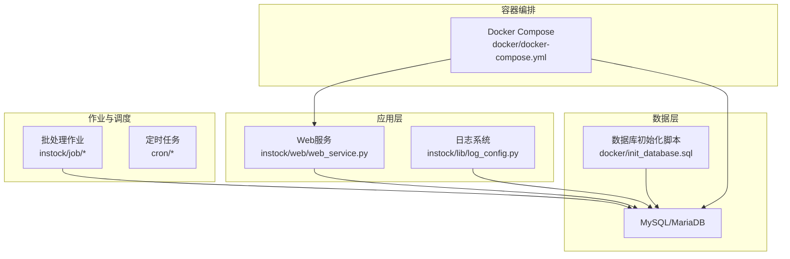
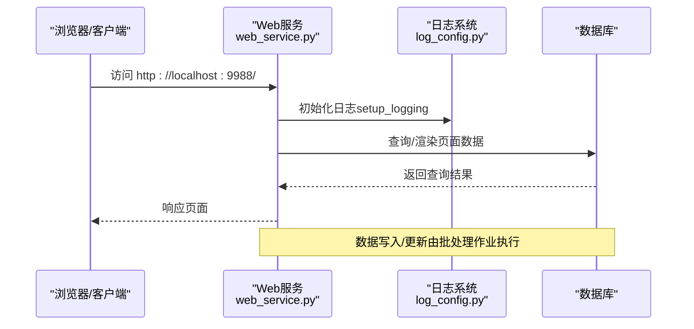
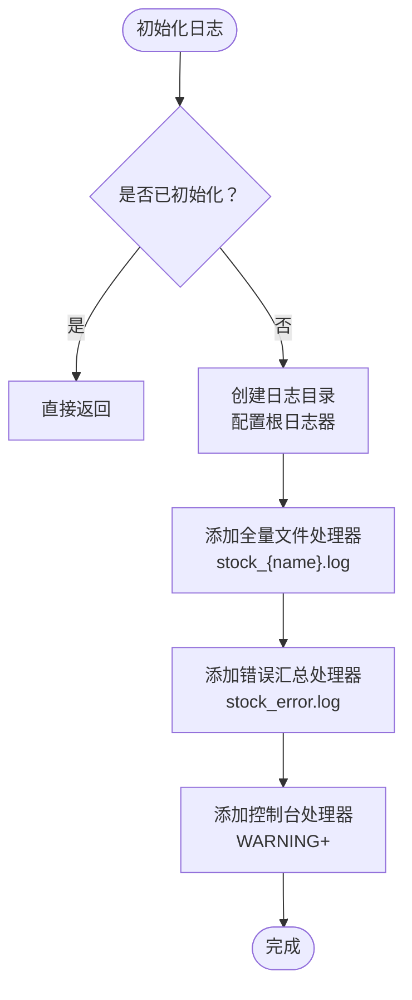
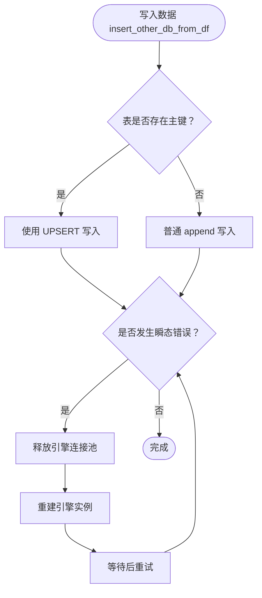
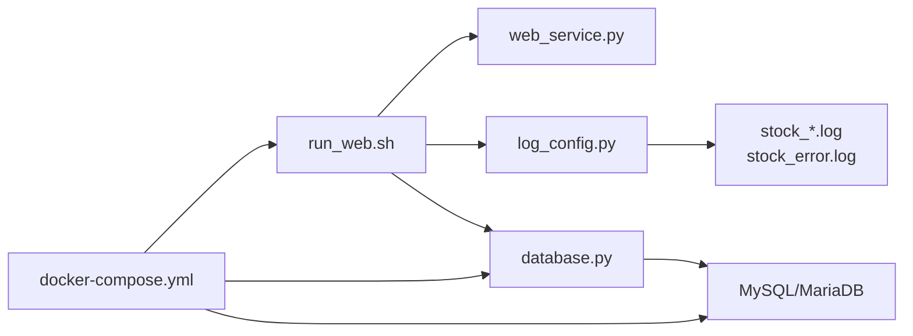

# 故障排除

<cite>
**本文引用的文件**   
- [README.md](file://README.md)
- [QUICKSTART.md](file://QUICKSTART.md)
- [docker/docker-compose.yml](file://docker/docker-compose.yml)
- [docker/init_database.sql](file://docker/init_database.sql)
- [instock/lib/log_config.py](file://instock/lib/log_config.py)
- [instock/lib/database.py](file://instock/lib/database.py)
- [instock/lib/torndb.py](file://instock/lib/torndb.py)
- [instock/bin/run_web.sh](file://instock/bin/run_web.sh)
- [instock/log/stock_error.log](file://instock/log/stock_error.log)
</cite>

## 目录
1. [简介](#简介)
2. [项目结构](#项目结构)
3. [核心组件](#核心组件)
4. [架构总览](#架构总览)
5. [详细组件分析](#详细组件分析)
6. [依赖关系分析](#依赖关系分析)
7. [性能考虑](#性能考虑)
8. [故障排除指南](#故障排除指南)
9. [结论](#结论)
10. [附录](#附录)

## 简介
本指南面向系统管理员与运维人员，围绕 SelectStock（InStock）股票数据采集与分析系统，提供系统化的故障排除方法与最佳实践。内容涵盖网络连接问题、数据库连接问题、数据同步问题、性能瓶颈识别、日志分析与错误定位、故障恢复流程、预防性维护、监控告警与应急响应预案，并配套工具与脚本使用说明，帮助快速定位与解决问题。

## 项目结构
系统采用前后端分离与批处理作业结合的架构：
- 后端核心位于 instock/core 与 instock/job，负责数据抓取、指标计算、策略选股与回测。
- Web 展示位于 instock/web，提供可视化界面。
- 日志统一由 instock/lib/log_config.py 管理，输出到 instock/log。
- 数据库初始化脚本位于 docker/init_database.sql，定义了系统所需的核心表结构。
- Docker 部署通过 docker/docker-compose.yml 管理数据库与应用服务健康检查与环境变量。

图表来源
- [docker/docker-compose.yml](file://docker/docker-compose.yml#L1-L87)
- [docker/init_database.sql](file://docker/init_database.sql#L1-L455)
- [instock/lib/log_config.py](file://instock/lib/log_config.py#L1-L104)

章节来源
- [docker/docker-compose.yml](file://docker/docker-compose.yml#L1-L87)
- [docker/init_database.sql](file://docker/init_database.sql#L1-L455)
- [README.md](file://README.md#L321-L700)

## 核心组件
- 日志系统：统一日志配置与轮转，分别输出到各模块日志与错误汇总日志，便于快速定位问题。
- 数据库模块：提供连接池、重试机制、UPSERT 写入、主键/索引自动创建与 SQL 辅助方法。
- Web 启动脚本：标准化环境变量与 Python 路径，确保服务稳定启动。
- Docker 编排：健康检查、环境变量注入、数据卷挂载，保障服务可用性与数据持久化。

章节来源
- [instock/lib/log_config.py](file://instock/lib/log_config.py#L1-L104)
- [instock/lib/database.py](file://instock/lib/database.py#L1-L304)
- [instock/bin/run_web.sh](file://instock/bin/run_web.sh#L1-L19)
- [docker/docker-compose.yml](file://docker/docker-compose.yml#L1-L87)

## 架构总览
系统运行时序（数据抓取与Web访问）如下：

图表来源
- [instock/lib/log_config.py](file://instock/lib/log_config.py#L47-L104)
- [docker/docker-compose.yml](file://docker/docker-compose.yml#L66-L71)

## 详细组件分析

### 日志系统（log_config.py）
- 输出目标：按模块输出到 stock_{name}.log，错误统一汇总到 stock_error.log，控制台输出 WARNING+。
- 轮转策略：单文件最大 10MB，最多保留 5 份。
- 初始化保护：同一进程内仅初始化一次，避免重复配置导致格式混乱。
- 使用建议：在入口脚本调用一次 setup_logging，模块内使用 logging.getLogger(__name__) 获取日志器。

图表来源
- [instock/lib/log_config.py](file://instock/lib/log_config.py#L47-L104)

章节来源
- [instock/lib/log_config.py](file://instock/lib/log_config.py#L1-L104)

### 数据库模块（database.py）
- 连接池：单例模式，避免频繁创建连接池；启用 pool_pre_ping 与 recycle，提升连接可用性。
- 重试机制：对瞬态错误（死锁、锁超时、连接异常等）进行有限次数重试。
- 写入策略：存在主键时使用 UPSERT（ON DUPLICATE KEY UPDATE），避免重复写入报错；首次创建表时自动添加主键与索引。
- SQL 辅助：提供 upsert、insert/update、execute/fetch/count 等通用方法，简化数据操作。

图表来源
- [instock/lib/database.py](file://instock/lib/database.py#L120-L185)

章节来源
- [instock/lib/database.py](file://instock/lib/database.py#L1-L304)

### Web 启动脚本（run_web.sh）
- 设置编码与语言环境，确保中文显示与日志输出正常。
- 将项目根目录加入 PYTHONPATH，确保模块导入正确。
- 启动 instock/web/web_service.py，打印访问地址。

章节来源
- [instock/bin/run_web.sh](file://instock/bin/run_web.sh#L1-L19)

### Docker 编排（docker-compose.yml）
- 数据库服务：健康检查 ping 校验，确保数据库可用后再启动应用。
- 应用服务：健康检查访问 http://localhost:9988/，端口映射 9988:9988。
- 环境变量：支持 db_host/db_user/db_password/db_database 等注入。
- 数据卷：挂载日志、缓存目录，保障数据持久化与可观测性。

章节来源
- [docker/docker-compose.yml](file://docker/docker-compose.yml#L1-L87)

## 依赖关系分析
- 日志系统依赖 instock/log 目录存在性与写权限。
- 数据库模块依赖 MySQL/MariaDB 可用性与网络连通性。
- Web 服务依赖日志初始化与数据库可用性。
- Docker 编排依赖健康检查与环境变量注入。

图表来源
- [instock/lib/log_config.py](file://instock/lib/log_config.py#L63-L94)
- [instock/lib/database.py](file://instock/lib/database.py#L60-L71)
- [docker/docker-compose.yml](file://docker/docker-compose.yml#L30-L71)

章节来源
- [docker/docker-compose.yml](file://docker/docker-compose.yml#L1-L87)
- [instock/lib/log_config.py](file://instock/lib/log_config.py#L1-L104)
- [instock/lib/database.py](file://instock/lib/database.py#L1-L304)

## 性能考虑
- 连接池与预检：启用 pool_pre_ping 与 recycle，减少连接失效带来的重试成本。
- 写入优化：存在主键时使用 UPSERT，避免重复写入与索引冲突。
- 日志轮转：控制单文件大小与保留份数，避免磁盘膨胀影响 IO。
- Web 启动：统一编码与路径，减少启动阶段的异常与重试。

## 故障排除指南

### 一、常见问题诊断方法
- 数据获取失败
  - 现象：抓取接口返回异常或超时。
  - 排查要点：检查网络连通性、代理配置、Cookie 注入、数据源优先级与自动切换。
  - 参考：README 中关于多数据源与代理/Cookie 的配置说明。
  
  章节来源
  - [README.md](file://README.md#L169-L195)

- 数据库连接失败
  - 现象：应用无法连接数据库或查询报错。
  - 排查要点：确认数据库服务状态、端口可达、凭据正确、字符集匹配；检查连接池与瞬态错误重试。
  - 参考：数据库模块的连接池与重试逻辑、Docker 健康检查。
  
  章节来源
  - [instock/lib/database.py](file://instock/lib/database.py#L80-L92)
  - [docker/docker-compose.yml](file://docker/docker-compose.yml#L23-L28)

- Web 服务无法访问
  - 现象：浏览器无法打开 http://localhost:9988。
  - 排查要点：确认服务已启动、端口映射正确、健康检查通过、日志无致命错误。
  - 参考：Docker 健康检查与启动脚本。
  
  章节来源
  - [docker/docker-compose.yml](file://docker/docker-compose.yml#L66-L71)
  - [instock/bin/run_web.sh](file://instock/bin/run_web.sh#L1-L19)

### 二、错误代码解释与定位
- 日志文件
  - stock_error.log：集中记录 ERROR 级别及以上错误，包含完整堆栈，适合全局问题定位。
  - stock_{name}.log：按模块输出 INFO+ 日志，适合模块级问题定位。
  - 参考：日志配置与轮转策略。
  
  章节来源
  - [instock/lib/log_config.py](file://instock/lib/log_config.py#L12-L28)

- 常见数据库错误类型
  - 死锁（1205）、事务死锁（1213）、连接丢失（Lost connection/Gone away）、连接拒绝（Connection refused）、Broken pipe 等。
  - 处理策略：自动重试、释放连接池并重建、延时退避。
  
  章节来源
  - [instock/lib/database.py](file://instock/lib/database.py#L109-L117)
  - [instock/lib/database.py](file://instock/lib/database.py#L166-L184)

### 三、性能问题排查
- 抓取与计算性能
  - 现象：单日数据处理耗时过长。
  - 排查要点：检查 CPU/内存占用、连接池并发、磁盘 IO、网络延迟；确认批处理作业在交易时段外运行。
  - 参考：README 关于批处理与多线程优化的描述。
  
  章节来源
  - [README.md](file://README.md#L308-L316)

- 数据库写入性能
  - 现象：写入慢、锁冲突频繁。
  - 排查要点：确认主键/索引存在、使用 UPSERT、减少并发写入峰值、合理设置连接池大小。
  
  章节来源
  - [instock/lib/database.py](file://instock/lib/database.py#L149-L150)
  - [instock/lib/database.py](file://instock/lib/database.py#L166-L184)

### 四、数据异常处理
- 历史数据缺失或不一致
  - 处理方法：使用增量更新脚本补全；必要时重建缓存后重新抓取。
  - 参考：README 中增量更新与缓存重建说明。
  
  章节来源
  - [README.md](file://README.md#L233-L293)

- 表结构不一致或缺失
  - 处理方法：使用初始化脚本创建缺失表；确认主键/索引自动创建逻辑正常。
  
  章节来源
  - [docker/init_database.sql](file://docker/init_database.sql#L1-L455)
  - [instock/lib/database.py](file://instock/lib/database.py#L186-L203)

### 五、系统日志分析与错误定位技巧
- 快速定位
  - 使用 stock_error.log 快速定位全局错误与异常堆栈。
  - 结合模块日志（stock_execute_job.log、stock_web.log、stock_trade.log）定位具体模块问题。
- 分析步骤
  - 按时间线梳理日志，关注 ERROR/Exception 行与上下文。
  - 对瞬态错误（如连接丢失）观察重试次数与退避策略是否生效。
  - 对数据库写入失败，检查 UPSERT 与主键创建逻辑。
  
  章节来源
  - [README.md](file://README.md#L314-L318)
  - [instock/lib/log_config.py](file://instock/lib/log_config.py#L12-L28)

### 六、故障恢复流程
- 网络/代理问题
  - 检查代理文件与 Cookie 配置；重启服务使配置生效。
  - 参考：README 中代理与 Cookie 配置说明。
  
  章节来源
  - [README.md](file://README.md#L418-L462)

- 数据库异常
  - 触发数据库模块的重试与连接池重建；检查健康检查与服务重启。
  - 参考：Docker 健康检查与数据库重试逻辑。
  
  章节来源
  - [docker/docker-compose.yml](file://docker/docker-compose.yml#L23-L28)
  - [instock/lib/database.py](file://instock/lib/database.py#L80-L92)
  - [instock/lib/database.py](file://instock/lib/database.py#L166-L184)

- Web 服务异常
  - 检查启动脚本环境变量与日志；确认健康检查通过。
  
  章节来源
  - [instock/bin/run_web.sh](file://instock/bin/run_web.sh#L1-L19)
  - [docker/docker-compose.yml](file://docker/docker-compose.yml#L66-L71)

### 七、预防性维护
- 定期检查
  - 数据库：检查表结构、索引、连接池状态与慢查询。
  - 日志：监控日志轮转与磁盘空间，定期清理过期日志。
  - 配置：定期校验代理与 Cookie 有效性。
- 自动化
  - 使用 Docker 健康检查与重启策略，确保服务自愈。
  - 使用定时任务执行增量更新与缓存清理。
  
  章节来源
  - [docker/docker-compose.yml](file://docker/docker-compose.yml#L1-L87)
  - [README.md](file://README.md#L233-L293)

### 八、监控告警与应急响应
- 健康检查
  - 数据库：通过 ping 命令检测可用性。
  - Web：通过 HTTP GET 检测服务可用性。
- 告警建议
  - 日志 ERROR 级别阈值告警、数据库连接失败告警、Web 服务不可达告警。
- 应急响应
  - 快速冻结写入、回滚可疑变更、切换备用数据源、临时降级非关键功能。

章节来源
- [docker/docker-compose.yml](file://docker/docker-compose.yml#L23-L28)
- [docker/docker-compose.yml](file://docker/docker-compose.yml#L66-L71)

## 结论
通过统一的日志体系、健壮的数据库连接与写入策略、完善的 Docker 健康检查与环境配置，SelectStock 系统具备良好的可观测性与可维护性。遵循本指南的故障排除流程与预防性维护建议，可显著缩短故障定位时间，提升系统稳定性与可用性。

## 附录

### A. 常用命令与路径
- 启动 Web 服务
  - Windows: instock/bin/run_web.bat
  - Linux/Mac: instock/bin/run_web.sh
- 查看日志
  - instock/log/stock_error.log
  - instock/log/stock_web.log
  - instock/log/stock_execute_job.log
- 数据库初始化
  - docker/init_database.sql
- Docker 部署
  - docker/docker-compose.yml

章节来源
- [instock/bin/run_web.sh](file://instock/bin/run_web.sh#L1-L19)
- [docker/docker-compose.yml](file://docker/docker-compose.yml#L1-L87)
- [docker/init_database.sql](file://docker/init_database.sql#L1-L455)
- [README.md](file://README.md#L668-L677)