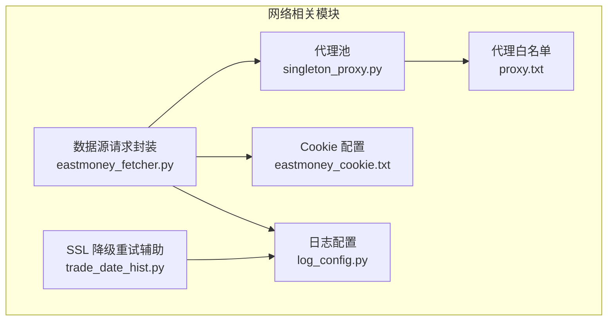
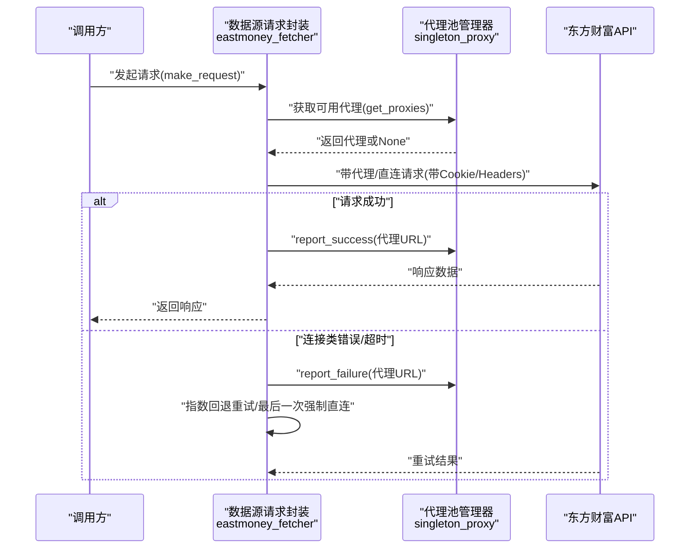
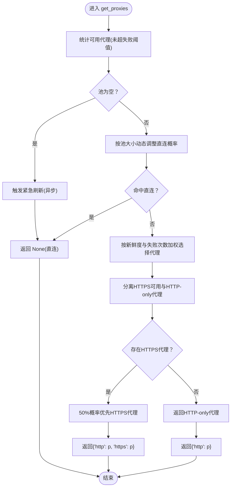
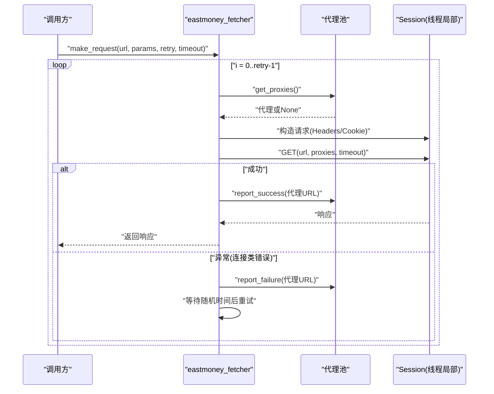
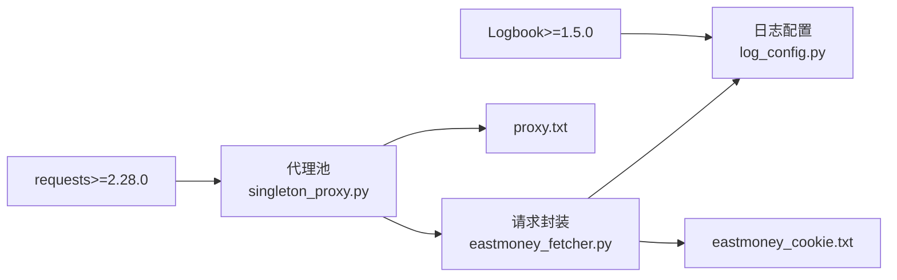

# 网络连接问题

<cite>
**本文引用的文件**
- [instock/core/eastmoney_fetcher.py](file://instock/core/eastmoney_fetcher.py)
- [instock/core/singleton_proxy.py](file://instock/core/singleton_proxy.py)
- [docker/stock/instock/core/eastmoney_fetcher.py](file://docker/stock/instock/core/eastmoney_fetcher.py)
- [docker/stock/instock/core/singleton_proxy.py](file://docker/stock/instock/core/singleton_proxy.py)
- [instock/config/eastmoney_cookie.txt](file://instock/config/eastmoney_cookie.txt)
- [docker/stock/instock/config/eastmoney_cookie.txt](file://docker/stock/instock/config/eastmoney_cookie.txt)
- [docker/stock/instock/config/proxy.txt](file://docker/stock/instock/config/proxy.txt)
- [instock/config/proxy.txt](file://instock/config/proxy.txt)
- [instock/lib/log_config.py](file://instock/lib/log_config.py)
- [requirements.txt](file://requirements.txt)
- [instock/core/crawling/trade_date_hist.py](file://instock/core/crawling/trade_date_hist.py)
- [docker/stock/instock/core/crawling/trade_date_hist.py](file://docker/stock/instock/core/crawling/trade_date_hist.py)
</cite>

## 目录
1. [简介](#简介)
2. [项目结构](#项目结构)
3. [核心组件](#核心组件)
4. [架构总览](#架构总览)
5. [详细组件分析](#详细组件分析)
6. [依赖关系分析](#依赖关系分析)
7. [性能考量](#性能考量)
8. [故障排查指南](#故障排查指南)
9. [结论](#结论)
10. [附录](#附录)

## 简介
本指南面向运维人员，聚焦 SelectStock 系统在获取东方财富等数据源时的网络连接问题排查。内容覆盖数据源连接失败、代理配置问题、防火墙阻断、DNS 解析异常等场景，提供检查步骤、工具使用、连接超时处理、SSL 证书验证、网络配置优化、连接池管理与异常重试机制等实现细节，帮助快速定位并解决问题。

## 项目结构
与网络连接相关的代码主要集中在以下模块：
- 代理池管理：singleton_proxy.py
- 数据源请求封装：eastmoney_fetcher.py
- Cookie 配置：eastmoney_cookie.txt
- 代理白名单配置：proxy.txt
- 日志配置：log_config.py
- SSL 降级重试辅助：trade_date_hist.py
- 依赖声明：requirements.txt

图表来源
- [instock/core/singleton_proxy.py](file://instock/core/singleton_proxy.py#L45-L701)
- [instock/core/eastmoney_fetcher.py](file://instock/core/eastmoney_fetcher.py#L16-L149)
- [instock/config/eastmoney_cookie.txt](file://instock/config/eastmoney_cookie.txt#L1-L2)
- [docker/stock/instock/config/proxy.txt](file://docker/stock/instock/config/proxy.txt#L1-L1)
- [instock/lib/log_config.py](file://instock/lib/log_config.py#L47-L104)
- [instock/core/crawling/trade_date_hist.py](file://instock/core/crawling/trade_date_hist.py#L307-L338)

章节来源
- [instock/core/singleton_proxy.py](file://instock/core/singleton_proxy.py#L1-L701)
- [instock/core/eastmoney_fetcher.py](file://instock/core/eastmoney_fetcher.py#L1-L149)
- [instock/config/eastmoney_cookie.txt](file://instock/config/eastmoney_cookie.txt#L1-L2)
- [docker/stock/instock/config/proxy.txt](file://docker/stock/instock/config/proxy.txt#L1-L1)
- [instock/lib/log_config.py](file://instock/lib/log_config.py#L1-L104)
- [instock/core/crawling/trade_date_hist.py](file://instock/core/crawling/trade_date_hist.py#L307-L338)

## 核心组件
- 代理池管理器（单例）：负责从多个免费代理源抓取、验证代理，维护可用代理池，后台定时刷新，支持手动配置代理优先级。
- 数据源请求封装：封装 Cookie 管理、会话管理、请求重试与超时控制、代理选择与反馈。
- Cookie 配置：提供环境变量与文件两种来源，优先级环境变量 > 文件 > 默认。
- 代理白名单：proxy.txt 中的手动代理优先级最高，且不会被自动移除。
- 日志配置：统一输出 INFO+ 全量日志与 ERROR+ 错误日志，便于定位网络问题。
- SSL 降级重试辅助：对特定接口提供 SSL 错误时的降级重试策略。

章节来源
- [instock/core/singleton_proxy.py](file://instock/core/singleton_proxy.py#L45-L233)
- [instock/core/eastmoney_fetcher.py](file://instock/core/eastmoney_fetcher.py#L22-L149)
- [instock/config/eastmoney_cookie.txt](file://instock/config/eastmoney_cookie.txt#L31-L52)
- [docker/stock/instock/config/proxy.txt](file://docker/stock/instock/config/proxy.txt#L1-L1)
- [instock/lib/log_config.py](file://instock/lib/log_config.py#L47-L104)
- [instock/core/crawling/trade_date_hist.py](file://instock/core/crawling/trade_date_hist.py#L307-L338)

## 架构总览
下图展示数据源请求与代理池交互的关键流程：

图表来源
- [instock/core/eastmoney_fetcher.py](file://instock/core/eastmoney_fetcher.py#L75-L142)
- [instock/core/singleton_proxy.py](file://instock/core/singleton_proxy.py#L112-L164)

章节来源
- [instock/core/eastmoney_fetcher.py](file://instock/core/eastmoney_fetcher.py#L75-L142)
- [instock/core/singleton_proxy.py](file://instock/core/singleton_proxy.py#L112-L164)

## 详细组件分析

### 组件A：代理池管理器（singleton_proxy）
- 功能要点
  - 自动抓取免费代理源并批量验证，过滤 HTTP/HTTPS 可用代理。
  - 后台定时刷新，重新验证现有代理并补充新代理。
  - 动态直连概率与权重选择：根据池大小调整直连概率，失败次数越少、越新越易被选中。
  - 手动代理优先：proxy.txt 中的代理优先级最高，失败不移除。
  - 紧急补充：当池耗尽时异步触发刷新，避免阻塞当前请求。
- 关键配置
  - 验证 URL、超时、刷新间隔、最小池大小、并发验证线程数、失败阈值、新鲜度阈值等。
- 验证逻辑
  - 先 HTTP 验证，再可选 HTTPS 隧道验证，分别记录 http_ok 与 https_ok。

图表来源
- [instock/core/singleton_proxy.py](file://instock/core/singleton_proxy.py#L112-L164)
- [instock/core/singleton_proxy.py](file://instock/core/singleton_proxy.py#L166-L183)
- [instock/core/singleton_proxy.py](file://instock/core/singleton_proxy.py#L510-L560)

章节来源
- [instock/core/singleton_proxy.py](file://instock/core/singleton_proxy.py#L35-L43)
- [instock/core/singleton_proxy.py](file://instock/core/singleton_proxy.py#L112-L183)
- [instock/core/singleton_proxy.py](file://instock/core/singleton_proxy.py#L510-L560)
- [instock/core/singleton_proxy.py](file://instock/core/singleton_proxy.py#L650-L686)

### 组件B：数据源请求封装（eastmoney_fetcher）
- 功能要点
  - 线程安全：每个线程独立 Session，避免连接池与 Cookie 混乱。
  - Cookie 管理：优先环境变量，其次文件，最后默认。
  - 重试与超时：支持多次重试，最后一次强制直连；走代理时缩短超时以避免长时间等待失效代理。
  - 连接错误识别：对常见连接类错误进行分类处理，触发代理池反馈与重试。
- 关键行为
  - make_request 中对连接类错误进行特殊处理，区分代理断开/过载与业务错误。
  - 调用代理池反馈成功/失败，用于池内权重与移除策略。

图表来源
- [instock/core/eastmoney_fetcher.py](file://instock/core/eastmoney_fetcher.py#L75-L142)
- [instock/core/eastmoney_fetcher.py](file://instock/core/eastmoney_fetcher.py#L185-L209)

章节来源
- [instock/core/eastmoney_fetcher.py](file://instock/core/eastmoney_fetcher.py#L22-L74)
- [instock/core/eastmoney_fetcher.py](file://instock/core/eastmoney_fetcher.py#L75-L142)
- [instock/core/eastmoney_fetcher.py](file://instock/core/eastmoney_fetcher.py#L185-L209)

### 组件C：Cookie 管理
- 优先级：环境变量 > 文件 > 默认。
- 文件位置：config/eastmoney_cookie.txt。
- 影响：Cookie 失效会导致 401/登录态异常，需及时更新。

章节来源
- [instock/config/eastmoney_cookie.txt](file://instock/config/eastmoney_cookie.txt#L31-L52)
- [docker/stock/instock/config/eastmoney_cookie.txt](file://docker/stock/instock/config/eastmoney_cookie.txt#L1-L2)

### 组件D：代理白名单与手动配置
- proxy.txt 中的手动代理优先级最高，且不会因失败被移除。
- 适合部署环境固定代理出口的场景。

章节来源
- [docker/stock/instock/config/proxy.txt](file://docker/stock/instock/config/proxy.txt#L1-L1)
- [instock/config/proxy.txt](file://instock/config/proxy.txt#L1-L1)
- [instock/core/singleton_proxy.py](file://instock/core/singleton_proxy.py#L70-L81)

### 组件E：SSL 降级重试辅助
- 针对 SSL 证书/握手异常，提供“代理+校验”→“直连+校验”→“直连+跳过校验”的降级重试策略。
- 适用于网络环境证书链不完整或代理链路证书异常的情况。

章节来源
- [instock/core/crawling/trade_date_hist.py](file://instock/core/crawling/trade_date_hist.py#L307-L338)
- [docker/stock/instock/core/crawling/trade_date_hist.py](file://docker/stock/instock/core/crawling/trade_date_hist.py#L307-L338)

## 依赖关系分析
- 网络请求依赖：requests>=2.28.0。
- 日志依赖：Logbook>=1.5.0（日志配置模块）。
- 代理池与请求封装耦合：eastmoney_fetcher 通过 proxys() 单例获取代理并反馈结果。
- 代理池与外部服务耦合：从多个免费代理源抓取并批量验证。

图表来源
- [requirements.txt](file://requirements.txt#L17-L18)
- [requirements.txt](file://requirements.txt#L24-L24)
- [instock/core/singleton_proxy.py](file://instock/core/singleton_proxy.py#L45-L701)
- [instock/core/eastmoney_fetcher.py](file://instock/core/eastmoney_fetcher.py#L16-L149)
- [docker/stock/instock/config/proxy.txt](file://docker/stock/instock/config/proxy.txt#L1-L1)
- [instock/config/eastmoney_cookie.txt](file://instock/config/eastmoney_cookie.txt#L1-L2)
- [instock/lib/log_config.py](file://instock/lib/log_config.py#L47-L104)

章节来源
- [requirements.txt](file://requirements.txt#L1-L41)
- [instock/core/singleton_proxy.py](file://instock/core/singleton_proxy.py#L45-L701)
- [instock/core/eastmoney_fetcher.py](file://instock/core/eastmoney_fetcher.py#L16-L149)
- [docker/stock/instock/config/proxy.txt](file://docker/stock/instock/config/proxy.txt#L1-L1)
- [instock/config/eastmoney_cookie.txt](file://instock/config/eastmoney_cookie.txt#L1-L2)
- [instock/lib/log_config.py](file://instock/lib/log_config.py#L47-L104)

## 性能考量
- 代理池大小与直连概率：池越大直连概率越低，避免代理被过度使用；池越小直连概率越高，减少代理依赖。
- 新鲜度权重：长时间未验证的代理权重降低，提升整体成功率。
- 批量验证与并发：后台刷新时对候选代理进行并发验证，加速池恢复。
- 请求超时策略：走代理时缩短超时，避免长时间等待失效代理导致资源占用。
- 线程安全：每个线程独立 Session，避免共享 Session 导致的连接池损坏与 Cookie 混乱。

章节来源
- [instock/core/singleton_proxy.py](file://instock/core/singleton_proxy.py#L135-L142)
- [instock/core/singleton_proxy.py](file://instock/core/singleton_proxy.py#L166-L183)
- [instock/core/singleton_proxy.py](file://instock/core/singleton_proxy.py#L562-L606)
- [instock/core/eastmoney_fetcher.py](file://instock/core/eastmoney_fetcher.py#L103-L103)
- [instock/core/eastmoney_fetcher.py](file://instock/core/eastmoney_fetcher.py#L26-L29)

## 故障排查指南

### 一、数据源连接失败（以东方财富为例）
- 现象
  - 请求返回 401/登录态异常、数据为空、频繁 5xx。
- 排查步骤
  1) 检查 Cookie 是否有效
     - 环境变量 EAST_MONEY_COOKIE 是否设置正确。
     - 文件 eastmoney_cookie.txt 是否存在且内容有效。
  2) 检查请求头与 Referer
     - 请求头包含必要的 UA、Accept、Referer 等。
  3) 观察代理池状态
     - 当前可用代理数量是否足够（池大小小于最小阈值时直连概率上升）。
     - 是否存在大量失败代理被移除。
  4) 查看日志
     - 使用统一日志配置，定位 ERROR 级别异常堆栈。
- 处置建议
  - 更新 Cookie 文件或环境变量。
  - 若代理池不足，等待后台刷新或手动触发刷新。
  - 对特定接口启用 SSL 降级重试（如适用）。

章节来源
- [instock/core/eastmoney_fetcher.py](file://instock/core/eastmoney_fetcher.py#L31-L52)
- [instock/core/eastmoney_fetcher.py](file://instock/core/eastmoney_fetcher.py#L54-L67)
- [instock/core/eastmoney_fetcher.py](file://instock/core/eastmoney_fetcher.py#L121-L127)
- [instock/lib/log_config.py](file://instock/lib/log_config.py#L47-L104)
- [instock/core/crawling/trade_date_hist.py](file://instock/core/crawling/trade_date_hist.py#L307-L338)

### 二、代理配置问题
- 现象
  - 请求超时、连接被拒绝、频繁切换代理。
- 排查步骤
  1) 检查 proxy.txt
     - 是否存在手动代理且未被移除。
  2) 检查代理池可用性
     - get_proxies 返回是否为 None（直连）或包含代理。
     - HTTPS 代理与 HTTP-only 代理的选择比例是否合理。
  3) 检查代理验证
     - HTTP 验证与 HTTPS 隧道验证是否通过。
  4) 检查后台刷新
     - 是否在运行且周期正常。
- 处置建议
  - 在 proxy.txt 中添加稳定代理，确保其优先级。
  - 调整最小池大小与刷新间隔，平衡稳定性与可用性。
  - 对代理源抓取失败进行监控，必要时更换代理源。

章节来源
- [docker/stock/instock/config/proxy.txt](file://docker/stock/instock/config/proxy.txt#L1-L1)
- [instock/core/singleton_proxy.py](file://instock/core/singleton_proxy.py#L70-L81)
- [instock/core/singleton_proxy.py](file://instock/core/singleton_proxy.py#L112-L164)
- [instock/core/singleton_proxy.py](file://instock/core/singleton_proxy.py#L510-L560)
- [instock/core/singleton_proxy.py](file://instock/core/singleton_proxy.py#L650-L686)

### 三、防火墙阻断与 DNS 解析异常
- 现象
  - 请求超时、DNS 解析失败、部分域名可访问部分不可。
- 排查步骤
  1) 使用网络诊断工具
     - ping/trace route/ nslookup/dig 检查目标域名可达性与解析链路。
     - curl/wget 测试直连与代理链路。
  2) 检查代理链路
     - 代理服务器是否允许访问目标域名与端口。
  3) 检查本地 DNS
     - 更换 DNS 服务器（如 8.8.8.8/114.114.114.114）验证解析异常。
- 处置建议
  - 在 proxy.txt 中配置可信代理出口。
  - 对于固定出口网络，优先使用手动代理。
  - 必要时启用 SSL 降级重试辅助。

章节来源
- [instock/core/crawling/trade_date_hist.py](file://instock/core/crawling/trade_date_hist.py#L307-L338)

### 四、连接超时与异常重试
- 现象
  - 请求超时、代理不稳定导致频繁失败。
- 排查步骤
  1) 检查超时设置
     - 直连超时 vs 走代理超时差异。
  2) 检查重试策略
     - 连接类错误是否触发代理池反馈与重试。
     - 最后一次重试是否强制直连。
  3) 检查指数回退
     - 重试间隔是否逐步增加，避免雪崩。
- 处置建议
  - 调整超时与重试参数，平衡成功率与响应时间。
  - 对代理失败进行限流与熔断，避免放大效应。

章节来源
- [instock/core/eastmoney_fetcher.py](file://instock/core/eastmoney_fetcher.py#L75-L103)
- [instock/core/eastmoney_fetcher.py](file://instock/core/eastmoney_fetcher.py#L116-L142)

### 五、SSL 证书验证问题
- 现象
  - SSLError/SSLEOFError、证书链不完整、代理链路证书异常。
- 排查步骤
  1) 检查证书链
     - 使用 openssl s_client 或浏览器开发者工具查看证书链。
  2) 检查代理链路
     - 代理是否正确转发证书或中间证书缺失。
- 处置建议
  - 启用 SSL 降级重试辅助，按顺序尝试代理+校验→直连+校验→直连+跳过校验。
  - 在受信环境中导入中间证书或更换代理出口。

章节来源
- [instock/core/eastmoney_fetcher.py](file://instock/core/eastmoney_fetcher.py#L124-L127)
- [instock/core/crawling/trade_date_hist.py](file://instock/core/crawling/trade_date_hist.py#L307-L338)

### 六、网络诊断工具使用
- 基础命令
  - ping/tracepath/traceroute：检查连通性与路由。
  - nslookup/dig：检查 DNS 解析。
  - curl -v/wget：验证直连与代理链路。
- Python 辅助
  - 使用 requests 的超时与代理参数进行最小化复现。
  - 结合日志输出定位异常阶段。

章节来源
- [instock/core/crawling/trade_date_hist.py](file://instock/core/crawling/trade_date_hist.py#L307-L338)

### 七、网络配置优化与连接池管理
- 代理池优化
  - 提升最小池大小，降低直连概率波动。
  - 增加并发验证线程数，缩短恢复时间。
- 连接池管理
  - 每线程独立 Session，避免共享 Session 导致的连接池损坏。
  - 合理设置 keep-alive 与超时，减少资源占用。
- 异常重试机制
  - 区分连接类错误与业务错误，对连接类错误进行代理池反馈与重试。
  - 最后一次强制直连，确保不受坏代理影响。

章节来源
- [instock/core/singleton_proxy.py](file://instock/core/singleton_proxy.py#L38-L42)
- [instock/core/singleton_proxy.py](file://instock/core/singleton_proxy.py#L40-L41)
- [instock/core/eastmoney_fetcher.py](file://instock/core/eastmoney_fetcher.py#L26-L29)
- [instock/core/eastmoney_fetcher.py](file://instock/core/eastmoney_fetcher.py#L116-L142)

## 结论
通过代理池的自动化抓取与验证、请求层的重试与超时控制、Cookie 与日志的协同，SelectStock 系统在网络连接问题上具备较强的自愈能力。运维人员应重点关注代理池健康度、Cookie 有效性、SSL 证书链与 DNS 解析，结合日志与最小化复现，快速定位并解决问题。

## 附录
- 常用检查清单
  - 代理池：可用代理数量、HTTPS 代理占比、最近验证时间。
  - Cookie：环境变量与文件内容、有效期。
  - 日志：ERROR 级别堆栈、代理反馈记录。
  - 网络：直连与代理链路连通性、DNS 解析、SSL 证书链。
- 相关实现参考
  - 代理池生命周期与后台刷新：见代理池管理器。
  - 请求封装与重试：见数据源请求封装。
  - SSL 降级重试：见 SSL 降级重试辅助。