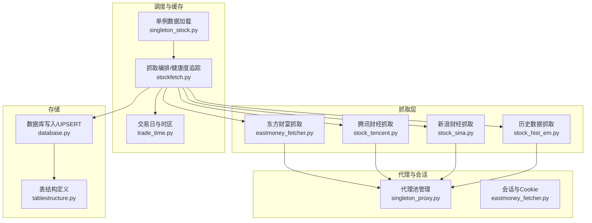
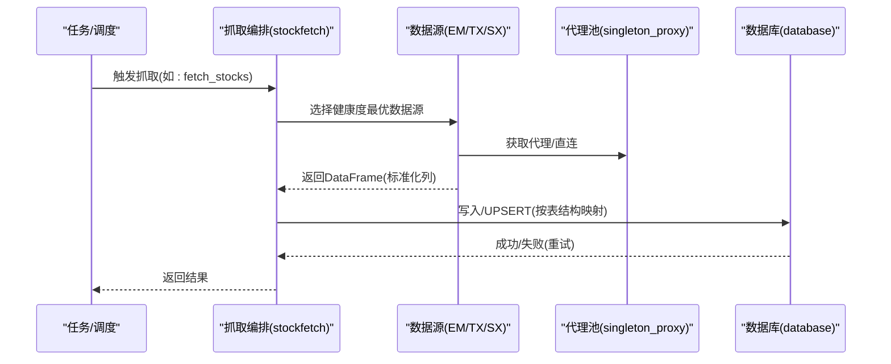
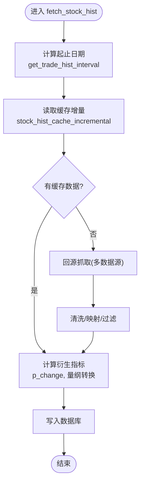
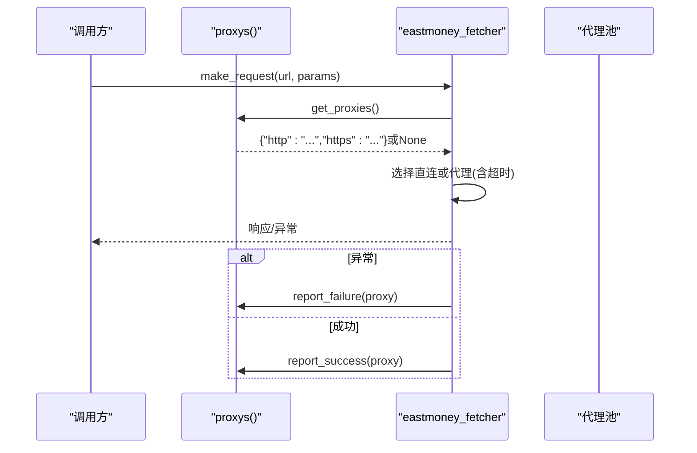
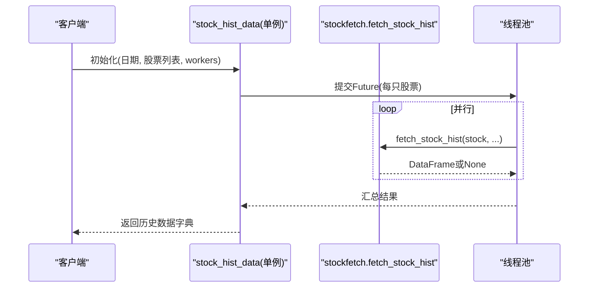
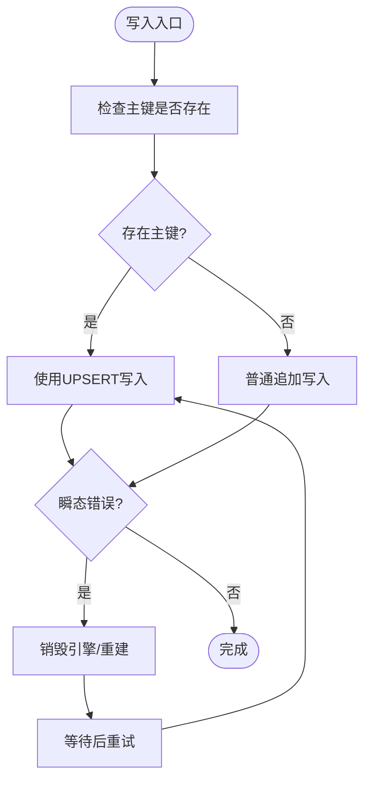
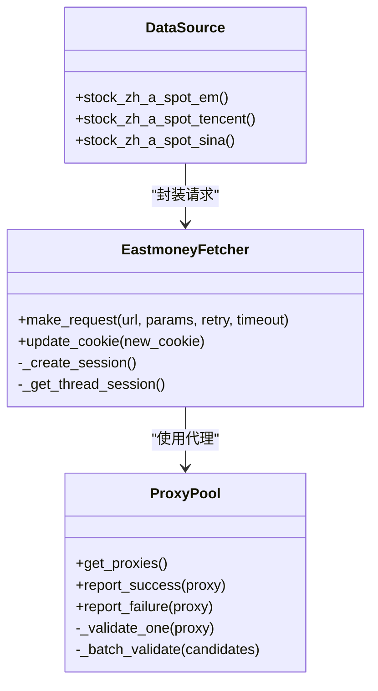
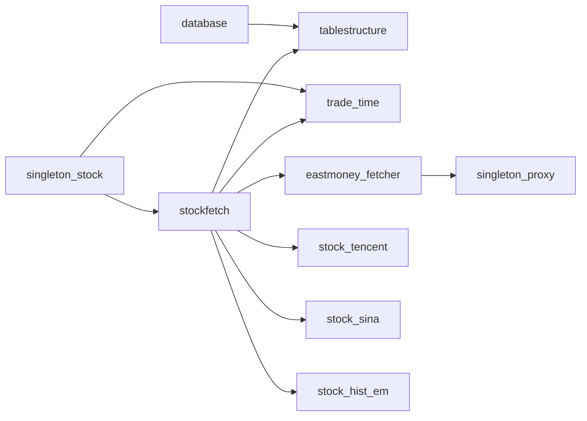

# 股票数据抓取

<cite>
**本文引用的文件**
- [instock/core/stockfetch.py](file://instock/core/stockfetch.py)
- [instock/core/eastmoney_fetcher.py](file://instock/core/eastmoney_fetcher.py)
- [instock/core/singleton_stock.py](file://instock/core/singleton_stock.py)
- [instock/core/singleton_proxy.py](file://instock/core/singleton_proxy.py)
- [instock/lib/database.py](file://instock/lib/database.py)
- [instock/lib/trade_time.py](file://instock/lib/trade_time.py)
- [instock/core/tablestructure.py](file://instock/core/tablestructure.py)
- [instock/core/crawling/stock_hist_em.py](file://instock/core/crawling/stock_hist_em.py)
- [instock/core/crawling/stock_sina.py](file://instock/core/crawling/stock_sina.py)
- [instock/core/crawling/stock_tencent.py](file://instock/core/crawling/stock_tencent.py)
</cite>

## 目录
1. [简介](#简介)
2. [项目结构](#项目结构)
3. [核心组件](#核心组件)
4. [架构总览](#架构总览)
5. [详细组件分析](#详细组件分析)
6. [依赖关系分析](#依赖关系分析)
7. [性能考量](#性能考量)
8. [故障排查指南](#故障排查指南)
9. [结论](#结论)
10. [附录](#附录)

## 简介
本项目是一个面向中国A股市场的股票数据抓取与存储系统，覆盖实时行情、历史K线、资金流向、龙虎榜、大宗交易、分红送配等多类数据。系统采用“多数据源 + 多代理 + 健康度追踪 + 缓存 + 单例 + 并发”的架构设计，具备自动降级、指数退避重试、日志聚合、数据库UPSERT写入、交易日与时区判断等功能，适合在生产环境中稳定运行。

## 项目结构
- 核心抓取层：封装东方财富、腾讯、新浪等多家数据源，统一返回标准化的pandas DataFrame。
- 代理与会话层：统一管理Cookie、会话、请求头、代理池、失败上报与健康度评估。
- 单例与调度层：提供历史数据并发抓取、缓存增量更新、交易日与时区辅助工具。
- 数据库层：提供连接池、UPSERT写入、主键/索引维护、重试与瞬态错误处理。
- 表结构定义：集中定义各类数据表的字段、类型、中文注释及映射关系。

图表来源
- [instock/core/stockfetch.py](file://instock/core/stockfetch.py#L1-L800)
- [instock/core/eastmoney_fetcher.py](file://instock/core/eastmoney_fetcher.py#L1-L149)
- [instock/core/singleton_proxy.py](file://instock/core/singleton_proxy.py#L1-L701)
- [instock/core/singleton_stock.py](file://instock/core/singleton_stock.py#L1-L116)
- [instock/lib/database.py](file://instock/lib/database.py#L1-L304)
- [instock/lib/trade_time.py](file://instock/lib/trade_time.py#L1-L224)
- [instock/core/tablestructure.py](file://instock/core/tablestructure.py#L1-L800)
- [instock/core/crawling/stock_hist_em.py](file://instock/core/crawling/stock_hist_em.py#L1-L200)
- [instock/core/crawling/stock_sina.py](file://instock/core/crawling/stock_sina.py#L1-L200)
- [instock/core/crawling/stock_tencent.py](file://instock/core/crawling/stock_tencent.py#L1-L200)

章节来源
- [instock/core/stockfetch.py](file://instock/core/stockfetch.py#L1-L800)
- [instock/core/singleton_stock.py](file://instock/core/singleton_stock.py#L1-L116)
- [instock/core/singleton_proxy.py](file://instock/core/singleton_proxy.py#L1-L701)
- [instock/lib/database.py](file://instock/lib/database.py#L1-L304)
- [instock/lib/trade_time.py](file://instock/lib/trade_time.py#L1-L224)
- [instock/core/tablestructure.py](file://instock/core/tablestructure.py#L1-L800)
- [instock/core/crawling/stock_hist_em.py](file://instock/core/crawling/stock_hist_em.py#L1-L200)
- [instock/core/crawling/stock_sina.py](file://instock/core/crawling/stock_sina.py#L1-L200)
- [instock/core/crawling/stock_tencent.py](file://instock/core/crawling/stock_tencent.py#L1-L200)

## 核心组件
- 多数据源抓取编排与健康度追踪：对实时/历史/专题数据统一入口，内置失败计数、降级冷却、渐进退避、聚合日志，保障稳定性。
- 代理池与会话管理：自动抓取免费代理、HTTP/HTTPS验证、失败上报、后台刷新、动态权重选择、直连/代理混合策略。
- 单例数据加载：提供历史数据并发抓取、缓存增量更新、交易日与时区辅助、内存释放。
- 数据库写入：连接池、UPSERT、主键/索引自动维护、瞬态错误重试、SQL执行封装。
- 表结构与字段映射：集中定义表字段、类型、中文注释、API字段到数据库字段的映射，确保入库一致性。

章节来源
- [instock/core/stockfetch.py](file://instock/core/stockfetch.py#L46-L185)
- [instock/core/singleton_proxy.py](file://instock/core/singleton_proxy.py#L45-L233)
- [instock/core/eastmoney_fetcher.py](file://instock/core/eastmoney_fetcher.py#L16-L149)
- [instock/core/singleton_stock.py](file://instock/core/singleton_stock.py#L19-L116)
- [instock/lib/database.py](file://instock/lib/database.py#L60-L203)
- [instock/core/tablestructure.py](file://instock/core/tablestructure.py#L25-L104)

## 架构总览
系统采用“抓取编排层 → 代理/会话层 → 单例调度层 → 存储层”的分层设计，数据流从多数据源抓取，经统一清洗与映射，写入数据库并持久化缓存，支持增量更新与回填。

图表来源
- [instock/core/stockfetch.py](file://instock/core/stockfetch.py#L304-L345)
- [instock/core/singleton_proxy.py](file://instock/core/singleton_proxy.py#L112-L164)
- [instock/lib/database.py](file://instock/lib/database.py#L120-L184)

## 详细组件分析

### 组件A：抓取编排与健康度追踪（stockfetch）
- 功能要点
  - 多数据源自动切换：按健康度排序，失败累计触发降级，冷却后自动恢复。
  - 指数退避重试：带抖动的指数退避，避免惊群效应。
  - 日志聚合：同一数据源在固定窗口内的失败合并输出，避免刷屏。
  - 实时/历史/专题数据统一入口：ETF、股票、资金流、龙虎榜、大宗交易、分红等。
  - 字段映射与清洗：根据表结构映射API字段，过滤无效数据，统一单位。
- 关键流程（历史K线增量更新）
  - 计算起止日期（考虑交易日与盘后状态）。
  - 读取缓存增量，若缺失则回源抓取。
  - 计算p_change等衍生指标，统一成交量单位。

图表来源
- [instock/core/stockfetch.py](file://instock/core/stockfetch.py#L744-L782)
- [instock/lib/trade_time.py](file://instock/lib/trade_time.py#L127-L168)

章节来源
- [instock/core/stockfetch.py](file://instock/core/stockfetch.py#L46-L185)
- [instock/core/stockfetch.py](file://instock/core/stockfetch.py#L744-L782)
- [instock/lib/trade_time.py](file://instock/lib/trade_time.py#L127-L168)

### 组件B：代理池与会话管理（singleton_proxy、eastmoney_fetcher）
- 功能要点
  - 代理池：多源抓取免费代理，批量验证HTTP/HTTPS，失败计数与移除，后台周期刷新。
  - 会话与Cookie：线程安全Session、UA/Referer/Accept等请求头、Cookie来源优先级。
  - 请求策略：直连/代理混合、超时控制、连接错误识别与重试、代理失败上报。
- 关键流程（代理选择与请求）
  - 根据池大小动态调整直连概率。
  - HTTPS可用时优先选择HTTPS代理。
  - 失败上报累积失败次数，超过阈值移除。
  - 请求异常分类处理，连接类错误换代理或直连。

图表来源
- [instock/core/singleton_proxy.py](file://instock/core/singleton_proxy.py#L112-L164)
- [instock/core/singleton_proxy.py](file://instock/core/singleton_proxy.py#L185-L209)
- [instock/core/eastmoney_fetcher.py](file://instock/core/eastmoney_fetcher.py#L75-L143)

章节来源
- [instock/core/singleton_proxy.py](file://instock/core/singleton_proxy.py#L45-L233)
- [instock/core/eastmoney_fetcher.py](file://instock/core/eastmoney_fetcher.py#L16-L149)

### 组件C：单例数据加载与并发抓取（singleton_stock）
- 功能要点
  - 单例模式：避免重复初始化，支持显式释放内存。
  - 并发抓取：ThreadPoolExecutor限制并发数，按股票列表并行拉取历史数据。
  - 依赖关系：依赖stockfetch与交易日工具，确保时间区间与缓存策略正确。
- 关键流程（历史数据单例加载）
  - 获取当日股票列表（foreign key）。
  - 限制并发线程数，提交Future并收集结果。
  - 统计成功/失败数量，记录日志。

图表来源
- [instock/core/singleton_stock.py](file://instock/core/singleton_stock.py#L40-L108)
- [instock/core/stockfetch.py](file://instock/core/stockfetch.py#L744-L782)

章节来源
- [instock/core/singleton_stock.py](file://instock/core/singleton_stock.py#L19-L116)

### 组件D：数据库写入与表结构（database、tablestructure）
- 功能要点
  - 连接池：最小连接数、最大溢出、回收与预检，避免连接泄漏。
  - UPSERT：基于主键冲突更新，解决并发写入死锁与重复插入。
  - 主键/索引：首次写入自动检测并创建主键与索引。
  - 瞬态错误重试：对特定MySQL错误码进行重试与连接清理。
- 表结构：集中定义各表字段、类型、中文注释与映射，统一入库字段。

图表来源
- [instock/lib/database.py](file://instock/lib/database.py#L94-L184)
- [instock/core/tablestructure.py](file://instock/core/tablestructure.py#L25-L104)

章节来源
- [instock/lib/database.py](file://instock/lib/database.py#L60-L203)
- [instock/core/tablestructure.py](file://instock/core/tablestructure.py#L25-L104)

### 组件E：数据源实现（东方财富/腾讯/新浪）
- 东方财富（实时/历史）
  - 实时：推送接口，分页拉取，字段丰富，支持多指标。
  - 历史：ETF与A股历史，统一量纲与单位。
- 腾讯/新浪（实时）
  - 实时：批量接口，GBK编码，字段相对精简，需做单位换算与缺失字段填充。
  - 并发：多线程分批抓取，避免限流。

图表来源
- [instock/core/eastmoney_fetcher.py](file://instock/core/eastmoney_fetcher.py#L16-L149)
- [instock/core/singleton_proxy.py](file://instock/core/singleton_proxy.py#L112-L164)
- [instock/core/crawling/stock_hist_em.py](file://instock/core/crawling/stock_hist_em.py#L20-L188)
- [instock/core/crawling/stock_tencent.py](file://instock/core/crawling/stock_tencent.py#L158-L200)
- [instock/core/crawling/stock_sina.py](file://instock/core/crawling/stock_sina.py#L171-L200)

章节来源
- [instock/core/crawling/stock_hist_em.py](file://instock/core/crawling/stock_hist_em.py#L20-L188)
- [instock/core/crawling/stock_tencent.py](file://instock/core/crawling/stock_tencent.py#L158-L200)
- [instock/core/crawling/stock_sina.py](file://instock/core/crawling/stock_sina.py#L171-L200)

## 依赖关系分析
- 组件耦合
  - stockfetch依赖tablestructure进行字段映射与清洗。
  - stockfetch依赖trade_time确定交易日与缓存策略。
  - singleton_stock依赖stockfetch与trade_time进行并发抓取与时间区间计算。
  - database依赖tablestructure进行表结构校验与写入。
  - eastmoney_fetcher依赖singleton_proxy与配置文件管理Cookie。
- 外部依赖
  - MySQL/SQLAlchemy：连接池、UPSERT、DDL维护。
  - pandas/numpy/talib：数据清洗、数值计算、技术指标。
  - requests：HTTP请求、代理支持。

图表来源
- [instock/core/stockfetch.py](file://instock/core/stockfetch.py#L1-L800)
- [instock/core/singleton_stock.py](file://instock/core/singleton_stock.py#L1-L116)
- [instock/lib/database.py](file://instock/lib/database.py#L1-L304)
- [instock/core/tablestructure.py](file://instock/core/tablestructure.py#L1-L800)
- [instock/lib/trade_time.py](file://instock/lib/trade_time.py#L1-L224)
- [instock/core/eastmoney_fetcher.py](file://instock/core/eastmoney_fetcher.py#L1-L149)
- [instock/core/singleton_proxy.py](file://instock/core/singleton_proxy.py#L1-L701)
- [instock/core/crawling/stock_tencent.py](file://instock/core/crawling/stock_tencent.py#L1-L200)
- [instock/core/crawling/stock_sina.py](file://instock/core/crawling/stock_sina.py#L1-L200)
- [instock/core/crawling/stock_hist_em.py](file://instock/core/crawling/stock_hist_em.py#L1-L200)

章节来源
- [instock/core/stockfetch.py](file://instock/core/stockfetch.py#L1-L800)
- [instock/core/singleton_stock.py](file://instock/core/singleton_stock.py#L1-L116)
- [instock/lib/database.py](file://instock/lib/database.py#L1-L304)
- [instock/core/tablestructure.py](file://instock/core/tablestructure.py#L1-L800)
- [instock/lib/trade_time.py](file://instock/lib/trade_time.py#L1-L224)
- [instock/core/eastmoney_fetcher.py](file://instock/core/eastmoney_fetcher.py#L1-L149)
- [instock/core/singleton_proxy.py](file://instock/core/singleton_proxy.py#L1-L701)
- [instock/core/crawling/stock_tencent.py](file://instock/core/crawling/stock_tencent.py#L1-L200)
- [instock/core/crawling/stock_sina.py](file://instock/core/crawling/stock_sina.py#L1-L200)
- [instock/core/crawling/stock_hist_em.py](file://instock/core/crawling/stock_hist_em.py#L1-L200)

## 性能考量
- 并发与限流
  - 单例历史数据加载限制并发线程数，避免对数据源造成过大压力。
  - 数据源侧分页/批量抓取与随机延迟，减少限流风险。
- 缓存与增量
  - 历史数据缓存按股票代码分片，支持增量更新，显著降低回源频率。
  - 交易日与时区判断避免盘中写入未完结数据。
- 代理与会话
  - 代理池健康度与权重选择，动态直连/代理混合，提升成功率与稳定性。
  - 线程安全Session与Cookie管理，避免连接池损坏与会话异常。
- 数据库
  - 连接池参数与UPSERT策略，减少锁竞争与重复写入。

[本节为通用指导，无需列出具体文件来源]

## 故障排查指南
- 代理相关
  - 现象：频繁连接错误或超时。
  - 处理：检查代理池健康度与失败计数，确认后台刷新是否正常；必要时手动触发刷新。
  - 参考
    - [instock/core/singleton_proxy.py](file://instock/core/singleton_proxy.py#L185-L233)
    - [instock/core/singleton_proxy.py](file://instock/core/singleton_proxy.py#L659-L686)
- 数据源失败
  - 现象：某数据源连续失败被降级。
  - 处理：等待冷却结束自动恢复；查看聚合日志定位具体错误；检查网络与Cookie。
  - 参考
    - [instock/core/stockfetch.py](file://instock/core/stockfetch.py#L64-L122)
    - [instock/core/stockfetch.py](file://instock/core/stockfetch.py#L146-L168)
- 数据库写入
  - 现象：死锁/锁超时/连接异常。
  - 处理：启用瞬态错误重试，销毁引擎重建连接；检查主键/索引是否已创建。
  - 参考
    - [instock/lib/database.py](file://instock/lib/database.py#L109-L184)
- 字段映射与清洗
  - 现象：入库列不匹配或数据异常。
  - 处理：核对tablestructure映射关系；确保列名清洗与过滤逻辑生效。
  - 参考
    - [instock/core/tablestructure.py](file://instock/core/tablestructure.py#L591-L799)
    - [instock/core/stockfetch.py](file://instock/core/stockfetch.py#L382-L425)

章节来源
- [instock/core/singleton_proxy.py](file://instock/core/singleton_proxy.py#L185-L233)
- [instock/core/singleton_proxy.py](file://instock/core/singleton_proxy.py#L659-L686)
- [instock/core/stockfetch.py](file://instock/core/stockfetch.py#L64-L122)
- [instock/core/stockfetch.py](file://instock/core/stockfetch.py#L146-L168)
- [instock/lib/database.py](file://instock/lib/database.py#L109-L184)
- [instock/core/tablestructure.py](file://instock/core/tablestructure.py#L591-L799)

## 结论
本系统通过多数据源、代理池、健康度追踪与缓存增量更新，实现了高可靠、高性能的股票数据抓取与存储。配合统一的表结构与字段映射、数据库UPSERT写入与主键/索引维护，满足生产环境对稳定性与可扩展性的要求。建议在部署时结合业务场景调整并发、重试与缓存策略，并持续监控代理池健康度与数据库写入性能。

[本节为总结性内容，无需列出具体文件来源]

## 附录

### 支持的数据类型与来源
- 实时行情
  - 东方财富：实时快照，字段最全。
  - 腾讯/新浪：实时快照，字段相对精简。
- 历史K线
  - 东方财富/腾讯/新浪：历史日线，统一量纲与单位。
- 资金流向
  - 个股/板块：支持多数据源自动切换。
- 专题数据
  - 龙虎榜、大宗交易、分红送配、筹码分布、涨停原因等。

章节来源
- [instock/core/crawling/stock_hist_em.py](file://instock/core/crawling/stock_hist_em.py#L20-L188)
- [instock/core/crawling/stock_tencent.py](file://instock/core/crawling/stock_tencent.py#L158-L200)
- [instock/core/crawling/stock_sina.py](file://instock/core/crawling/stock_sina.py#L171-L200)
- [instock/core/stockfetch.py](file://instock/core/stockfetch.py#L256-L345)

### 数据质量控制与字段映射
- 字段映射：依据tablestructure定义的map字段，将API字段映射到数据库字段。
- 数据清洗：过滤ST、无效价格、非A股代码；统一单位（成交量从“手”转“股”）。
- 衍生指标：计算p_change等技术指标，便于后续分析。

章节来源
- [instock/core/tablestructure.py](file://instock/core/tablestructure.py#L591-L799)
- [instock/core/stockfetch.py](file://instock/core/stockfetch.py#L382-L425)
- [instock/core/stockfetch.py](file://instock/core/stockfetch.py#L774-L779)

### 代理配置与最佳实践
- 代理来源：多源免费代理自动抓取与验证，支持HTTP/HTTPS隧道。
- 配置方式：proxy.txt优先级最高；环境变量/EAST_MONEY_COOKIE可覆盖默认值。
- 最佳实践：合理设置并发与重试，避免对单一数据源施压；监控代理池健康度与失败率。

章节来源
- [instock/core/singleton_proxy.py](file://instock/core/singleton_proxy.py#L70-L96)
- [instock/core/eastmoney_fetcher.py](file://instock/core/eastmoney_fetcher.py#L31-L52)