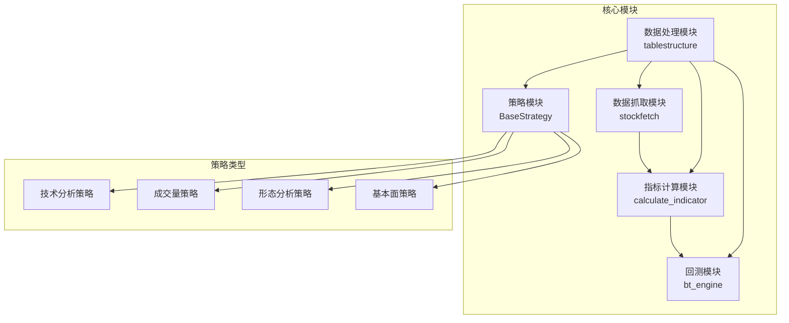
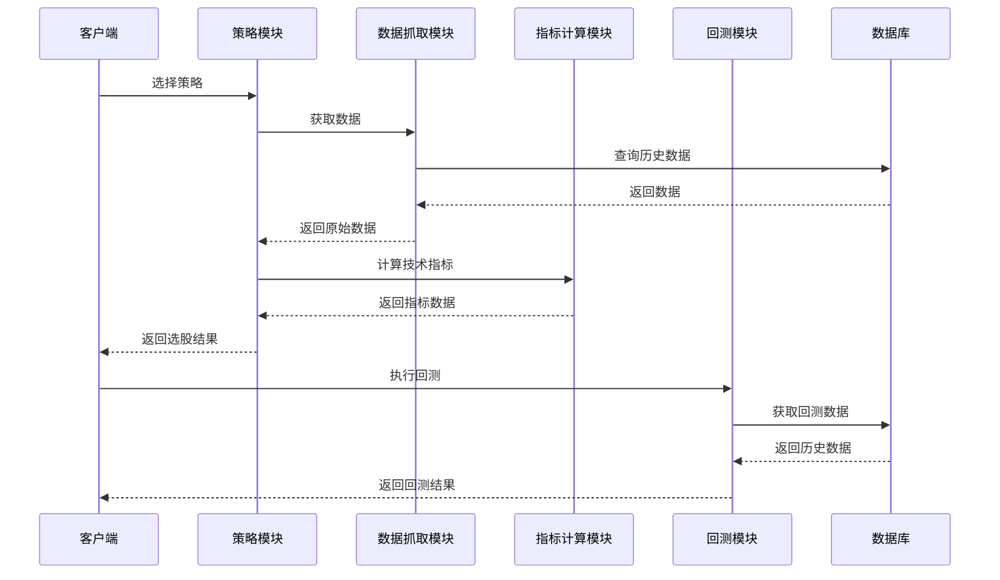
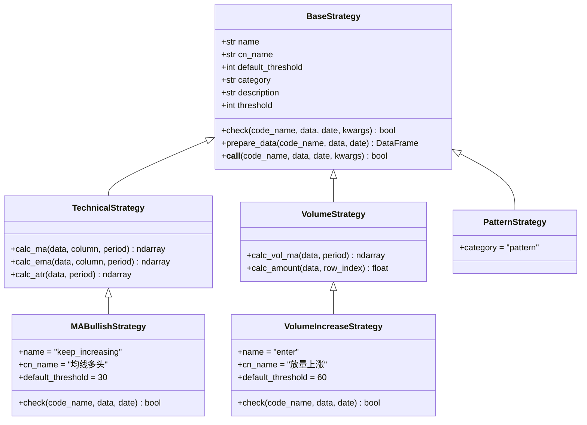
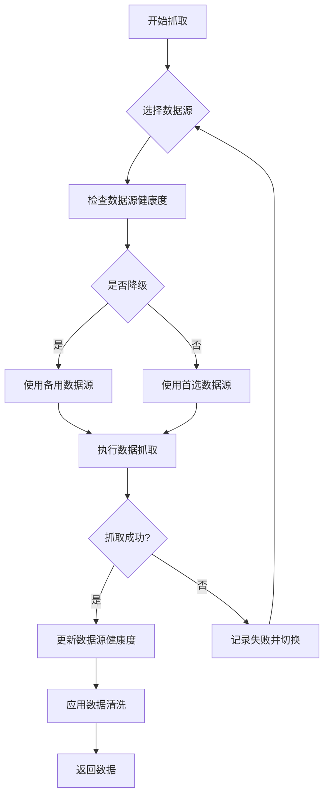
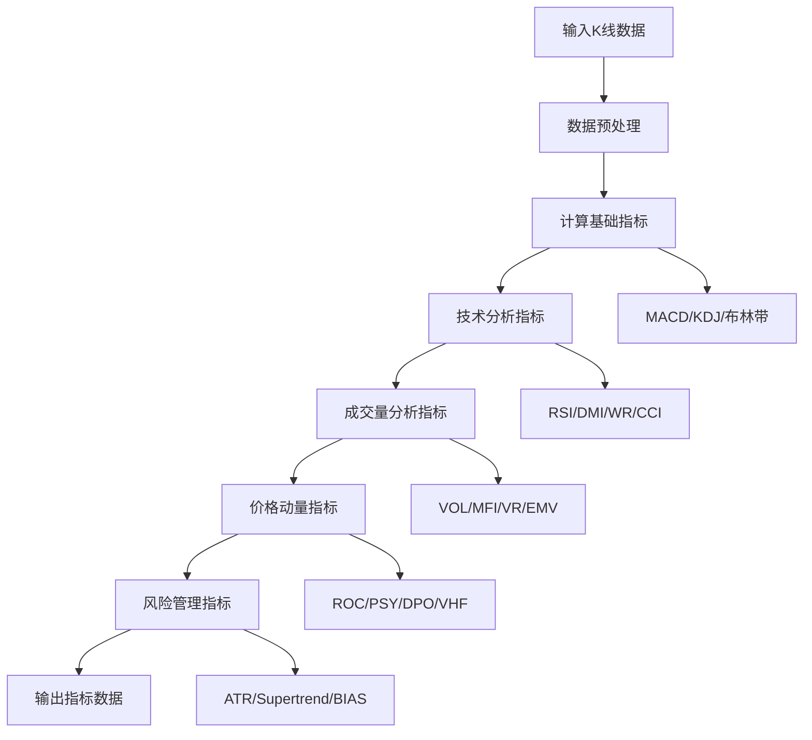
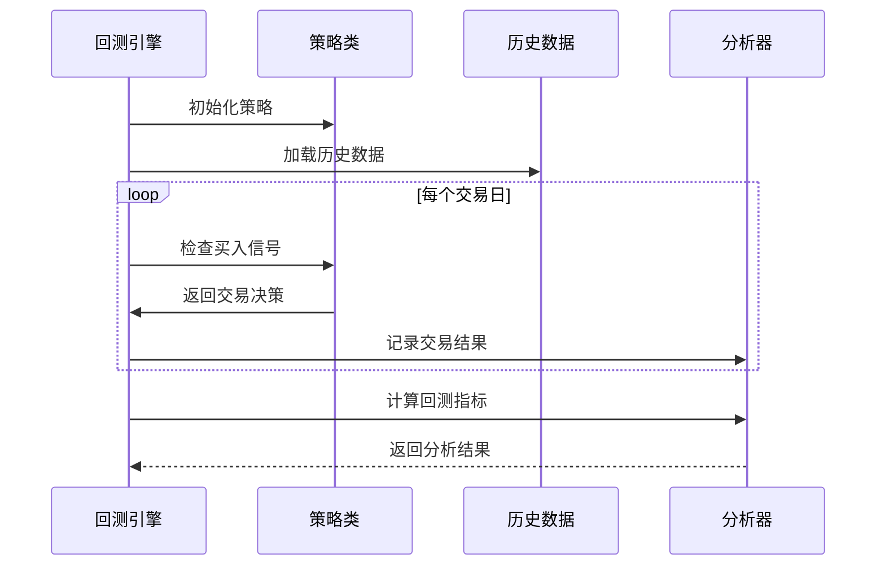
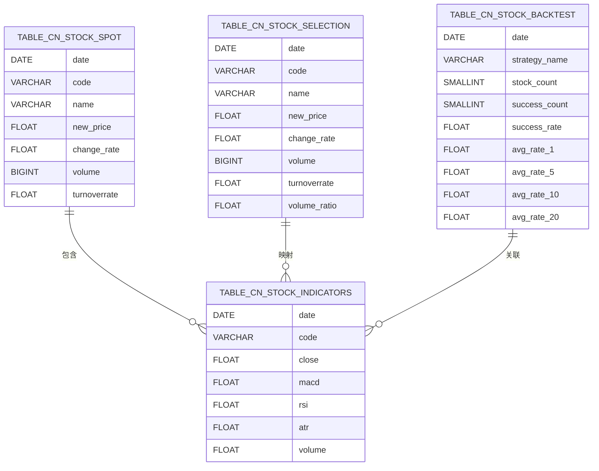
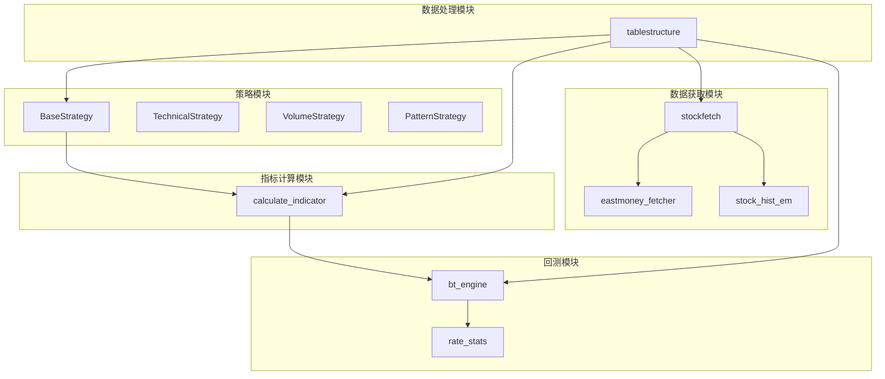

# 核心模块设计

<cite>
**本文档引用的文件**
- [instock/core/strategy/base.py](file://instock/core/strategy/base.py)
- [instock/core/stockfetch.py](file://instock/core/stockfetch.py)
- [instock/core/indicator/calculate_indicator.py](file://instock/core/indicator/calculate_indicator.py)
- [instock/core/backtest/bt_engine.py](file://instock/core/backtest/bt_engine.py)
- [instock/core/tablestructure.py](file://instock/core/tablestructure.py)
- [instock/core/strategy/technical/ma_strategies.py](file://instock/core/strategy/technical/ma_strategies.py)
- [instock/core/strategy/volume/volume_strategies.py](file://instock/core/strategy/volume/volume_strategies.py)
- [instock/core/strategy/pattern/pattern_strategies.py](file://instock/core/strategy/pattern/pattern_strategies.py)
- [instock/core/backtest/rate_stats.py](file://instock/core/backtest/rate_stats.py)
- [instock/core/crawling/stock_hist_em.py](file://instock/core/crawling/stock_hist_em.py)
- [instock/core/eastmoney_fetcher.py](file://instock/core/eastmoney_fetcher.py)
</cite>

## 目录
1. [简介](#简介)
2. [项目结构](#项目结构)
3. [核心组件](#核心组件)
4. [架构概览](#架构概览)
5. [详细组件分析](#详细组件分析)
6. [依赖分析](#依赖分析)
7. [性能考虑](#性能考虑)
8. [故障排除指南](#故障排除指南)
9. [结论](#结论)

## 简介

SelectStock是一个基于Python的量化选股系统，旨在为投资者提供全面的股票筛选、分析和回测功能。该系统通过五大核心模块实现了从数据获取到策略回测的完整流程。

系统的主要目标包括：
- 提供多种技术分析策略
- 支持基本面分析
- 实现自动化数据抓取
- 提供回测和风险评估功能
- 支持自定义策略扩展

## 项目结构

系统采用模块化设计，主要分为五个核心模块：



**图表来源**
- [instock/core/strategy/base.py](file://instock/core/strategy/base.py#L20-L202)
- [instock/core/stockfetch.py](file://instock/core/stockfetch.py#L1-L1584)
- [instock/core/indicator/calculate_indicator.py](file://instock/core/indicator/calculate_indicator.py#L1-L449)
- [instock/core/backtest/bt_engine.py](file://instock/core/backtest/bt_engine.py#L1-L388)
- [instock/core/tablestructure.py](file://instock/core/tablestructure.py#L1-L1137)

**章节来源**
- [instock/core/strategy/base.py](file://instock/core/strategy/base.py#L1-L202)
- [instock/core/stockfetch.py](file://instock/core/stockfetch.py#L1-L1584)
- [instock/core/indicator/calculate_indicator.py](file://instock/core/indicator/calculate_indicator.py#L1-L449)
- [instock/core/backtest/bt_engine.py](file://instock/core/backtest/bt_engine.py#L1-L388)
- [instock/core/tablestructure.py](file://instock/core/tablestructure.py#L1-L1137)

## 核心组件

### 策略模块 (BaseStrategy及其子类)

策略模块提供了统一的策略框架，支持多种类型的选股策略：

- **BaseStrategy**: 抽象基类，定义了所有策略的通用接口
- **TechnicalStrategy**: 技术分析策略基类
- **VolumeStrategy**: 成交量分析策略基类  
- **PatternStrategy**: 形态分析策略基类
- **FundamentalStrategy**: 基本面分析策略基类

**章节来源**
- [instock/core/strategy/base.py](file://instock/core/strategy/base.py#L20-L202)

### 数据抓取模块 (stockfetch)

数据抓取模块负责从多个数据源获取实时和历史数据，支持自动切换和健康度监控：

- **多数据源支持**: 东方财富、腾讯财经、新浪财经
- **智能切换**: 基于健康度的自动数据源切换
- **缓存机制**: 历史数据缓存优化性能
- **错误处理**: 完善的异常处理和重试机制

**章节来源**
- [instock/core/stockfetch.py](file://instock/core/stockfetch.py#L1-L1584)

### 指标计算模块 (calculate_indicator)

指标计算模块提供丰富的技术指标计算功能：

- **技术指标**: MACD、KDJ、布林带、RSI等50+种指标
- **成交量指标**: 成交量比率、能量潮等
- **价格动量指标**: ROC、PSY、BIAS等
- **风险管理指标**: ATR、ATR%等

**章节来源**
- [instock/core/indicator/calculate_indicator.py](file://instock/core/indicator/calculate_indicator.py#L1-L449)

### 回测模块 (bt_engine)

回测模块基于Backtrader框架，提供完整的回测功能：

- **信号驱动回测**: 基于选股信号的回测引擎
- **策略批量回测**: 支持多个策略的批量测试
- **性能分析**: Sharpe比率、最大回撤等指标
- **可视化支持**: 回测结果图表展示

**章节来源**
- [instock/core/backtest/bt_engine.py](file://instock/core/backtest/bt_engine.py#L1-L388)

### 数据处理模块 (tablestructure)

数据处理模块定义了系统使用的数据结构和表结构：

- **表结构定义**: 100+张数据表的结构定义
- **字段映射**: 数据字段与数据库表的映射关系
- **策略配置**: 各种策略的参数配置
- **数据验证**: 数据格式和约束验证

**章节来源**
- [instock/core/tablestructure.py](file://instock/core/tablestructure.py#L1-L1137)

## 架构概览

系统采用分层架构设计，各模块职责清晰，耦合度低：



**图表来源**
- [instock/core/strategy/base.py](file://instock/core/strategy/base.py#L47-L62)
- [instock/core/stockfetch.py](file://instock/core/stockfetch.py#L304-L345)
- [instock/core/indicator/calculate_indicator.py](file://instock/core/indicator/calculate_indicator.py#L23-L407)
- [instock/core/backtest/bt_engine.py](file://instock/core/backtest/bt_engine.py#L254-L258)

## 详细组件分析

### 策略模块深度分析

策略模块采用面向对象设计，通过继承机制实现策略扩展：



**图表来源**
- [instock/core/strategy/base.py](file://instock/core/strategy/base.py#L20-L202)
- [instock/core/strategy/technical/ma_strategies.py](file://instock/core/strategy/technical/ma_strategies.py#L22-L55)
- [instock/core/strategy/volume/volume_strategies.py](file://instock/core/strategy/volume/volume_strategies.py#L19-L68)

#### 策略注册机制

系统使用装饰器模式实现策略注册：

```mermaid
flowchart TD
A[定义策略类] --> B[@register_strategy装饰器]
B --> C[注册到STRATEGY_REGISTRY]
C --> D[通过名称获取策略]
D --> E[策略实例化]
E --> F[执行check方法]
```

**图表来源**
- [instock/core/strategy/base.py](file://instock/core/strategy/base.py#L159-L191)

**章节来源**
- [instock/core/strategy/base.py](file://instock/core/strategy/base.py#L155-L202)
- [instock/core/strategy/technical/ma_strategies.py](file://instock/core/strategy/technical/ma_strategies.py#L1-L237)
- [instock/core/strategy/volume/volume_strategies.py](file://instock/core/strategy/volume/volume_strategies.py#L1-L126)
- [instock/core/strategy/pattern/pattern_strategies.py](file://instock/core/strategy/pattern/pattern_strategies.py#L1-L276)

### 数据抓取模块详细分析

数据抓取模块实现了智能的数据源管理和缓存机制：



**图表来源**
- [instock/core/stockfetch.py](file://instock/core/stockfetch.py#L125-L134)
- [instock/core/stockfetch.py](file://instock/core/stockfetch.py#L256-L299)

#### 数据源健康度监控

系统实现了基于线程安全的健康度监控机制：

- **失败计数**: 统计连续失败次数
- **降级机制**: 连续失败达到阈值时降级数据源
- **冷却时间**: 渐进式冷却时间（最大1小时）
- **自动恢复**: 成功后自动恢复并重置计数

**章节来源**
- [instock/core/stockfetch.py](file://instock/core/stockfetch.py#L46-L123)
- [instock/core/stockfetch.py](file://instock/core/stockfetch.py#L256-L345)

### 指标计算模块详细分析

指标计算模块提供了完整的K线技术分析功能：



**图表来源**
- [instock/core/indicator/calculate_indicator.py](file://instock/core/indicator/calculate_indicator.py#L23-L407)

#### 指标计算优化

系统在指标计算中采用了多项优化措施：

- **NaN处理**: 统一的NaN和Inf值处理
- **内存优化**: 避免不必要的数据复制
- **性能优化**: 使用向量化操作和缓存机制
- **兼容性**: 支持pandas 2.x的Copy-on-Write模式

**章节来源**
- [instock/core/indicator/calculate_indicator.py](file://instock/core/indicator/calculate_indicator.py#L13-L407)

### 回测模块详细分析

回测模块基于Backtrader框架，提供了完整的回测解决方案：



**图表来源**
- [instock/core/backtest/bt_engine.py](file://instock/core/backtest/bt_engine.py#L181-L207)

#### 回测成本模型

系统实现了精确的交易成本模型：

- **佣金**: 买卖各0.025%
- **印花税**: 卖出时0.05%
- **滑点**: 买卖各0.05%
- **总成本**: 约0.20%单次交易

**章节来源**
- [instock/core/backtest/bt_engine.py](file://instock/core/backtest/bt_engine.py#L101-L214)
- [instock/core/backtest/rate_stats.py](file://instock/core/backtest/rate_stats.py#L11-L31)

### 数据处理模块详细分析

数据处理模块定义了系统的数据结构和表结构：



**图表来源**
- [instock/core/tablestructure.py](file://instock/core/tablestructure.py#L63-L104)
- [instock/core/tablestructure.py](file://instock/core/tablestructure.py#L591-L799)
- [instock/core/tablestructure.py](file://instock/core/tablestructure.py#L396-L407)

#### 策略配置管理

系统提供了灵活的策略配置管理：

- **策略注册**: 动态注册和发现策略
- **参数配置**: 策略参数的集中管理
- **分类管理**: 策略按类别组织和筛选
- **扩展支持**: 易于添加新的策略类型

**章节来源**
- [instock/core/tablestructure.py](file://instock/core/tablestructure.py#L409-L443)
- [instock/core/tablestructure.py](file://instock/core/tablestructure.py#L1-L800)

## 依赖分析

系统模块间的依赖关系如下：



**图表来源**
- [instock/core/strategy/base.py](file://instock/core/strategy/base.py#L1-L202)
- [instock/core/stockfetch.py](file://instock/core/stockfetch.py#L1-L1584)
- [instock/core/indicator/calculate_indicator.py](file://instock/core/indicator/calculate_indicator.py#L1-L449)
- [instock/core/backtest/bt_engine.py](file://instock/core/backtest/bt_engine.py#L1-L388)
- [instock/core/tablestructure.py](file://instock/core/tablestructure.py#L1-L1137)

**章节来源**
- [instock/core/strategy/base.py](file://instock/core/strategy/base.py#L1-L202)
- [instock/core/stockfetch.py](file://instock/core/stockfetch.py#L1-L1584)
- [instock/core/indicator/calculate_indicator.py](file://instock/core/indicator/calculate_indicator.py#L1-L449)
- [instock/core/backtest/bt_engine.py](file://instock/core/backtest/bt_engine.py#L1-L388)
- [instock/core/tablestructure.py](file://instock/core/tablestructure.py#L1-L1137)

## 性能考虑

系统在设计时充分考虑了性能优化：

### 缓存策略
- **历史数据缓存**: 基于文件系统的缓存机制
- **数据源健康度缓存**: 线程安全的健康度状态
- **指标计算缓存**: 避免重复计算相同指标

### 并发处理
- **多线程安全**: 每个线程使用独立的Session
- **代理池管理**: 智能代理轮询和故障转移
- **异步处理**: 支持并发数据抓取

### 内存优化
- **惰性计算**: 使用pandas的惰性计算特性
- **数据类型优化**: 合理的数据类型选择
- **垃圾回收**: 及时释放不再使用的资源

## 故障排除指南

### 常见问题及解决方案

#### 数据抓取失败
**问题**: 数据源访问超时或返回空数据
**解决方案**:
1. 检查网络连接和代理设置
2. 查看数据源健康度状态
3. 调整重试参数和超时设置
4. 使用备用数据源

#### 指标计算异常
**问题**: 指标计算结果异常或NaN值
**解决方案**:
1. 检查输入数据的质量和完整性
2. 验证数据的时间顺序
3. 确认数据类型转换正确
4. 检查NaN值处理逻辑

#### 回测结果偏差
**问题**: 回测结果与实际交易差异较大
**解决方案**:
1. 检查交易成本设置
2. 验证数据复权处理
3. 确认交易时间假设
4. 检查滑点和流动性影响

**章节来源**
- [instock/core/stockfetch.py](file://instock/core/stockfetch.py#L170-L184)
- [instock/core/indicator/calculate_indicator.py](file://instock/core/indicator/calculate_indicator.py#L13-L21)
- [instock/core/backtest/rate_stats.py](file://instock/core/backtest/rate_stats.py#L28-L31)

## 结论

SelectStock系统通过五大核心模块的协同工作，构建了一个功能完整、扩展性强的量化选股平台。系统的主要特点包括：

### 设计优势
- **模块化设计**: 各模块职责明确，耦合度低
- **可扩展性**: 支持自定义策略和数据源
- **性能优化**: 多项性能优化措施确保高效运行
- **稳定性**: 完善的错误处理和健康度监控

### 技术特色
- **多数据源支持**: 智能数据源切换和故障转移
- **丰富指标体系**: 50+种技术指标计算
- **完整回测框架**: 基于Backtrader的专业回测
- **灵活配置**: 支持策略参数的动态调整

### 应用价值
系统为投资者提供了从数据获取、策略开发到回测验证的完整解决方案，支持多种投资策略的开发和验证，具有较高的实用价值和扩展潜力。