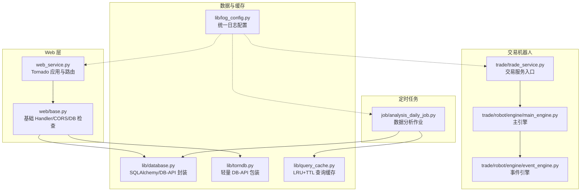
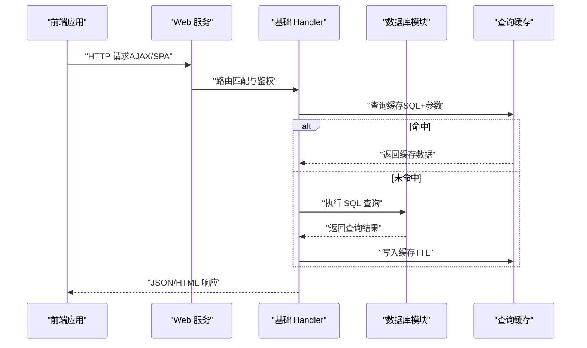
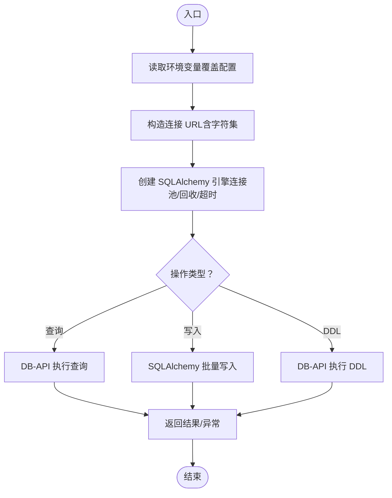
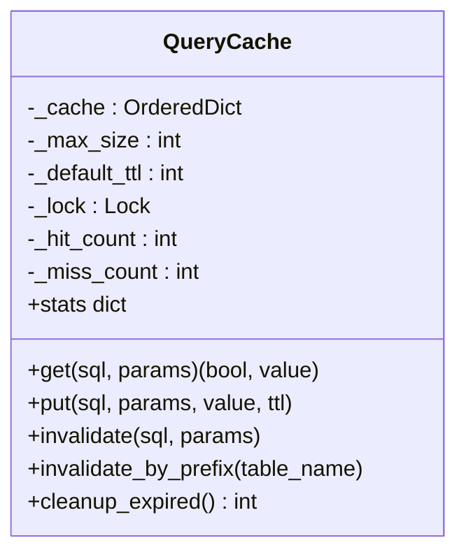
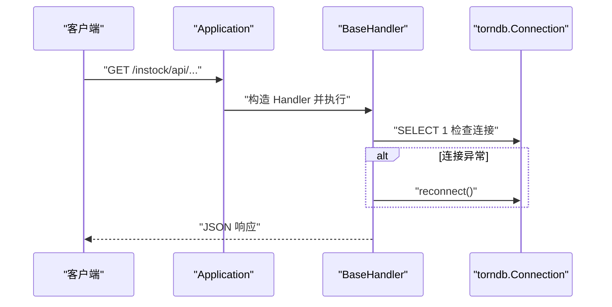
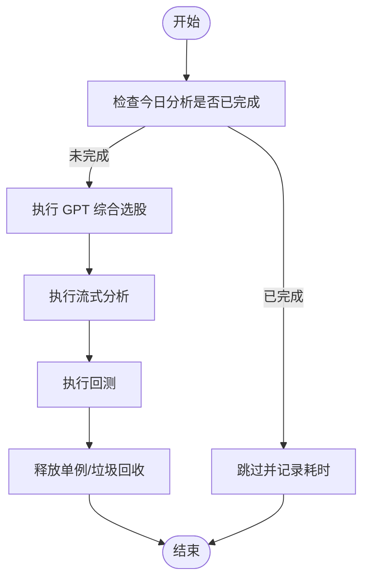
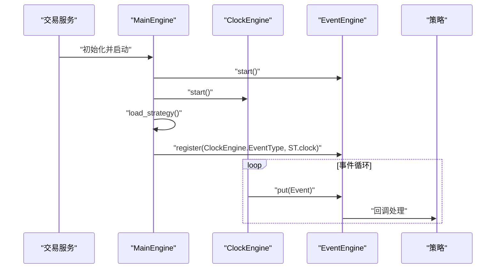
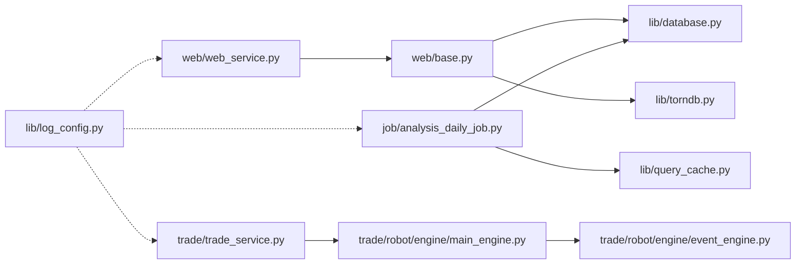

# 模块间通信机制

<cite>
**本文引用的文件**
- [docker/stock/instock/lib/database.py](file://docker/stock/instock/lib/database.py)
- [docker/stock/instock/lib/query_cache.py](file://docker/stock/instock/lib/query_cache.py)
- [docker/stock/instock/web/web_service.py](file://docker/stock/instock/web/web_service.py)
- [docker/stock/instock/web/base.py](file://docker/stock/instock/web/base.py)
- [docker/stock/instock/job/analysis_daily_job.py](file://docker/stock/instock/job/analysis_daily_job.py)
- [docker/stock/instock/lib/torndb.py](file://docker/stock/instock/lib/torndb.py)
- [docker/stock/instock/lib/log_config.py](file://docker/stock/instock/lib/log_config.py)
- [docker/stock/instock/trade/trade_service.py](file://docker/stock/instock/trade/trade_service.py)
- [docker/stock/instock/trade/robot/engine/main_engine.py](file://docker/stock/instock/trade/robot/engine/main_engine.py)
- [docker/stock/instock/trade/robot/engine/event_engine.py](file://docker/stock/instock/trade/robot/engine/event_engine.py)
</cite>

## 目录
1. [简介](#简介)
2. [项目结构](#项目结构)
3. [核心组件](#核心组件)
4. [架构总览](#架构总览)
5. [详细组件分析](#详细组件分析)
6. [依赖分析](#依赖分析)
7. [性能考虑](#性能考虑)
8. [故障排查指南](#故障排查指南)
9. [结论](#结论)

## 简介
本文件聚焦 SelectStock 系统的模块间通信机制，系统采用“Web 服务 + 数据库 + 缓存 + 定时任务 + 交易机器人”的分层架构。模块间通过以下方式协同：
- Web 服务模块通过 Tornado 路由与 Handler 接收前端请求，经由数据库模块与缓存模块进行数据读写。
- 定时任务模块独立运行，基于数据库与本地缓存执行分析、筛选与回测，避免对外部 API 的依赖。
- 交易机器人模块采用事件驱动引擎，通过事件总线在策略、时钟与交易之间解耦协作。

## 项目结构
系统采用按功能域划分的目录组织，核心模块如下：
- lib：基础设施与通用能力（数据库、缓存、日志、DB-API 封装）
- web：Web 服务与前端路由
- job：定时任务与批处理作业
- trade：交易机器人与事件引擎
- fontWeb：前端应用（Vue SPA）

图表来源
- [docker/stock/instock/web/web_service.py](file://docker/stock/instock/web/web_service.py#L53-L98)
- [docker/stock/instock/web/base.py](file://docker/stock/instock/web/base.py#L14-L36)
- [docker/stock/instock/lib/database.py](file://docker/stock/instock/lib/database.py#L58-L69)
- [docker/stock/instock/lib/torndb.py](file://docker/stock/instock/lib/torndb.py#L47-L121)
- [docker/stock/instock/lib/query_cache.py](file://docker/stock/instock/lib/query_cache.py#L27-L156)
- [docker/stock/instock/job/analysis_daily_job.py](file://docker/stock/instock/job/analysis_daily_job.py#L98-L145)
- [docker/stock/instock/trade/trade_service.py](file://docker/stock/instock/trade/trade_service.py#L19-L26)
- [docker/stock/instock/trade/robot/engine/main_engine.py](file://docker/stock/instock/trade/robot/engine/main_engine.py#L22-L90)
- [docker/stock/instock/trade/robot/engine/event_engine.py](file://docker/stock/instock/trade/robot/engine/event_engine.py#L19-L85)

章节来源
- [docker/stock/instock/web/web_service.py](file://docker/stock/instock/web/web_service.py#L53-L98)
- [docker/stock/instock/lib/database.py](file://docker/stock/instock/lib/database.py#L58-L69)
- [docker/stock/instock/lib/query_cache.py](file://docker/stock/instock/lib/query_cache.py#L27-L156)
- [docker/stock/instock/job/analysis_daily_job.py](file://docker/stock/instock/job/analysis_daily_job.py#L98-L145)
- [docker/stock/instock/trade/trade_service.py](file://docker/stock/instock/trade/trade_service.py#L19-L26)
- [docker/stock/instock/trade/robot/engine/main_engine.py](file://docker/stock/instock/trade/robot/engine/main_engine.py#L22-L90)
- [docker/stock/instock/trade/robot/engine/event_engine.py](file://docker/stock/instock/trade/robot/engine/event_engine.py#L19-L85)

## 核心组件
- 数据库模块（SQLAlchemy + DB-API）：提供连接池、事务与 DDL/DML 能力，封装常用增删改查与表存在性检查。
- 缓存模块（LRU+TTL）：为 Web API 提供内存缓存，降低数据库压力，支持命中率统计与过期清理。
- Web 服务模块（Tornado）：定义 REST 风格路由与 SPA 回退，集中处理 CORS、静态资源与模板渲染。
- 定时任务模块：独立执行数据分析、流式分析与回测，依赖数据库与本地缓存，避免外部 API。
- 交易机器人模块：事件驱动架构，策略通过事件引擎订阅时钟与市场事件，实现松耦合协作。

章节来源
- [docker/stock/instock/lib/database.py](file://docker/stock/instock/lib/database.py#L58-L232)
- [docker/stock/instock/lib/query_cache.py](file://docker/stock/instock/lib/query_cache.py#L27-L156)
- [docker/stock/instock/web/web_service.py](file://docker/stock/instock/web/web_service.py#L53-L98)
- [docker/stock/instock/job/analysis_daily_job.py](file://docker/stock/instock/job/analysis_daily_job.py#L98-L145)
- [docker/stock/instock/trade/robot/engine/event_engine.py](file://docker/stock/instock/trade/robot/engine/event_engine.py#L19-L85)

## 架构总览
系统采用“请求驱动 + 事件驱动 + 任务驱动”混合模式：
- 请求驱动：Web 层接收前端请求，Handler 通过数据库/缓存模块读取数据，返回 JSON/HTML。
- 事件驱动：交易机器人通过事件引擎分发时钟与市场事件，策略订阅事件并执行交易动作。
- 任务驱动：定时任务独立运行，按日/周期执行分析与回测，减少对在线服务的压力。

图表来源
- [docker/stock/instock/web/web_service.py](file://docker/stock/instock/web/web_service.py#L56-L88)
- [docker/stock/instock/web/base.py](file://docker/stock/instock/web/base.py#L14-L36)
- [docker/stock/instock/lib/query_cache.py](file://docker/stock/instock/lib/query_cache.py#L51-L92)
- [docker/stock/instock/lib/database.py](file://docker/stock/instock/lib/database.py#L207-L215)

## 详细组件分析

### 数据库模块（SQLAlchemy + DB-API）
- 连接池与超时：通过 SQLAlchemy 创建连接池，限制最大连接数与回收时间；DB-API 使用 pymysql，设置连接/读/写超时。
- 事务与一致性：DB-API 默认自动提交；SQLAlchemy 支持事务控制与批量写入。
- DDL/DML：提供插入、更新、计数、存在性检查与原生 SQL 执行，异常统一记录日志。
- 多库支持：支持切换目标数据库，便于迁移与隔离。

图表来源
- [docker/stock/instock/lib/database.py](file://docker/stock/instock/lib/database.py#L22-L69)
- [docker/stock/instock/lib/database.py](file://docker/stock/instock/lib/database.py#L78-L232)

章节来源
- [docker/stock/instock/lib/database.py](file://docker/stock/instock/lib/database.py#L22-L69)
- [docker/stock/instock/lib/database.py](file://docker/stock/instock/lib/database.py#L78-L232)

### 缓存模块（LRU+TTL）
- 结构：有序字典存储键值与过期时间，线程安全锁保护。
- 策略：LRU 淘汰、TTL 过期、命中/未命中计数、统计命中率。
- 使用场景：股票列表分页与策略筛选结果缓存，显著降低重复查询成本。

图表来源
- [docker/stock/instock/lib/query_cache.py](file://docker/stock/instock/lib/query_cache.py#L27-L156)

章节来源
- [docker/stock/instock/lib/query_cache.py](file://docker/stock/instock/lib/query_cache.py#L27-L156)

### Web 服务模块（Tornado）
- 路由与中间件：定义 API 路由与 SPA 回退，设置 CORS 头，静态资源托管。
- 数据库连接：全局复用 torndb.Connection，基础 Handler 每次请求检查并自动重连。
- 日志：统一日志配置，按模块输出日志文件与错误汇总。

图表来源
- [docker/stock/instock/web/web_service.py](file://docker/stock/instock/web/web_service.py#L53-L98)
- [docker/stock/instock/web/base.py](file://docker/stock/instock/web/base.py#L14-L36)
- [docker/stock/instock/lib/torndb.py](file://docker/stock/instock/lib/torndb.py#L114-L121)

章节来源
- [docker/stock/instock/web/web_service.py](file://docker/stock/instock/web/web_service.py#L53-L98)
- [docker/stock/instock/web/base.py](file://docker/stock/instock/web/base.py#L14-L36)
- [docker/stock/instock/lib/torndb.py](file://docker/stock/instock/lib/torndb.py#L47-L121)

### 定时任务模块（数据分析）
- 协作方式：独立脚本，依赖数据库与本地缓存，避免外部 API；通过阈值判断是否跳过已执行的任务。
- 任务编排：依次执行 GPT 综合选股、流式分析与回测；任务完成后释放单例以控制内存峰值。
- 异常处理：每个子任务捕获异常并记录日志，不影响整体流程。

图表来源
- [docker/stock/instock/job/analysis_daily_job.py](file://docker/stock/instock/job/analysis_daily_job.py#L98-L145)

章节来源
- [docker/stock/instock/job/analysis_daily_job.py](file://docker/stock/instock/job/analysis_daily_job.py#L98-L145)

### 交易机器人模块（事件驱动）
- 主引擎：初始化事件引擎与时钟引擎，加载策略并注册事件监听；支持动态重载策略。
- 事件引擎：基于队列与线程的事件分发器，按事件类型分发至注册的处理器。
- 交易服务：启动主引擎，加载策略并进入运行态。

图表来源
- [docker/stock/instock/trade/trade_service.py](file://docker/stock/instock/trade/trade_service.py#L19-L26)
- [docker/stock/instock/trade/robot/engine/main_engine.py](file://docker/stock/instock/trade/robot/engine/main_engine.py#L81-L90)
- [docker/stock/instock/trade/robot/engine/event_engine.py](file://docker/stock/instock/trade/robot/engine/event_engine.py#L54-L57)

章节来源
- [docker/stock/instock/trade/trade_service.py](file://docker/stock/instock/trade/trade_service.py#L19-L26)
- [docker/stock/instock/trade/robot/engine/main_engine.py](file://docker/stock/instock/trade/robot/engine/main_engine.py#L22-L172)
- [docker/stock/instock/trade/robot/engine/event_engine.py](file://docker/stock/instock/trade/robot/engine/event_engine.py#L19-L85)

## 依赖分析
- Web 服务依赖数据库模块与缓存模块，通过基础 Handler 统一接入。
- 定时任务直接依赖数据库模块与缓存模块，不依赖 Web 层。
- 交易机器人内部通过事件引擎解耦，策略与事件源松耦合。
- 日志模块被所有模块统一使用，保障可观测性。

图表来源
- [docker/stock/instock/web/web_service.py](file://docker/stock/instock/web/web_service.py#L34-L40)
- [docker/stock/instock/web/base.py](file://docker/stock/instock/web/base.py#L14-L36)
- [docker/stock/instock/lib/database.py](file://docker/stock/instock/lib/database.py#L58-L69)
- [docker/stock/instock/lib/torndb.py](file://docker/stock/instock/lib/torndb.py#L47-L121)
- [docker/stock/instock/lib/query_cache.py](file://docker/stock/instock/lib/query_cache.py#L27-L156)
- [docker/stock/instock/job/analysis_daily_job.py](file://docker/stock/instock/job/analysis_daily_job.py#L46-L50)
- [docker/stock/instock/trade/trade_service.py](file://docker/stock/instock/trade/trade_service.py#L12-L13)
- [docker/stock/instock/trade/robot/engine/main_engine.py](file://docker/stock/instock/trade/robot/engine/main_engine.py#L43-L44)
- [docker/stock/instock/trade/robot/engine/event_engine.py](file://docker/stock/instock/trade/robot/engine/event_engine.py#L24-L34)

章节来源
- [docker/stock/instock/web/web_service.py](file://docker/stock/instock/web/web_service.py#L34-L40)
- [docker/stock/instock/job/analysis_daily_job.py](file://docker/stock/instock/job/analysis_daily_job.py#L46-L50)
- [docker/stock/instock/trade/robot/engine/main_engine.py](file://docker/stock/instock/trade/robot/engine/main_engine.py#L43-L44)

## 性能考虑
- 连接池与超时：数据库连接池限制并发，避免资源耗尽；DB-API 显式设置超时，防止阻塞。
- 缓存命中：LRU+TTL 缓存显著降低重复查询；统计命中率有助于容量规划。
- 任务内存控制：定时任务通过释放单例与垃圾回收控制峰值内存。
- 事件处理：事件引擎使用队列与线程池化处理，避免阻塞主时钟线程。

## 故障排查指南
- 数据库连接异常：基础 Handler 会在每次请求检查并自动重连；若仍失败，查看日志文件定位具体 SQL。
- 缓存未命中：确认 SQL 与参数组合是否一致；检查 TTL 是否过短；必要时清理缓存。
- 定时任务跳过：检查阈值与日期条件；可通过强制执行环境变量绕过跳过逻辑。
- 交易机器人策略加载：启用动态重载时注意策略文件变更与事件注册；查看事件队列长度与处理耗时。

章节来源
- [docker/stock/instock/web/base.py](file://docker/stock/instock/web/base.py#L28-L36)
- [docker/stock/instock/lib/query_cache.py](file://docker/stock/instock/lib/query_cache.py#L93-L121)
- [docker/stock/instock/job/analysis_daily_job.py](file://docker/stock/instock/job/analysis_daily_job.py#L72-L95)
- [docker/stock/instock/trade/robot/engine/main_engine.py](file://docker/stock/instock/trade/robot/engine/main_engine.py#L165-L172)

## 结论
SelectStock 通过清晰的模块边界与多种通信模式实现了高内聚、低耦合的系统架构：
- Web 服务与数据库/缓存的交互采用同步查询与缓存命中优先策略，兼顾响应速度与一致性。
- 定时任务以独立进程运行，避免对在线服务的影响，同时通过阈值与强制执行机制保证可靠性。
- 交易机器人采用事件驱动，策略与事件源解耦，具备良好的扩展性与稳定性。
- 统一日志体系贯穿所有模块，为问题定位与性能优化提供支撑。