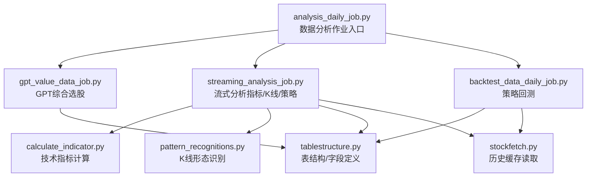
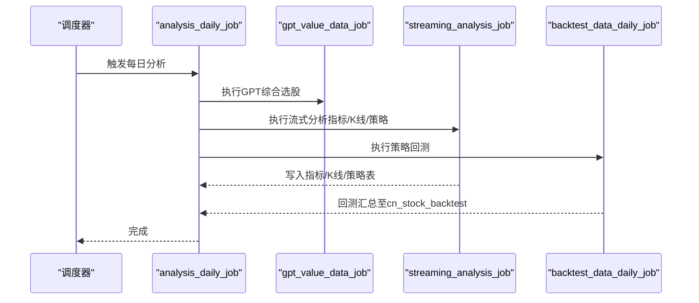
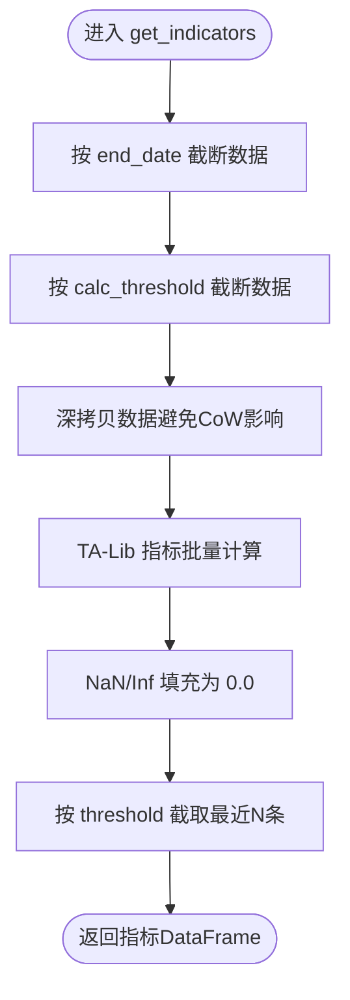
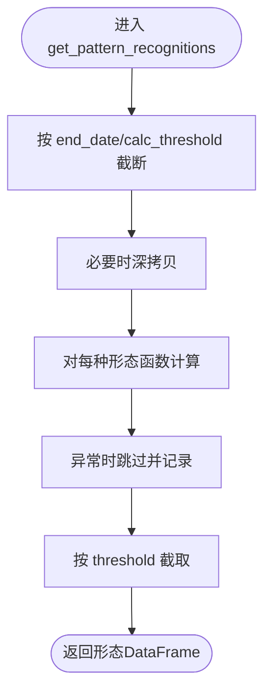
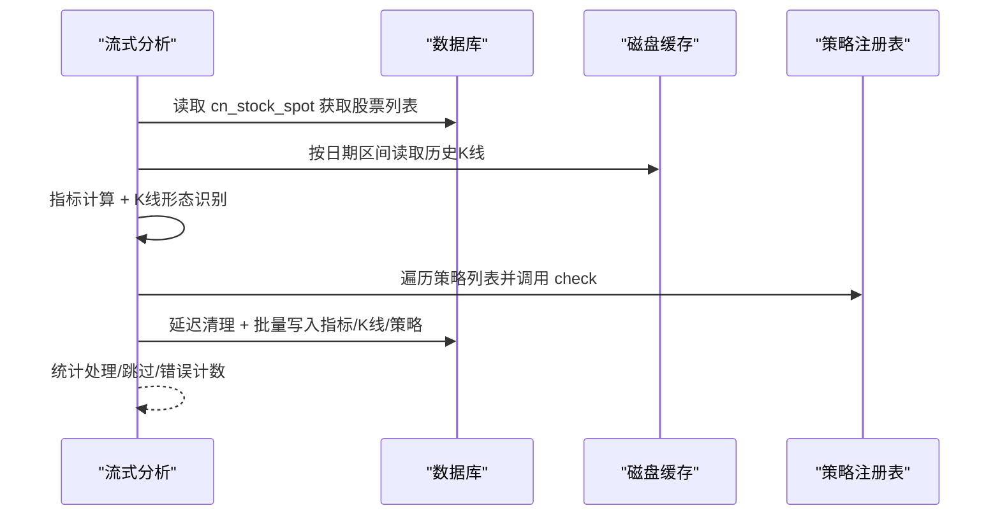
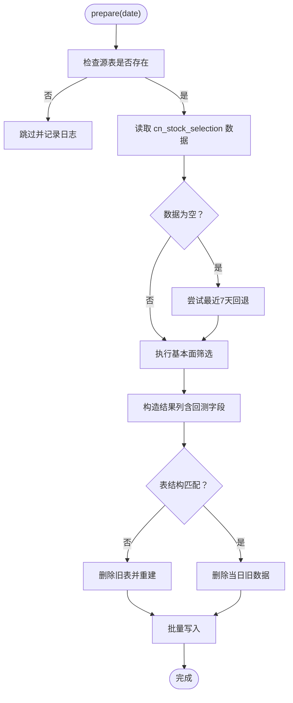
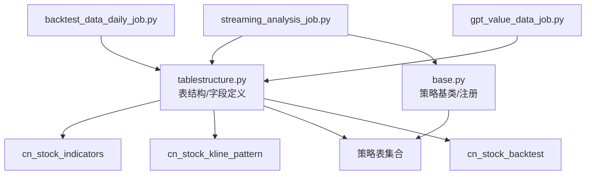

# 分析计算作业

<cite>
**本文引用的文件**
- [instock/analysis_daily_job.py](file://instock/analysis_daily_job.py)
- [instock/streaming_analysis_job.py](file://instock/streaming_analysis_job.py)
- [instock/calculate_indicator.py](file://instock/core/indicator/calculate_indicator.py)
- [instock/pattern_recognitions.py](file://instock/core/pattern/pattern_recognitions.py)
- [instock/tablestructure.py](file://instock/core/tablestructure.py)
- [instock/base.py](file://instock/core/strategy/base.py)
- [instock/gpt_value_data_job.py](file://instock/job/gpt_value_data_job.py)
- [instock/backtest_data_daily_job.py](file://instock/job/backtest_data_daily_job.py)
- [instock/safe_backfill.py](file://instock/job/safe_backfill.py)
- [instock/query_cache.py](file://instock/lib/query_cache.py)
- [instock/stockfetch.py](file://instock/core/stockfetch.py)
</cite>

## 目录
1. [简介](#简介)
2. [项目结构](#项目结构)
3. [核心组件](#核心组件)
4. [架构总览](#架构总览)
5. [详细组件分析](#详细组件分析)
6. [依赖关系分析](#依赖关系分析)
7. [性能考量](#性能考量)
8. [故障排查指南](#故障排查指南)
9. [结论](#结论)
10. [附录](#附录)

## 简介
本技术文档围绕 SelectStock 的“分析计算作业”展开，系统阐述其设计理念、执行策略与实现细节。分析计算作业涵盖三大类任务：
- 技术指标计算作业：对单只股票的历史K线数据进行指标计算，形成 cn_stock_indicators 表。
- K线形态识别作业：基于 TA-Lib 形态函数识别K线形态，形成 cn_stock_kline_pattern 表。
- 选股结果计算作业：基于指标与形态结果，结合策略规则与回测数据，形成策略表与汇总表。

作业强调“零API调用、纯本地计算”，通过磁盘缓存与数据库解耦，实现单次遍历、批量写入、延迟清理、并发控制与内存峰值控制，确保在低内存环境下稳定运行。

## 项目结构
分析计算作业位于 instock/job 与 instock/core 下，主要文件如下：
- instock/analysis_daily_job.py：数据分析作业入口，协调 GPT 选股、流式分析与回测。
- instock/streaming_analysis_job.py：流式分析主控，负责指标、K线形态与策略的统一处理。
- instock/core/indicator/calculate_indicator.py：技术指标计算引擎。
- instock/core/pattern/pattern_recognitions.py：K线形态识别引擎。
- instock/core/tablestructure.py：数据库表结构与字段定义。
- instock/core/strategy/base.py：策略基类与注册体系。
- instock/job/gpt_value_data_job.py：GPT综合选股作业。
- instock/job/backtest_data_daily_job.py：策略回测作业。
- instock/job/safe_backfill.py：安全补跑脚本，降低内存峰值。
- instock/lib/query_cache.py：Web 查询缓存（与分析作业互补）。
- instock/core/stockfetch.py：历史数据缓存与数据源健康度管理。

**图表来源**
- [instock/analysis_daily_job.py](file://instock/analysis_daily_job.py#L98-L149)
- [instock/streaming_analysis_job.py](file://instock/streaming_analysis_job.py#L118-L294)
- [instock/calculate_indicator.py](file://instock/core/indicator/calculate_indicator.py#L23-L407)
- [instock/pattern_recognitions.py](file://instock/core/pattern/pattern_recognitions.py#L10-L70)
- [instock/tablestructure.py](file://instock/core/tablestructure.py#L320-L589)
- [instock/stockfetch.py](file://instock/core/stockfetch.py#L190-L200)
- [instock/backtest_data_daily_job.py](file://instock/job/backtest_data_daily_job.py#L35-L140)
- [instock/gpt_value_data_job.py](file://instock/job/gpt_value_data_job.py#L27-L111)

**章节来源**
- [instock/analysis_daily_job.py](file://instock/analysis_daily_job.py#L98-L149)
- [instock/streaming_analysis_job.py](file://instock/streaming_analysis_job.py#L118-L294)
- [instock/tablestructure.py](file://instock/core/tablestructure.py#L320-L589)

## 核心组件
- 技术指标计算引擎：基于 TA-Lib 的指标计算，包含 MACD、KDJ、布林带、RSI、VR、ATR、DMI、WR、CCI、DMA、TEMA、MFI、VWMA、PPO、StochRSI、WT、Supertrend、ROC、OBV、SAR、PSY、BRAR、EMV、BIAS、DPO、VHF、RVI、FI、ENE 等，具备 NaN/Inf 处理与阈值截断能力。
- K线形态识别引擎：基于 TA-Lib 形态函数识别 50+ 种K线形态，按日期截断与阈值控制输出。
- 流式分析处理器：单次遍历 + 多线程并发 + 批量写入，按需从磁盘缓存读取历史数据，延迟清理数据库表，避免中途崩溃导致数据丢失。
- 策略基类与注册：提供策略基类、技术/成交量/趋势/形态策略分类与注册表，统一 check 接口。
- GPT综合选股：基于 cn_stock_selection 的基本面筛选，输出 cn_stock_strategy_gpt_value。
- 回测作业：按策略表回测，动态计算 N 日收益率，汇总至 cn_stock_backtest。

**章节来源**
- [instock/calculate_indicator.py](file://instock/core/indicator/calculate_indicator.py#L23-L407)
- [instock/pattern_recognitions.py](file://instock/core/pattern/pattern_recognitions.py#L10-L70)
- [instock/streaming_analysis_job.py](file://instock/streaming_analysis_job.py#L118-L294)
- [instock/base.py](file://instock/core/strategy/base.py#L20-L202)
- [instock/gpt_value_data_job.py](file://instock/job/gpt_value_data_job.py#L27-L111)
- [instock/backtest_data_daily_job.py](file://instock/job/backtest_data_daily_job.py#L35-L140)

## 架构总览
分析计算作业采用“阶段化、解耦化、流式化”的架构：
- 阶段1（数据获取）：通过 fetch 系列作业将历史K线与行情写入磁盘缓存与数据库。
- 阶段2（分析计算）：analysis_daily_job 协调 GPT 选股、流式分析与回测，全部基于本地缓存与数据库。
- 关键特性：零API调用、单次遍历、延迟清理、批量写入、并发控制、内存峰值控制。

**图表来源**
- [instock/analysis_daily_job.py](file://instock/analysis_daily_job.py#L98-L149)
- [instock/gpt_value_data_job.py](file://instock/job/gpt_value_data_job.py#L184-L191)
- [instock/streaming_analysis_job.py](file://instock/streaming_analysis_job.py#L520-L530)
- [instock/backtest_data_daily_job.py](file://instock/job/backtest_data_daily_job.py#L138-L141)

## 详细组件分析

### 技术指标计算作业
- 输入：单只股票的历史K线数据（DataFrame），包含 date、open、high、low、close、volume、amount 等。
- 处理：按日期截断、阈值截断、NaN/Inf清洗、TA-Lib 指标批量计算。
- 输出：指标列集合（如 macd、kdjk、boll、rsi、vr、atr、cci、dma、mfi、vwma、ppo、wt、supertrend 等）。
- 精度控制：对 NaN/Inf 统一填充为 0.0，避免后续计算异常；阈值截断保证只取最近 N 条有效数据。
- 并发与内存：单只股票处理完成后立即释放，避免内存堆积。

**图表来源**
- [instock/calculate_indicator.py](file://instock/core/indicator/calculate_indicator.py#L23-L407)

**章节来源**
- [instock/calculate_indicator.py](file://instock/core/indicator/calculate_indicator.py#L23-L407)

### K线形态识别作业
- 输入：单只股票的历史K线数据（DataFrame）。
- 处理：对每种形态函数（共50+种）应用到 OHLC 数据，输出形态标记列。
- 输出：形态列集合（如 doji、hammer、engulfing_pattern、morning_star 等）。
- 控制：按日期截断与阈值控制，仅输出最新一日形态结果。

**图表来源**
- [instock/pattern_recognitions.py](file://instock/core/pattern/pattern_recognitions.py#L10-L70)

**章节来源**
- [instock/pattern_recognitions.py](file://instock/core/pattern/pattern_recognitions.py#L10-L70)

### 选股结果计算作业（策略与回测）
- 流式分析主控：
  - 获取股票列表（优先从数据库 cn_stock_spot，降级使用单例）。
  - 计算日期区间（默认10年历史）。
  - 构建指标/K线/策略列定义。
  - 延迟清理：仅在首次写入时清理当日数据，避免中途崩溃。
  - 多线程并发：按批次（BATCH_SIZE）提交，每批完成后批量写入并清空缓冲区。
  - 写入策略：指标表、K线形态表、各策略表（含回测字段占位）。
- 回测作业：
  - 顺序扫描策略表，筛选当日未回测记录。
  - 按策略函数动态回测，从磁盘缓存读取历史数据。
  - 分批并发计算，批量更新回测字段。
  - 汇总至 cn_stock_backtest，按日期与策略名称去重。

**图表来源**
- [instock/streaming_analysis_job.py](file://instock/streaming_analysis_job.py#L118-L294)
- [instock/tablestructure.py](file://instock/core/tablestructure.py#L409-L443)
- [instock/stockfetch.py](file://instock/core/stockfetch.py#L190-L200)

**章节来源**
- [instock/streaming_analysis_job.py](file://instock/streaming_analysis_job.py#L118-L294)
- [instock/backtest_data_daily_job.py](file://instock/job/backtest_data_daily_job.py#L35-L140)
- [instock/tablestructure.py](file://instock/core/tablestructure.py#L409-L443)

### GPT综合选股作业
- 输入：cn_stock_selection 表（综合选股数据）。
- 处理：从源表读取，支持日期回退（最近7天），执行基本面筛选，计算综合评分。
- 输出：cn_stock_strategy_gpt_value 表（含回测字段占位）。
- 容错：源表不存在或无数据时跳过；表结构不匹配时自动重建。

**图表来源**
- [instock/gpt_value_data_job.py](file://instock/job/gpt_value_data_job.py#L27-L111)

**章节来源**
- [instock/gpt_value_data_job.py](file://instock/job/gpt_value_data_job.py#L27-L111)

## 依赖关系分析
- 表结构依赖：所有写入表的列定义集中在 tablestructure.py，包括指标表、K线形态表、策略表、回测汇总表等。
- 策略依赖：策略注册表集中管理，策略函数通过注册表统一调用。
- 数据依赖：流式分析与回测均依赖磁盘缓存与数据库，避免重复加载全量数据。
- 环境变量依赖：并发度、批量大小、工作线程、历史年数、阈值等均可通过环境变量调整。

**图表来源**
- [instock/tablestructure.py](file://instock/core/tablestructure.py#L320-L589)
- [instock/base.py](file://instock/core/strategy/base.py#L155-L202)
- [instock/streaming_analysis_job.py](file://instock/streaming_analysis_job.py#L118-L294)
- [instock/backtest_data_daily_job.py](file://instock/job/backtest_data_daily_job.py#L35-L140)
- [instock/gpt_value_data_job.py](file://instock/job/gpt_value_data_job.py#L27-L111)

**章节来源**
- [instock/tablestructure.py](file://instock/core/tablestructure.py#L320-L589)
- [instock/base.py](file://instock/core/strategy/base.py#L155-L202)

## 性能考量
- 内存控制
  - 单次遍历：4900只股票 × 1次缓存读取，显著降低I/O次数。
  - 峰值内存：< 100 MB（对比原架构 ~1670 MB）。
  - 延迟清理：仅在首次写入时清理当日数据，避免中途崩溃。
  - 批量写入：按 BATCH_SIZE 写入，减少数据库连接开销。
- 并发与吞吐
  - 外层并发：策略表顺序处理（外层 workers），内层并发（内层 workers）按批次控制。
  - 线程池：ThreadPoolExecutor 控制并发度，避免一次性创建过多Future对象。
- 环境变量调优
  - INSTOCK_BATCH_SIZE：批量大小（默认50）。
  - INSTOCK_ANALYSIS_WORKERS：分析并发线程数（默认2）。
  - INSTOCK_BACKTEST_OUTER_WORKERS/INNER_WORKERS：回测并发线程数（默认1/2）。
  - INSTOCK_ANALYSIS_DONE_THRESHOLD：分析完成阈值（默认1000）。
  - INSTOCK_FORCE_ANALYSIS=1：强制执行分析（跳过完成检查）。
- 安全补跑
  - safe_backfill.py：停止 web_service 释放内存，设置 workers=1，补跑完毕后自动重启。

**章节来源**
- [instock/streaming_analysis_job.py](file://instock/streaming_analysis_job.py#L48-L54)
- [instock/backtest_data_daily_job.py](file://instock/job/backtest_data_daily_job.py#L52-L91)
- [instock/safe_backfill.py](file://instock/job/safe_backfill.py#L48-L52)

## 故障排查指南
- 分析任务跳过
  - 现象：当日指标表行数达到阈值，自动跳过分析。
  - 处理：设置 INSTOCK_FORCE_ANALYSIS=1 强制执行；或等待其他节点完成。
- 股票列表获取失败
  - 现象：数据库无 cn_stock_spot 数据，降级使用单例；若仍失败，检查网络与代理。
  - 处理：确认 fetch 系列作业已运行；必要时重试。
- 表结构不匹配
  - 现象：旧表列数不足，写入失败。
  - 处理：自动重建旧表；或手动执行 schema 检查与迁移。
- 回测数据缺失
  - 现象：策略表存在但回测字段为空。
  - 处理：运行回测作业；或使用 on-the-fly 动态计算。
- 内存不足
  - 现象：低内存服务器运行失败。
  - 处理：使用 safe_backfill.py 降低并发度；调整环境变量；关闭 web_service 释放内存。

**章节来源**
- [instock/analysis_daily_job.py](file://instock/analysis_daily_job.py#L60-L95)
- [instock/streaming_analysis_job.py](file://instock/streaming_analysis_job.py#L57-L86)
- [instock/backtest_data_daily_job.py](file://instock/job/backtest_data_daily_job.py#L167-L270)
- [instock/safe_backfill.py](file://instock/job/safe_backfill.py#L31-L83)

## 结论
分析计算作业通过“零API调用、单次遍历、延迟清理、批量写入、并发控制”等设计，实现了在低内存环境下的稳定高效运行。技术指标与K线形态计算具备完善的 NaN/Inf 处理与阈值控制，策略与回测模块通过磁盘缓存与数据库解耦，支持灵活的参数配置与容错恢复。整体架构清晰、扩展性强，适合在生产环境中长期维护与演进。

## 附录
- 参数配置清单
  - INSTOCK_BATCH_SIZE：批量大小（默认50）
  - INSTOCK_ANALYSIS_WORKERS：分析并发线程数（默认2）
  - INSTOCK_BACKTEST_OUTER_WORKERS：回测外层并发（默认1）
  - INSTOCK_BACKTEST_INNER_WORKERS：回测内层并发（默认2）
  - INSTOCK_ANALYSIS_DONE_THRESHOLD：分析完成阈值（默认1000）
  - INSTOCK_FORCE_ANALYSIS=1：强制执行分析
  - HIST_DATA_DEFAULT_YEARS：历史数据年数（默认10）
- 数据输入输出格式
  - 输入：历史K线（OHLCV）、行情快照（cn_stock_spot）、综合选股（cn_stock_selection）。
  - 输出：指标表（cn_stock_indicators）、K线形态表（cn_stock_kline_pattern）、策略表（各策略）、回测汇总（cn_stock_backtest）。
- 缓存与增量
  - 磁盘缓存：历史K线按股票与日期分片存储，按需读取。
  - 增量计算：safe_backfill.py 提供安全补跑流程，降低内存峰值。
- 错误恢复与验证
  - 错误恢复：单只股票失败不影响整体；表结构不匹配自动重建；日期回退机制保障数据可用。
  - 结果验证：回测汇总表提供成功率与平均收益统计；Web 层支持 on-the-fly 动态回测。

**章节来源**
- [instock/streaming_analysis_job.py](file://instock/streaming_analysis_job.py#L48-L54)
- [instock/backtest_data_daily_job.py](file://instock/job/backtest_data_daily_job.py#L52-L91)
- [instock/safe_backfill.py](file://instock/job/safe_backfill.py#L48-L52)
- [instock/tablestructure.py](file://instock/core/tablestructure.py#L320-L589)