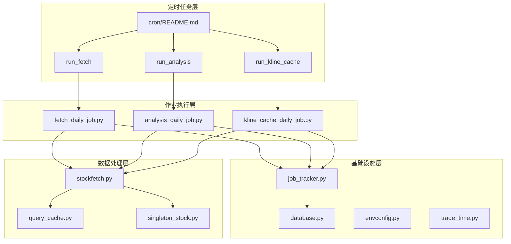
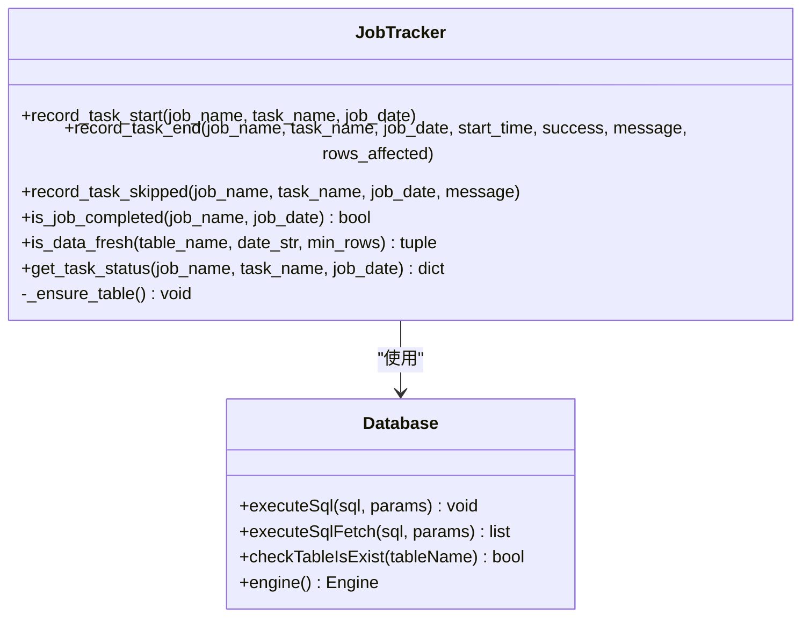
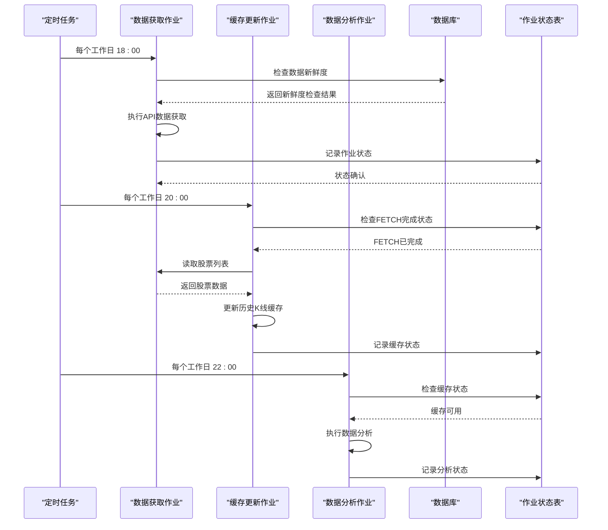
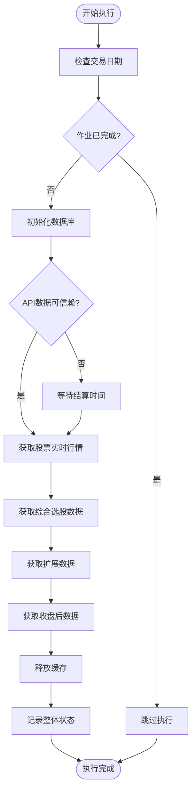
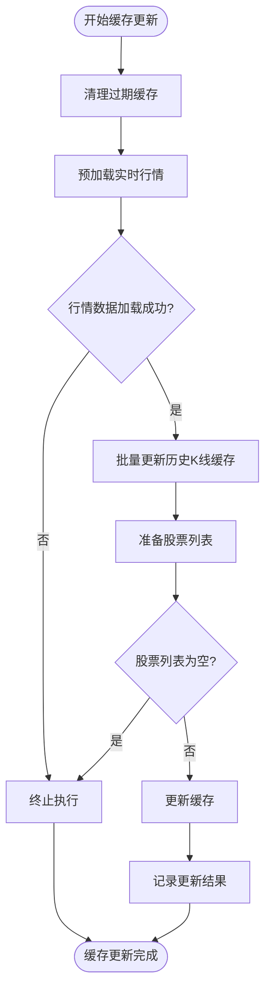
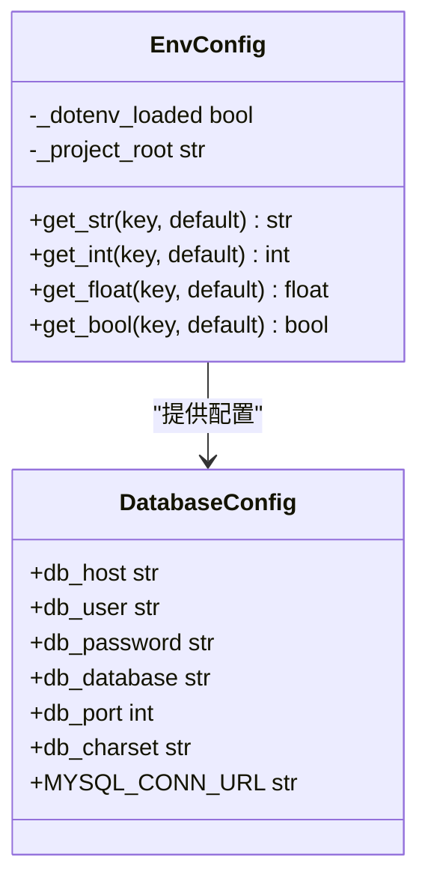
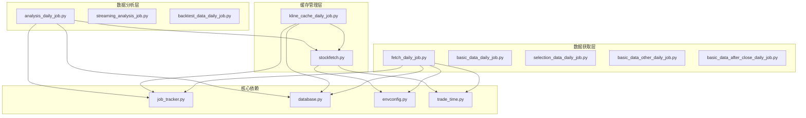
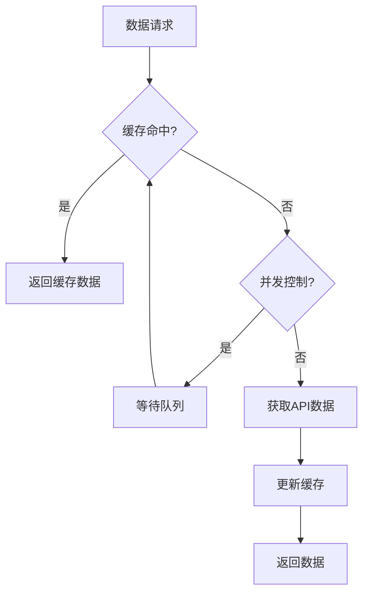

# 数据新鲜度管理系统

<cite>
**本文档引用的文件**
- [README.md](file://README.md)
- [QUICKSTART.md](file://QUICKSTART.md)
- [cron/README.md](file://cron/README.md)
- [instock/lib/job_tracker.py](file://instock/lib/job_tracker.py)
- [instock/job/fetch_daily_job.py](file://instock/job/fetch_daily_job.py)
- [instock/job/analysis_daily_job.py](file://instock/job/analysis_daily_job.py)
- [instock/lib/database.py](file://instock/lib/database.py)
- [instock/lib/envconfig.py](file://instock/lib/envconfig.py)
- [instock/lib/trade_time.py](file://instock/lib/trade_time.py)
- [instock/core/stockfetch.py](file://instock/core/stockfetch.py)
- [docker/Dockerfile](file://docker/Dockerfile)
- [docker/stock/instock/lib/job_tracker.py](file://docker/stock/instock/lib/job_tracker.py)
- [docker/stock/instock/core/stockfetch.py](file://docker/stock/instock/core/stockfetch.py)
- [docker/stock/instock/job/kline_cache_daily_job.py](file://docker/stock/instock/job/kline_cache_daily_job.py)
- [docker/stock/instock/lib/query_cache.py](file://docker/stock/instock/lib/query_cache.py)
- [docker/stock/instock/core/singleton_stock.py](file://docker/stock/instock/core/singleton_stock.py)
</cite>

## 目录
1. [简介](#简介)
2. [项目结构](#项目结构)
3. [核心组件](#核心组件)
4. [架构概览](#架构概览)
5. [详细组件分析](#详细组件分析)
6. [依赖关系分析](#依赖关系分析)
7. [性能考虑](#性能考虑)
8. [故障排除指南](#故障排除指南)
9. [结论](#结论)

## 简介

数据新鲜度管理系统是InStock股票分析系统的核心基础设施，负责监控和管理各类数据的时效性和完整性。该系统通过智能化的数据新鲜度检查、作业状态追踪和缓存管理机制，确保股票数据的准确性和及时性。

系统采用三层架构设计：数据获取层（run_fetch）、缓存管理层（run_kline_cache）和数据分析层（run_analysis），实现了获取与分析的完全解耦。通过cn_job_status表统一追踪作业状态，通过is_data_fresh函数检查数据新鲜度，通过缓存机制优化数据访问性能。

## 项目结构

**图表来源**
- [cron/README.md:1-221](file://cron/README.md#L1-L221)
- [instock/job/fetch_daily_job.py:1-230](file://instock/job/fetch_daily_job.py#L1-L230)
- [instock/job/analysis_daily_job.py:1-221](file://instock/job/analysis_daily_job.py#L1-L221)

**章节来源**
- [README.md:1-800](file://README.md#L1-L800)
- [cron/README.md:1-221](file://cron/README.md#L1-L221)

## 核心组件

### 作业状态追踪器（JobTracker）

作业状态追踪器是数据新鲜度管理系统的核心组件，负责记录和查询作业执行状态。其主要功能包括：

- **状态记录**：记录每个作业/子任务的执行状态、开始/结束时间、耗时
- **数据新鲜度检查**：检查某表的当日数据是否已存在且完整
- **作业完成检查**：检查某日作业是否已成功完成
- **任务状态查询**：获取指定任务的执行状态信息

**图表来源**
- [instock/lib/job_tracker.py:62-233](file://instock/lib/job_tracker.py#L62-L233)
- [instock/lib/database.py:255-298](file://instock/lib/database.py#L255-L298)

### 数据新鲜度检查机制

系统通过is_data_fresh函数实现智能化的数据新鲜度检查，主要特点：

- **阈值配置**：不同数据表设置不同的新鲜度阈值
- **时间检查**：结合交易时间和结算时间判断数据是否可信赖
- **环境变量支持**：通过INSTOCK_FORCE_FETCH强制执行
- **状态追踪**：通过cn_job_status表记录整体作业完成状态

**章节来源**
- [instock/lib/job_tracker.py:176-202](file://instock/lib/job_tracker.py#L176-L202)
- [instock/job/fetch_daily_job.py:108-133](file://instock/job/fetch_daily_job.py#L108-L133)

### 缓存管理系统

系统采用多层次缓存策略优化数据访问性能：

- **历史K线缓存**：`instock/cache/hist/`目录下的gzip压缩pickle文件
- **查询缓存**：内存中的LRU缓存，支持TTL过期
- **单例缓存**：股票数据单例模式，避免重复加载
- **智能清理**：定期清理过期和无效缓存文件

**章节来源**
- [instock/core/stockfetch.py:1143-1150](file://instock/core/stockfetch.py#L1143-L1150)
- [docker/stock/instock/lib/query_cache.py:27-48](file://docker/stock/instock/lib/query_cache.py#L27-L48)

## 架构概览

**图表来源**
- [cron/README.md:73-96](file://cron/README.md#L73-L96)
- [instock/job/fetch_daily_job.py:147-150](file://instock/job/fetch_daily_job.py#L147-L150)
- [docker/stock/instock/job/kline_cache_daily_job.py:109-160](file://docker/stock/instock/job/kline_cache_daily_job.py#L109-L160)

## 详细组件分析

### 数据获取作业（run_fetch）

数据获取作业负责集中执行所有需要外部API的数据获取任务，采用串行执行和子进程隔离的设计原则：

**图表来源**
- [instock/job/fetch_daily_job.py:135-226](file://instock/job/fetch_daily_job.py#L135-L226)

**章节来源**
- [instock/job/fetch_daily_job.py:1-230](file://instock/job/fetch_daily_job.py#L1-L230)

### 缓存更新作业（run_kline_cache）

缓存更新作业专门负责历史K线缓存的增量更新，采用低内存模式和智能预加载策略：

**图表来源**
- [docker/stock/instock/job/kline_cache_daily_job.py:110-160](file://docker/stock/instock/job/kline_cache_daily_job.py#L110-L160)

**章节来源**
- [docker/stock/instock/job/kline_cache_daily_job.py:1-160](file://docker/stock/instock/job/kline_cache_daily_job.py#L1-L160)

### 数据分析作业（run_analysis）

数据分析作业基于本地缓存和数据库数据执行所有分析、筛选、回测任务，实现零API调用的纯本地计算：

**章节来源**
- [instock/job/analysis_daily_job.py:1-221](file://instock/job/analysis_daily_job.py#L1-L221)

### 环境配置管理

系统通过envconfig模块实现集中式的环境变量配置管理：

**图表来源**
- [instock/lib/envconfig.py:50-83](file://instock/lib/envconfig.py#L50-L83)
- [instock/lib/database.py:23-46](file://instock/lib/database.py#L23-L46)

**章节来源**
- [instock/lib/envconfig.py:1-83](file://instock/lib/envconfig.py#L1-L83)
- [instock/lib/database.py:1-298](file://instock/lib/database.py#L1-L298)

## 依赖关系分析

**图表来源**
- [instock/lib/job_tracker.py:1-233](file://instock/lib/job_tracker.py#L1-L233)
- [instock/job/fetch_daily_job.py:36-56](file://instock/job/fetch_daily_job.py#L36-L56)

**章节来源**
- [cron/README.md:23-33](file://cron/README.md#L23-L33)

## 性能考虑

### 缓存策略优化

系统采用多层次缓存策略提升性能：

- **历史K线缓存**：首次全量获取后，后续采用增量更新策略
- **查询缓存**：内存LRU缓存，支持TTL过期，减少数据库重复查询
- **单例模式**：避免重复加载相同数据，减少内存占用
- **批量处理**：每批处理50只股票，平衡内存使用和处理效率

### 并发控制机制

**章节来源**
- [docker/stock/instock/lib/query_cache.py:27-48](file://docker/stock/instock/lib/query_cache.py#L27-L48)
- [docker/stock/instock/core/singleton_stock.py:42-73](file://docker/stock/instock/core/singleton_stock.py#L42-L73)

### 错误处理和重试机制

系统实现了完善的错误处理和重试机制：

- **瞬态错误重试**：数据库连接异常、死锁等可重试错误自动重试
- **数据源健康度追踪**：连续失败的数据源自动降级，避免资源浪费
- **指数退避重试**：重试等待时间呈指数增长，避免雪崩效应
- **超时控制**：子进程执行超时自动终止，防止资源泄露

**章节来源**
- [instock/lib/database.py:104-111](file://instock/lib/database.py#L104-L111)
- [instock/core/stockfetch.py:66-125](file://instock/core/stockfetch.py#L66-L125)

## 故障排除指南

### 常见问题诊断

1. **数据新鲜度检查失败**
   - 检查INSTOCK_FORCE_FETCH环境变量设置
   - 验证交易日检测逻辑是否正确
   - 确认数据表结构和字段完整性

2. **缓存更新异常**
   - 检查缓存目录权限和磁盘空间
   - 验证股票列表获取是否成功
   - 确认API数据源可用性

3. **作业状态追踪异常**
   - 检查cn_job_status表结构
   - 验证数据库连接配置
   - 确认作业执行日志

### 调试工具和方法

- **日志分析**：通过stock_execute_job.log、stock_web.log、stock_trade.log分析问题
- **状态检查**：使用is_job_completed和is_data_fresh函数检查系统状态
- **环境变量验证**：确认INSTOCK_FORCE_FETCH、INSTOCK_FORCE_ANALYSIS等配置

**章节来源**
- [README.md:314-319](file://README.md#L314-L319)
- [instock/lib/job_tracker.py:147-174](file://instock/lib/job_tracker.py#L147-L174)

## 结论

数据新鲜度管理系统通过智能化的数据新鲜度检查、作业状态追踪和缓存管理机制，实现了股票数据的高效管理和可靠更新。系统采用三层架构设计，实现了获取与分析的完全解耦，通过cn_job_status表统一追踪作业状态，通过is_data_fresh函数智能检查数据新鲜度，通过多层次缓存策略优化数据访问性能。

该系统的主要优势包括：

- **智能化数据管理**：自动检查数据新鲜度，避免重复获取
- **作业状态追踪**：完整的作业执行状态记录和查询
- **缓存优化**：多层次缓存策略提升系统性能
- **容错机制**：完善的错误处理和重试机制
- **配置灵活**：通过环境变量实现灵活配置

通过这些机制的协同工作，系统能够确保股票数据的准确性和及时性，为后续的数据分析和策略执行提供可靠的数据基础。