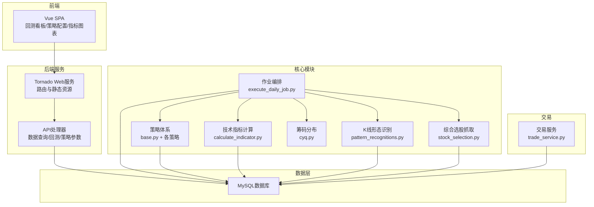
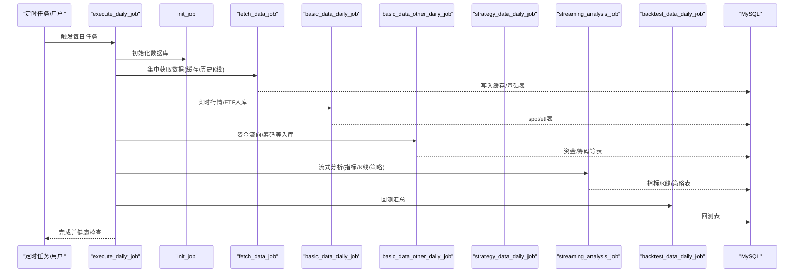
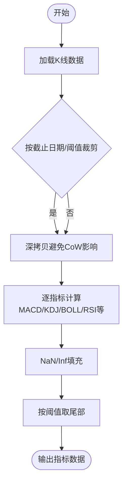
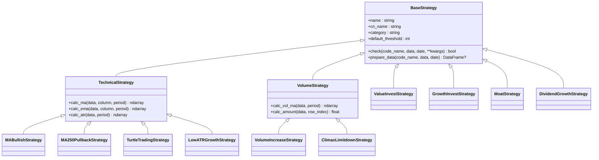
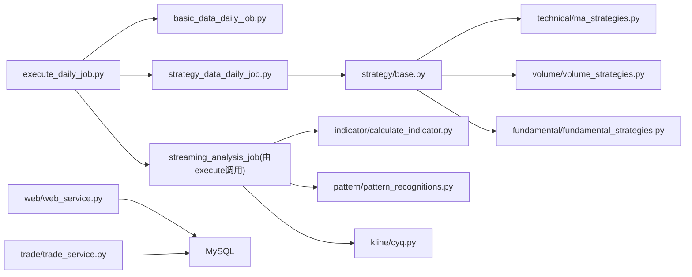

# 核心功能特性

<cite>
**本文引用的文件**
- [README.md](file://README.md)
- [QUICKSTART.md](file://QUICKSTART.md)
- [instock/core/crawling/stock_selection.py](file://instock/core/crawling/stock_selection.py)
- [instock/core/strategy/base.py](file://instock/core/strategy/base.py)
- [instock/core/indicator/calculate_indicator.py](file://instock/core/indicator/calculate_indicator.py)
- [instock/core/kline/cyq.py](file://instock/core/kline/cyq.py)
- [instock/core/pattern/pattern_recognitions.py](file://instock/core/pattern/pattern_recognitions.py)
- [instock/core/strategy/technical/ma_strategies.py](file://instock/core/strategy/technical/ma_strategies.py)
- [instock/core/strategy/volume/volume_strategies.py](file://instock/core/strategy/volume/volume_strategies.py)
- [instock/core/strategy/fundamental/fundamental_strategies.py](file://instock/core/strategy/fundamental/fundamental_strategies.py)
- [instock/web/web_service.py](file://instock/web/web_service.py)
- [instock/trade/trade_service.py](file://instock/trade/trade_service.py)
- [instock/job/execute_daily_job.py](file://instock/job/execute_daily_job.py)
- [instock/job/basic_data_daily_job.py](file://instock/job/basic_data_daily_job.py)
- [instock/job/strategy_data_daily_job.py](file://instock/job/strategy_data_daily_job.py)
</cite>

## 目录
1. [简介](#简介)
2. [项目结构](#项目结构)
3. [核心组件](#核心组件)
4. [架构总览](#架构总览)
5. [详细组件分析](#详细组件分析)
6. [依赖关系分析](#依赖关系分析)
7. [性能考量](#性能考量)
8. [故障排查指南](#故障排查指南)
9. [结论](#结论)
10. [附录](#附录)

## 简介
本文件面向SelectStock量化投资股票选股系统，聚焦系统的核心功能特性，围绕“综合选股、股票每日数据、技术指标计算、K线形态识别、筹码分布、策略选股、选股验证、自动交易”等模块展开，系统化阐述各模块的作用、实现原理、使用方法与实际应用场景，并提供可操作的使用案例与排障建议，帮助用户快速理解并高效使用系统。

## 项目结构
系统采用前后端分离与模块化设计：
- 后端核心模块位于 instock/core，涵盖数据抓取、指标计算、K线形态、策略体系、筹码分布等；
- Web服务位于 instock/web，提供Tornado服务与Vue前端交互；
- 任务调度与批处理位于 instock/job，统一编排每日数据采集、分析与回测；
- 交易模块位于 instock/trade，提供交易引擎与策略运行；
- 文档与说明位于根目录 README.md、QUICKSTART.md 等。

**图表来源**
- [instock/web/web_service.py](file://instock/web/web_service.py#L53-L97)
- [instock/job/execute_daily_job.py](file://instock/job/execute_daily_job.py#L80-L179)
- [instock/core/crawling/stock_selection.py](file://instock/core/crawling/stock_selection.py#L18-L110)
- [instock/core/indicator/calculate_indicator.py](file://instock/core/indicator/calculate_indicator.py#L23-L407)
- [instock/core/pattern/pattern_recognitions.py](file://instock/core/pattern/pattern_recognitions.py#L10-L34)
- [instock/core/kline/cyq.py](file://instock/core/kline/cyq.py#L13-L165)
- [instock/core/strategy/base.py](file://instock/core/strategy/base.py#L20-L202)
- [instock/trade/trade_service.py](file://instock/trade/trade_service.py#L19-L30)

**章节来源**
- [README.md](file://README.md#L1-L700)
- [QUICKSTART.md](file://QUICKSTART.md#L1-L207)

## 核心组件
- 综合选股：从东方财富抓取A股候选池，支持字段映射、分页与重试，输出结构化数据，供策略与筛选使用。
- 股票每日数据：抓取实时行情、ETF行情、资金流向、分红送配、大宗交易、龙虎榜等，按交易日入库。
- 技术指标计算：基于TA-Lib与pandas，覆盖MACD、KDJ、BOLL、RSI、CR、ATR、DMI、W%R、CCI、VR、DMA、MFI、VWMA、PPO、WT、Supertrend、DPO、VHF、RVI、OBV、SAR、PSY、BRAR、EMV、BIAS等，结果与主流软件保持一致性。
- K线形态识别：支持61种K线形态识别，按日期与阈值计算，输出形态信号。
- 筹码分布：基于K线数据与换手率，计算210个交易日筹码分布，输出成本、获利比例、分位区间等。
- 策略选股：提供技术类（均线多头、回踩年线、海龟交易、低ATR成长）、成交量类（放量上涨、放量跌停）、基本面类（价值/成长/护城河/股息成长）等策略，策略注册与分类管理。
- 选股验证：通过回测看板提供跨策略总览、时间序列、单策略明细、收益分布、买入-卖出配对等，支持自定义收益周期与日期区间。
- 自动交易：提供交易服务入口，支持策略加载与监控，内置示例策略与日志。

**章节来源**
- [README.md](file://README.md#L14-L213)
- [instock/core/crawling/stock_selection.py](file://instock/core/crawling/stock_selection.py#L18-L110)
- [instock/core/indicator/calculate_indicator.py](file://instock/core/indicator/calculate_indicator.py#L23-L407)
- [instock/core/pattern/pattern_recognitions.py](file://instock/core/pattern/pattern_recognitions.py#L10-L34)
- [instock/core/kline/cyq.py](file://instock/core/kline/cyq.py#L13-L165)
- [instock/core/strategy/base.py](file://instock/core/strategy/base.py#L20-L202)
- [instock/core/strategy/technical/ma_strategies.py](file://instock/core/strategy/technical/ma_strategies.py#L22-L237)
- [instock/core/strategy/volume/volume_strategies.py](file://instock/core/strategy/volume/volume_strategies.py#L19-L126)
- [instock/core/strategy/fundamental/fundamental_strategies.py](file://instock/core/strategy/fundamental/fundamental_strategies.py#L30-L351)
- [instock/web/web_service.py](file://instock/web/web_service.py#L53-L97)
- [instock/trade/trade_service.py](file://instock/trade/trade_service.py#L19-L30)

## 架构总览
系统采用“作业驱动 + 流式分析”的流水线架构：
- Phase 1：集中数据获取（API密集），更新本地缓存；
- Phase 2：基础数据入库（实时行情/ETF/综合选股）；
- Phase 3：扩展数据入库（资金流向/龙虎榜/筹码等）；
- Phase 4：流式分析（指标+K线形态+策略），低内存模式；
- Phase 5：回测与收尾（回测汇总/大宗交易等）。

**图表来源**
- [instock/job/execute_daily_job.py](file://instock/job/execute_daily_job.py#L80-L179)
- [instock/job/basic_data_daily_job.py](file://instock/job/basic_data_daily_job.py#L79-L93)
- [instock/job/strategy_data_daily_job.py](file://instock/job/strategy_data_daily_job.py#L87-L96)

**章节来源**
- [README.md](file://README.md#L214-L231)
- [instock/job/execute_daily_job.py](file://instock/job/execute_daily_job.py#L80-L179)

## 详细组件分析

### 综合选股
- 作用：从东方财富获取A股候选池，构建可筛选的基础数据集，支持字段类型转换与缺失值处理。
- 实现原理：构造API请求参数，分页拉取，首页重试保护，逐页重试，最终统一清洗与类型转换。
- 使用方法：直接调用抓取函数，或通过作业脚本执行；也可在策略中作为基础数据源。
- 应用场景：为技术/基本面/消息面筛选提供股票池；配合回测模块进行策略验证。
- 关键路径：[stock_selection](file://instock/core/crawling/stock_selection.py#L18-L110)

**章节来源**
- [instock/core/crawling/stock_selection.py](file://instock/core/crawling/stock_selection.py#L18-L110)
- [README.md](file://README.md#L14-L29)

### 股票每日数据
- 作用：抓取实时行情、ETF行情、资金流向、分红送配、大宗交易、龙虎榜、筹码分布等，按交易日入库。
- 实现原理：基于单例缓存与数据库写入，支持批量模式与当前时间模式；ETF单独处理。
- 使用方法：通过作业脚本 basic_data_daily_job 或 execute_daily_job 调用；也可独立运行。
- 应用场景：为指标计算与策略提供基础数据；支持前端实时展示。
- 关键路径：[save_nph_stock_spot_data](file://instock/job/basic_data_daily_job.py#L24-L48)、[save_nph_etf_spot_data](file://instock/job/basic_data_daily_job.py#L52-L75)

**章节来源**
- [README.md](file://README.md#L33-L41)
- [instock/job/basic_data_daily_job.py](file://instock/job/basic_data_daily_job.py#L24-L93)

### 技术指标计算
- 作用：批量计算常用技术指标，覆盖动量、波动率、趋势、能量、超买超卖等类别。
- 实现原理：基于TA-Lib与pandas，统一NaN/Inf处理，支持截止日期与阈值裁剪，保证与主流软件结果一致。
- 使用方法：传入K线数据，按日期截断与阈值裁剪，输出指标列；支持单只股票指标抽取。
- 应用场景：为K线形态识别与策略提供前置特征；前端Bokeh图表展示。
- 关键路径：[get_indicators](file://instock/core/indicator/calculate_indicator.py#L23-L407)、[get_indicator](file://instock/core/indicator/calculate_indicator.py#L410-L449)

**图表来源**
- [instock/core/indicator/calculate_indicator.py](file://instock/core/indicator/calculate_indicator.py#L23-L407)

**章节来源**
- [README.md](file://README.md#L41-L56)
- [instock/core/indicator/calculate_indicator.py](file://instock/core/indicator/calculate_indicator.py#L23-L449)

### K线形态识别
- 作用：识别61种经典K线形态，输出形态信号，辅助策略与人工判断。
- 实现原理：对OHLC数据逐项调用形态识别函数，按阈值与日期裁剪，返回包含形态信号的行。
- 使用方法：传入OHLC数据与形态函数映射，按日期与阈值计算，筛选非0信号。
- 应用场景：结合技术策略进行形态确认；前端K线图叠加形态标记。
- 关键路径：[get_pattern_recognitions](file://instock/core/pattern/pattern_recognitions.py#L10-L34)、[get_pattern_recognition](file://instock/core/pattern/pattern_recognitions.py#L37-L71)

**章节来源**
- [README.md](file://README.md#L85-L108)
- [instock/core/pattern/pattern_recognitions.py](file://instock/core/pattern/pattern_recognitions.py#L10-L71)

### 筹码分布
- 作用：计算筹码分布与相关指标（平均成本、获利比例、分位区间），反映市场成本与套牢盘压力。
- 实现原理：基于K线价格区间与换手率，迭代叠加三角分布，计算总筹码与成本分界。
- 使用方法：传入K线数据与参数（精度因子、计算范围、交易天数），返回分布与指标对象。
- 应用场景：判断短期压力/支撑区域；辅助趋势与超买超卖判断。
- 关键路径：[CYQCalculator.calc](file://instock/core/kline/cyq.py#L27-L165)

**章节来源**
- [README.md](file://README.md#L110-L114)
- [instock/core/kline/cyq.py](file://instock/core/kline/cyq.py#L13-L165)

### 策略选股
- 作用：提供可注册的策略框架与多种策略实现，支持技术、成交量、趋势、形态与基本面策略。
- 实现原理：策略基类提供统一接口与数据准备，策略注册表管理策略类；具体策略实现check方法。
- 使用方法：通过策略注册装饰器注册策略；在作业中按策略列表并行执行；支持并发线程池。
- 应用场景：基于规则的自动化选股；与回测模块联动验证策略有效性。
- 关键路径：
  - 策略基类与注册：[BaseStrategy/register_strategy](file://instock/core/strategy/base.py#L20-L202)
  - 技术策略示例：[MABullishStrategy/MA250PullbackStrategy/TurtleTradingStrategy/LowATRGrowthStrategy](file://instock/core/strategy/technical/ma_strategies.py#L22-L237)
  - 成交量策略示例：[VolumeIncreaseStrategy/ClimaxLimitdownStrategy](file://instock/core/strategy/volume/volume_strategies.py#L19-L126)
  - 基本面策略示例：[ValueInvest/GrowthInvest/MoatStrategy/DividendGrowthStrategy](file://instock/core/strategy/fundamental/fundamental_strategies.py#L30-L351)
  - 策略执行作业：[prepare/run_check/main](file://instock/job/strategy_data_daily_job.py#L23-L96)

**图表来源**
- [instock/core/strategy/base.py](file://instock/core/strategy/base.py#L20-L202)
- [instock/core/strategy/technical/ma_strategies.py](file://instock/core/strategy/technical/ma_strategies.py#L22-L237)
- [instock/core/strategy/volume/volume_strategies.py](file://instock/core/strategy/volume/volume_strategies.py#L19-L126)
- [instock/core/strategy/fundamental/fundamental_strategies.py](file://instock/core/strategy/fundamental/fundamental_strategies.py#L30-L351)

**章节来源**
- [README.md](file://README.md#L115-L182)
- [instock/core/strategy/base.py](file://instock/core/strategy/base.py#L20-L202)
- [instock/core/strategy/technical/ma_strategies.py](file://instock/core/strategy/technical/ma_strategies.py#L22-L237)
- [instock/core/strategy/volume/volume_strategies.py](file://instock/core/strategy/volume/volume_strategies.py#L19-L126)
- [instock/core/strategy/fundamental/fundamental_strategies.py](file://instock/core/strategy/fundamental/fundamental_strategies.py#L30-L351)
- [instock/job/strategy_data_daily_job.py](file://instock/job/strategy_data_daily_job.py#L23-L96)

### 选股验证（回测）
- 作用：对策略选出的股票进行回测，验证策略成功率与收益分布，支持多维度看板。
- 实现原理：Web服务提供回测API与看板接口，前端Vue组件消费数据；支持自定义收益周期与日期区间。
- 使用方法：在前端“选股验证 → 回测看板”中配置参数并运行；后端返回跨策略总览、时间序列、收益分布等。
- 应用场景：策略效果评估、参数优化与风控校验。
- 关键路径：[Application路由](file://instock/web/web_service.py#L56-L87)

**章节来源**
- [README.md](file://README.md#L185-L194)
- [instock/web/web_service.py](file://instock/web/web_service.py#L53-L97)

### 自动交易
- 作用：提供交易服务入口，加载策略并启动监控，支持策略热加载与日志记录。
- 实现原理：读取交易配置文件，初始化主引擎，加载策略并启动；日志落盘便于排查。
- 使用方法：启动交易服务脚本；按需配置券商与交易参数。
- 应用场景：策略实盘或模拟交易；与策略模块联动。
- 关键路径：[trade_service.main](file://instock/trade/trade_service.py#L19-L30)

**章节来源**
- [README.md](file://README.md#L195-L204)
- [instock/trade/trade_service.py](file://instock/trade/trade_service.py#L19-L30)

## 依赖关系分析
- 模块耦合：
  - 作业编排（execute_daily_job）串联数据获取、入库、流式分析与回测，形成强依赖链；
  - 策略模块依赖指标/K线/筹码等中间表，形成数据依赖；
  - Web服务依赖数据库与API处理器，提供前端交互。
- 外部依赖：
  - TA-Lib用于指标计算；
  - Tornado提供Web服务；
  - MySQL存储数据；
  - 东方财富/腾讯/新浪等数据源（自动容错切换）。

**图表来源**
- [instock/job/execute_daily_job.py](file://instock/job/execute_daily_job.py#L80-L179)
- [instock/job/strategy_data_daily_job.py](file://instock/job/strategy_data_daily_job.py#L87-L96)
- [instock/core/strategy/base.py](file://instock/core/strategy/base.py#L20-L202)
- [instock/core/strategy/technical/ma_strategies.py](file://instock/core/strategy/technical/ma_strategies.py#L22-L237)
- [instock/core/strategy/volume/volume_strategies.py](file://instock/core/strategy/volume/volume_strategies.py#L19-L126)
- [instock/core/strategy/fundamental/fundamental_strategies.py](file://instock/core/strategy/fundamental/fundamental_strategies.py#L30-L351)
- [instock/core/indicator/calculate_indicator.py](file://instock/core/indicator/calculate_indicator.py#L23-L407)
- [instock/core/pattern/pattern_recognitions.py](file://instock/core/pattern/pattern_recognitions.py#L10-L34)
- [instock/core/kline/cyq.py](file://instock/core/kline/cyq.py#L13-L165)
- [instock/web/web_service.py](file://instock/web/web_service.py#L53-L97)
- [instock/trade/trade_service.py](file://instock/trade/trade_service.py#L19-L30)

**章节来源**
- [README.md](file://README.md#L298-L318)
- [instock/job/execute_daily_job.py](file://instock/job/execute_daily_job.py#L80-L179)

## 性能考量
- 多阶段流水线：API集中在Phase 1，其余阶段仅读取本地缓存，显著降低API调用与内存峰值；
- 低内存模式：流式分析逐只股票读取与处理，峰值内存远低于全量加载；
- 并发控制：策略执行与数据入库使用线程池，适配低配服务器；
- 数据健康检查：流水线结束进行核心表数据检查，便于快速定位问题。

**章节来源**
- [README.md](file://README.md#L308-L318)
- [instock/job/execute_daily_job.py](file://instock/job/execute_daily_job.py#L132-L179)

## 故障排查指南
- 数据获取失败：检查网络与代理配置，系统具备多数据源自动切换与重试机制；
- 数据库连接失败：确认数据库服务运行与配置正确；
- 历史数据更新：使用 fetch_data_job 或 execute_daily_job 进行增量更新；
- 日志定位：查看 stock_execute_job.log、stock_web.log、stock_trade.log，按模块区分问题域；
- 页面无数据：执行数据健康检查，确认当日数据是否入库。

**章节来源**
- [QUICKSTART.md](file://QUICKSTART.md#L169-L195)
- [README.md](file://README.md#L435-L462)

## 结论
SelectStock系统以“作业驱动 + 流式分析”为核心，围绕综合选股、每日数据、指标计算、K线形态、筹码分布、策略体系、回测验证与自动交易构建了完整的量化选股闭环。其模块化设计、多数据源容错、低内存流式分析与完善的Web/交易接口，使得系统在易用性、可维护性与可扩展性方面具备良好平衡，适合个人与团队在多场景下开展量化研究与实盘探索。

## 附录
- 快速开始：安装依赖、配置数据库、运行数据作业、启动Web服务、访问系统；
- 常用操作：回测看板、手动拉取历史数据、计算技术指标、运行策略选股、批量处理历史数据、调整历史数据获取年数、强制重建缓存；
- Docker部署：完整部署与仅应用两种方式，支持代理与Cookie配置。

**章节来源**
- [QUICKSTART.md](file://QUICKSTART.md#L1-L207)
- [README.md](file://README.md#L404-L462)