# 技术分析策略

<cite>
**本文引用的文件**
- [instock/core/strategy/base.py](file://instock/core/strategy/base.py)
- [instock/core/strategy/technical/ma_strategies.py](file://instock/core/strategy/technical/ma_strategies.py)
- [instock/core/strategy/volume/volume_strategies.py](file://instock/core/strategy/volume/volume_strategies.py)
- [instock/core/strategy/pattern/pattern_strategies.py](file://instock/core/strategy/pattern/pattern_strategies.py)
- [instock/core/indicator/calculate_indicator.py](file://instock/core/indicator/calculate_indicator.py)
- [instock/core/strategy/README.md](file://instock/core/strategy/README.md)
- [docker/stock/instock/core/strategy/document/ChatGP选股策略文档.md](file://docker/stock/instock/core/strategy/document/ChatGP选股策略文档.md)
- [instock/core/backtest/bt_engine.py](file://instock/core/backtest/bt_engine.py)
</cite>

## 目录
1. [引言](#引言)
2. [项目结构](#项目结构)
3. [核心组件](#核心组件)
4. [架构总览](#架构总览)
5. [详细组件分析](#详细组件分析)
6. [依赖分析](#依赖分析)
7. [性能考虑](#性能考虑)
8. [故障排查指南](#故障排查指南)
9. [结论](#结论)
10. [附录](#附录)

## 引言
本文件围绕 SelectStock 的技术分析策略进行系统化梳理，重点覆盖基于技术指标的选股策略，包括均线策略（均线多头、回踩年线、海龟交易法则、低ATR成长）、成交量策略（放量上涨、放量跌停）、以及K线形态策略（突破平台、停机坪、高而窄的旗形、无大幅回撤）。文档将逐项说明策略实现原理、技术指标计算方法、参数配置与适用市场环境，并提供参数调优与风险管理建议，帮助用户理解与高效使用这些策略。

## 项目结构
技术分析策略主要分布在以下模块：
- 策略基类与注册机制：提供统一的策略抽象、工具方法与注册表
- 技术策略：均线、动量、趋势、波动率等指标驱动的策略
- 成交量策略：以成交量与成交额为核心的信号
- 形态策略：基于K线形态与整理行为的策略
- 指标计算：统一的TA-Lib指标计算与填充处理
- 回测引擎：策略回测与可视化支持

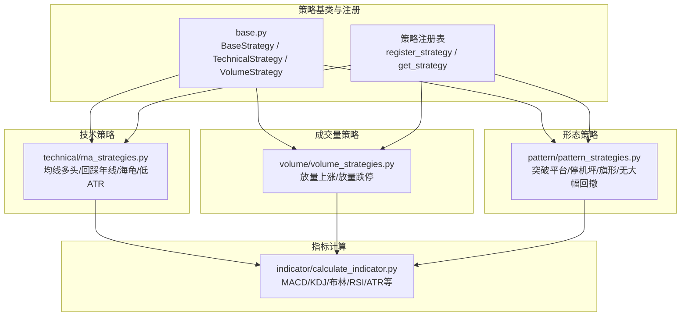

图示来源
- [instock/core/strategy/base.py](file://instock/core/strategy/base.py#L19-L202)
- [instock/core/strategy/technical/ma_strategies.py](file://instock/core/strategy/technical/ma_strategies.py#L1-L237)
- [instock/core/strategy/volume/volume_strategies.py](file://instock/core/strategy/volume/volume_strategies.py#L1-L126)
- [instock/core/strategy/pattern/pattern_strategies.py](file://instock/core/strategy/pattern/pattern_strategies.py#L1-L276)
- [instock/core/indicator/calculate_indicator.py](file://instock/core/indicator/calculate_indicator.py#L23-L408)

章节来源
- [instock/core/strategy/README.md](file://instock/core/strategy/README.md#L1-L146)

## 核心组件
- 策略基类与注册
  - BaseStrategy：定义统一接口与数据准备逻辑
  - TechnicalStrategy/VolumeStrategy：封装常用技术指标计算（MA/EMA/ATR/成交量MA等）
  - 注册机制：通过装饰器将策略注册到全局注册表，便于按名称获取与批量管理
- 指标计算
  - 统一使用 TA-Lib 计算主流技术指标，内置NaN/Inf填充与阈值裁剪，保证稳定性
- 策略实现
  - 均线策略：均线多头、回踩年线、海龟交易法则、低ATR成长
  - 成交量策略：放量上涨、放量跌停
  - 形态策略：突破平台、停机坪、高而窄的旗形、无大幅回撤

章节来源
- [instock/core/strategy/base.py](file://instock/core/strategy/base.py#L19-L202)
- [instock/core/indicator/calculate_indicator.py](file://instock/core/indicator/calculate_indicator.py#L23-L408)

## 架构总览
策略执行链路自上而下分为“数据准备—指标计算—策略判定—回测评估”四个环节。策略基类负责数据过滤与阈值校验；指标计算模块提供统一的TA-Lib接口；具体策略在各自文件中实现check逻辑；回测引擎支持策略信号的回测与可视化。

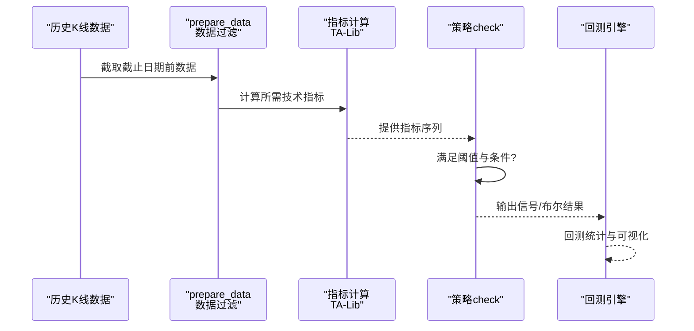

图示来源
- [instock/core/strategy/base.py](file://instock/core/strategy/base.py#L64-L96)
- [instock/core/indicator/calculate_indicator.py](file://instock/core/indicator/calculate_indicator.py#L23-L408)
- [instock/core/backtest/bt_engine.py](file://instock/core/backtest/bt_engine.py#L101-L307)

## 详细组件分析

### 均线策略

#### 均线多头（MA30持续上涨）
- 实现原理
  - 计算30日均线，要求最近N日呈单调递增，且末日较初日涨幅超过20%
  - 通过分段采样（三分之一与三分之二处）验证趋势持续性
- 技术指标与参数
  - 指标：30日MA（TA-Lib MA）
  - 阈值：默认N=30，涨幅阈值1.2倍
- 适用市场环境
  - 趋势明确、波动较小的震荡或慢牛行情
- 风险提示
  - 需结合成交量与回调位置，避免追高

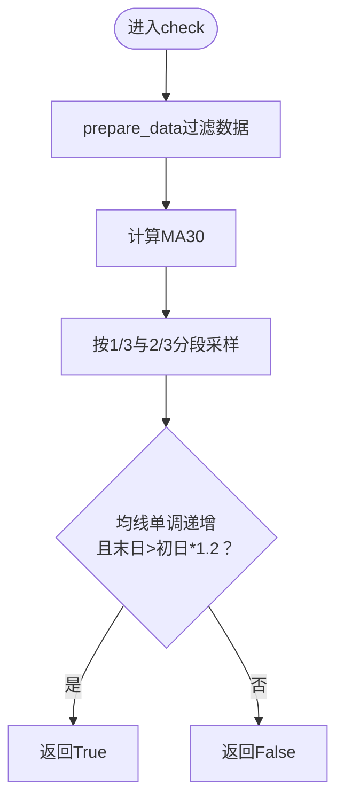

图示来源
- [instock/core/strategy/technical/ma_strategies.py](file://instock/core/strategy/technical/ma_strategies.py#L36-L55)
- [instock/core/strategy/base.py](file://instock/core/strategy/base.py#L104-L108)

章节来源
- [instock/core/strategy/technical/ma_strategies.py](file://instock/core/strategy/technical/ma_strategies.py#L22-L55)

#### 回踩年线（突破年线后缩量回踩）
- 实现原理
  - 前段：股价从250日线下方向上突破
  - 后段：突破后在年线上方运行，期间最低价与最高价日期间隔10–50日
  - 缩量回踩：最高成交量/最低成交量>2，且最低价/最高价<0.8
- 技术指标与参数
  - 指标：250日MA（TA-Lib MA）
  - 时间窗口：默认N=60，最低/最高点查找与日期差计算
- 适用市场环境
  - 主升浪初期或主升浪回踩，适合稳健型投资者
- 风险提示
  - 注意成交量与价格配合，避免假突破

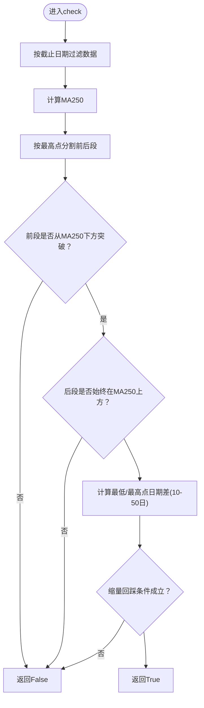

图示来源
- [instock/core/strategy/technical/ma_strategies.py](file://instock/core/strategy/technical/ma_strategies.py#L73-L137)
- [instock/core/strategy/base.py](file://instock/core/strategy/base.py#L118-L123)

章节来源
- [instock/core/strategy/technical/ma_strategies.py](file://instock/core/strategy/technical/ma_strategies.py#L58-L137)

#### 海龟交易法则（60日新高突破）
- 实现原理
  - 当日收盘价达到最近60日最高收盘价即视为突破信号
- 技术指标与参数
  - 指标：60日最高价（滚动max）
  - 阈值：当日收盘价≥60日最高
- 适用市场环境
  - 突破型行情，适合趋势跟踪者
- 风险提示
  - 需结合成交量与后续确认信号，避免追高

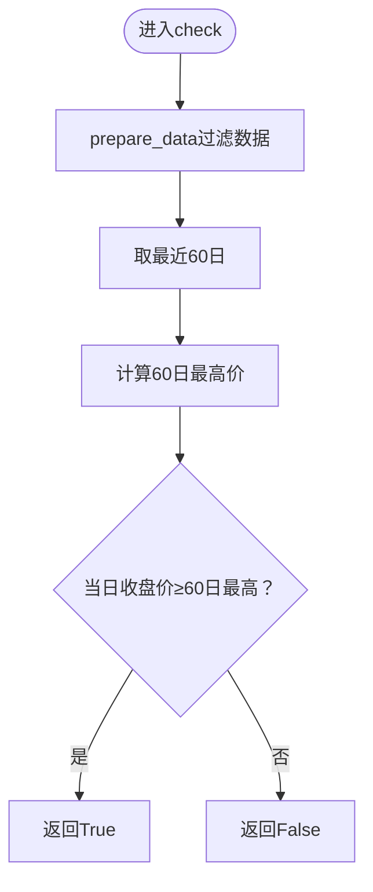

图示来源
- [instock/core/strategy/technical/ma_strategies.py](file://instock/core/strategy/technical/ma_strategies.py#L153-L166)

章节来源
- [instock/core/strategy/technical/ma_strategies.py](file://instock/core/strategy/technical/ma_strategies.py#L140-L166)

#### 低ATR成长（低波动稳健上涨）
- 实现原理
  - ATR相对价格比例低于3%（衡量低波动）
  - 120日内涨幅超过10%
- 技术指标与参数
  - 指标：ATR（TA-Lib ATR）
  - 阈值：ATR/Close < 3%，涨幅>10%
- 适用市场环境
  - 盘整或温和上涨阶段，偏好稳健成长
- 风险提示
  - 需关注突破信号与成交量配合

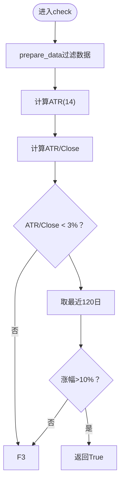

图示来源
- [instock/core/strategy/technical/ma_strategies.py](file://instock/core/strategy/technical/ma_strategies.py#L183-L211)
- [instock/core/strategy/base.py](file://instock/core/strategy/base.py#L118-L123)

章节来源
- [instock/core/strategy/technical/ma_strategies.py](file://instock/core/strategy/technical/ma_strategies.py#L169-L211)

### 成交量策略

#### 放量上涨（当日放量上涨）
- 实现原理
  - 当日涨幅>2%且阳线（收盘>开盘）
  - 成交额≥2亿
  - 当日成交量/5日均量≥2
- 技术指标与参数
  - 指标：5日均量（TA-Lib MA）
  - 阈值：p_change≥2，成交额≥2亿，量比≥2
- 适用市场环境
  - 趋势确认或突破初期，适合趋势跟踪
- 风险提示
  - 需结合价格位置与技术指标确认

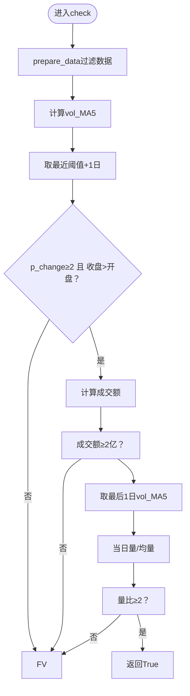

图示来源
- [instock/core/strategy/volume/volume_strategies.py](file://instock/core/strategy/volume/volume_strategies.py#L34-L68)

章节来源
- [instock/core/strategy/volume/volume_strategies.py](file://instock/core/strategy/volume/volume_strategies.py#L19-L68)

#### 放量跌停（恐慌性抛售）
- 实现原理
  - 当日接近跌停（跌幅≈-10%）
  - 成交量显著放大（量比≥1.5）
- 技术指标与参数
  - 指标：5日均量（TA-Lib MA）
  - 阈值：p_change≈-10%，量比≥1.5
- 适用市场环境
  - 市场恐慌或利空释放，适合逆向思维
- 风险提示
  - 需结合消息面与技术面确认是否见底

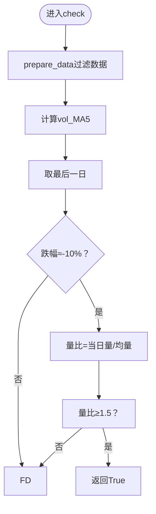

图示来源
- [instock/core/strategy/volume/volume_strategies.py](file://instock/core/strategy/volume/volume_strategies.py#L85-L112)

章节来源
- [instock/core/strategy/volume/volume_strategies.py](file://instock/core/strategy/volume/volume_strategies.py#L71-L112)

### 形态策略

#### 突破平台（放量突破60日均线）
- 实现原理
  - 存在某日收盘价≥60日均线>开盘价
  - 该日满足放量上涨（依赖成交量策略）
  - 之前某段时间内，收盘价与60日均线偏离在-5%~20%之间
- 技术指标与参数
  - 指标：60日MA（TA-Lib MA）
  - 依赖：放量上涨策略
- 适用市场环境
  - 平台整理后突破，适合趋势跟踪
- 风险提示
  - 需确认突破有效与后续放量确认

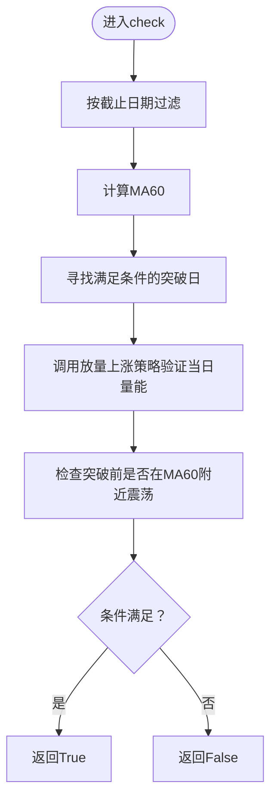

图示来源
- [instock/core/strategy/pattern/pattern_strategies.py](file://instock/core/strategy/pattern/pattern_strategies.py#L37-L77)

章节来源
- [instock/core/strategy/pattern/pattern_strategies.py](file://instock/core/strategy/pattern/pattern_strategies.py#L22-L77)

#### 停机坪（涨停后横盘蓄势）
- 实现原理
  - 最近15日出现接近涨停日（>9.5%）
  - 涨停后次日高开高走，且与涨停价差距不超过±3%
  - 接下来2–3日继续高开高走，每日涨跌幅限制在±5%以内
- 技术指标与参数
  - 依赖：海龟交易策略（寻找涨停日）
  - 阈值：涨跌幅与开盘/收盘价关系
- 适用市场环境
  - 趋势延续型整理，适合波段操作
- 风险提示
  - 需关注后续能否放量突破

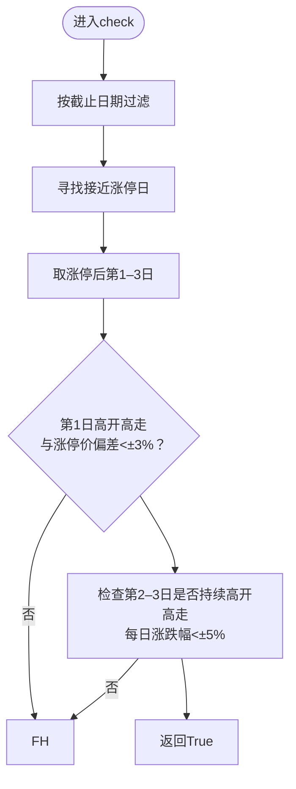

图示来源
- [instock/core/strategy/pattern/pattern_strategies.py](file://instock/core/strategy/pattern/pattern_strategies.py#L95-L148)

章节来源
- [instock/core/strategy/pattern/pattern_strategies.py](file://instock/core/strategy/pattern/pattern_strategies.py#L80-L148)

#### 高而窄的旗形（短期快速上涨后窄幅整理）
- 实现原理
  - 至少上市60日
  - 当日收盘价/24–10日前最低价≥1.9
  - 24–10日前连续两日涨幅≥9.5%
  - 需满足“机构参与”条件（istop=True）
- 技术指标与参数
  - 阈值：价格倍数与连续涨跌幅
  - 条件：istop=True
- 适用市场环境
  - 快速上涨后的强势整理，适合短线博弈
- 风险提示
  - 需结合成交量与突破信号

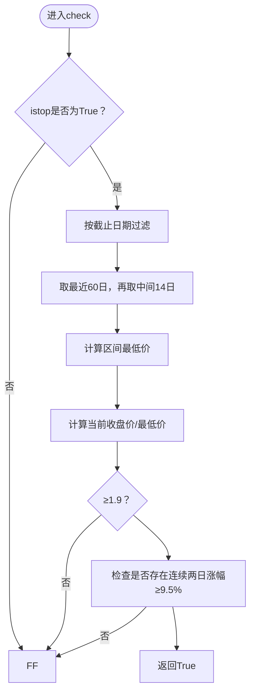

图示来源
- [instock/core/strategy/pattern/pattern_strategies.py](file://instock/core/strategy/pattern/pattern_strategies.py#L167-L203)

章节来源
- [instock/core/strategy/pattern/pattern_strategies.py](file://instock/core/strategy/pattern/pattern_strategies.py#L151-L203)

#### 无大幅回撤（稳健上涨）
- 实现原理
  - 最近60日涨幅>60%
  - 期间单日跌幅不超过-7%，或高开低走不超过-7%，或两日累计跌幅不超过-10%，或两日高开低走累计不超过-10%
- 技术指标与参数
  - 阈值：多条件组合
- 适用市场环境
  - 健康上涨通道，适合稳健型投资者
- 风险提示
  - 需关注后续是否出现放量滞涨

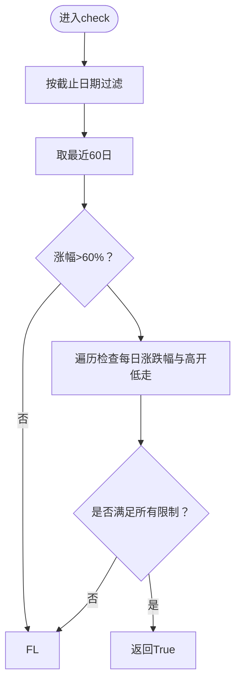

图示来源
- [instock/core/strategy/pattern/pattern_strategies.py](file://instock/core/strategy/pattern/pattern_strategies.py#L220-L250)

章节来源
- [instock/core/strategy/pattern/pattern_strategies.py](file://instock/core/strategy/pattern/pattern_strategies.py#L206-L250)

### 技术指标计算方法与参数
- 常用指标
  - MA/EMA：移动平均与指数移动平均（用于趋势判断）
  - ATR：平均真实波幅（用于波动率与止损设置）
  - MACD/KDJ/布林/RSI：动量与超买超卖辅助
- 计算要点
  - 使用 TA-Lib 计算，统一NaN/Inf填充
  - 支持按截止日期裁剪与阈值控制
- 参数建议
  - MA：5/10/20/60/120/250日均线
  - ATR：14日
  - RSI：14日
  - MACD：快线12、慢线26、信号9

章节来源
- [instock/core/indicator/calculate_indicator.py](file://instock/core/indicator/calculate_indicator.py#L23-L408)
- [instock/core/strategy/base.py](file://instock/core/strategy/base.py#L104-L123)

### 参数调优指南
- 均线策略
  - MA30涨幅阈值：根据市场波动性调整（震荡市可下调，趋势市可上调）
  - 回踩年线：缩量回踩比例与时间窗口可按板块轮动调整
- 成交量策略
  - 放量上涨：量比与成交额阈值可根据流动性调整
  - 放量跌停：量比阈值与跌停幅度可微调
- 形态策略
  - 突破平台：60日均线偏离容忍度与放量上涨阈值
  - 停机坪：高开高走幅度与连续天数
  - 旗形：连续涨跌幅与机构参与条件
  - 无大幅回撤：各项限制阈值可按回撤容忍度调整

章节来源
- [instock/core/strategy/technical/ma_strategies.py](file://instock/core/strategy/technical/ma_strategies.py#L22-L237)
- [instock/core/strategy/volume/volume_strategies.py](file://instock/core/strategy/volume/volume_strategies.py#L19-L126)
- [instock/core/strategy/pattern/pattern_strategies.py](file://instock/core/strategy/pattern/pattern_strategies.py#L22-L276)

### 风险管理建议
- 止损与止盈
  - ATR止损：以ATR倍数设置动态止损
  - 技术指标止盈：RSI超买、布林上轨、MACD背离
- 仓位管理
  - 单只股票最大仓位10%，核心股票15%，行业集中度上限30%
- 回撤控制
  - 组合最大回撤>15%停止加仓，>20%降至半仓
- 黑天鹅应对
  - 个股单日跌幅>8%或两日累计>12%时强制减仓

章节来源
- [docker/stock/instock/core/strategy/document/ChatGP选股策略文档.md](file://docker/stock/instock/core/strategy/document/ChatGP选股策略文档.md#L239-L273)

## 依赖分析
- 组件耦合
  - 策略依赖基类提供的数据准备与指标计算工具
  - 形态策略内部复用成交量与趋势策略以减少重复逻辑
- 外部依赖
  - TA-Lib：统一技术指标计算
  - pandas/numpy：数据处理与数值计算
- 潜在风险
  - 指标计算中的NaN/Inf需统一处理
  - 日期解析与阈值裁剪需注意边界情况

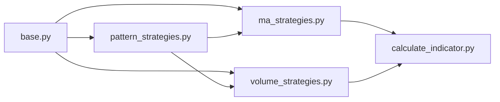

图示来源
- [instock/core/strategy/base.py](file://instock/core/strategy/base.py#L19-L202)
- [instock/core/strategy/technical/ma_strategies.py](file://instock/core/strategy/technical/ma_strategies.py#L1-L237)
- [instock/core/strategy/volume/volume_strategies.py](file://instock/core/strategy/volume/volume_strategies.py#L1-L126)
- [instock/core/strategy/pattern/pattern_strategies.py](file://instock/core/strategy/pattern/pattern_strategies.py#L1-L276)
- [instock/core/indicator/calculate_indicator.py](file://instock/core/indicator/calculate_indicator.py#L23-L408)

## 性能考虑
- 数据裁剪与缓存
  - 按截止日期与阈值裁剪数据，减少计算量
- 向量化计算
  - 使用TA-Lib与pandas/numpy向量化处理，提升速度
- 回测优化
  - 回测引擎支持批量信号回测与分析器输出，便于快速迭代

章节来源
- [instock/core/indicator/calculate_indicator.py](file://instock/core/indicator/calculate_indicator.py#L23-L408)
- [instock/core/backtest/bt_engine.py](file://instock/core/backtest/bt_engine.py#L101-L307)

## 故障排查指南
- 常见问题
  - 数据不足：检查阈值与截止日期过滤是否导致样本过少
  - 指标异常：关注NaN/Inf填充逻辑，确保指标列可用
  - 日期格式：注意字符串日期解析与timedelta比较
- 定位方法
  - 在策略check中打印关键变量（如MA、ATR、成交量等）
  - 使用最小可复现数据集验证逻辑分支
- 相关实现
  - 数据准备与阈值校验
  - 指标计算与填充
  - 回测引擎信号收集与统计

章节来源
- [instock/core/strategy/base.py](file://instock/core/strategy/base.py#L64-L96)
- [instock/core/indicator/calculate_indicator.py](file://instock/core/indicator/calculate_indicator.py#L13-L21)
- [instock/core/backtest/bt_engine.py](file://instock/core/backtest/bt_engine.py#L279-L307)

## 结论
SelectStock 的技术分析策略以统一的基类与指标计算为基础，覆盖了均线、成交量与形态三大类别的核心选股思路。通过参数化与阈值控制，策略能够适配不同市场环境；配合回测引擎与风控体系，可实现从信号到实盘的闭环管理。建议在实际应用中结合市场阶段与板块轮动，动态调整参数并严格执行风控。

## 附录
- 策略注册与获取
  - 通过装饰器注册策略，按名称从注册表获取策略类
- 回测流程
  - 信号收集→回测统计→报告生成，支持多种持有期与分析指标

章节来源
- [instock/core/strategy/base.py](file://instock/core/strategy/base.py#L155-L202)
- [instock/core/backtest/bt_engine.py](file://instock/core/backtest/bt_engine.py#L217-L307)