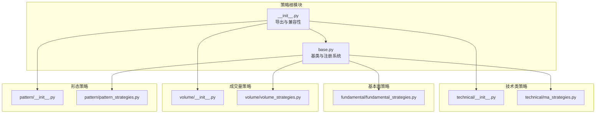
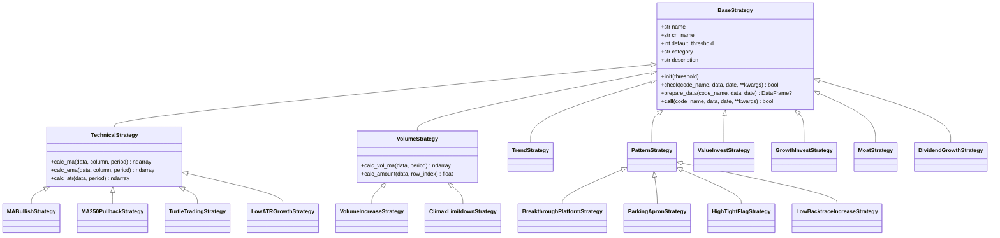
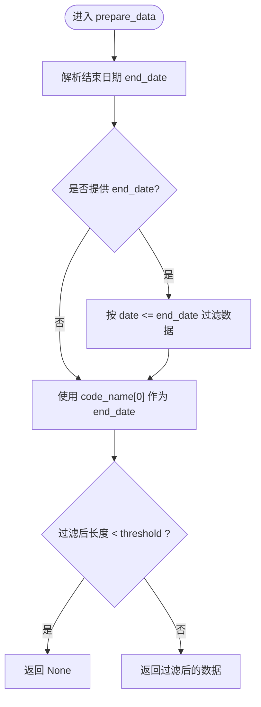
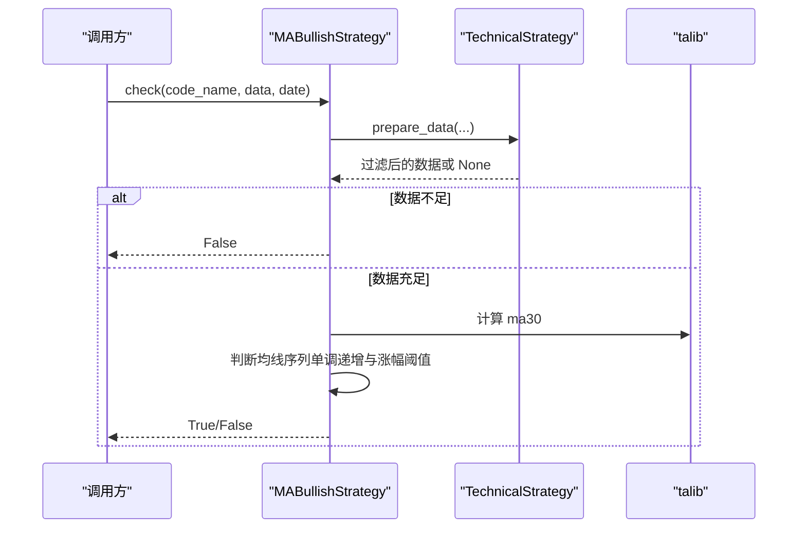
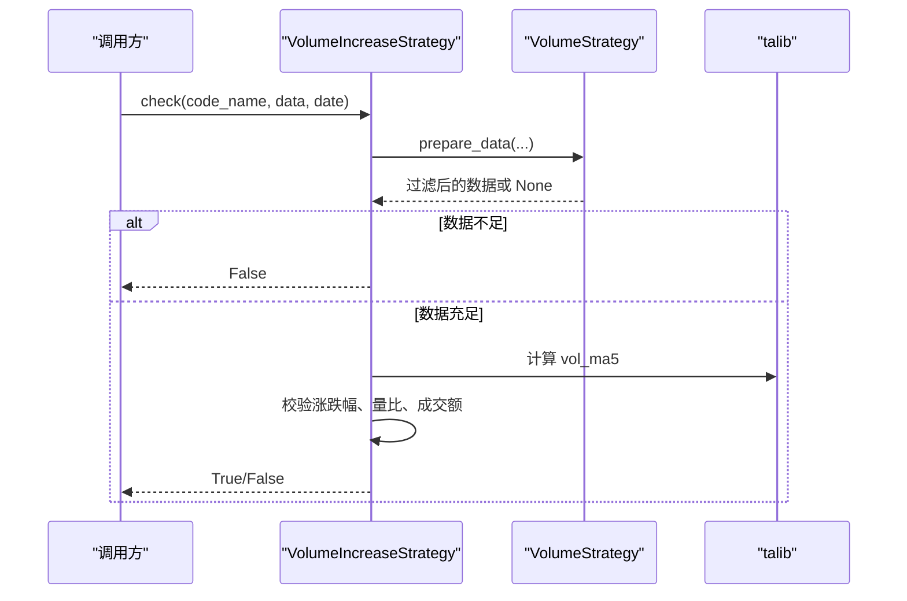
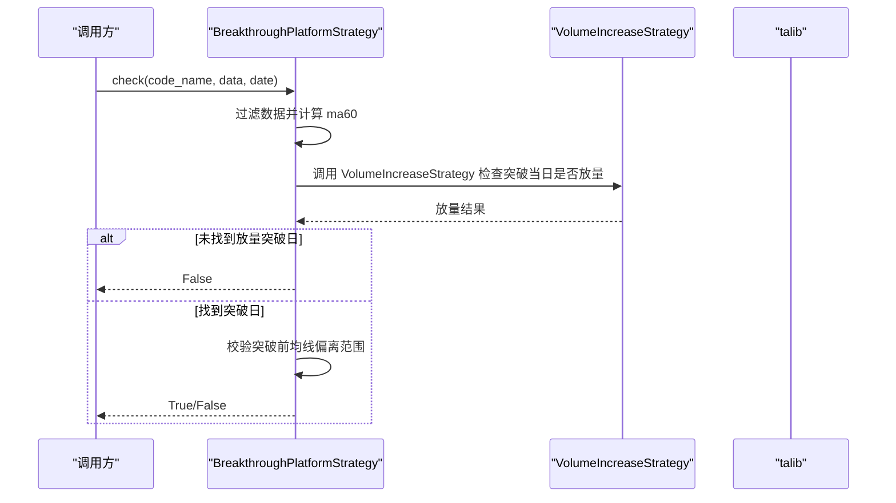
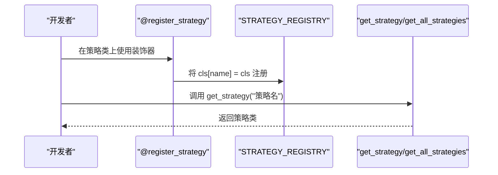
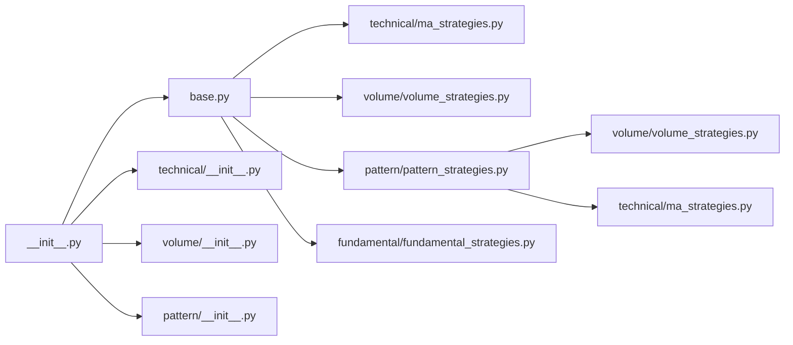

# 策略基类设计

<cite>
**本文引用的文件**
- [instock/core/strategy/base.py](file://instock/core/strategy/base.py)
- [instock/core/strategy/__init__.py](file://instock/core/strategy/__init__.py)
- [instock/core/strategy/technical/ma_strategies.py](file://instock/core/strategy/technical/ma_strategies.py)
- [instock/core/strategy/volume/volume_strategies.py](file://instock/core/strategy/volume/volume_strategies.py)
- [instock/core/strategy/pattern/pattern_strategies.py](file://instock/core/strategy/pattern/pattern_strategies.py)
- [instock/core/strategy/fundamental/fundamental_strategies.py](file://instock/core/strategy/fundamental/fundamental_strategies.py)
- [instock/core/strategy/technical/__init__.py](file://instock/core/strategy/technical/__init__.py)
- [instock/core/strategy/volume/__init__.py](file://instock/core/strategy/volume/__init__.py)
- [instock/core/strategy/pattern/__init__.py](file://instock/core/strategy/pattern/__init__.py)
- [instock/core/strategy/enter.py](file://instock/core/strategy/enter.py)
- [instock/core/strategy/turtle_trade.py](file://instock/core/strategy/turtle_trade.py)
- [instock/core/strategy/climax_limitdown.py](file://instock/core/strategy/climax_limitdown.py)
- [instock/core/strategy/backtrace_ma250.py](file://instock/core/strategy/backtrace_ma250.py)
- [tests/test_strategy_mapping.py](file://tests/test_strategy_mapping.py)
</cite>

## 目录
1. [引言](#引言)
2. [项目结构](#项目结构)
3. [核心组件](#核心组件)
4. [架构总览](#架构总览)
5. [详细组件分析](#详细组件分析)
6. [依赖分析](#依赖分析)
7. [性能考虑](#性能考虑)
8. [故障排查指南](#故障排查指南)
9. [结论](#结论)
10. [附录](#附录)

## 引言
本文件围绕 SelectStock 项目中的策略基类设计展开，系统阐述 BaseStrategy 抽象基类的理念与实现，覆盖策略接口定义、数据准备机制、策略注册系统；深入解析核心方法（check、prepare_data、__call__）以及不同策略类型（TechnicalStrategy、VolumeStrategy、PatternStrategy、FundamentalStrategy）的特化实现；最后给出策略开发最佳实践与扩展指南，帮助开发者理解并高效扩展策略体系。

## 项目结构
策略模块采用“按功能域分层 + 分类子包”的组织方式：
- 核心基类与注册系统位于策略根目录
- 按策略类别拆分为 technical、volume、pattern、fundamental 子包
- 提供兼容性模块与导出入口，便于旧接口平滑过渡

图表来源
- [instock/core/strategy/base.py](file://instock/core/strategy/base.py#L20-L202)
- [instock/core/strategy/__init__.py](file://instock/core/strategy/__init__.py#L30-L119)
- [instock/core/strategy/technical/__init__.py](file://instock/core/strategy/technical/__init__.py#L1-L44)
- [instock/core/strategy/volume/__init__.py](file://instock/core/strategy/volume/__init__.py#L1-L20)
- [instock/core/strategy/pattern/__init__.py](file://instock/core/strategy/pattern/__init__.py#L1-L28)

章节来源
- [instock/core/strategy/__init__.py](file://instock/core/strategy/__init__.py#L1-L119)

## 核心组件
本节聚焦 BaseStrategy 抽象基类及其派生类，解释设计理念与关键方法。

- 抽象基类 BaseStrategy
  - 设计目标：统一策略接口，规范 check 流程，提供数据准备与调用入口
  - 关键属性：name、cn_name、default_threshold、category、description
  - 关键方法：
    - check：抽象方法，子类必须实现
    - prepare_data：数据过滤与阈值校验
    - __call__：使策略实例可直接调用

- 技术类策略 TechnicalStrategy
  - 继承 BaseStrategy，扩展常用技术指标计算工具（如 MA、EMA、ATR）
  - 用于均线、通道、动量等技术形态的策略

- 成交量策略 VolumeStrategy
  - 继承 BaseStrategy，扩展成交量与成交额计算工具（如 vol_ma5、amount）
  - 用于放量、缩量、天量等成交量驱动的策略

- 趋势与形态策略
  - TrendStrategy、PatternStrategy：作为分类标记基类，便于按类别检索与管理

- 注册系统
  - 策略注册表 STRATEGY_REGISTRY：全局字典，按 name 映射策略类
  - 装饰器 register_strategy：自动注册策略类
  - 查询接口：get_strategy、get_all_strategies、get_strategies_by_category

章节来源
- [instock/core/strategy/base.py](file://instock/core/strategy/base.py#L20-L202)

## 架构总览
策略架构采用“抽象基类 + 分类特化 + 注册系统”的模式，支持多策略并行、按需加载与分类管理。

图表来源
- [instock/core/strategy/base.py](file://instock/core/strategy/base.py#L20-L202)
- [instock/core/strategy/technical/ma_strategies.py](file://instock/core/strategy/technical/ma_strategies.py#L22-L237)
- [instock/core/strategy/volume/volume_strategies.py](file://instock/core/strategy/volume/volume_strategies.py#L19-L126)
- [instock/core/strategy/pattern/pattern_strategies.py](file://instock/core/strategy/pattern/pattern_strategies.py#L22-L276)
- [instock/core/strategy/fundamental/fundamental_strategies.py](file://instock/core/strategy/fundamental/fundamental_strategies.py#L30-L351)

## 详细组件分析

### BaseStrategy 抽象基类与数据准备机制
- check 抽象方法：子类必须实现，输入为 (code_name, data, date, **kwargs)，输出布尔值
- prepare_data：按 end_date 过滤数据，确保长度满足阈值，否则返回 None
- __call__：直接委托 check，支持“实例可调用”语法

图表来源
- [instock/core/strategy/base.py](file://instock/core/strategy/base.py#L64-L96)

章节来源
- [instock/core/strategy/base.py](file://instock/core/strategy/base.py#L20-L96)

### 技术类策略（TechnicalStrategy）
- 特化能力：提供 MA、EMA、ATR 等指标计算封装，减少重复实现
- 典型策略：
  - MABullishStrategy：均线多头策略，要求 MA30 连续上升且涨幅超阈值
  - MA250PullbackStrategy：回踩年线策略，突破年线后缩量整理
  - TurtleTradingStrategy：海龟交易法则，突破 N 日新高
  - LowATRGrowthStrategy：低波动稳健上涨策略，结合 ATR 比例与涨幅

图表来源
- [instock/core/strategy/technical/ma_strategies.py](file://instock/core/strategy/technical/ma_strategies.py#L36-L55)
- [instock/core/strategy/base.py](file://instock/core/strategy/base.py#L64-L96)

章节来源
- [instock/core/strategy/technical/ma_strategies.py](file://instock/core/strategy/technical/ma_strategies.py#L22-L237)
- [instock/core/strategy/base.py](file://instock/core/strategy/base.py#L99-L124)

### 成交量策略（VolumeStrategy）
- 特化能力：提供 vol_ma5、amount 等成交量与成交额计算
- 典型策略：
  - VolumeIncreaseStrategy：放量上涨策略，要求涨跌幅、量比、成交额等条件
  - ClimaxLimitdownStrategy：放量跌停策略，要求跌停幅度与量比

图表来源
- [instock/core/strategy/volume/volume_strategies.py](file://instock/core/strategy/volume/volume_strategies.py#L34-L68)
- [instock/core/strategy/base.py](file://instock/core/strategy/base.py#L64-L96)

章节来源
- [instock/core/strategy/volume/volume_strategies.py](file://instock/core/strategy/volume/volume_strategies.py#L19-L126)

### 形态策略（PatternStrategy）
- 特化能力：面向 K 线形态识别与组合条件判断
- 典型策略：
  - BreakthroughPlatformStrategy：突破平台策略，结合量能与均线偏离
  - ParkingApronStrategy：停机坪策略，涨停后横盘蓄势
  - HighTightFlagStrategy：高而窄的旗形，短期快速上涨后整理
  - LowBacktraceIncreaseStrategy：无大幅回撤策略，稳健上涨

图表来源
- [instock/core/strategy/pattern/pattern_strategies.py](file://instock/core/strategy/pattern/pattern_strategies.py#L37-L77)

章节来源
- [instock/core/strategy/pattern/pattern_strategies.py](file://instock/core/strategy/pattern/pattern_strategies.py#L22-L276)

### 基本面策略（FundamentalStrategy）
- 特化能力：基于财务指标的筛选与评分，支持批量过滤与排序
- 典型策略：
  - ValueInvestStrategy：价值投资，关注 ROE、毛利率、净利率、资产负债率、现金流、PE
  - GrowthInvestStrategy：成长投资，关注营收与利润复合增速、ROE、毛利率、资产负债率
  - MoatStrategy：护城河，结合财务筛选与护城河评分
  - DividendGrowthStrategy：股息成长，关注股息率、ROE、利润增长、现金流与负债率

章节来源
- [instock/core/strategy/fundamental/fundamental_strategies.py](file://instock/core/strategy/fundamental/fundamental_strategies.py#L30-L351)

### 策略注册系统与查询接口
- 注册装饰器 register_strategy：将策略类注册到 STRATEGY_REGISTRY
- 查询接口：
  - get_strategy(name)：按名称获取策略类
  - get_all_strategies()：获取全部策略副本
  - get_strategies_by_category(category)：按分类过滤策略

图表来源
- [instock/core/strategy/base.py](file://instock/core/strategy/base.py#L159-L202)

章节来源
- [instock/core/strategy/base.py](file://instock/core/strategy/base.py#L155-L202)

### 兼容性模块与导出入口
- 兼容性模块：enter.py、turtle_trade.py、climax_limitdown.py、backtrace_ma250.py 提供旧接口风格的函数式检查
- 导出入口：__init__.py 将基类、各分类策略与兼容模块统一导出，便于外部按需导入

章节来源
- [instock/core/strategy/__init__.py](file://instock/core/strategy/__init__.py#L11-L77)
- [instock/core/strategy/enter.py](file://instock/core/strategy/enter.py#L16-L60)
- [instock/core/strategy/turtle_trade.py](file://instock/core/strategy/turtle_trade.py#L14-L37)
- [instock/core/strategy/climax_limitdown.py](file://instock/core/strategy/climax_limitdown.py#L15-L59)
- [instock/core/strategy/backtrace_ma250.py](file://instock/core/strategy/backtrace_ma250.py#L17-L91)

## 依赖分析
- 模块耦合
  - 策略基类与各分类策略：松耦合，通过继承与装饰器注册连接
  - 策略与第三方库：依赖 talib 进行指标计算，依赖 pandas/numpy 处理数据
  - 策略与兼容模块：形态策略内部可能依赖其他策略（如调用 VolumeIncreaseStrategy、TurtleTradingStrategy），形成跨策略协作
- 循环依赖
  - 未发现循环导入；形态策略内部调用通过延迟导入（from ... import ...）避免循环
- 外部依赖
  - pandas、numpy、talib 为策略计算核心依赖

图表来源
- [instock/core/strategy/base.py](file://instock/core/strategy/base.py#L20-L202)
- [instock/core/strategy/pattern/pattern_strategies.py](file://instock/core/strategy/pattern/pattern_strategies.py#L38-L63)
- [instock/core/strategy/technical/__init__.py](file://instock/core/strategy/technical/__init__.py#L7-L16)
- [instock/core/strategy/volume/__init__.py](file://instock/core/strategy/volume/__init__.py#L7-L12)
- [instock/core/strategy/pattern/__init__.py](file://instock/core/strategy/pattern/__init__.py#L7-L16)

章节来源
- [instock/core/strategy/pattern/pattern_strategies.py](file://instock/core/strategy/pattern/pattern_strategies.py#L38-L63)

## 性能考虑
- 数据过滤与切片
  - prepare_data 使用布尔掩码过滤数据，避免重复拷贝；注意在策略内部尽量复用中间列（如 ma、atr）以减少重复计算
- 指标计算
  - 使用 talib 向量化计算，建议在策略内部集中计算并缓存中间结果，避免多次重复计算同一指标
- 阈值与窗口
  - default_threshold 应根据策略特性设置，过小可能导致误判，过大可能错过信号；建议结合回测验证选择最优阈值
- 批量处理
  - 对于基本面策略，优先使用批量过滤与评分，减少逐行判断的开销

## 故障排查指南
- 策略未注册
  - 现象：调用 get_strategy 抛出异常
  - 排查：确认策略类已使用 @register_strategy 装饰器注册，且策略 name 与类一致
- 数据不足
  - 现象：check 返回 False 或抛出异常
  - 排查：确认传入数据长度满足 default_threshold；必要时调整阈值或提前补齐数据
- 日期边界问题
  - 现象：策略在特定日期触发异常
  - 排查：检查 end_date 解析逻辑与数据中是否存在缺失日期；确保数据按 date 升序排列
- 跨策略依赖
  - 现象：形态策略内部调用其他策略时报错
  - 排查：确认被依赖策略已注册；避免在模块级导入造成循环依赖，采用延迟导入

章节来源
- [instock/core/strategy/base.py](file://instock/core/strategy/base.py#L173-L185)
- [instock/core/strategy/pattern/pattern_strategies.py](file://instock/core/strategy/pattern/pattern_strategies.py#L38-L63)

## 结论
SelectStock 的策略基类设计以抽象基类为核心，通过分类特化与注册系统实现了策略的统一接口、清晰职责与灵活扩展。技术、成交量、形态与基本面策略分别针对不同特征域提供专用工具与典型实现，配合兼容性模块与导出入口，既保证了向后兼容，又便于新策略快速接入。遵循本文最佳实践，开发者可高效构建与维护策略体系。

## 附录
- 策略开发最佳实践
  - 明确定义策略属性：name、cn_name、category、default_threshold、description
  - 在 check 中先调用 prepare_data，确保数据长度与截止日期合规
  - 使用继承类提供的指标计算工具，减少重复实现
  - 对跨策略依赖采用延迟导入，避免循环依赖
  - 为策略编写单元测试，覆盖正常路径与边界条件
- 扩展指南
  - 新建策略类继承对应分类基类（如 TechnicalStrategy、VolumeStrategy 等）
  - 使用 @register_strategy 装饰器注册策略
  - 在 __init__.py 中导出策略类，保持对外接口一致
  - 如需兼容旧接口，提供等价函数式检查（参考 enter.py、turtle_trade.py 等）