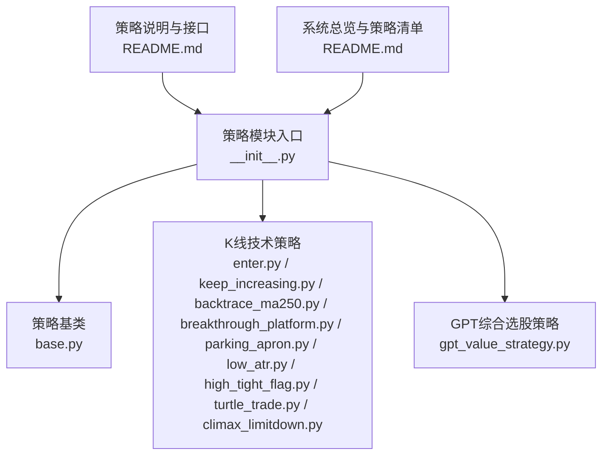
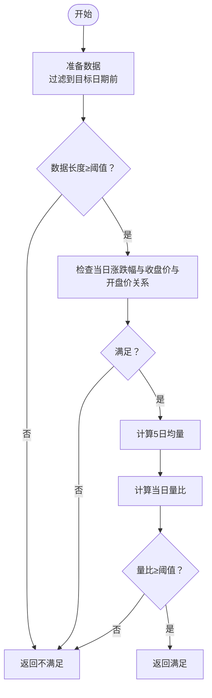
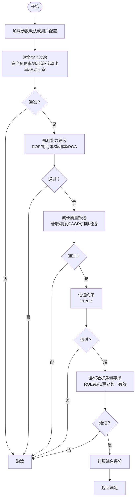
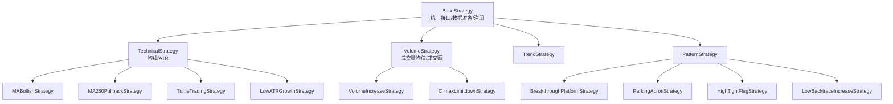

# 策略选股系统

<cite>
**本文引用的文件**
- [README.md](file://README.md)
- [instock/core/strategy/__init__.py](file://instock/core/strategy/__init__.py)
- [instock/core/strategy/base.py](file://instock/core/strategy/base.py)
- [instock/core/strategy/README.md](file://instock/core/strategy/README.md)
- [instock/core/strategy/enter.py](file://instock/core/strategy/enter.py)
- [instock/core/strategy/keep_increasing.py](file://instock/core/strategy/keep_increasing.py)
- [instock/core/strategy/parking_apron.py](file://instock/core/strategy/parking_apron.py)
- [instock/core/strategy/backtrace_ma250.py](file://instock/core/strategy/backtrace_ma250.py)
- [instock/core/strategy/breakthrough_platform.py](file://instock/core/strategy/breakthrough_platform.py)
- [instock/core/strategy/turtle_trade.py](file://instock/core/strategy/turtle_trade.py)
- [instock/core/strategy/high_tight_flag.py](file://instock/core/strategy/high_tight_flag.py)
- [instock/core/strategy/climax_limitdown.py](file://instock/core/strategy/climax_limitdown.py)
- [instock/core/strategy/low_atr.py](file://instock/core/strategy/low_atr.py)
- [instock/core/strategy/gpt_value_strategy.py](file://instock/core/strategy/gpt_value_strategy.py)
</cite>

## 目录
1. [简介](#简介)
2. [项目结构](#项目结构)
3. [核心组件](#核心组件)
4. [架构总览](#架构总览)
5. [详细组件分析](#详细组件分析)
6. [依赖关系分析](#依赖关系分析)
7. [性能考量](#性能考量)
8. [故障排查指南](#故障排查指南)
9. [结论](#结论)
10. [附录](#附录)

## 简介
本系统提供一套完整的量化选股体系，内置多种K线技术策略、成交量策略、形态识别策略与基本面策略（含GPT综合选股与海龟交易法则等）。系统支持策略注册与扩展、统一接口、回测验证与可视化展示，便于用户理解现有策略并开发自定义策略。

## 项目结构
策略模块位于 instock/core/strategy 目录，包含策略基类、具体策略实现、注册与接口说明，以及面向前端的分类与作业执行说明。

图表来源
- [instock/core/strategy/__init__.py](file://instock/core/strategy/__init__.py#L1-L119)
- [instock/core/strategy/base.py](file://instock/core/strategy/base.py#L1-L202)
- [instock/core/strategy/README.md](file://instock/core/strategy/README.md#L1-L146)
- [README.md](file://README.md#L115-L181)

章节来源
- [instock/core/strategy/__init__.py](file://instock/core/strategy/__init__.py#L1-L119)
- [instock/core/strategy/README.md](file://instock/core/strategy/README.md#L1-L146)
- [README.md](file://README.md#L115-L181)

## 核心组件
- 策略基类与注册机制
  - 提供统一的 check 接口、数据准备、类别分类与注册表，支持按分类检索与动态注册。
- K线技术策略族
  - 放量上涨、均线多头、停机坪、回踩年线、突破平台、低ATR成长、高而窄的旗形、放量跌停等。
- 基本面策略族
  - GPT综合选股（五层过滤与评分）、海龟交易法则（60日新高）。
- 作业与回测
  - 策略在统一作业流程中执行，支持回测与可视化。

章节来源
- [instock/core/strategy/base.py](file://instock/core/strategy/base.py#L20-L202)
- [instock/core/strategy/__init__.py](file://instock/core/strategy/__init__.py#L30-L119)
- [instock/core/strategy/README.md](file://instock/core/strategy/README.md#L65-L146)
- [README.md](file://README.md#L115-L181)

## 架构总览
策略系统采用“基类 + 注册表 + 统一接口”的架构，策略实现遵循统一的 check 接口，便于并行执行与回测。

```mermaid
classDiagram
class BaseStrategy {
+str name
+str cn_name
+int default_threshold
+str category
+str description
+check(code_name, data, date, **kwargs) bool
+prepare_data(code_name, data, date) DataFrame?
+__call__(code_name, data, date, **kwargs) bool
}
class TechnicalStrategy {
+calc_ma(data, column, period) ndarray
+calc_ema(data, column, period) ndarray
+calc_atr(data, period) ndarray
}
class VolumeStrategy {
+calc_vol_ma(data, period) ndarray
+calc_amount(data, row_index) float
}
class TrendStrategy
class PatternStrategy
class VolumeIncreaseStrategy {
+check(code_name, data, date, threshold) bool
}
class MABullishStrategy {
+check(code_name, data, date, threshold) bool
}
class MA250PullbackStrategy {
+check(code_name, data, date, threshold) bool
}
class TurtleTradingStrategy {
+check(code_name, data, date, threshold) bool
}
class LowATRGrowthStrategy {
+check(code_name, data, date, threshold) bool
}
class ClimaxLimitdownStrategy {
+check(code_name, data, date, threshold) bool
}
class BreakthroughPlatformStrategy {
+check(code_name, data, date, threshold) bool
}
class ParkingApronStrategy {
+check(code_name, data, date, threshold) bool
}
class HighTightFlagStrategy {
+check(code_name, data, date, threshold) bool
}
class LowBacktraceIncreaseStrategy {
+check(code_name, data, date, threshold) bool
}
BaseStrategy <|-- TechnicalStrategy
BaseStrategy <|-- VolumeStrategy
BaseStrategy <|-- TrendStrategy
BaseStrategy <|-- PatternStrategy
TechnicalStrategy <.. VolumeIncreaseStrategy
TechnicalStrategy <.. MABullishStrategy
TechnicalStrategy <.. MA250PullbackStrategy
TechnicalStrategy <.. TurtleTradingStrategy
TechnicalStrategy <.. LowATRGrowthStrategy
VolumeStrategy <.. VolumeIncreaseStrategy
VolumeStrategy <.. ClimaxLimitdownStrategy
PatternStrategy <.. BreakthroughPlatformStrategy
PatternStrategy <.. ParkingApronStrategy
PatternStrategy <.. HighTightFlagStrategy
PatternStrategy <.. LowBacktraceIncreaseStrategy
```

图表来源
- [instock/core/strategy/base.py](file://instock/core/strategy/base.py#L20-L202)
- [instock/core/strategy/enter.py](file://instock/core/strategy/enter.py#L16-L61)
- [instock/core/strategy/keep_increasing.py](file://instock/core/strategy/keep_increasing.py#L15-L39)
- [instock/core/strategy/backtrace_ma250.py](file://instock/core/strategy/backtrace_ma250.py#L17-L92)
- [instock/core/strategy/breakthrough_platform.py](file://instock/core/strategy/breakthrough_platform.py#L17-L52)
- [instock/core/strategy/parking_apron.py](file://instock/core/strategy/parking_apron.py#L15-L60)
- [instock/core/strategy/turtle_trade.py](file://instock/core/strategy/turtle_trade.py#L14-L38)
- [instock/core/strategy/high_tight_flag.py](file://instock/core/strategy/high_tight_flag.py#L13-L50)
- [instock/core/strategy/climax_limitdown.py](file://instock/core/strategy/climax_limitdown.py#L15-L60)
- [instock/core/strategy/low_atr.py](file://instock/core/strategy/low_atr.py#L12-L64)

## 详细组件分析

### 放量上涨（K线技术策略）
- 实现要点
  - 当日涨幅小于阈值且收盘价不小于开盘价；
  - 成交额不低于阈值；
  - 当日成交量与5日均量比不低于阈值。
- 参数与适用场景
  - 适用于捕捉短期放量突破或异常放量的信号，适合中短线参与。
- 风险控制
  - 对异常放量的容忍度较低，建议结合趋势与成交量均值进行二次过滤。

图表来源
- [instock/core/strategy/enter.py](file://instock/core/strategy/enter.py#L16-L61)

章节来源
- [instock/core/strategy/enter.py](file://instock/core/strategy/enter.py#L12-L61)

### 均线多头（K线技术策略）
- 实现要点
  - 计算30日均线，要求近期多个时点的30日均线呈单调递增，且末期较初期涨幅超过阈值。
- 参数与适用场景
  - 适用于中长期趋势向好的股票，适合趋势跟踪策略。
- 风险控制
  - 需要足够的历史数据长度，避免短期波动导致误判。

章节来源
- [instock/core/strategy/keep_increasing.py](file://instock/core/strategy/keep_increasing.py#L11-L39)

### 停机坪（K线技术策略）
- 实现要点
  - 近期出现涨停日，且满足“停机坪”三日整理规则：高开高走、涨跌幅受控、连续两日满足条件。
- 参数与适用场景
  - 识别涨停后横盘整理后的潜在突破机会。
- 风险控制
  - 严格的时间窗口与涨跌幅限制，避免追高风险。

章节来源
- [instock/core/strategy/parking_apron.py](file://instock/core/strategy/parking_apron.py#L11-L60)

### 回踩年线（K线技术策略）
- 实现要点
  - 前段由250日均线以下向上突破，后段在年线之上运行，回踩期间缩量，回踩区间跨度在限定天数内。
- 参数与适用场景
  - 识别突破年线后的回踩机会，适合中长线趋势跟踪。
- 风险控制
  - 强制缩量回踩与时间跨度限制，降低追高风险。

章节来源
- [instock/core/strategy/backtrace_ma250.py](file://instock/core/strategy/backtrace_ma250.py#L12-L92)

### 突破平台（K线技术策略）
- 实现要点
  - 在60日内某日收盘价上穿60日均线且当日开盘价低于均线，随后满足放量上涨，且突破前某日收盘价与60日均线偏离在限定范围。
- 参数与适用场景
  - 识别平台整理后的放量突破信号。
- 风险控制
  - 要求突破当日放量，避免假突破。

章节来源
- [instock/core/strategy/breakthrough_platform.py](file://instock/core/strategy/breakthrough_platform.py#L13-L52)

### 放量跌停（K线技术策略）
- 实现要点
  - 当日跌幅超过阈值，成交额不低于阈值，成交量至少为5日均量的倍数。
- 参数与适用场景
  - 识别恐慌性抛售后的潜在反抽机会。
- 风险控制
  - 严格的量能与跌幅门槛，避免追空风险。

章节来源
- [instock/core/strategy/climax_limitdown.py](file://instock/core/strategy/climax_limitdown.py#L11-L60)

### 低ATR成长（K线技术策略）
- 实现要点
  - 最近若干交易日最高价与最低价涨幅超过阈值，且平均真实波幅（ATR）低于阈值。
- 参数与适用场景
  - 识别低波动稳健上涨的标的。
- 风险控制
  - ATR阈值过滤低波动股票，避免震荡市中的噪声。

章节来源
- [instock/core/strategy/low_atr.py](file://instock/core/strategy/low_atr.py#L9-L64)

### 高而窄的旗形（K线技术策略）
- 实现要点
  - 近期快速上涨后窄幅整理，整理区间最低价与当日收盘价比值超过阈值，整理期内连续两日涨幅超过阈值。
- 参数与适用场景
  - 识别快速上涨后的整理突破机会。
- 风险控制
  - 整理期连续两日涨幅作为确认条件，减少假突破概率。

章节来源
- [instock/core/strategy/high_tight_flag.py](file://instock/core/strategy/high_tight_flag.py#L9-L50)

### 海龟交易法则（K线技术策略）
- 实现要点
  - 最后一个交易日收盘价达到最近N日最高收盘价。
- 参数与适用场景
  - 识别突破新高的强势股。
- 风险控制
  - 仅作为入场信号，建议配合止损与仓位管理。

章节来源
- [instock/core/strategy/turtle_trade.py](file://instock/core/strategy/turtle_trade.py#L11-L38)

### GPT综合选股（基本面策略）
- 实现要点
  - 五层过滤：财务安全、盈利能力、成长质量、估值约束；支持评分计算与参数化配置。
- 参数与适用场景
  - 从综合选股表中筛选优质公司，适合价值投资与长期持有。
- 风险控制
  - 数据质量要求（至少ROE或PE之一有效），避免数据缺失导致误判。

图表来源
- [instock/core/strategy/gpt_value_strategy.py](file://instock/core/strategy/gpt_value_strategy.py#L79-L200)

章节来源
- [instock/core/strategy/gpt_value_strategy.py](file://instock/core/strategy/gpt_value_strategy.py#L1-L318)

## 依赖关系分析
- 策略基类与注册
  - 所有策略继承自统一基类，具备统一接口与数据准备能力；通过注册表集中管理，支持按分类检索。
- 策略实现
  - 技术策略依赖TA-Lib计算均线、ATR等指标；成交量策略依赖成交量均值；形态策略依赖K线与成交量组合条件。
- 作业与回测
  - 策略在统一作业流程中执行，支持并行与回测。

图表来源
- [instock/core/strategy/base.py](file://instock/core/strategy/base.py#L20-L202)
- [instock/core/strategy/__init__.py](file://instock/core/strategy/__init__.py#L30-L119)

章节来源
- [instock/core/strategy/base.py](file://instock/core/strategy/base.py#L1-L202)
- [instock/core/strategy/__init__.py](file://instock/core/strategy/__init__.py#L1-L119)

## 性能考量
- 数据准备与阈值
  - 策略基类提供 prepare_data，按目标日期过滤数据并校验最小长度，避免无效计算。
- 指标计算
  - 使用TA-Lib进行高效指标计算，减少重复计算与内存占用。
- 执行与并行
  - 策略在统一作业流程中并行执行，缩短整体处理时间。

章节来源
- [instock/core/strategy/base.py](file://instock/core/strategy/base.py#L64-L96)
- [instock/core/strategy/README.md](file://instock/core/strategy/README.md#L121-L128)

## 故障排查指南
- 策略未注册
  - 若通过名称获取策略类报错，检查注册表是否包含该策略名称。
- 数据不足
  - 策略返回不满足时，检查数据长度是否满足默认阈值或传入阈值。
- 参数问题（GPT综合选股）
  - 若筛选结果为空，检查参数配置是否合理，或确认数据字段是否存在有效值。

章节来源
- [instock/core/strategy/base.py](file://instock/core/strategy/base.py#L173-L186)
- [instock/core/strategy/gpt_value_strategy.py](file://instock/core/strategy/gpt_value_strategy.py#L46-L54)

## 结论
本系统通过统一的策略基类与注册机制，提供了从K线技术到基本面的完整选股方案。策略实现清晰、参数可配置、执行可并行、结果可回测，既适合理解现有策略，也为扩展自定义策略提供了良好范式。

## 附录

### 策略开发与扩展指南
- 新增K线策略
  - 在策略目录创建策略文件，实现统一接口函数；在注册表中登记。
- 新增基本面策略
  - 在策略目录创建策略文件，定义表结构与接口；在作业流程中注册执行；在前端路由中添加展示。
- 参数化与配置
  - 基于现有参数加载机制，支持从配置中心加载用户自定义参数，便于策略迭代与优化。

章节来源
- [instock/core/strategy/README.md](file://instock/core/strategy/README.md#L129-L146)
- [instock/core/strategy/gpt_value_strategy.py](file://instock/core/strategy/gpt_value_strategy.py#L46-L54)