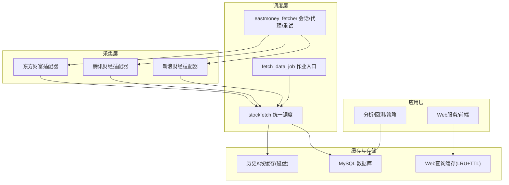
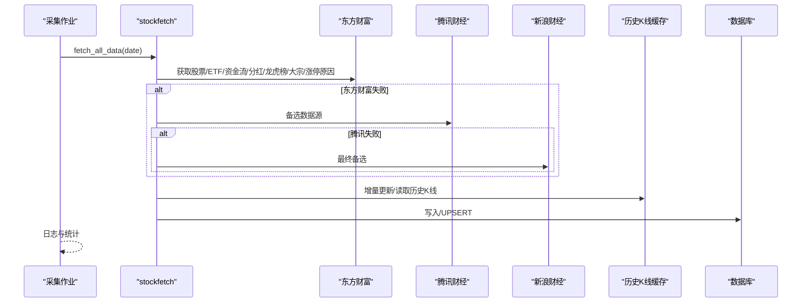
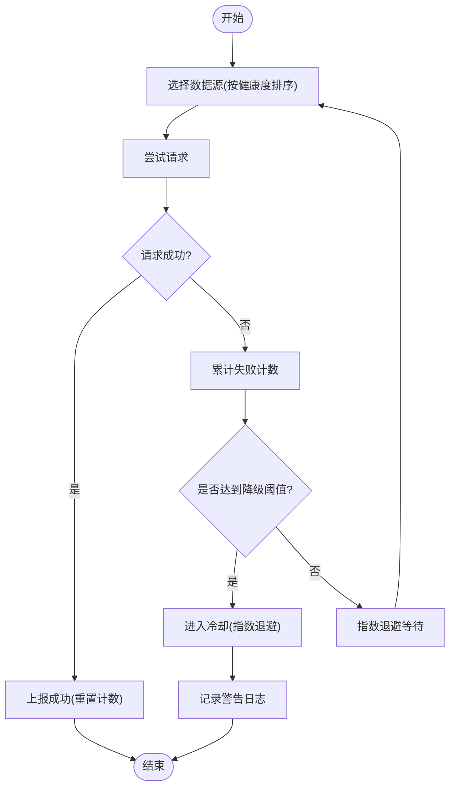
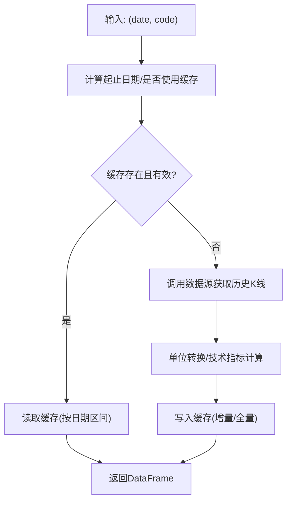
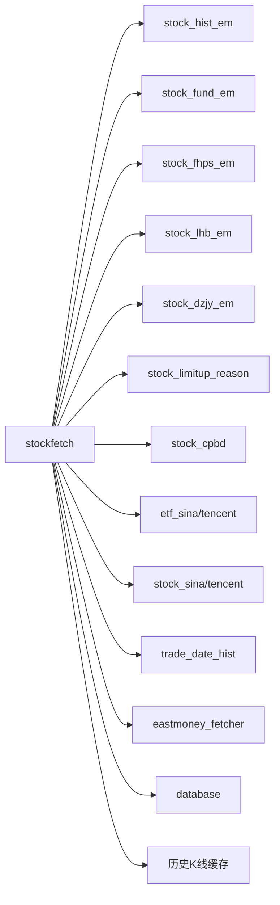

# 股票每日数据采集

<cite>
**本文引用的文件**
- [README.md](file://README.md)
- [QUICKSTART.md](file://QUICKSTART.md)
- [instock/core/crawling/stock_hist_em.py](file://instock/core/crawling/stock_hist_em.py)
- [instock/core/crawling/stock_fund_em.py](file://instock/core/crawling/stock_fund_em.py)
- [instock/core/crawling/stock_fhps_em.py](file://instock/core/crawling/stock_fhps_em.py)
- [instock/core/crawling/stock_lhb_em.py](file://instock/core/crawling/stock_lhb_em.py)
- [instock/core/crawling/stock_dzjy_em.py](file://instock/core/crawling/stock_dzjy_em.py)
- [instock/core/crawling/stock_limitup_reason.py](file://instock/core/crawling/stock_limitup_reason.py)
- [instock/core/crawling/stock_cpbd.py](file://instock/core/crawling/stock_cpbd.py)
- [instock/core/crawling/etf_sina.py](file://instock/core/crawling/etf_sina.py)
- [instock/core/crawling/etf_tencent.py](file://instock/core/crawling/etf_tencent.py)
- [instock/core/crawling/stock_sina.py](file://instock/core/crawling/stock_sina.py)
- [instock/core/crawling/stock_tencent.py](file://instock/core/crawling/stock_tencent.py)
- [instock/core/crawling/trade_date_hist.py](file://instock/core/crawling/trade_date_hist.py)
- [instock/core/eastmoney_fetcher.py](file://instock/core/eastmoney_fetcher.py)
- [instock/core/stockfetch.py](file://instock/core/stockfetch.py)
- [instock/job/fetch_data_job.py](file://instock/job/fetch_data_job.py)
- [instock/lib/query_cache.py](file://instock/lib/query_cache.py)
- [instock/lib/database.py](file://instock/lib/database.py)
</cite>

## 目录
1. [简介](#简介)
2. [项目结构](#项目结构)
3. [核心组件](#核心组件)
4. [架构总览](#架构总览)
5. [详细组件分析](#详细组件分析)
6. [依赖关系分析](#依赖关系分析)
7. [性能考虑](#性能考虑)
8. [故障排查指南](#故障排查指南)
9. [结论](#结论)
10. [附录](#附录)

## 简介
本系统面向A股市场的每日数据采集，覆盖股票行情、资金流向、分红配送、龙虎榜、大宗交易、ETF数据、涨停原因、早盘/尾盘抢筹、板块资金流向等关键维度。系统采用多数据源抓取机制（东方财富优先，辅以腾讯/新浪），结合增量缓存、代理与Cookie管理、健康度监控与自动降级、数据库持久化与UPSERT写入，形成稳定高效的采集流水线。

## 项目结构
- 数据采集层：各数据源适配器（东方财富、腾讯、新浪）
- 采集调度层：统一入口脚本与数据源健康度管理
- 缓存与持久化：本地历史K线缓存、数据库写入
- Web与分析：前端可视化、指标计算、策略选股、回测

图表来源
- [instock/core/stockfetch.py](file://instock/core/stockfetch.py#L256-L346)
- [instock/core/eastmoney_fetcher.py](file://instock/core/eastmoney_fetcher.py#L75-L143)
- [instock/job/fetch_data_job.py](file://instock/job/fetch_data_job.py#L38-L108)
- [instock/lib/query_cache.py](file://instock/lib/query_cache.py#L27-L156)
- [instock/lib/database.py](file://instock/lib/database.py#L94-L203)

章节来源
- [README.md](file://README.md#L33-L511)
- [QUICKSTART.md](file://QUICKSTART.md#L157-L167)

## 核心组件
- 多数据源抓取器：封装Cookie、会话、代理、重试与健康度监控，自动切换数据源，降低单一源故障风险。
- 统一调度器：按优先级调用各数据源，完成数据清洗、列映射、过滤与入库准备。
- 历史K线缓存：按股票代码分目录存储，支持增量更新与单位转换，显著降低API压力。
- 数据库写入：基于SQLAlchemy，支持UPSERT与索引自动创建，提升并发写入稳定性。
- Web查询缓存：LRU+TTL，减少重复查询，提升前端交互性能。
- 交易日历：备用API与SSL降级策略，保障日历数据可用性。

章节来源
- [instock/core/eastmoney_fetcher.py](file://instock/core/eastmoney_fetcher.py#L16-L149)
- [instock/core/stockfetch.py](file://instock/core/stockfetch.py#L46-L135)
- [instock/job/fetch_data_job.py](file://instock/job/fetch_data_job.py#L38-L108)
- [instock/lib/query_cache.py](file://instock/lib/query_cache.py#L27-L156)
- [instock/lib/database.py](file://instock/lib/database.py#L94-L203)
- [instock/core/crawling/trade_date_hist.py](file://instock/core/crawling/trade_date_hist.py#L307-L350)

## 架构总览
系统遵循“采集与分析分离”的设计原则：采集阶段仅负责数据获取与缓存，分析阶段从缓存按需读取，避免重复抓取与数据库压力。

图表来源
- [instock/job/fetch_data_job.py](file://instock/job/fetch_data_job.py#L38-L108)
- [instock/core/stockfetch.py](file://instock/core/stockfetch.py#L256-L346)
- [instock/core/eastmoney_fetcher.py](file://instock/core/eastmoney_fetcher.py#L75-L143)

## 详细组件分析

### 多数据源抓取机制
- 数据源优先级：东方财富（首选）、腾讯财经、新浪财经。
- 健康度监控：连续失败触发降级，冷却时间指数退避，恢复后自动回滚。
- 代理与Cookie：自动代理池轮换，支持环境变量与文件注入Cookie，降低风控风险。
- 重试策略：指数退避+抖动，避免“惊群效应”。

图表来源
- [instock/core/stockfetch.py](file://instock/core/stockfetch.py#L64-L123)
- [instock/core/eastmoney_fetcher.py](file://instock/core/eastmoney_fetcher.py#L94-L143)

章节来源
- [instock/core/stockfetch.py](file://instock/core/stockfetch.py#L46-L135)
- [instock/core/eastmoney_fetcher.py](file://instock/core/eastmoney_fetcher.py#L31-L149)

### 历史K线缓存与增量更新
- 存储策略：按股票代码前缀分目录，文件名包含复权标记，gzip压缩。
- 增量更新：按交易日区间对比缓存，仅补录新增交易日，避免全量重抓。
- 单位转换：缓存单位为“手”，返回时转换为“股”，统一口径。
- 读取流程：优先读缓存，失败回源；成功后写入缓存并更新元数据。

图表来源
- [instock/core/stockfetch.py](file://instock/core/stockfetch.py#L744-L782)
- [instock/core/stockfetch.py](file://instock/core/stockfetch.py#L785-L800)

章节来源
- [instock/core/stockfetch.py](file://instock/core/stockfetch.py#L744-L782)

### 数据清洗与列映射
- 股票/ETF/资金流/板块资金流：统一列名映射，缺失字段填充默认值，过滤ST与非A股。
- 龙虎榜：优先使用东方财富，新浪数据需映射列并补齐缺失字段。
- 操盘必读：整合多家数据源字段，统一输出结构化表。

章节来源
- [instock/core/stockfetch.py](file://instock/core/stockfetch.py#L302-L346)
- [instock/core/stockfetch.py](file://instock/core/stockfetch.py#L428-L462)
- [instock/core/stockfetch.py](file://instock/core/stockfetch.py#L465-L487)
- [instock/core/stockfetch.py](file://instock/core/stockfetch.py#L539-L613)
- [instock/core/crawling/stock_cpbd.py](file://instock/core/crawling/stock_cpbd.py#L14-L103)

### 数据获取方法与配置选项
- 采集入口：采集作业脚本集中发起API请求，支持独立运行与批量日期执行。
- 配置项：
  - 历史数据年数：环境变量覆盖默认值。
  - 数据源重试次数与间隔：环境变量控制。
  - 代理与Cookie：文件或环境变量注入。
  - 数据库连接：支持环境变量注入。

章节来源
- [instock/job/fetch_data_job.py](file://instock/job/fetch_data_job.py#L111-L119)
- [instock/core/stockfetch.py](file://instock/core/stockfetch.py#L38-L44)
- [instock/core/eastmoney_fetcher.py](file://instock/core/eastmoney_fetcher.py#L31-L53)
- [instock/lib/database.py](file://instock/lib/database.py#L24-L40)

### 关键数据源适配器
- 股票/ETF实时行情：东方财富为主，腾讯/新浪为备选，统一列顺序与类型转换。
- 资金流向：个股与板块资金流，支持多时段指标。
- 分红配送：按报告期抓取，字段标准化。
- 龙虎榜：个股详情、机构统计、活跃营业部等多维度。
- 大宗交易：市场统计、每日明细、活跃统计等。
- 涨停原因：同花顺涨停原因与详因抓取。
- 交易日历：备用API与SSL降级策略。

章节来源
- [instock/core/crawling/stock_hist_em.py](file://instock/core/crawling/stock_hist_em.py#L20-L189)
- [instock/core/crawling/etf_sina.py](file://instock/core/crawling/etf_sina.py#L137-L195)
- [instock/core/crawling/etf_tencent.py](file://instock/core/crawling/etf_tencent.py#L118-L176)
- [instock/core/crawling/stock_sina.py](file://instock/core/crawling/stock_sina.py#L171-L243)
- [instock/core/crawling/stock_tencent.py](file://instock/core/crawling/stock_tencent.py#L158-L230)
- [instock/core/crawling/stock_fund_em.py](file://instock/core/crawling/stock_fund_em.py#L46-L487)
- [instock/core/crawling/stock_fhps_em.py](file://instock/core/crawling/stock_fhps_em.py#L21-L146)
- [instock/core/crawling/stock_lhb_em.py](file://instock/core/crawling/stock_lhb_em.py#L21-L136)
- [instock/core/crawling/stock_dzjy_em.py](file://instock/core/crawling/stock_dzjy_em.py#L20-L270)
- [instock/core/crawling/stock_limitup_reason.py](file://instock/core/crawling/stock_limitup_reason.py#L19-L99)
- [instock/core/crawling/trade_date_hist.py](file://instock/core/crawling/trade_date_hist.py#L352-L382)

## 依赖关系分析
- 组件耦合：
  - stockfetch 依赖各数据源适配器与缓存/数据库模块。
  - eastmoney_fetcher 为所有数据源提供统一会话、代理与重试。
  - fetch_data_job 作为采集入口，串联缓存清理、实时行情预加载与历史K线批量更新。
- 外部依赖：
  - MySQL/SQLAlchemy：持久化与UPSERT。
  - requests/urllib3：HTTP请求与SSL降级。
  - pandas/talib：数据处理与技术指标计算。

图表来源
- [instock/core/stockfetch.py](file://instock/core/stockfetch.py#L10-L32)
- [instock/core/eastmoney_fetcher.py](file://instock/core/eastmoney_fetcher.py#L16-L30)
- [instock/lib/database.py](file://instock/lib/database.py#L60-L71)

章节来源
- [instock/core/stockfetch.py](file://instock/core/stockfetch.py#L10-L32)
- [instock/lib/database.py](file://instock/lib/database.py#L60-L71)

## 性能考虑
- 并发与限流：多线程并发抓取，批次间随机延迟，避免触发目标站点限流。
- 缓存策略：历史K线缓存与Web查询缓存双层缓存，显著降低API与数据库压力。
- 指数退避：重试等待时间呈指数增长并加入抖动，避免“惊群效应”。
- 单例与线程安全：eastmoney_fetcher为每个线程维护独立Session，避免连接池损坏。
- UPSERT写入：使用ON DUPLICATE KEY UPDATE，减少主键冲突与死锁风险。

章节来源
- [instock/core/eastmoney_fetcher.py](file://instock/core/eastmoney_fetcher.py#L22-L74)
- [instock/lib/database.py](file://instock/lib/database.py#L94-L107)
- [instock/lib/query_cache.py](file://instock/lib/query_cache.py#L27-L93)

## 故障排查指南
- 数据源失败：
  - 查看健康度日志，确认是否触发降级与冷却。
  - 检查代理池状态与失败计数，必要时清理代理文件。
- Cookie与风控：
  - 更新Cookie或更换账号轮换，避免访问受限。
- 交易日历：
  - 若SSL错误，系统自动降级直连；仍失败则检查网络与证书。
- 数据库连接：
  - 检查瞬态错误（死锁、锁超时、连接异常）并重试；必要时dispose引擎重建连接。
- 缓存问题：
  - 清理过期缓存或重建缓存目录后重试。

章节来源
- [instock/core/stockfetch.py](file://instock/core/stockfetch.py#L64-L123)
- [instock/core/eastmoney_fetcher.py](file://instock/core/eastmoney_fetcher.py#L116-L143)
- [instock/core/crawling/trade_date_hist.py](file://instock/core/crawling/trade_date_hist.py#L307-L350)
- [instock/lib/database.py](file://instock/lib/database.py#L110-L117)
- [instock/job/fetch_data_job.py](file://instock/job/fetch_data_job.py#L58-L63)

## 结论
本系统通过多数据源自动切换、健康度监控、代理与Cookie管理、缓存与UPSERT写入等机制，实现了A股每日关键数据的稳定采集与高效分析。建议在生产环境中结合代理池与Cookie轮换策略，合理设置重试与缓存参数，确保在高并发与风控环境下保持稳定运行。

## 附录
- 快速开始与常用操作参见快速入门文档。
- 数据库设计与API参考详见项目文档。

章节来源
- [QUICKSTART.md](file://QUICKSTART.md#L1-L207)
- [README.md](file://README.md#L1-L700)