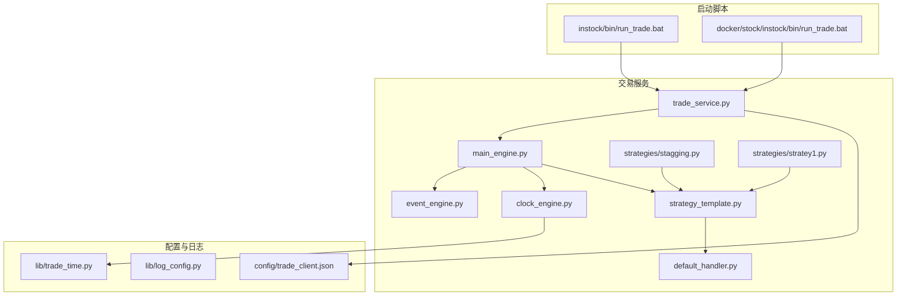
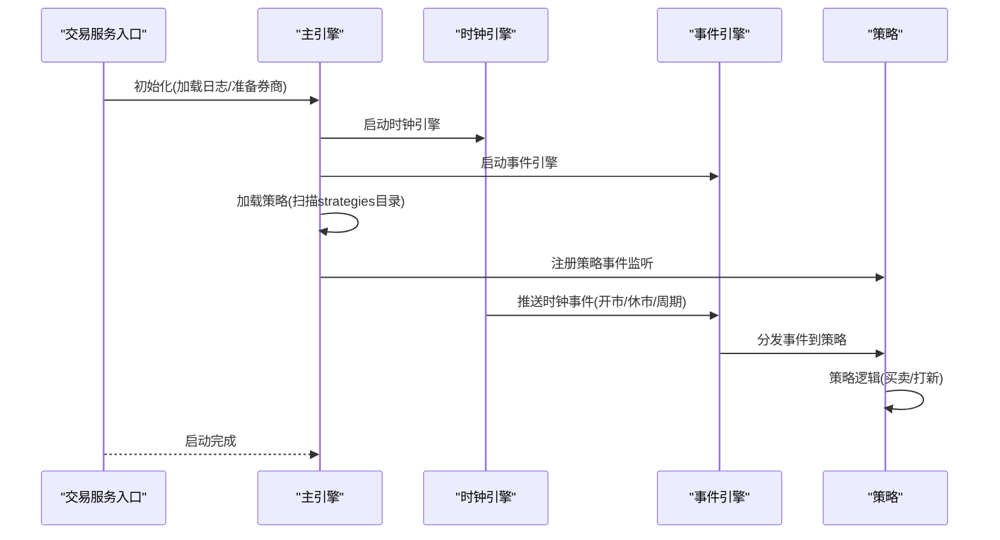
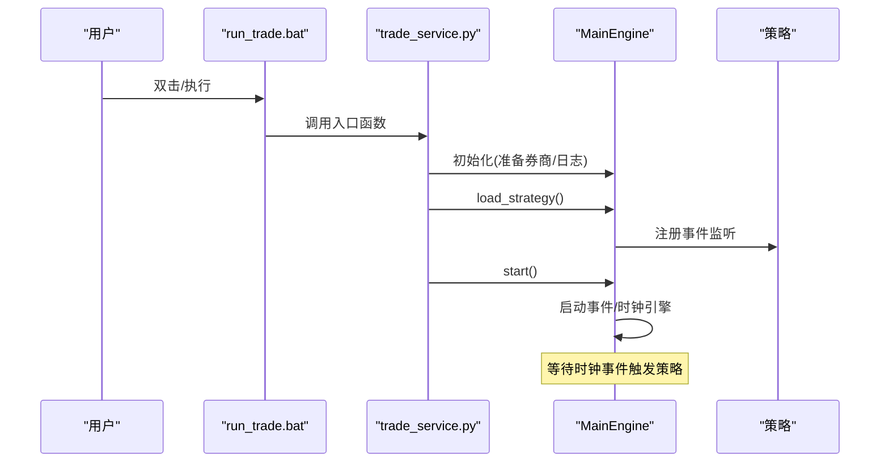
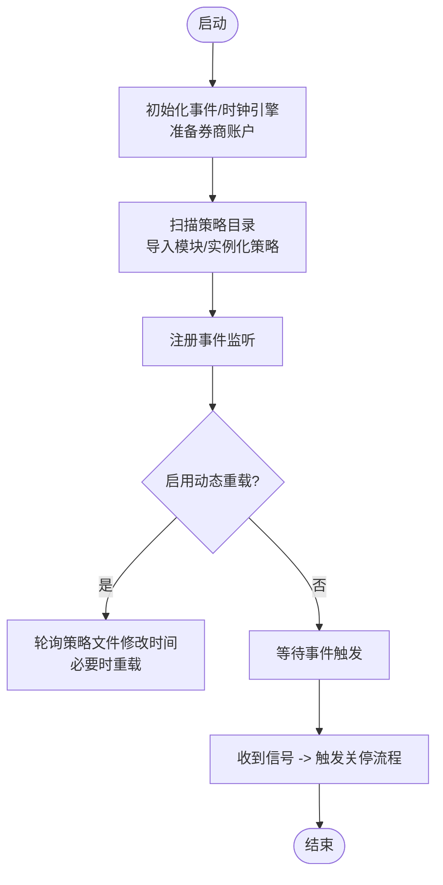
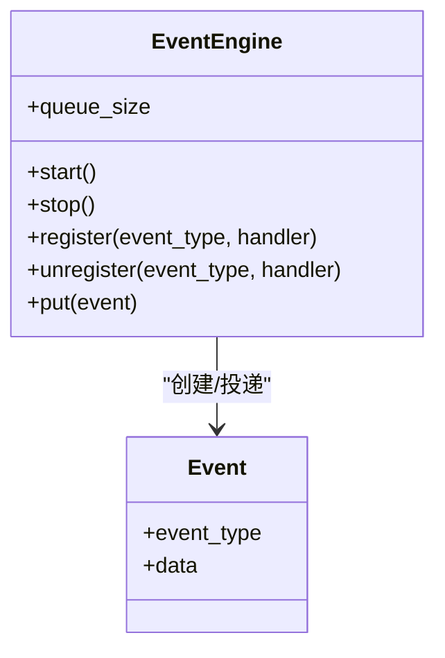
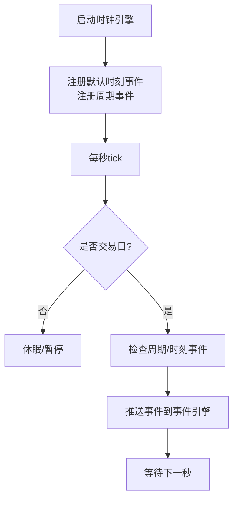
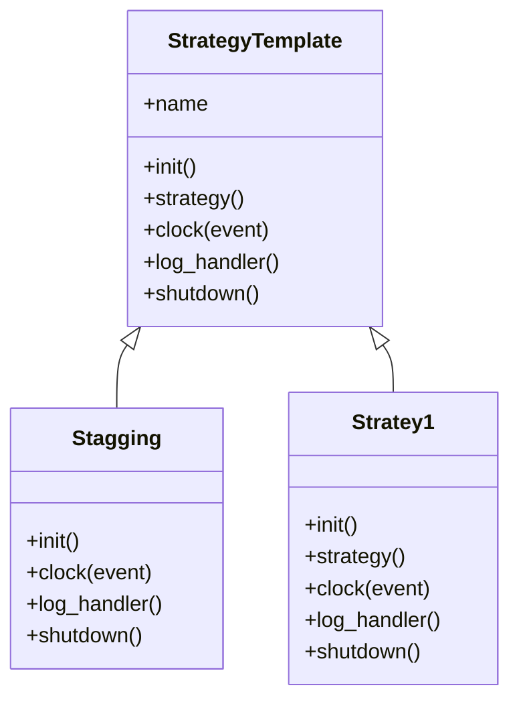
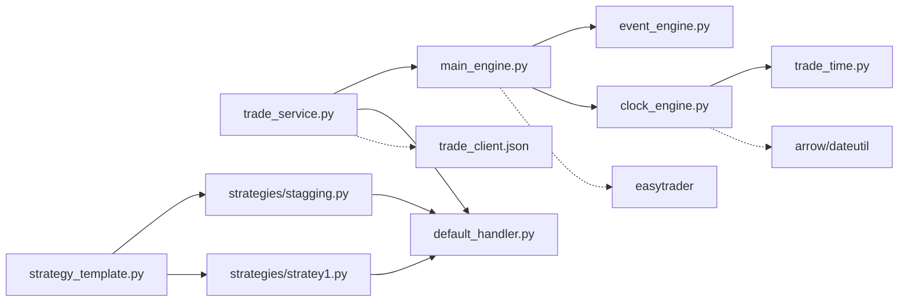

# 自动交易系统

<cite>
**本文引用的文件**   
- [README.md](file://README.md)
- [QUICKSTART.md](file://QUICKSTART.md)
- [trade_service.py](file://instock/trade/trade_service.py)
- [main_engine.py](file://instock/trade/robot/engine/main_engine.py)
- [event_engine.py](file://instock/trade/robot/engine/event_engine.py)
- [clock_engine.py](file://instock/trade/robot/engine/clock_engine.py)
- [strategy_template.py](file://instock/trade/robot/infrastructure/strategy_template.py)
- [default_handler.py](file://instock/trade/robot/infrastructure/default_handler.py)
- [stagging.py](file://instock/trade/strategies/stagging.py)
- [stratey1.py](file://instock/trade/strategies/stratey1.py)
- [log_config.py](file://instock/lib/log_config.py)
- [trade_client.json](file://instock/config/trade_client.json)
- [run_trade.bat](file://instock/bin/run_trade.bat)
- [run_trade.bat（Docker）](file://docker/stock/instock/bin/run_trade.bat)
- [trade_time.py](file://instock/lib/trade_time.py)
</cite>

## 目录
1. [简介](#简介)
2. [项目结构](#项目结构)
3. [核心组件](#核心组件)
4. [架构总览](#架构总览)
5. [详细组件分析](#详细组件分析)
6. [依赖分析](#依赖分析)
7. [性能考量](#性能考量)
8. [故障排查指南](#故障排查指南)
9. [结论](#结论)
10. [附录](#附录)

## 简介
本文件面向SelectStock自动交易系统，围绕交易机器人引擎、策略模板、交易日志管理与风险控制机制展开，系统性阐述交易服务的启动配置、策略参数设置、交易执行流程、日志记录与监控方法，并提供安全与风控建议，帮助用户安全、可控地使用自动交易功能。

## 项目结构
自动交易相关的核心位于instock/trade目录，包含交易服务入口、事件驱动引擎、时钟引擎、策略模板与示例策略、日志处理器等模块；配置与日志分别位于instock/config与instock/log；启动脚本位于instock/bin与docker/stock/instock/bin。

图表来源
- [trade_service.py](file://instock/trade/trade_service.py#L1-L31)
- [main_engine.py](file://instock/trade/robot/engine/main_engine.py#L1-L232)
- [event_engine.py](file://instock/trade/robot/engine/event_engine.py#L1-L85)
- [clock_engine.py](file://instock/trade/robot/engine/clock_engine.py#L1-L231)
- [strategy_template.py](file://instock/trade/robot/infrastructure/strategy_template.py#L1-L43)
- [default_handler.py](file://instock/trade/robot/infrastructure/default_handler.py#L1-L37)
- [stagging.py](file://instock/trade/strategies/stagging.py#L1-L57)
- [stratey1.py](file://instock/trade/strategies/stratey1.py#L1-L68)
- [trade_client.json](file://instock/config/trade_client.json#L1-L5)
- [log_config.py](file://instock/lib/log_config.py#L1-L104)
- [trade_time.py](file://instock/lib/trade_time.py#L1-L224)
- [run_trade.bat](file://instock/bin/run_trade.bat#L1-L10)
- [run_trade.bat（Docker）](file://docker/stock/instock/bin/run_trade.bat#L1-L10)

章节来源
- [README.md](file://README.md#L195-L204)
- [QUICKSTART.md](file://QUICKSTART.md#L1-L207)

## 核心组件
- 交易服务入口：负责加载日志、初始化主引擎、加载策略并启动。
- 主引擎：整合事件引擎、时钟引擎，管理策略生命周期与动态重载，处理优雅关停。
- 事件引擎：基于队列与线程的事件分发器，支持注册/注销事件处理器。
- 时钟引擎：提供统一时间源与交易时段状态，支持固定时刻与周期间隔触发。
- 策略模板：策略基类，约定策略命名、初始化、时钟回调、日志钩子与关停钩子。
- 日志处理器：统一日志输出（文件/控制台），支持策略自定义日志文件。
- 示例策略：打新策略与演示策略，展示如何注册时钟事件与执行交易动作。
- 配置与时间：交易客户端配置文件、交易日与交易时间判断工具。
- 启动脚本：Windows批处理脚本，便于一键启动交易服务。

章节来源
- [trade_service.py](file://instock/trade/trade_service.py#L1-L31)
- [main_engine.py](file://instock/trade/robot/engine/main_engine.py#L1-L232)
- [event_engine.py](file://instock/trade/robot/engine/event_engine.py#L1-L85)
- [clock_engine.py](file://instock/trade/robot/engine/clock_engine.py#L1-L231)
- [strategy_template.py](file://instock/trade/robot/infrastructure/strategy_template.py#L1-L43)
- [default_handler.py](file://instock/trade/robot/infrastructure/default_handler.py#L1-L37)
- [stagging.py](file://instock/trade/strategies/stagging.py#L1-L57)
- [stratey1.py](file://instock/trade/strategies/stratey1.py#L1-L68)
- [trade_client.json](file://instock/config/trade_client.json#L1-L5)
- [trade_time.py](file://instock/lib/trade_time.py#L1-L224)
- [run_trade.bat](file://instock/bin/run_trade.bat#L1-L10)
- [run_trade.bat（Docker）](file://docker/stock/instock/bin/run_trade.bat#L1-L10)

## 架构总览
自动交易系统采用“事件驱动 + 时钟驱动”的双引擎架构：时钟引擎在交易时段与非交易时段按固定节奏推送事件，事件引擎接收事件并分发给已注册的策略处理器；主引擎负责策略的加载、监听、动态重载与关停流程。

图表来源
- [trade_service.py](file://instock/trade/trade_service.py#L19-L31)
- [main_engine.py](file://instock/trade/robot/engine/main_engine.py#L81-L91)
- [clock_engine.py](file://instock/trade/robot/engine/clock_engine.py#L169-L176)
- [event_engine.py](file://instock/trade/robot/engine/event_engine.py#L54-L62)

## 详细组件分析

### 交易服务入口与启动流程
- 交易服务入口负责：
  - 设置日志处理器（文件输出，路径指向instock/log/stock_trade.log）。
  - 初始化主引擎，传入券商类型与交易客户端配置文件路径。
  - 开启策略自动重载（开发调试用，不建议生产开启）。
  - 加载策略并启动引擎。
- 启动脚本run_trade.bat（Windows）与Docker版本均调用trade_service.py，确保服务常驻运行。

图表来源
- [trade_service.py](file://instock/trade/trade_service.py#L19-L31)
- [run_trade.bat](file://instock/bin/run_trade.bat#L1-L10)
- [run_trade.bat（Docker）](file://docker/stock/instock/bin/run_trade.bat#L1-L10)

章节来源
- [trade_service.py](file://instock/trade/trade_service.py#L1-L31)
- [run_trade.bat](file://instock/bin/run_trade.bat#L1-L10)
- [run_trade.bat（Docker）](file://docker/stock/instock/bin/run_trade.bat#L1-L10)

### 主引擎：策略生命周期与动态重载
- 负责：
  - 初始化事件引擎与时钟引擎。
  - 读取交易客户端配置文件，准备easytrader账户。
  - 扫描strategies目录，动态导入策略模块，实例化策略并注册事件监听。
  - 提供策略动态重载（基于文件修改时间检测）。
  - 统一关停流程：触发before_shutdown、引擎自身shutdown、策略shutdown、after_shutdown。
- 线程安全：使用锁保护策略加载过程，避免并发冲突。

图表来源
- [main_engine.py](file://instock/trade/robot/engine/main_engine.py#L25-L80)
- [main_engine.py](file://instock/trade/robot/engine/main_engine.py#L150-L172)
- [main_engine.py](file://instock/trade/robot/engine/main_engine.py#L201-L232)

章节来源
- [main_engine.py](file://instock/trade/robot/engine/main_engine.py#L1-L232)

### 事件引擎：事件分发与线程模型
- 使用队列承载事件，单线程消费，为每个事件派生处理线程，避免阻塞事件循环。
- 提供注册/注销事件处理器与停止机制，保证有序关闭。

图表来源
- [event_engine.py](file://instock/trade/robot/engine/event_engine.py#L19-L85)

章节来源
- [event_engine.py](file://instock/trade/robot/engine/event_engine.py#L1-L85)

### 时钟引擎：统一时间与交易时段
- 提供now与now_dt统一时间接口，维护trading_state（交易中/休市）。
- 默认注册开市、休市、下午开盘、收市等时刻事件，以及0.5/1/5/15/30/60分钟周期事件。
- 交易日判断与交易时段判断来自trade_time工具模块。

图表来源
- [clock_engine.py](file://instock/trade/robot/engine/clock_engine.py#L169-L176)
- [clock_engine.py](file://instock/trade/robot/engine/clock_engine.py#L183-L200)
- [trade_time.py](file://instock/lib/trade_time.py#L12-L21)
- [trade_time.py](file://instock/lib/trade_time.py#L64-L70)

章节来源
- [clock_engine.py](file://instock/trade/robot/engine/clock_engine.py#L1-L231)
- [trade_time.py](file://instock/lib/trade_time.py#L1-L224)

### 策略模板与示例策略
- 策略模板约定：
  - name属性标识策略。
  - init()用于注册时钟事件（时刻/周期）。
  - clock(event)作为事件回调入口，根据event.data.clock_event与trading_state执行策略。
  - log_handler()可返回自定义日志处理器（策略专属日志文件）。
  - shutdown()在关停前执行。
- 示例策略：
  - 打新策略：在每日10:00触发auto_ipo。
  - 演示策略：在指定时刻执行买入/卖出示例动作，并打印账户信息。

图表来源
- [strategy_template.py](file://instock/trade/robot/infrastructure/strategy_template.py#L9-L43)
- [stagging.py](file://instock/trade/strategies/stagging.py#L14-L57)
- [stratey1.py](file://instock/trade/strategies/stratey1.py#L14-L68)

章节来源
- [strategy_template.py](file://instock/trade/robot/infrastructure/strategy_template.py#L1-L43)
- [stagging.py](file://instock/trade/strategies/stagging.py#L1-L57)
- [stratey1.py](file://instock/trade/strategies/stratey1.py#L1-L68)

### 日志管理与监控
- 交易服务日志：默认输出到instock/log/stock_trade.log。
- 策略日志：示例策略通过log_handler()返回自定义文件（如stock.log），便于区分策略行为。
- 通用日志配置：lib/log_config.py提供统一日志格式、文件轮转与控制台输出策略，适用于数据抓取/分析/Web等模块。
- 监控建议：结合策略日志与stock_trade.log，观察策略触发、交易动作与异常堆栈；利用stock_error.log集中定位错误。

章节来源
- [trade_service.py](file://instock/trade/trade_service.py#L10-L21)
- [default_handler.py](file://instock/trade/robot/infrastructure/default_handler.py#L15-L37)
- [stagging.py](file://instock/trade/strategies/stagging.py#L44-L49)
- [stratey1.py](file://instock/trade/strategies/stratey1.py#L55-L60)
- [log_config.py](file://instock/lib/log_config.py#L1-L104)
- [README.md](file://README.md#L314-L318)

### 交易客户端配置与安全
- 交易客户端配置文件trade_client.json包含账户、密码与交易软件路径，主引擎在存在该文件时准备easytrader账户。
- 安全建议：
  - 严格保管配置文件与凭据，限制文件权限。
  - 生产环境不启用策略自动重载，避免策略代码热更新带来的未知风险。
  - 仅在必要时开启交易服务，避免非预期触发（如打新）。
  - 对交易软件的验证码识别与券商接口保持最小授权与最小暴露面。

章节来源
- [trade_client.json](file://instock/config/trade_client.json#L1-L5)
- [main_engine.py](file://instock/trade/robot/engine/main_engine.py#L32-L41)
- [README.md](file://README.md#L463-L492)

## 依赖分析
- 组件耦合关系：
  - trade_service.py依赖main_engine.py与default_handler.py。
  - main_engine.py依赖event_engine.py、clock_engine.py与策略模块。
  - clock_engine.py依赖trade_time.py与event_engine.py。
  - 策略模块依赖strategy_template.py与default_handler.py。
- 外部依赖：
  - easytrader：用于对接交易软件，执行下单/查询等动作。
  - arrow/dateutil：用于时间与时区处理。
  - logbook/logging：用于日志输出与轮转。

图表来源
- [trade_service.py](file://instock/trade/trade_service.py#L1-L31)
- [main_engine.py](file://instock/trade/robot/engine/main_engine.py#L1-L232)
- [event_engine.py](file://instock/trade/robot/engine/event_engine.py#L1-L85)
- [clock_engine.py](file://instock/trade/robot/engine/clock_engine.py#L1-L231)
- [strategy_template.py](file://instock/trade/robot/infrastructure/strategy_template.py#L1-L43)
- [stagging.py](file://instock/trade/strategies/stagging.py#L1-L57)
- [stratey1.py](file://instock/trade/strategies/stratey1.py#L1-L68)
- [trade_client.json](file://instock/config/trade_client.json#L1-L5)
- [trade_time.py](file://instock/lib/trade_time.py#L1-L224)

章节来源
- [main_engine.py](file://instock/trade/robot/engine/main_engine.py#L1-L232)
- [clock_engine.py](file://instock/trade/robot/engine/clock_engine.py#L1-L231)

## 性能考量
- 事件引擎采用“单线程消费 + 多线程处理”的模式，避免事件队列堆积与阻塞。
- 时钟引擎每秒tick，周期事件按精度（0.5/1/5/15/30/60分钟）触发，策略逻辑应尽量轻量，避免在高频事件中执行重IO。
- 动态重载策略在开发阶段启用，生产环境建议关闭，减少策略模块反复导入带来的额外开销。
- 交易时段判断与交易日判断来自trade_time工具，避免重复计算，提升时间判定效率。

章节来源
- [event_engine.py](file://instock/trade/robot/engine/event_engine.py#L36-L53)
- [clock_engine.py](file://instock/trade/robot/engine/clock_engine.py#L169-L176)
- [main_engine.py](file://instock/trade/robot/engine/main_engine.py#L165-L172)
- [trade_time.py](file://instock/lib/trade_time.py#L1-L224)

## 故障排查指南
- 交易服务无法启动
  - 检查run_trade.bat是否正确调用trade_service.py。
  - 确认Python路径与依赖安装正常。
- 券商账户不可用
  - 确认trade_client.json存在且字段完整。
  - 检查交易软件路径与凭证是否正确。
- 策略未触发
  - 确认策略已加载（查看stock_trade.log）。
  - 检查策略注册的时钟事件是否匹配当前交易日与交易时段。
- 日志定位
  - 交易服务日志：instock/log/stock_trade.log。
  - 策略日志：示例策略各自文件（如stock.log）。
  - 错误汇总：instock/log/stock_error.log。
- 交易时段异常
  - 检查trade_time.py的交易日与交易时段判断逻辑。
  - 确认系统时区设置与本地时区一致。

章节来源
- [trade_service.py](file://instock/trade/trade_service.py#L10-L21)
- [trade_client.json](file://instock/config/trade_client.json#L1-L5)
- [clock_engine.py](file://instock/trade/robot/engine/clock_engine.py#L169-L176)
- [trade_time.py](file://instock/lib/trade_time.py#L1-L224)
- [log_config.py](file://instock/lib/log_config.py#L1-L104)
- [README.md](file://README.md#L314-L318)

## 结论
SelectStock自动交易系统通过事件驱动与时间驱动的双引擎架构，提供了可扩展、可监控、可重载的策略执行框架。配合统一的日志体系与交易时段判断，能够在保证安全性的同时，满足策略开发与生产的多样化需求。建议在生产环境中关闭策略自动重载、严格管理交易凭据与路径，并持续监控日志与交易行为，以实现稳健的自动化交易。

## 附录
- 启动与运行
  - Windows：双击instock/bin/run_trade.bat或执行python trade_service.py。
  - Docker：使用instock/bin/run_trade.bat或docker/stock/instock/bin/run_trade.bat。
- 策略开发要点
  - 在init()中注册所需时钟事件（时刻/周期）。
  - 在clock(event)中根据event.data.clock_event与trading_state执行策略。
  - 通过log_handler()为策略提供独立日志文件。
- 风险控制建议
  - 仅在必要时开启交易服务。
  - 生产环境不启用策略自动重载。
  - 严格保护交易客户端配置文件与凭据。
  - 对策略执行结果进行审计与回放验证。

章节来源
- [run_trade.bat](file://instock/bin/run_trade.bat#L1-L10)
- [run_trade.bat（Docker）](file://docker/stock/instock/bin/run_trade.bat#L1-L10)
- [strategy_template.py](file://instock/trade/robot/infrastructure/strategy_template.py#L1-L43)
- [stagging.py](file://instock/trade/strategies/stagging.py#L1-L57)
- [stratey1.py](file://instock/trade/strategies/stratey1.py#L1-L68)
- [README.md](file://README.md#L195-L204)